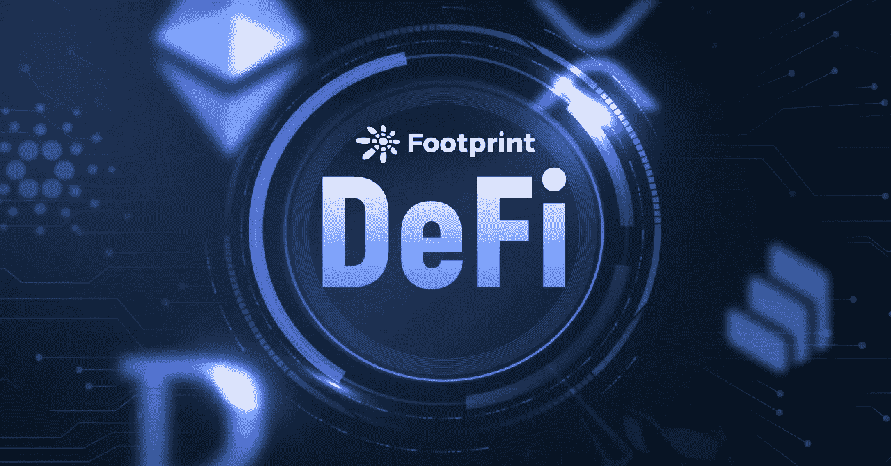
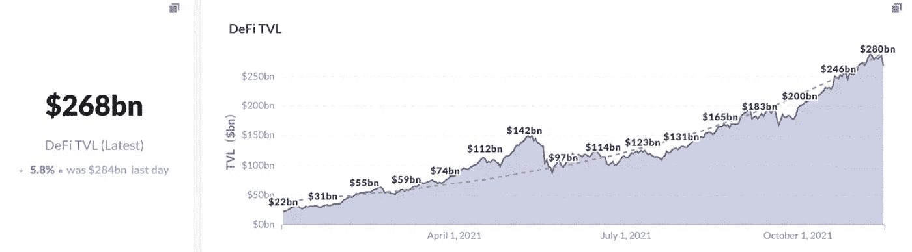
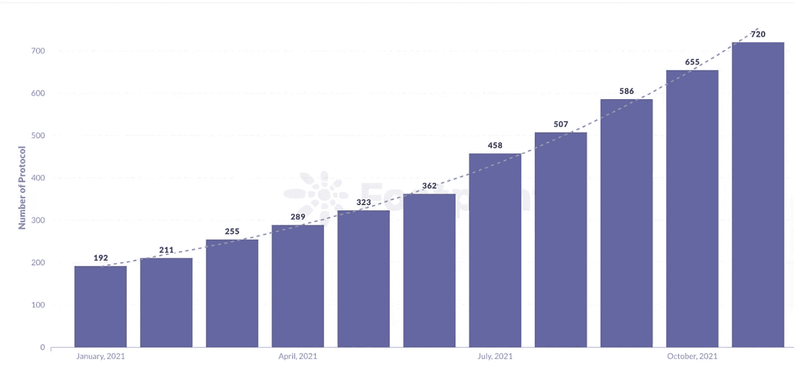
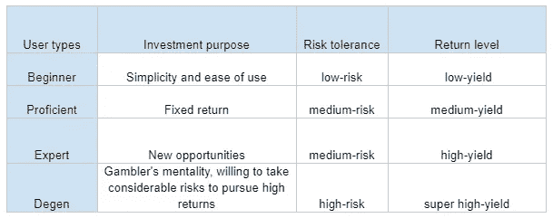
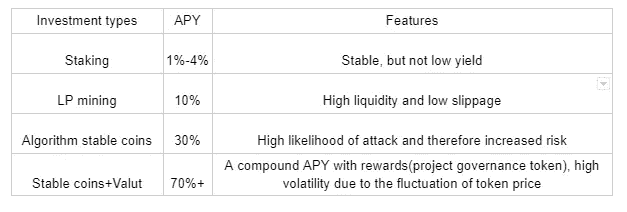
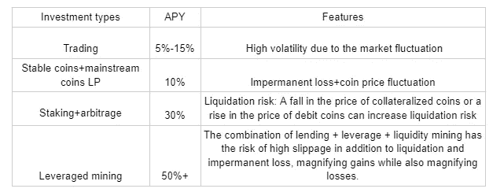
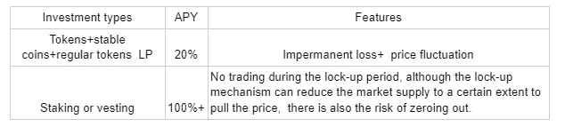
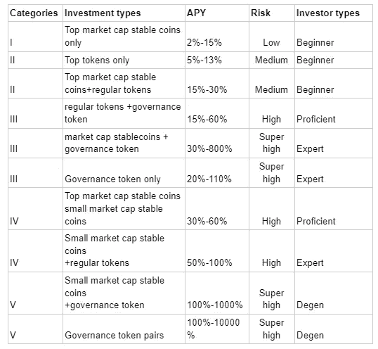

# 如何投资 DeFi

> 原文：<https://medium.com/coinmonks/how-to-invest-in-defi-fff96f1d0e37?source=collection_archive---------15----------------------->

根据区块链数据分析平台 Footprint Analytics 的数据，TVL 的 DeFi 在 11 月超过了 2800 亿美元。大量资金进入 DeFi 市场的主要原因之一是其诱人的 APY。

*Footprint Analytics: DeFi TVL surpasses $280 billion in November*

然而，高 APY 伴随着高风险。与传统金融相比，DeFi 的性质使其易受攻击或不受监管。

投资者在考虑投资 DeFi 项目时需要三思。

根据足迹数据，目前 DeFi 项目的数量超过 700 个。从这么多项目中应该如何选择？

[*FootprintAnalysis：The number of DeFi projects has now exceeded 700*](https://www.footprint.network/topic/Metrics/DiscoverValuableProjects)

**一、你是什么样的投资人**

加密货币的价格波动很大。投资它们比传统的金融投资风险更大。

在选择一个项目之前，你需要知道的三件事是投资目的、你的风险承受程度和你要求的回报水平。

根据我的个人经验，投资者分为四种类型。

请注意上面对投资者的分类，因为他们已经注意到了数字货币投资本身的波动风险。

**二世。投资类别**

就投资的代币而言，根据代币类型，有三种类型的 DeFi 投资类别。

**1)稳币:**不同稳币投资方式及收益对比

稳定币 LP 挖矿没有非永久性亏损。然而，stablecoin LP 的综合回报率在 5–15%之间，这是一个相对较低的回报率。许多平台愿意提供额外的回报来吸引用户提供流动性，但风险也提高了。

风险:无法锁定稳定的内容+协议失败

**2)常规令牌:** BTC，ETH

虽然存在多种风险，但常规代币适合初学者尝试，并通过进行一些小额头寸交易来积累经验。HODL 也是密码市场上一种流行的交易策略。

风险:市场波动+非永久性损失+清算

**3)治理令牌**

大多数 DeFi 项目发行平台令牌作为生态系统的一部分，收益率高达一百倍或一千倍。而有些代币不支持实际的业务场景，投资风险极高。

风险:项目风险+象征性价格波动

**三、如何选择投资？**

现在，我们可以选择一个合适的投资后，知道风险偏好与 DeFi 投资的基本知识。

注:小市值硬币指的是低于 1000 亿的市值

DeFi 被认为是互联网发展的新趋势。与传统金融相比，DeFi 在普惠金融、金融权利、资产便利性、金融成本、隐私等方面具有优势。

但是，它也处于早期阶段，仍然需要时间来发展。许多项目是为投机而建，没有为 DeFi 生态系统进行任何创新。在投资之前，你需要做更多的研究，了解项目背景以及其商业模式。

*免责声明:本文内容仅代表个人观点，仅供参考，不构成任何投资建议。*

> 加入 Coinmonks [电报频道](https://t.me/coincodecap)和 [Youtube 频道](https://www.youtube.com/c/coinmonks/videos)了解加密交易和投资

## 另外，阅读

*   [火币交易机器人](https://blog.coincodecap.com/huobi-trading-bot) | [如何购买 ADA](https://blog.coincodecap.com/buy-ada-cardano) | [Geco？一次审查](https://blog.coincodecap.com/geco-one-review)
*   [币安 vs 比特邮票](https://blog.coincodecap.com/binance-vs-bitstamp) | [比特熊猫 vs 比特币基地 vs Coinsbit](https://blog.coincodecap.com/bitpanda-coinbase-coinsbit)
*   [如何购买 Ripple (XRP)](https://blog.coincodecap.com/buy-ripple-india) | [非洲最好的加密交易所](https://blog.coincodecap.com/crypto-exchange-africa)
*   [非洲最佳加密交易所](https://blog.coincodecap.com/crypto-exchange-africa) | [胡交易所评论](https://blog.coincodecap.com/hoo-exchange-review)
*   [eToro vs robin hood](https://blog.coincodecap.com/etoro-robinhood)|[MoonXBT vs by bit vs Bityard](https://blog.coincodecap.com/bybit-bityard-moonxbt)
*   [Stormgain 评论](https://blog.coincodecap.com/stormgain-review) | [Probit 评论](https://blog.coincodecap.com/probit-review) | [北海巨妖评论](/coinmonks/kraken-review-6165fc1056ac)
*   [如何在势不可挡的域名上购买域名？](https://blog.coincodecap.com/buy-domain-on-unstoppable-domains)
*   [印度的秘密税](https://blog.coincodecap.com/crypto-tax-india) | [altFINS 审查](https://blog.coincodecap.com/altfins-review) | [Prokey 审查](/coinmonks/prokey-review-26611173c13c)
*   [区块链 vs 比特币基地](https://blog.coincodecap.com/blockfi-vs-coinbase) | [BitKan 评论](https://blog.coincodecap.com/bitkan-review) | [期货交易机器人](/coinmonks/futures-trading-bots-5a282ccee3f5)
*   [南非的加密交易所](https://blog.coincodecap.com/crypto-exchanges-in-south-africa) | [BitMEX 加密信号](https://blog.coincodecap.com/bitmex-crypto-signals)
*   [如何在 WazirX 上购买柴犬(SHIB)币？](https://blog.coincodecap.com/buy-shiba-wazirx)
*   [MoonXBT 副本交易](https://blog.coincodecap.com/moonxbt-copy-trading) | [阿联酋](https://blog.coincodecap.com/crypto-wallets-in-uae)的加密钱包
*   [MoonXBT vs Bybit vs 币安](https://blog.coincodecap.com/bybit-binance-moonxbt) | [硬件钱包](/coinmonks/hardware-wallets-dfa1211730c6)