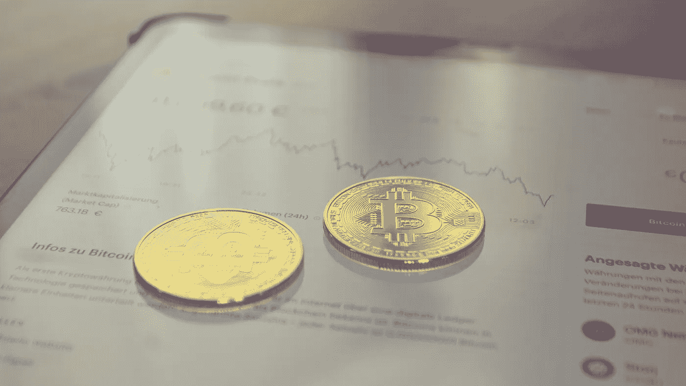
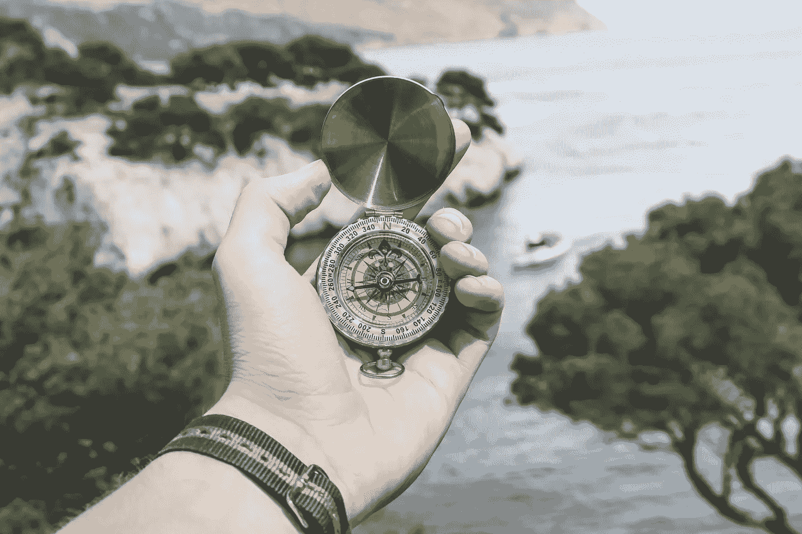

# 如何将你的第一笔 100 美元投资于加密

> 原文：<https://medium.com/coinmonks/how-to-invest-your-first-100-in-crypto-165473138a88?source=collection_archive---------2----------------------->

## 加密货币被称为我们这一代最伟大的财富转移之一。

自疫情以来，加密货币的总市值已增至 1.59 万亿美元，仅 2020 年 1 月以来，就有超过 3000 万个新的比特币地址或持有者。很多人都想加入。

问题是，真的很难知道从哪里开始投资加密，因为有太多的信息存在——其中许多是相互冲突的，复杂的，或者只是诈骗。

因此，我整理了这个指南，牵着你的手，一步一步地回答新加密货币投资者最常见的一些问题。

到本文结束时，你不仅会知道我的建议是买什么——即使只有 100 美元，你也会知道在哪里买，如何锁定利润，如何通过平均成本最小化风险，以及如何继续你对这个领域的了解。咻！准备成为密码专家吧！

来自你友好的加密邻居的快速免责声明——这不是财务建议。

我们开始吧！

你有 100 美元开始投资加密。有哪些项目值得你花血汗钱？有哪些项目是你应该避之不及的？

这份名单在蓝筹股和市值较低的另类投资之间找到了平衡，后者可能会带来一些重大收益。

**投资组合**

30 美元比特币

比特币是所有加密技术中市值最大的，价值 6160 亿美元。它的总供应量为 2100 万枚硬币，由于比特币减半(比特币挖矿奖励减半的四年周期)，新硬币的创造量不断减少。随着对代币兴趣的增加和供应量的减少，价格通常会上升。比特币也被认为是抵御通胀的工具，通常每年获得两位数的增长，而美元等法定货币则会贬值。这种针对通胀的保护已经导致大资金玩家购买比特币——包括特斯拉的埃隆·马斯克(Elon Musk)以 15 亿美元的价格和 Microstrategy 的迈克尔·塞勒(Michael Saylor)，他拥有 9 万 BTC。

25 美元以太坊

以太坊以 2790 亿美元的市值位居第二。虽然它的供应量远高于比特币，但它的效用才是这里的关键。以太坊被称为“信息的亚马逊”，加密货币领域普遍认为以太坊将成为未来 10 年加密创新的中心。据估计，一个名为“The Flippening”的事件即将发生，届时以太坊的总市值将超过比特币，标志着以太坊成为加密包的领导者。事实上，以太坊也即将推出其 ETH 2.0 更新，这将大大提高其处理交易的能力，并减少天然气费(处理交易收取的费用)，以太坊的未来非常光明。

20 美元多边形

Polygon 的未来直接与以太坊联系在一起。随着以太坊继续向 crypto-Polygon 的最高市值进军，它将从中受益。Polygon 的技术是以太坊和其他区块链的插件，提供二级扩展和安全解决方案。正如我前面提到的，燃气费和交易速度是以太坊关心的问题。多边形解决了以太坊的这两个问题。随着 ETH 2.0 的推出以及以太坊生态系统中创造出越来越多的实用程序，对 Polygon 等二级扩展解决方案的需求只会增加。更不用说 80%的分散式应用程序都是建立在以太坊上的——Polygon 在未来的几年内都将处于有利地位。

10 美元链环

继续骑在以太坊的尾巴上的趋势，我们的第三个投资将是 Chainlink。Chainlink 的技术通过分散的网络提供了从区块链到现实世界数据的数据桥梁，以确保有效性、安全性和准确性。我预计，随着越来越多的开发人员涌入以太坊，寻找连接区块链和现实世界数据链的解决方案，链接将呈指数级增长。

15 美元卡尔达诺

与我们最近的几枚硬币/代币不同，卡尔达诺不打算与以太坊合作。它被建成以太坊网络的直接竞争对手。由以太坊的联合创始人查尔斯·霍金森创立——他们当然有开发人才。投资卡尔达诺和两年前投资以太坊差不多。风险很大，但收益很高。随着 Cardano 推出智能合同(或个人和当事人之间的可编程合同)的前景，可能是时候考虑支持这个项目了。

既然我们已经选择了投资，那么我们如何着手实际购买 crypto 呢？让我们进行一次加密交易吧！

虽然在哪里购买加密有很多选择，我选择了比特币基地作为本教程，因为它是许多第一次加密投资者的第一次交流。你可以把它想象成一个泡沫地板的游乐场——在比特币基地你很可能不会被嘘。更不用说它是美国最大的加密货币交易所，其无懈可击的安全记录使其成为购买您第一笔资产的安全赌注。

*我在下面的描述中提供了我的推荐链接。请随意使用它来收集一个免费的 10 美元 BTC。

认真考虑一下，让你喜欢的加密项目能够重复购买。几乎不可能确定何时高卖或低买。通过将投资分散到一段时间，拥有一个自动投资设置可以保护你免受过度风险。

此外，把它当作一条经验法则——一旦你的一项投资价格上涨 30%,你就卖出一部分，把这些利润转换成 BTC。把这个当成你的存钱罐——手头有投资流动性，以应对任何糟糕的下跌或熊市。这样做，你手头就有了钱，并完全准备好“放弃”你最喜欢的项目。

值得理解的是，你阅读这篇文章，并投资于你的第一个加密货币只是一个漫长而繁荣的加密旅程中的一步。

我在下面链接了一些我最喜欢的资源，以帮助你更多地了解这个行业，并“提升”你对加密游戏的理解。不久之后，你将成为自己的密码专家——并有可能就该主题发布自己的博客或 Youtube 频道。

现在你知道了。您现在了解了一些有前途的加密项目，在哪里投资您的第一个令牌，如何保护您的投资免受过度风险，并且已经收集了资源来继续了解更多关于该行业的信息。

https://www.coinbase.com/join/turner_sq8g 比特币基地链接—

如果你想看我的更多内容，可以考虑在我的 Youtube 频道上关注我！链接—

 [## 无人驾驶飞机

### 欢迎来到 NoAutoPilot Youtube 频道，在这里我们将帮助你掌控你的金钱和生活目标。关闭…

www.youtube.com](https://www.youtube.com/channel/UCnCBeEKjj95nPG8q_56yGlA) 

*   包括附属链接