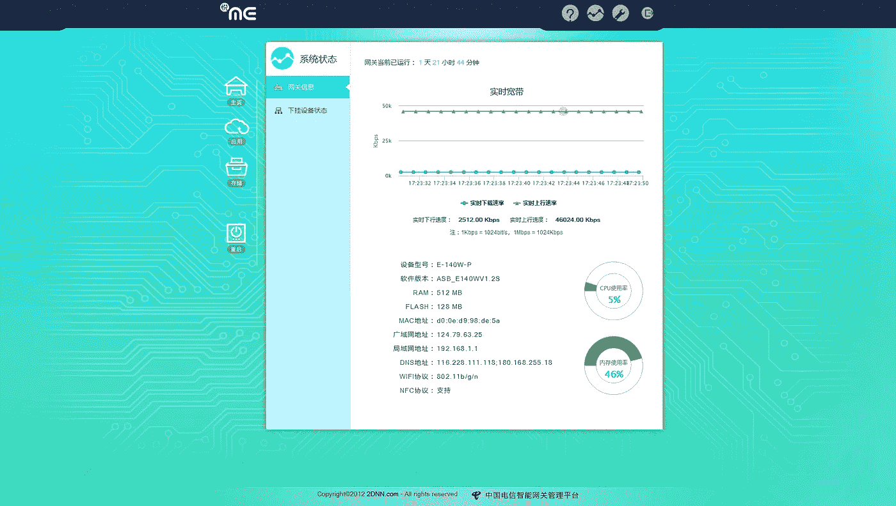
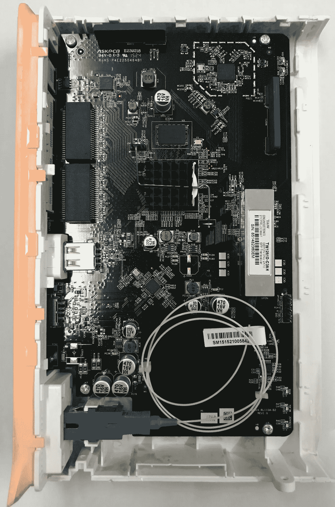
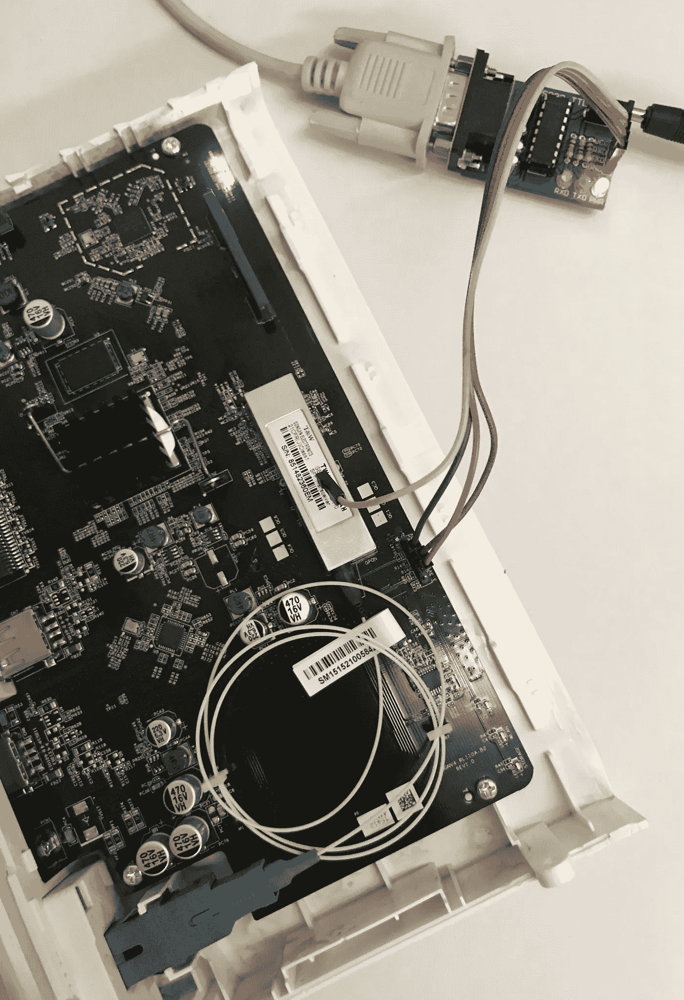
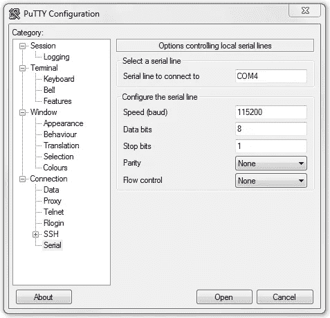
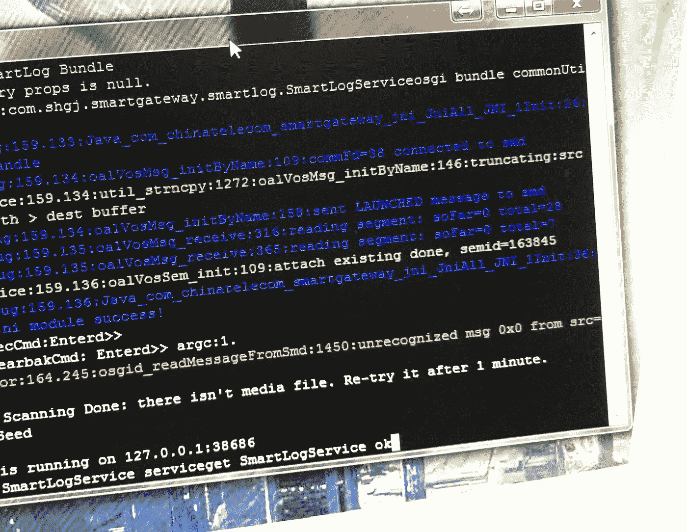
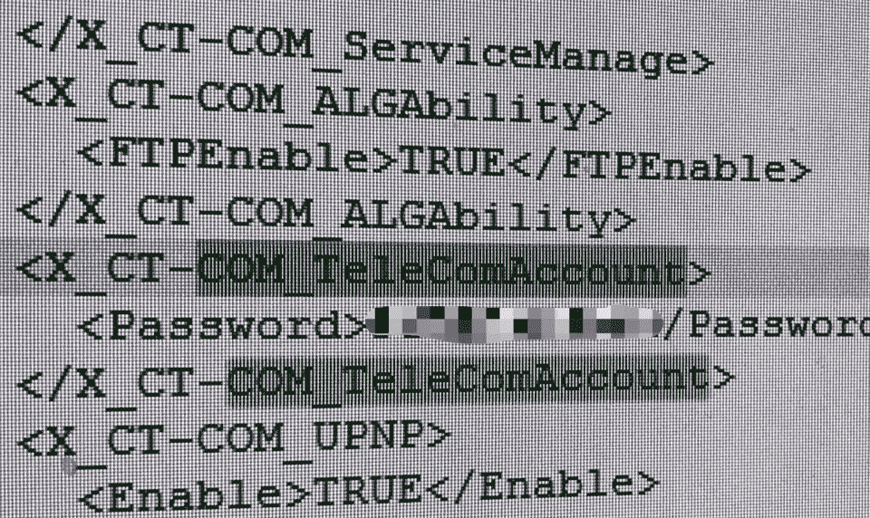

# 简单如 ABC:如何破解中国电信的调制解调器/路由器——以 E-140W-P 为例

> 原文：<https://medium.com/coinmonks/how-to-jailbreak-your-modem-from-china-telecom-shown-exemplary-for-a-e-140w-p-53c32d647a29?source=collection_archive---------0----------------------->

**首先:**根据中国法律(包括 CSL——网络安全法)和中国电信的条款和条件，以下指令肯定不打算在中国执行，极有可能是非法的，并且不排除被当局起诉。我拒绝对后果负责。

在中国，中国电信的互联网连接通常通过调制解调器和路由器的组合(包括 3 或 4 个局域网端口)进行非透明访问。调制解调器使用 DHCP 客户端通过 ADSL 或玻璃纤维获得分配的公共 IP。如果需要，集成路由器使用 DHCP 服务器在 192.168.1.x 网段中建立网络。调制解调器/路由器为自己保留 IP 192.168.1.1，并在内部网中充当网关和 DNS。

共有 253 个客户端可以通过局域网端口和 WiFi (ID 2 到 254)登录。如果您想在公寓内设置额外的网络，您可以将额外的路由器连接到每个 LAN 端口。

# 问题是

如有疑问，您可能会发现您的设备甚至位于两个 NAT 伪装之后，但您只能控制其中一个。端口转发和端口触发端在中国电信的 modem/路由器组合。但是，可以将调制解调器切换到桥接模式并独立运行。一名技术人员出来操作调制解调器。然而，现在内部路由器不能再使用了，你必须将自己的路由器连接到调制解调器。之后，只有一个路由器可以用调制解调器操作。内部局域网端口是无用的。但至少你从技术人员那里得到了你接入中国电信网络的数据。对于大多数人来说，这应该是获得对路由表的控制的更容易和合法的方式。

我临时打开了网桥模式，但无法向技术人员明确表示我想在几米远的地方操作路由器，而不是在墙板后面。要么是他缺乏想象力，但我妻子在调解和翻译方面的尝试表明，他认为私人客户不具备独立操作路由器(甚至在一个公寓里操作几个路由器)的技术知识。无论如何，我让调制解调器再次肆无忌惮地运行。在短时间内，我无法尝试是否有可能在网桥模式下，在公共 IP 下的 NAT 后面的某个端口下寻址某台计算机。我唯一的目标是控制端口转发和调制解调器/路由器的内部防火墙。

在调制解调器本身上，有一个标签，上面有客户登录路由器的凭据——通常是用户 *useradmin* 和 5 位数字和字母的组合。用户管理的设置非常有限，公共 IP 和内部网中 DHCP 分配的 IP 之间的端口转发被完全禁用。因此，DynDNS 服务在中国也不起作用。

作为用户“telecomadmin ”,接入调制解调器有望获得更多选择。密码似乎是 8 到 10 位数字和字母的组合，但在几次登录失败后，路由器会在几分钟内禁止进一步的登录尝试。暴力攻击也许是可能的，但似乎很耗时。总之，比起撬棍我更喜欢一套开锁工具。

过去，用户 useradmin 可以创建一个调制解调器设置转储，telecomadmin 的密码以纯文本形式存储在其中。等你停止打脸一段时间后，我会告诉你，这肯定是不可能的了，但显示了中国电信的硬件安全设置的松懈处理。然而，通过串行接口访问似乎更有前途，尽管连接器不能从外部访问。要接触到引脚，必须打开外壳，这将导致保修失效。多好啊，如果你已经有了在 WRT54G 和一些 ASUS 路由器上记录串行服务接口的经验。

# 身体——让我们身体接触一下…

带着读取串行数据的适配器套件，我开始工作。在没有带 RS232 接口的电脑的情况下，我带了一个额外的 RS232 转 USB 转换器。你只需松开两个螺丝，其中一个用贴纸盖住。不干胶标签很容易松开，之后又会重新粘上。用抹刀和一些技巧就可以打开箱子，不会造成损坏。

中国电信调制解调器的越狱仅仅意味着找出用户 telecomadmin 的密码，他最终可以改变调制解调器上的所有设置。虽然“越狱”一词暗示了越狱的想法，但它只意味着侵入设备。中国电信似乎完全依赖于客户的无知和技术上的无能。由于我在这里戴上了白帽子，并且只策划了一个 NAT 防火墙后面的几个照明网络节点的私有(测试)操作，所以我认为我的行动没有引起看门人的注意。

我不知道中国电信还有哪些路由器/调制解调器，但我假设它们的配置都非常相似。允许访问后端的软件是 2012 年的。

# 典当！

打开箱子后，你会发现一些孤零零的但贴有正确标签的针，用于维护目的。你连接

GND/GND，
TXD/RXD，最终
RXD/TXD，通过适配器将您的路由器与您的计算机连接起来。

无论您使用哪种适配器设备和操作系统，驱动程序都将提供对(虚拟)COM 端口的访问。我使用 windows，插入适配器并安装驱动程序，结果显示该设备可通过 COM 端口 com4 访问。

用如下设置打开一个终端(我用的是 putty ):

打开路由器电源后，控制台会收到调制解调器和路由器日志的垃圾邮件。

您可以通过按下<enter>按钮来停止。将显示输入用户名和密码的提示。很难相信，但是第一次尝试 admin/admin 组合时效果很好。您的提示显示“S304 ”,这是此类路由器的常用“用户”。</enter>

随着命令

> 显示 mdm 配置

您可以强制机器转储所有系统配置。右击 putty 的左上角，选择“全部复制到剪贴板”,最后粘贴到你选择的编辑器中。我的是 notepad++。

然后搜索术语

> COM_TeleComAccount

您将获得超级管理员密码

> …
> <X _ CT-COM _ TeleComAccount>
> <密码>XXXXXXXXXX</密码>
> </X _ CT-COM _ TeleComAccount>
> …

登录方式

> telecomadmin/XXXXXXXXXX

现在我们有了超级管理员控制面板，靠在椅背上，享受比中国电信更聪明的满足感。

# 底线是…

还是那句话，这个程序在中国肯定是不合法的！据我所知，中国的整个互联网流量都经过深度包检查(DPI)，但中国电信显然没有在他们提供的设备的安全性上花太多功夫。标准的用户名和密码组合、每个螺丝刀的所有者都可以访问的明文文件中的明文密码以及完全没有任何最先进的加密技术，使得 ABC 可以轻松破解他们的硬件。

> [直接在您的收件箱中获得最佳软件交易](https://coincodecap.com/?utm_source=coinmonks)

