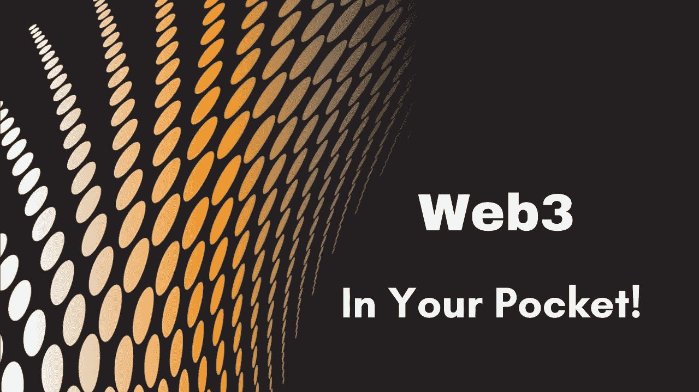

# 如何把 Web3.0 放在口袋里？

> 原文：<https://medium.com/coinmonks/how-to-keep-web3-0-in-your-pocket-5637f4eef9ea?source=collection_archive---------2----------------------->

## 我们正处于 Web3 时代，在这篇文章中，我将告诉你从手机访问 Web3 的便捷方式。

Image credit [pixabay](http://pixabay.com/)

我们是经历了网络革命的一代；我们经历了 Web1.0，Web2.0，现在我们处于 Web3.0 时代。但我们中的一些人仍然没有将自己升级到 Web3.0，这可能是因为他们没有意识到这一点，或者他们发现访问 Web3.0 有困难，或者他们不知道 Web3.0 的重要性。所以继续阅读这篇文章，我会让你了解 Web3 的重要性，并告诉你访问 Web3.0 的最简单的方法

Web3.0 只不过是第三代的[万维网](https://en.wikipedia.org/wiki/World_Wide_Web)但是在我告诉你 Web3.0 的重要性之前，我们应该简单地讨论一下什么是 Web1.0、Web2.0 和 Web3.0，这样有人能理解 Web3.0 的重要性吗

## 什么是 Web1.0？

Web1.0 是从 1983 年到 1999 年，互联网的第一个阶段，用户没有贡献，网站是在静态页面中，所以用户不能有交互功能，网站直接存储在网站文件中没有不同的数据库，所以很容易被黑客攻击，没有制作精美网站的选项，有些网站不是每个浏览器都支持，管理复杂。搜索能力没有提高{ [参考](https://websitebuilders.com/how-to/glossary/web1/) }。

## **什么是 Web2.0？**

1999 年后，Darci DiNucci 引入了术语 Web2.0，Web2.0 的广泛使用在 2004 年后得到了改善。在 Web2.0 时代， [web 应用](https://en.wikipedia.org/wiki/Web_application)创造了它们的位置，现在网站在 [UI](https://en.wikipedia.org/wiki/User_interface) (用户界面)和 [UX](https://en.wikipedia.org/wiki/User_experience) (用户体验)方面有所改进，现在用户可以生成[内容](https://en.wikipedia.org/wiki/Web_content)，网站、内容、应用之间的[互操作性](https://en.wikipedia.org/wiki/Interoperability)增加了{ [引用](https://websitebuilders.com/how-to/glossary/web2/) }。

## 什么是 Web3.0？

Web3.0 是语义网，它不是通过关键词或数字，而是通过搜索和分析来改进 Web 技术，互联网与人工智能相结合，可以更准确地连接和理解用户。游戏、电子商务、地理空间环境等内容可以以 3D 图形的形式执行，这是一个开放的网络，让您能够控制您的数据。

## Web3.0 的重要性

众所周知，Web3.0 是开放、无信任和无权限的，当它与区块链技术结合时，它将使用户更个性化地使用互联网，控制数据，更好的搜索体验，丰富的应用程序体验，更容易使用或贡献，因此它对个人和商业用例具有重要意义。

Web3.0 将分散所有的服务和应用程序，去除中间人和互联网，成为一个[点对点](https://en.wikipedia.org/wiki/Peer-to-peer)系统，减少现有[巨型互联网公司](https://en.wikipedia.org/wiki/List_of_largest_Internet_companies)的统治地位，将控制权交给用户，系统可以奖励用户。

## 如何从手机访问 Web3？

一部普通的手机，通过连接一个[中央网络服务器](https://en.wikipedia.org/wiki/Client%E2%80%93server_model)来生成一个中央环境，所以当你下载一个应用程序、聊天、网上冲浪或下载/上传任何东西时，所有的数据都通过一个中央服务器，没有[加密](/searchencrypt/what-is-encryption-how-does-it-work-e8f20e340537)。

所以我们需要通过下载状态应用来创造一个安全的环境，让你有充分的权力在同一个地方访问 Web3.0 和去中心化的应用。

[状态应用](https://status.im/get/)是一个具有多种设施的应用，构建于以太网之上，提供安全聊天、安全钱包、 [Dapps](https://www.investopedia.com/terms/d/decentralized-applications-dapps.asp) (分散应用)、[ERC 20](https://www.investopedia.com/news/what-erc20-and-what-does-it-mean-ethereum/)&[ERC 721](http://erc721.org/)兼容性、Web3 浏览器等

## 结论:

在使用了[状态应用](https://status.im/get/)一个月后，我正在写这篇文章，我描述的所有关于 Web1.0、Web2.0 和 Web3.0 的事情都是我的研究。[状态应用](https://status.im/get/)的座右铭是好的，但我认为它还需要更多的改进，因为有时它需要时间来加载，这是因为状态应用仍处于初始阶段，但你可以尝试一下。

> 作者详细信息:
> 
> 姓名:吉坦德拉·纳伊克
> 
> 电子邮件:Jitencrackit2@gmail.com

> 直接在您的收件箱中获得最佳软件交易

