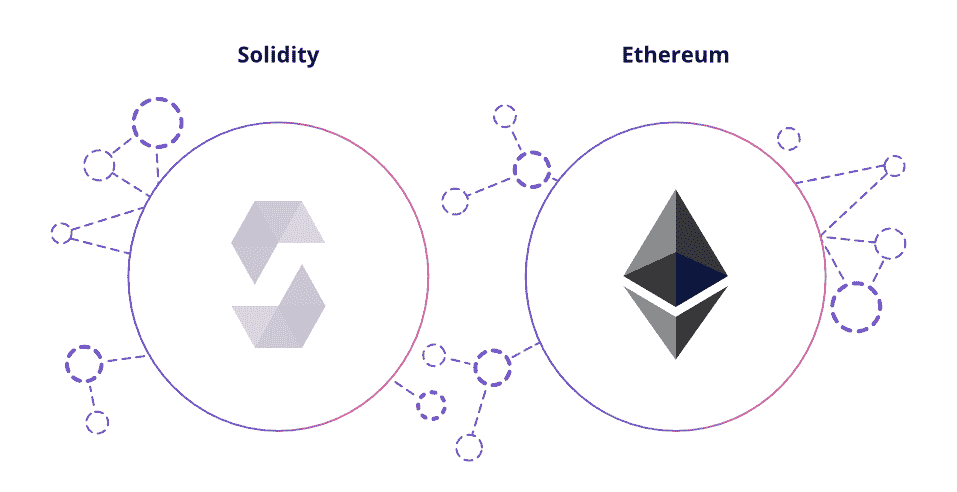

# 如何在 30 天内学会扎实

> 原文：<https://medium.com/coinmonks/how-to-learn-solidity-in-30-days-78b02e503d23?source=collection_archive---------0----------------------->

过去一个月，我利用空闲时间学习 Solidity(以太坊智能合约语言)。由于 NFT 的大肆宣传和我对去中心化金融(Defi)无止境的兴趣，我认为终于到了适当学习稳健的时候了。

它们为基于以太坊的普通令牌 ERC20 和 NFT 提供动力，我们听说它们通过 ERC721 和 ERC1125 协议卖出了高价。