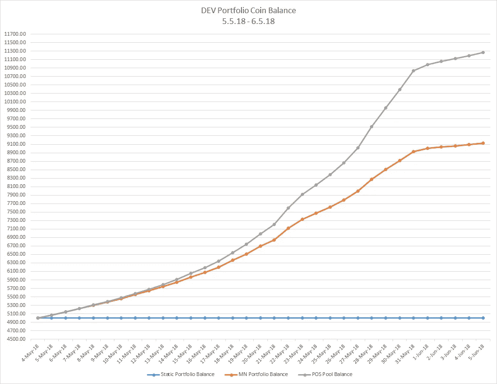
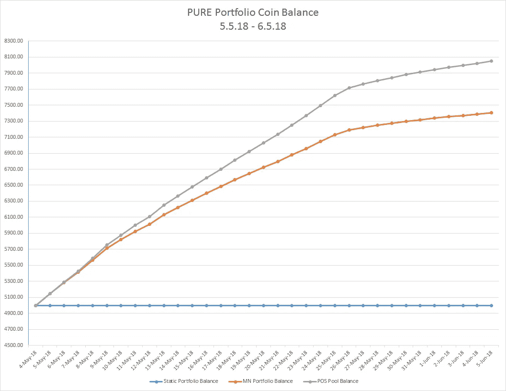
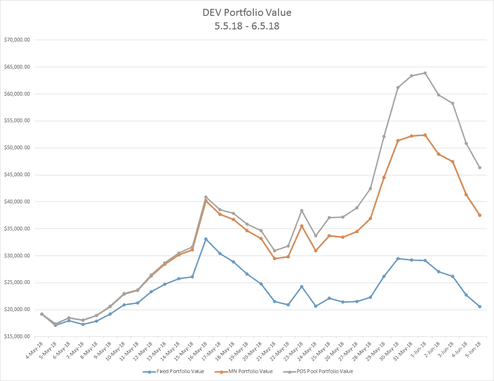
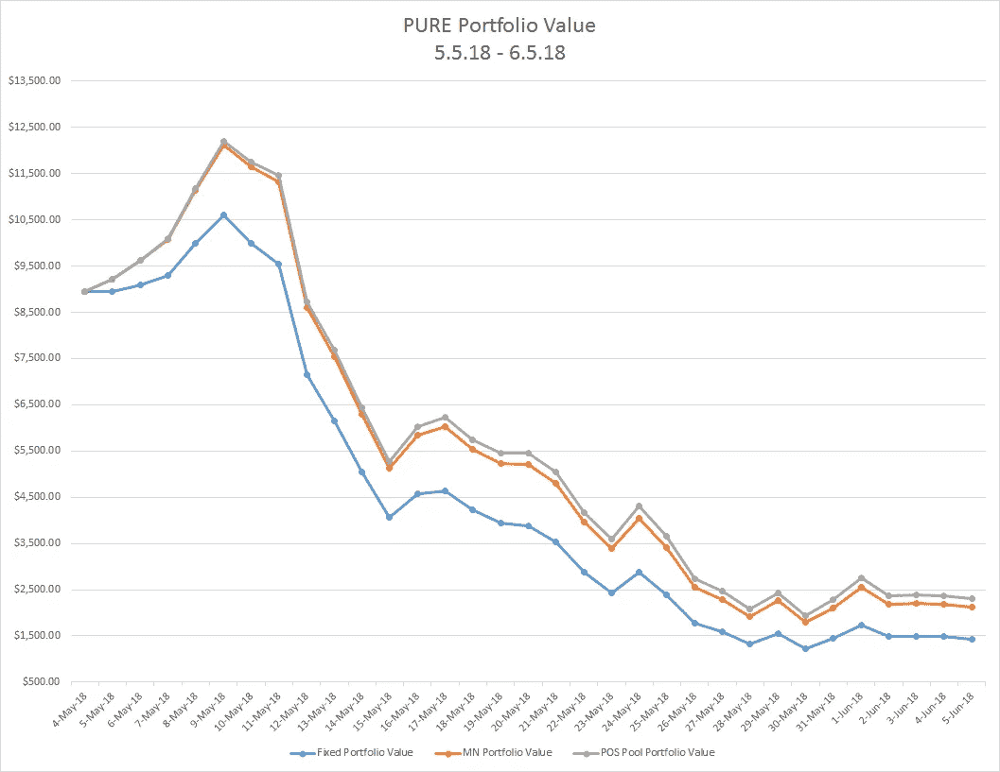

# 如何利用 Masternode 复利打包行李:

> 原文：<https://medium.com/coinmonks/how-to-leverage-masternode-compound-interest-to-pack-your-bags-6b36ffda40ac?source=collection_archive---------9----------------------->

## 复合被动收入的力量

# **第一部分——背景**

2018 年 4 月，我读了一篇知名加密矿工 [@notsofast](https://twitter.com/notsofast?lang=en) (来自两年前)的转发，平静地说*【转述】* *拥有一个 Dash master node(1000 个 Dash 硬币)有一天会像在曼哈顿拥有一栋公寓楼一样。*

拥有出租房产会给你带来被动收入，在曼哈顿拥有一栋出租房产会给你带来大量被动收入。请继续。

在他最初发推文的时候，一辆 Masternode 的 Dash 价值约 2500 美元。在 2017 年 12 月的鼎盛时期，Dash 的 Masternode 价值约为 150 万美元(尽管在撰写本文时接近 31.5 万美元)。大约 59，000%的升值本身是不真实的，但我们在其他硬币上看到了这一点。从一开始真正引起我兴趣的是，除了硬币价格的增长，因为它的 Masternode 奖励，你正在获得显著的被动回报，潜在地增加你的投资回报率指数。

在我们继续之前，重要的是至少在概念上理解主节点和复利。

# 主节点

在基本形式上，Masternode(根据@darbyOgill_)是“一个完整的节点或加密货币钱包，它完全同步于你选择的任何具有 Masternode 功能可用性的硬币的区块链上，并且始终全天候运行。”换句话说，Masternode 是一种货币的一定数量的硬币(具有 Masternode 功能),放在一个安全的钱包中，供社区随时使用。这样做的好处是，主节点可以执行加密货币的多种通用和独特功能，速度比区块链的各个部分快得多。

托管主节点最终是为加密货币本身提供服务，作为回报，奖励(以主节点硬币的形式)将返还给托管主节点的人。

如果你真的对参与赌注和高手过招感兴趣，有两篇不容错过的文章值得一读。第一篇是 [CoinSutra](https://coinsutra.com/masternodes/) 的一篇很棒的文章，详细介绍了什么是 Masternodes 以及它们是如何工作的。第二篇是@DarbyOgill_ 的一篇中型文章，名为 [Masternodes for 初学者](/@DarbyOGill_/masternodes-for-beginners-6c697119bc31)。第二篇文章深入探讨了如何选择主节点，以及如何安装并运行主节点。

# 复利

复利是一个非常简单的概念，但人们往往不能完全掌握它的力量。复利的概念就是把你的利息收入加到你的本金上，这样下一次的利息收入是基于更高的本金。很直接，对吧？大多数人都非常熟悉传统投资和投资组合领域的复利，但当涉及到加密投资和主节点时，这种动力就有了全新的含义。

当谈到复利时，要记住的关键不是你得到的本金的百分比，甚至不是本金的数量，而是你的利息复利的比率。你的复利越快，你就能越快地建立起你可以持续复利的本金。

网上有很多复利计算器，你可以玩玩感受一下它是如何工作的，但这里有一个简单的例子来说明复利的重要性。考虑以下固定本金和利息、不同复利的情况:

1，000 美元的本金**以每年** **的复利**计算，一年的利率为 1% = 1，010.00 美元

1，000 美元的本金**按季度复利**计算，一年的利率为 1% = 1，040.60 美元

本金 1000 美元**每周复利**一年 1% = 1126.84 美元

1，000 美元的本金**以 1% = 37，783.54 美元的利率每日复利**计算一年

# 第 2 部分—深入

好了，现在你至少应该对主节点和复利有一个基本的了解。所以你只需选择一枚主节点硬币，设置主节点，获得回报，对吗？有点，但是像生活中的大多数事情一样，优化你的过程是至关重要的。

在一个非常基本的层面上，当你运行一个主节点时，你将收到你的奖励(在硬币的奖励间隔)到一个你建立的独立于主节点的钱包。如果你愿意，你可以让这个钱包无限积累，但你永远只能从你的主节点运行中产生复利。如果这样想。如果您的主节点需要 5000 个硬币，而您有 6500 个硬币，您仍然只能在主节点的 5000 个硬币上获得奖励。您不能运行部分 Masternode，因此，在您有足够的硬币购买另一个完整的 Masternode 之前，您无法将您的收入进行再投资。如果你还记得上面的话，我们越快复合这些收益越好，那么我们如何让它发生呢？

进入主节点共享的概念。我最初偶然发现 Masternode 共享服务是因为我想参与的 master node 的成本超出了我的预算。此外，我没有 Linux 背景，不习惯设置 Masternode，而且我住在一个互联网费用非常高的地区，所以让一个节点和设备一直在线很可能是一个双输游戏。当我意识到共享服务也能让我以更有效的方式利用我的收入时，开始时“简单”的方式最终成为了我的“灯泡”时刻。

主节点共享服务本质上是向其用户提供购买主节点位置(主节点的百分比)的公司/个人。通过这样做，您可以购买更少的主节点，并获得相应百分比的主节点奖励。Masternode 共享服务为他们的服务收取费用(我发现这是象征性的)，并为你做所有的协调和托管。我个人使用 [Simple POS Pool](https://simplepospool.com/?ref=KFleming) ，但我知道还有其他人提供不同的硬币。我在这里 写了一篇关于简单 POS 池 [**的评论，我认为在注册之前阅读是很重要的。**](/@keegandfleming/simple-pos-pool-review-f99d688dc42e)

回到灯泡时刻…我很快注意到，因为我能够购买 Masternode 的老虎机(小百分比),我的奖励很快积累到可以购买另一个老虎机的数量。添加额外的插槽条目，意味着我能够更快地构建另一个插槽条目。每次我买了 Masternode 吃角子老虎机，我就能产生足够的硬币来更快地买下另一个。这让我想知道，如果我拥有自己的 Masternodes，或者我根本没有 master nodes，我的回报率会有多大的不同。系好安全带。

# 第 3 部分—用例

在这一点上，你应该假设持有一枚硬币的主节点比持有相同数量的所述硬币更有利可图，但你可能没有假设持有所述硬币的主节点的主节点槽比持有该硬币的整个主节点更有利可图。让我们看看实际硬币上的实际数字，看看它到底是什么样子。

出于此分析的目的，我选择了两种硬币(DEV 和 PURE)来评估从 2018 年 5 月 5 日到 2018 年 6 月 5 日的一个月时间。我特意选择了一枚在此期间价格略有上涨(DEV)的硬币和一枚价格大幅下跌(PURE)的硬币。现在你可能知道，一些硬币表现很好，而大多数硬币表现很差。如果你赶上了火箭…所有这些都是毫无意义的，你是满载而归。如果你有一个显示稳定增长的好硬币，知道会发生什么很重要，当你有一个绝对的火车残骸(你会)，知道会发生什么也很重要。

我使用了来自[Coinmarketcap.com](https://coinmarketcap.com/)的每枚硬币的历史价格数据，以及来自 [masternodes.online](https://masternodes.online/) 的 Masternode 每日平均奖励。同样为了方便，这两种硬币都需要 5000 个硬币来创建一个完整的 Masternode。

为了便于说明，我使用了以下三种比较性能的方法:

1.固定投资组合:在这个场景中，我模拟了购买一个完整主节点所需的数量，但没有购买一个主节点。投资组合价值随价格波动，但硬币数量是固定的(5000)

2.MN Portfolio:在这个场景中，我购买了 5000 枚硬币来创建一个完整的 Masternode，然后创建了 Masternode。投资组合价值随价格波动，并受到奖励硬币的积极影响。

3.POS Pool Portfolio:在这个场景中，我购买了 5000 枚硬币来创建一个完整的 Masternode，然后创建了 Masternode。此外，每当我生成 50 个硬币，我就额外购买一个 Masternode 插槽(1%)。投资组合价值随价格波动，并受到奖励硬币的积极影响。

**首先让我们看看投资组合余额(硬币数量):**

在 DEV 的例子中，固定投资组合以 5000 个硬币开始，以 5000 个硬币结束(令人震惊)。MN 投资组合以 5000 个硬币开始，以 9130 个结束(赚了 4130 个硬币)。POS 池投资组合以 5，000 个硬币开始，以 11，271 个硬币结束(赚 6，271 个硬币)。

在 PURE 的例子中，固定投资组合从 5000 个硬币开始，到 5000 个硬币结束。MN 投资组合以 5000 个硬币开始，以 7404 结束(赚了 2404 个硬币)。POS 池投资组合以 5000 个硬币开始，以 8，049 个硬币结束(赚 4，049 个硬币)。

**现在让我们看看投资组合价值(注意，这受到硬币价格和余额的影响):**

在 DEV 的情况下，固定投资组合开始时的价值为 19，150 美元，结束时的价值为 20，550 美元(收益为 1，400 美元)。MN 投资组合开始时的价值为 19，150 美元，结束时的价值为 37，527 美元(收益为 18，877 美元)。POS Pool 投资组合的初始价值为 19，150 美元，最终价值为 46，325 美元(收入为 27，175 美元)。

在 PURE 的情况下，固定投资组合以 8，950 美元开始，以 1，430 美元结束(损失 1，400 美元)。MN 投资组合以 8，950 美元开始，以 2，117 美元结束(损失 6，832 美元)。POS 池投资组合的初始价值为 8，950 美元，最终价值为 2，302 美元(损失 6，647 美元)。

# 第 4 部分—结论

从上面的数据来看，有几件事应该会立刻引起你的注意:

1.无论您选择什么 Masternode，都会受到价格的影响。如果硬币价格暴跌，一周(或一个月)12，000%的投资回报率就无关紧要了。你只剩下一枚数量惊人的硬币，你可能无法兑现，也没有任何价值。这使得你的硬币选择标准更加重要。

**2。**随着硬币价格的上涨，如果你有更多的硬币来倍增硬币，你的帐户余额将以更快的速度增加。**增加利润。**

3.随着硬币价格的下降，如果你有更多的硬币可以倍增，你的帐户余额将以较慢的速度下降。**为你的投资增加一些价格保护和缓冲。**

4.你越快让你的奖励硬币开始产生更多的奖励越好。购买插槽，以便您可以尽快进入主节点位置，这对您的整体帐户价值非常有利。

5.尽管 Masternode 共享服务通常被视为投资 master node 的“简单”或“廉价”方式。如果操作正确，它们可以说是比实际拥有 Masternode 本身更好的投资。一个严重的警告是硬币的安全性。我在我的简单 POS 评论[中对此做了更详细的说明，但在投资之前应该理解和考虑这一点。](/@keegandfleming/simple-pos-pool-review-f99d688dc42e)

就选择投资 Masternode 硬币而言，将提供以下内容……我个人选择了令人惊讶的 master node 和令人难以置信的垃圾，因此我没有任何硬币选择记录，使我有资格就单个硬币向你提供建议。你必须自己做研究。你应该从基本面(团队、白皮书、路线图、社区等)来评估硬币。)和技术(价格、数量、市值、投资回报率等)。)投资前的立场。不要只看一个硬币的投资回报率，因为它往往是非常误导性的，并不表明硬币的力量。有大量的信息可以用于硬币评估，请使用它。

推荐:我把这些信息放在一起，希望它能帮助像我这样正在寻找更多主节点和投资策略信息的人。它当然可以免费使用，我真心希望你能利用这个概念来最大化你的投资组合和头寸。如果你有兴趣尝试将 [Simple POS Pool](https://simplepospool.com/?ref=KFleming) 作为主共享服务，我恳请你使用我的[推荐链接](https://simplepospool.com/?ref=KFleming)。非常感谢，这将极大地帮助我。

最后一句警告！以上信息参考了我的观点，仅供参考。这绝不是投资建议。找一个有正式执照的专业人士寻求投资建议。如同加密世界中的任何事情一样，请保护好你的账户信息和资金。永远不要投资超过你能承受的损失。