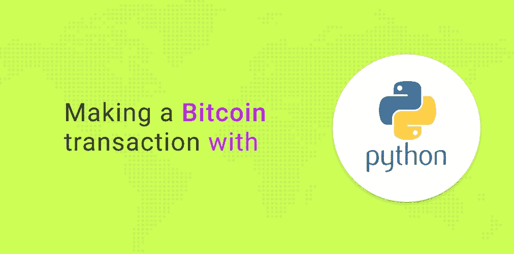

# 如何用 Python 进行比特币交易

> 原文：<https://medium.com/coinmonks/how-to-make-a-bitcoin-transaction-with-python-450d7d3db864?source=collection_archive---------2----------------------->



## 最初发表在 [NOWNodes 博客](https://nownodes.io/blog/how-to-make-a-bitcoin-transaction-with-python)感谢 [Gaurav Agrawal](https://medium.com/u/87a61f1520ab?source=post_page-----450d7d3db864--------------------------------) ！

在上一篇文章中，我们了解了[创建比特币高清钱包](/coinmonks/bitcoin-hierarchical-deterministic-wallet-in-python-5947147e3eda)。今天，我们将讨论如何使用 Python 创建、签名和广播比特币交易。

# 先决条件

我们将使用`[bit](https://pypi.org/project/bit/)` python 库，这是开发比特币相关应用程序的最快、最简单的库之一。使用以下命令安装`[bit](https://pypi.org/project/bit/)`。

```
pip install bit
```

# 创建比特币钱包(Testnet)

在本教程中，我们将创建一个比特币 testnet 钱包。因为我们将创建交易并发送比特币，所以我们不希望您丢失真正的比特币。

比特币测试网(Bitcoin Testnet)是一个模拟原始比特币网络但不具有任何货币价值的网络。Testnet 有测试比特币。因此，不要把真实的比特币发送到 testnet 地址，你会丢失它们。

因此，让我们创建一个简单的 testnet 钱包。为此，创建一个简单的 python 文件`transaction.py`，复制并粘贴下面的代码。

```
from bit import PrivateKeyTestnetmy_key = PrivateKeyTestnet()print(my_key.version)print(my_key.to_wif())print(my_key.address)
```

这段代码将创建一个简单的钱包并打印`wif` ( [钱包导入格式](https://en.bitcoin.it/wiki/Wallet_import_format))。使用这个`wif`我们可以再次得到我们的钱包。

否则`my_key = PrivateKeyTestnet()`每次都会生成一个新的钱包。

所以一旦得到`wif`就把`my_key = PrivateKeyTestnet()`换成`my_key = PrivateKeyTestnet('wif')`。这样，每次我们重新运行上述代码时，我们都将使用同一个钱包。

# 获取测试比特币

现在，我们需要获得一些测试比特币，这样我们就可以将它发送到另一个钱包。

要获得 testnet 比特币，请使用[此链接](https://testnet-faucet.mempool.co/)。输入上述钱包生成的地址。你可以在这里查看你的 testnet 交易[。](https://blockstream.info/testnet/)

交易确认后，您还可以使用

```
print(my_key.balance_as('usd'))
```

**注意:** Testnet 比特币没有任何货币价值。

# 创建交易

现在我们准备创建一个事务。但是等等，我们需要一个接收者地址，否则，我们将把事务发送到哪里。您可以使用上述方法创建另一个钱包。然而，为了简洁起见，我们将使用下面的 testnet 地址。

**注意:**下面的地址是一个比特币 testnet 地址，不要在这个地址上发送真实的比特币。

```
mkH41dfD4S8DEoSfcVSvEfpyZ9siogWWtr
```

现在，我们什么都有了，所以我们准备创建一个比特币交易。

```
tx_hash = my_key.send([('mkH41dfD4S8DEoSfcVSvEfpyZ9siogWWtr', 1, 'usd')])print(tx_hash)
```

是的，使用`bit`我们可以只用一个命令来创建、签署和广播事务。另外，`[send()](https://ofek.dev/bit/dev/api.html#bit.PrivateKey.send)`方法以一个数组作为参数。这意味着您可以一次创建和发送多个交易。

上面的代码将打印一个交易散列，我们可以在[比特币 testnet block explorer](https://blockstream.info/testnet/) 上查看。

交易确认后，您可以使用重新检查您的钱包余额。

```
print(my_key.get_balance())
```

如需进一步阅读，请查阅`[bit documentation](https://ofek.dev/bit/)`。

NOWNodes —适用于 40 多个最受欢迎的区块链网络的资源管理器和 API。
在 1 个工作日内获得您的 API。

> [直接在您的收件箱中获得最佳软件交易](https://coincodecap.com/?utm_source=coinmonks)

[](https://coincodecap.com/?utm_source=coinmonks)