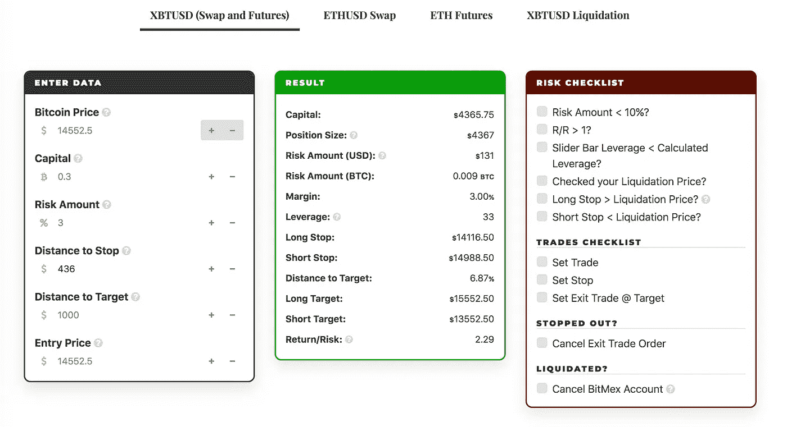

# 如何制作加密货币交易机器人——第 2 部分

> 原文：<https://medium.com/coinmonks/how-to-make-a-cryptocurrency-trading-bot-7409696b617e?source=collection_archive---------0----------------------->

## 风险管理。为什么你必须避免在 BitMex 上清算。。

快速警告:

*   不是交易建议。
*   其他一些人知道建造机器人/松树等。比我好。
*   我个人与 TradingView、Alertatron、exchanges 或任何提到的服务没有任何关系。
*   我在这里展示的大多数产品我已经用了好几年了。
*   您可以通过在帖子中注册推荐链接来帮助这个项目。

> 在[我自己的加密机器人讨论中询问关于机器人的一切](https://t.me/mocbchat)

[*零部分*](/@strategst/crypto-signals-were-a-scam-6cc240f55b40) *，我为什么要这样做*

[*第一部分*](/coinmonks/how-to-make-a-cryptocurrency-trading-bot-f94172e0c7bd) *，如何在 TradingView 上用开源策略生成信号。*

答按照第一部分的步骤，现在我们有两个买卖比特币的警告。

首先，让我们回到脚本的策略版本，看看我们这里有什么风险管理。

> 添加战略的更新版本，因为旧版本在本教程中不适用。

转到策略设置-属性-交易列表

**正如我们在第 1 部分中看到的，我们正在用一个简单的风险管理系统测试高杠杆策略:**

1.初始资本为 14552.5 美元，相当于 1 BTC 的美元

2.在每笔交易中拿 3%的资金冒险

3.在每笔交易中，相同的仓位大小为 1 BTC

4.标准止损 3%。

5.这里我们不会使用止盈，因为在这种趋势跟踪策略中，最重要的是驾驭整个趋势波，避免过早退出。

For precise backtesting make sure that your Initial Capital and Order Size are in proportion with Bitcoin price in the first trade

为了用其他数量的初始资本测试这个策略(假设你没有 1 个完整的 BTC)，你必须相应地改变你的初始资本值和订单大小。因此，举例来说，如果你想用 0.3 BTC 测试你的策略，你必须将你的初始资本设置为 4365.75 美元(2018/01 年的值为 0.3)，订单大小为 0.3。

Testing TradingView strategy with 0.3 BTC

我们可以返回概览，看到我们已经改变了净利润和支出数字。

我们选择这个特定的风险管理系统是因为它的简单性。你可以看到，这里的标准订单规模(或头寸规模)是我们初始资本的 100%，但我们只承担 3%的风险。这意味着我们使用 x33 的杠杆来交易这个头寸。

我们是如何进行这些杠杆计算的？

为此，我们使用了一个免费的反液化工具。

这个工具的详细指南很少，但是这里我们将简要描述它是如何工作的。

假设我们有一个价值 10000 美元的 BTC。我们一笔交易的分配资本是 3%。所以，事实上我们只能用 300 美元来冒险。我们的止损也是 3%。为了计算我们的头寸规模，我们必须用我们的风险金额除以止损距离(这个公式归功于 [CryptoCred](https://medium.com/u/f4aaa233d678?source=post_page-----7409696b617e--------------------------------) )。

所以，我们的头寸将是$300/0.03 = +10，000。

如果这一切听起来让你困惑，很高兴地说，你不必为每笔交易做所有这些计算，我们将在下一章的自动化服务中编写这个系统的代码。

但是现在，为了检查我们的计算逻辑，我们将使用反液化工具，它可以为我们计算所有的逻辑。从策略设置中输入您的风险金额和初始资本(以比特币为单位),并将“止损距离”设为 BTC 价格的 3%——我们已将此止损点硬编码在策略中。在右边的绿色窗口中，你会看到显示你的杠杆和仓位大小的结果。

让我们再计算一个例子，用 0.3 BTC 计算交易头寸，每次交易用 3%的资金冒险。

在这里，我们将比特币价格放在“比特币价格”中我们回溯测试的开始，我们的“资本”，“风险金额”为 3%，停止距离为比特币价格的 3%，它将是 436 美元。在“结果”中，我们的头寸规模和 x33 的杠杆是 4367 美元。

**但是还有一件事。**

在 BitMex 或 ByBit 等加密交易所，没有 KYC，交易所所有者不知道你是谁，所以他们不能给你钱。这意味着如果你在交易中被清算，你不能欠他们任何东西。

> 相反，BitMex 提出了另一件事。在每一个头寸中，他们都会保留一定比例的真实美元风险金额，以备万一他们在你破产前无法卖出你的头寸时使用。

这意味着，当你以高杠杆和紧张的清算价格交易时，交易所必须迅速卖出你的头寸，以免你负债。由于这里的债务是不可能的，他们会在价格达到你的破产水平之前开始出售你的头寸。

因此，举例来说，当你用 x100 杠杆交易，BTC 是 10，000 美元，你有 1%或 9900 美元作为你的破产价格，但 BitMex 将在大约 9950 美元开始出售你的头寸，给你 0.5%的交易保证金，以确保他们能够在 BTC 价格触及 9900 美元之前出售你的头寸。

如果他们在 9949 美元水平快速卖出你的头寸怎么办？交易所会清算你，把你的 49 美元存入他们的保险基金。BitMex 保险基金的数量通常会增加，但在真正的大波动时期，它有助于该交易所保持流动性。

在这一部分，我们在计算我们的头寸和实际杠杆时要记住一件事:不要给交易所保险基金注资。如何做到这一点？在多头交易中，始终保持你的平仓价格低于你的止损，在空头交易中，保持你的平仓价格高于止损。

在下一章中，我们将把 BitMex 的杠杆率设置为 x10，以保持较低的平仓价格，并根据我们自己的计算，以 x33 的实际杠杆率交易我们的策略。

然后，我会告诉你如何自动化风险管理系统，并在交易所执行，这样我们就可以包装我们的机器人，并开始[自动加密交易](https://coincodecap.com/category/trading-automation)。

在[我自己的加密机器人讨论上再见](https://t.me/mocbchat)！

> [*在您的收件箱中直接获得最佳软件交易*](https://coincodecap.com/?utm_source=coinmonks)

