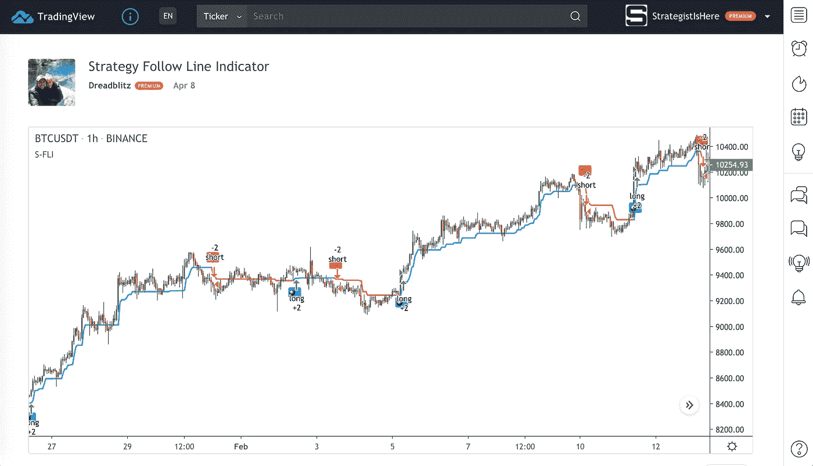
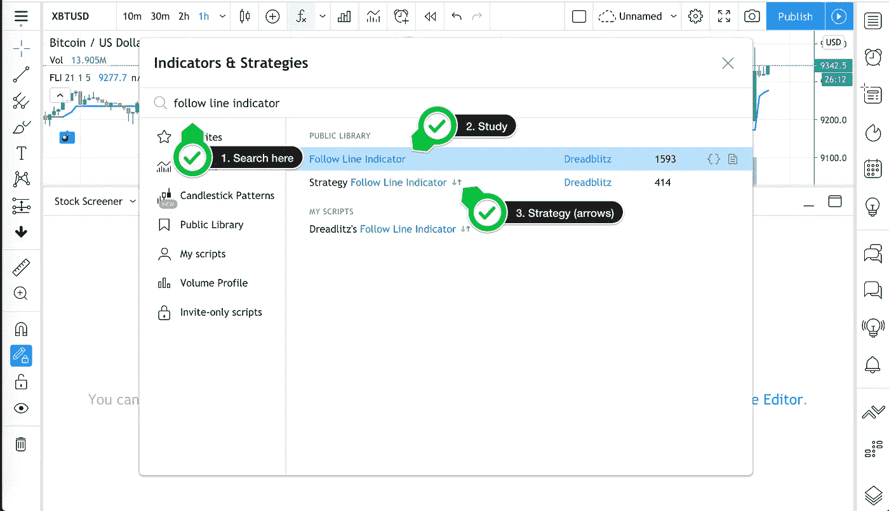
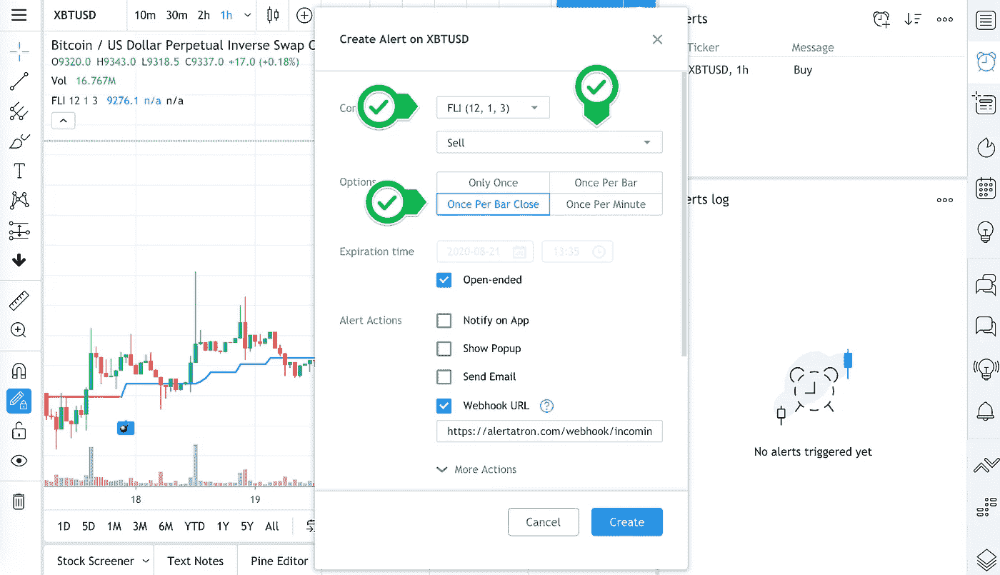

# 如何使用 TradingView 制作加密货币交易机器人

> 原文：<https://medium.com/coinmonks/how-to-make-a-cryptocurrency-trading-bot-f94172e0c7bd?source=collection_archive---------0----------------------->

## 没有技术知识和编码经验—基于云—第 1 部分

首先，一些警告:

*   不是交易建议。
*   有些人知道机器人建筑/松树等。比我好。
*   我个人与 TradingView、Alertatron、exchanges 或任何提到的服务没有任何关系。
*   我在这里展示的大多数产品我已经用了好几年了。
*   您可以通过帖子中的推荐链接注册来帮助这个项目。

*不要让帖子的长度吓到你。这里你有很多截图和描述，但是真的写这个教程比做它更难。*

在这里帮助和聊天:[我自己的加密机器人聊天](https://t.me/mocbchat)

[*我为什么这样做，part zero。*](/@strategst/crypto-signals-were-a-scam-6cc240f55b40)

# 我们正在做什么

我们正在基于开源策略制作基于云的[加密货币交易机器人](https://blog.coincodecap.com/five-best-crypto-trading-bots)，因此我们可以看到机器人的交易逻辑、过去的性能、调整参数，并完全控制其执行。这将是一个非常简单的趋势跟踪策略，但却非常有利可图。

# Bot 结构

一般来说，每个自动交易系统都有三个主要部分:

1.*信号生成器。*这是关于价格跟踪软件，以定义的方式产生信号的信息处理，以及信号发送器。有更多的方法可以做到这一点:通过 API 从交易所拉价格的 python 脚本，在本地计算机上运行的 MQL 4/5，数以千计。这里我们将尽可能简单和自动地说明，因此我们将选择 Tradingview。这部分是关于用 Tradingview 产生信号。

2.*风险管理。*这就要交易不会让你破产的位置，让你改天再战。我们将使用一个非常简单但严格的系统，每笔交易 3%，所有交易 9%(尽管这是后面讨论的主题)。说到止损，我们将在回溯测试的策略中对它们进行编码，在接下来的部分中，我将展示如何在交易所中自动设置止损。

3.*执行。执行是你的机器人的第二个关键部分。执行可以让你的策略像回溯测试一样盈利，也可以让你的策略亏损。这是关于佣金、滑点、限价/市价单，以及许多其他非常小但非常重要的事情。这是第二个教程的主题。*

# 产生信号。

因此，为了产生信号，我们必须准备两样东西。

首先，*向交易所*发送服务器端警报，我们至少需要 TradingView 的[专业版订阅](https://www.tradingview.com/gopro/?share_your_love=StrategistIsHere)(这是我的参考链接)。它给了我们最多 10 个警报的能力，所以我们可以用我们的策略监控最多 5 个硬币。

TradingView plans

第二件也是最重要的事情是，我们必须*找到一个有利可图的战略*。众所周知，大多数盈利策略都是秘密进行的。值得庆幸的是，在 TradingView 上，我们有一个巨大的开源社区和慷慨的程序员，他们免费发布他们的策略，所以我们可以研究他们，修改一些部分，也可以公开发布。所以，你可以去[这里](https://www.tradingview.com/scripts/?script_type=strategies)找一些。

Choose “Strategies only“

这里我想提请大家注意一件事。在 TradingView 上有两种类型的脚本:“学习”和“策略”脚本。简而言之，“策略”让我们能够回溯测试结果，通过“研究”，我们可以创建将被发送到执行服务的警报。[单据](https://www.tradingview.com/pine-script-docs/en/v4/Quickstart_guide.html#study-vs-strategy)。我们可以将策略转换为研究，就像我们可以将研究转换为策略一样，但是还有一些细节。

所以，就目前而言，我建议选择策略并在其中进行研究。

对于这个教程，*我从交易者*[*Dreadblitz*](https://www.tradingview.com/u/Dreadblitz/)那里找到了一个回溯测试——盈利策略和学习。

[“跟随线指标”](https://www.tradingview.com/script/NCdNYR6I-Strategy-Follow-Line-Indicator/)是一个非常简单也非常有效的趋势跟踪策略。最适合趋势性和波动性资产，如比特币。那么，让我们看看战略的实际表现。

# 将策略添加到图表中

首先，打开图表窗口，转到[交易视图](https://www.tradingview.com/)并选择“图表”

我们在这里。你可以看到价格变动，时间框架，蜡烛，设置。都在一个地方。

现在，让我们在 Bitmex 上选择比特币，只需写 XBTUSD，在窗口中选择 Bitmex 永续期货。

然后选择 1H 时间表(现在)，并点击“松树编辑器”标签。

好了，我们现在在 Pine script coding 语言编辑器中，可以自由地编写我们想要添加到图表中的任何策略。

# 在 TradingView 中，我们有两种方法将脚本添加到图表中。

第一步是粘贴代码，第二步是从公共库中选择脚本。

## a.首先，让我们看看公共图书馆将向我们展示什么。

选择窗口顶部的“指标和策略”。

在搜索栏中键入“跟随线条指示器”。找到“策略”版本并点击它。

好了，现在我们有了一个应用于图表的策略。我们来看看它的参数。点击“齿轮”按钮。

参数对战略盈利能力有巨大的影响。你可以随意调整，但重要的是要记住，作为参数调整的结果，你有回溯测试，它们是过去交易的结果。过去表现的关系虽然在某种程度上相关，但高度不确定。

通过调整参数，您可以调整利润曲线平滑度、利润/支出比率、平仓交易总数等。

让我们将“BB 周期”从 21 改为 12，将 ATR 周期从 5 改为 3。它将为我们提供一个应对最新比特币动荡市场的更具响应性的策略。

我们现在有什么？一个简单的盈利策略，在两年内赚了 215%的利润，409 笔平仓交易，几乎 12.9%的最大亏损。作为对比，下面有一条灰色细线。这条线向我们展示了如果我们只是持有比特币这两年的利润。在精确的数字中，这个回溯测试向我们展示了两种资本分配的方式:使用这种策略，2018/01/01 的初始资本为 1BTC/$14500，使用这种策略在 2020/07/22 赚到$31277.50，或者通过持有$BTC 保持在$9300。

> 注意:回溯测试结果是最好的结果，如果出错或计算不正确，有很多方法会导致亏损，但一般来说，用盈利策略交易或简单的 hodling 之间的区别就在这里。此外，调整战略，使其能够在尽可能多的资产和时间范围内盈利，避免[过度适应](https://www.investopedia.com/terms/o/overfitting.asp#:~:text=Overfitting%20is%20a%20modeling%20error,in%20the%20data%20under%20study.)。

## b.或者我们可以添加自己的代码

这是我们第一个不太明显的细节。这个策略的编码者没有止损就离开了这个策略。所以在代码中，我们只看到了 buy 和 sell 函数。但是很明显，我们的风险管理系统不允许我们不止损就交易。别担心，我已经在代码中为您添加了这一点。去[的 pastebin](https://pastebin.com/SkPGYKiQ) 那里复制代码。([我自己的加密机器人聊天](https://t.me/mocbchat)求助)

打开 Pine 编辑器

首先删除所有内容，粘贴代码并将脚本添加到图表中。

好了，现在我们有了更现实的回测，止损 3%。这给了我们更少的净利润和更少的支出，但总的来说，这并没有改变我们的利润曲线。

# 使用 TradingView 为自动交易设置提醒

让我们假设我们现在有了可靠的回溯测试，检查了所有的东西，并且对我们的策略感到满意。现在我们需要一个“研究”版本的警报脚本。

*   转到“指标和策略”,再次搜索“跟踪线指标”。
*   像以前一样，我们看到两个版本的“跟随线指标”，现在我们选择“研究”版本(没有箭头)，研究版本有大约 1500 个喜欢。
*   将此研究添加到图表中，单击“调整”按钮，输入与策略中相同的参数。为了在回溯测试和真实交易中获得相同的结果，每个参数都必须相同。

现在让我们为交易设置警报。我们必须为购买和出售设置单独的警报。

首先，转到“报警”按钮。

然后点击“新提醒”按钮

这里在“条件”中选择我们研究的“FLI 12，1，3”

要设置“卖出”提醒，请选择“卖出”并在每个酒吧关闭一次。目前没有其他内容，只需点击“关闭”。

对于“买入”提醒，选择研究“FLI 12，1，3”，然后选择“买入”和“每柱成交一次”选项。

您将看到您已解决的通知列表。将鼠标悬停在其中一个上以暂停、打开设置或删除。

因此，我们已经完成了 bot 构建的第一部分，因此我们可以自动生成信号，查看回溯测试，并根据我们的利润/风险偏好进行调整。我们可以将这些信号发送给我们的执行软件，以便在密码交易所自动交易。

在[我自己的加密机器人讨论上再见](https://t.me/mocbchat)

> 加入 Coinmonks [电报频道](https://t.me/coincodecap)和 [Youtube 频道](https://www.youtube.com/c/coinmonks/videos)获取每日[加密新闻](http://coincodecap.com/)

## 另外，阅读

*   [复制交易](/coinmonks/top-10-crypto-copy-trading-platforms-for-beginners-d0c37c7d698c) | [加密税务软件](/coinmonks/crypto-tax-software-ed4b4810e338)
*   [网格交易](https://coincodecap.com/grid-trading) | [加密硬件钱包](/coinmonks/the-best-cryptocurrency-hardware-wallets-of-2020-e28b1c124069)
*   [密码电报信号](http://Top 4 Telegram Channels for Crypto Traders) | [密码交易机器人](/coinmonks/crypto-trading-bot-c2ffce8acb2a)
*   [最佳加密交易所](/coinmonks/crypto-exchange-dd2f9d6f3769) | [印度最佳加密交易所](/coinmonks/bitcoin-exchange-in-india-7f1fe79715c9)
*   开发人员的最佳加密 API
*   [Pionex 双投](https://coincodecap.com/pionex-dual-investment) | [AdvCash 审核](https://coincodecap.com/advcash-review) | [秉持审核](https://coincodecap.com/uphold-review)
*   [面向开发者的 8 个最佳加密货币 APIs】](https://coincodecap.com/best-cryptocurrency-apis)
*   [7 个最佳零费用加密交易平台](https://coincodecap.com/zero-fee-crypto-exchanges)
*   [最佳网上赌场](https://coincodecap.com/best-online-casinos) | [期货交易机器人](/coinmonks/futures-trading-bots-5a282ccee3f5)
*   [分散交易所](https://coincodecap.com/what-are-decentralized-exchanges) | [比特 FIP](https://coincodecap.com/bitbns-fip)
*   最佳[密码借贷平台](/coinmonks/top-5-crypto-lending-platforms-in-2020-that-you-need-to-know-a1b675cec3fa)
*   杠杆代币的终极指南