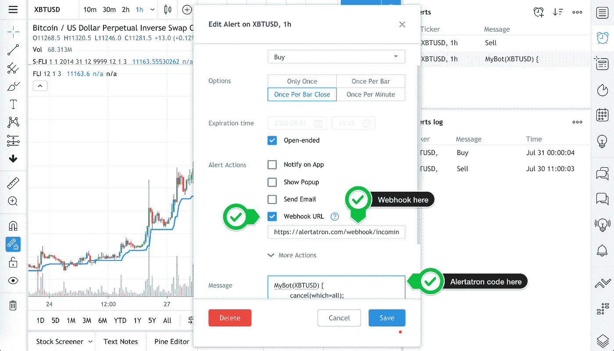
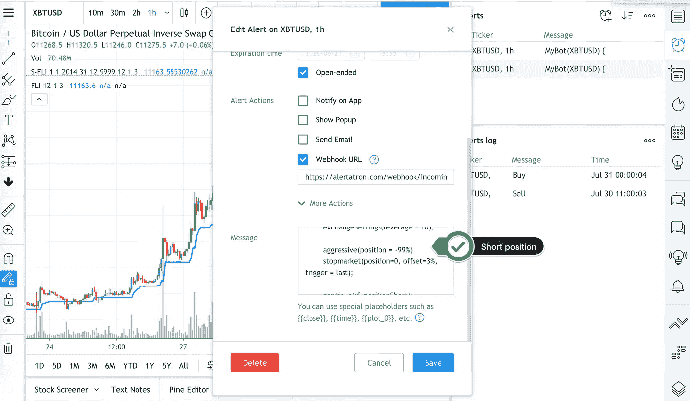

# 如何制作加密货币交易机器人——第 4 部分

> 原文：<https://medium.com/coinmonks/how-to-make-a-cryptocurrency-trading-bot-part-4-46d205d74704?source=collection_archive---------1----------------------->

嘿嘿嘿！我们几乎做到了！最后一件事是编写 Alertatron 消息并完成 TradingView 警报。

快速警告:

*   不是交易建议。
*   其他一些人知道建造机器人/松树等。比我好。
*   我个人与 TradingView、Alertatron、exchanges 或任何提到的服务没有任何关系。
*   我在这里展示的大多数产品我已经用了好几年了。
*   您可以通过在帖子中注册推荐链接来帮助这个项目。

*在* [*我自己的加密机器人讨论*](https://t.me/mocbchat) 中询问关于机器人的一切

我们正在做的是:

[*零件零*](/@strategst/crypto-signals-were-a-scam-6cc240f55b40) *，我为什么要这样做*

[*第一部分*](/coinmonks/how-to-make-a-cryptocurrency-trading-bot-f94172e0c7bd) *，如何在 TradingView 上用开源策略生成信号。*

[第二部分](/coinmonks/how-to-make-a-cryptocurrency-trading-bot-7409696b617e)，BitMex 的风险管理和杠杆设置。

[第三部分](/coinmonks/how-to-make-a-cryptocurrency-trading-bot-part-3-f6abf3b58bd8)，Alertatron 设置，以及 BitMex API 集成。

对于我们最新的教程和文章，请订阅[我自己的加密机器人频道](https://t.me/myowncryptobots)！

让我们从 Alertatron 开始吧。如果你没有编程经验，不要害怕，这个服务有一个非常简单的编程语言。Alertatron 的语言就像普通的英语，但以逻辑的方式书写。如果你能在日常生活中写出组织良好的列表或有序的段落，你会很容易处理 Alertatron。

无论如何，这次让我一字一句地引导你。

因此，我们添加了脚本和与此策略相关的警报。它将如何工作:

> 当您的 TradingView 脚本想要进行交易时，TradingView 会发送一个包含特定于 Alertatron 的代码的买入或卖出警报。Alertatron 读取代码，用交易所特有的 API 语言与交易所对话，执行你的订单，设置止损，并获利。当执行时，交换告诉 Alertatron 一切都已完成，Alertatron 在电报中发送您的交换余额状态(它也有松弛和不协调集成)。这一切都在几秒钟内完成。

## 所以，最后一件事是帮助我们的脚本发送特定于 Alertatron 的消息。

为此，让我们看看第二部分中的[风险管理系统。这里我们定义了:](/coinmonks/how-to-make-a-cryptocurrency-trading-bot-7409696b617e)

> 1.初始资本为 14552.5 美元，相当于 1 BTC 的美元
> 
> 2.在每笔交易中拿 3%的资金冒险
> 
> 3.在每笔交易中，相同的仓位大小为 1 BTC
> 
> 4.标准止损 3%。

和

> 5.在下一章中，我们将把 BitMex 的杠杆率设置为 x10，以保持较低的平仓价格，并根据我们自己的计算，以 x33 的实际杠杆率交易我们的策略。

## 我们来编码吧！

首先，我们需要知道 Alertatron 是一步一步执行我们的命令的，如果它没有执行上一行，就不会转到下一行。所以我们必须按照执行的顺序来安排命令。

好的，首先我们需要让他知道交易需要什么样的密钥，以及我们想要交易什么样的货币对。

我们在 Alertatron 上的键的名字是 MyBot。我们还想在 Bitmex 上交易比特币/美元。这个乐器的名字是 XBTUSD。

## 基本框架

在 Alertatron 语言中，我们可以用一行来表达:

```
MyBot(XBTUSD) {}
```

MyBot 是我们的帐户名，XBTUSD 是我们的对，在花括号{}内，我们将告诉他下一步该做什么。

## 清洁

我们希望开始每笔交易，取消所有未完成的订单。此外，我们还想清理一些以前订单中的剩余部分，如 stops 和 TP。我们就像“请取消所有这些事情”，或者用机器人的语言来说:

```
cancel(which=all);
```

现在我们有:

```
MyBot(XBTUSD) {cancel(which=all);}
```

## 杠杆作用

接下来，我们的逻辑是将交易所设置更改为交易所官方杠杆率，它必须低于实际杠杆率。就当是 x10 吧。所以:

```
exchangeSettings(leverage = 10);
```

exchangeSettings 是更改 exchange 设置的命令，leverage = 10 表示我们希望我们的官方杠杆是 x10。别忘了分号；因为它告诉我们已经完成了这个命令。

我们的指挥部现在看起来怎么样了？

```
MyBot(XBTUSD) {cancel(which=all);exchangeSettings(leverage = 10);}
```

仅使用此命令，我们就可以通过 Alertatron 上保存的手动警报来更改我们的 BitMex 杠杆，而无需登录 BitMex！但是，让我们继续前进。

## 购买

现在，让我们执行“长”命令。我们有三种购买方式:市价订单，即按当前报价购买；限价订单，即按你希望提供的价格购买，例如比当前价格低 10 美元，或激进订单。来自 Alertaron 文档:

激进挂单试图用不断调整到订单簿前面的限价单来进入或退出头寸。

因此，当有人通过市价单向你出售她的头寸时，积极的长单将被立即兑现。

因为好的限价单机制或多或少是清楚的，让我们讨论一下市场和积极的正面和负面影响。

对于盈利能力，也许更重要的是回溯测试的准确性，有两件事是至关重要的:交易费和滑点。

> 市场买入的明显优势是即时的头寸转换。但是有两个缺点。当我们试图以高于平均水平的仓位买入时，比如超过 100，00 0 美元的 XBTUSD 和少得多的 altcoins，就会出现相当大的滑点。它会极大地影响我们的结果，并对回溯测试产生痛苦的影响。此外，BitMex 将向我们收取做市商佣金，因此，如果我们有 10000 美元的头寸，我们将支付 0.075 美元的佣金，这将是 15 美元的头寸转换佣金(做空 10 美元，做多 10 美元)。因此，对于 1000 笔交易，我们将实现 15000 美元的费用支出，无论我们是盈利还是遭受损失。
> 
> 在激进期权中，有机会追逐价格相当长的时间，所以我们可能遭受同样的滑点，但交易所会支付我们，尽管我们可以限制我们的滑点。通常，我们会有机会在信号出现时以相同的价格完成订单，而不需要追逐它，并收取“接受者”佣金。在流动性交易中，当我们能够接近信号价格完成订单时，激进订单更有利可图。此外，Bitmex 或 Bybit 为此类订单向我们支付负(-0.025)佣金。因此，对于 1000 笔交易，我们仅仅通过转换头寸就从交易所获得了 2500 美元的利润。

我们应该为不同类型的策略考虑不同类型的订单。在这种策略中，警报在第一次强劲走势后出现，价格通常会在同一水平停留一段时间，因此我们将使用激进的订单来增加盈利能力。

我们已经决定使用积极型订单，现在我们必须决定我们的仓位大小。不得不说，Alertatron execution 非常聪明，它只要告诉你想要什么样的目标头寸——正(做多)或负(做空)以及你想要什么样的确切数量或百分比的资金就足够了。

如何计算 Alertatron 中的杠杆仓位？将你每笔交易的分配资本(我们分配了 3%)和你的实际杠杆(我们的是 x33)相乘。结果是 99%，这足够接近我们想要交易的金额— 1 BTC。但是如果我们想用 5%的资本和 x45 的杠杆来进行另一种策略，我们将使用 225%的头寸。

好了，就这些，所以我们写了下面的东西:

```
aggressive(position = 99%);
```

在这里，侵略性代表一种侵略性的秩序，位置有一个积极的标志。这意味着我们想长。头寸计算的公式是杠杆*分配资本。

“位置”功能可以用在其他方面，例如，您可以设置固定的位置，如 5000 美元。

```
aggressive(position = 5000);
```

或者，如果你希望空头头寸为负数，在数字前面加上减号

```
aggressive(position = — 5000);
```

Alertatron 可以做的一件很酷的事情是计算 delta——你拥有的位置和你想要的位置之间的差异，所以当你的位置是 3000 并且你发出新的攻击性命令时(位置=-8000)；Alertatron 首先会计算，它不仅要卖出 8000 股才能做空，还要卖出 3000 股才能平仓，所以它总共会卖出 11000 股。所以只要写下你想要拥有和享受的目标位置就好了！

现在我们的代码看起来像这样:

```
MyBot(XBTUSD) {cancel(which=all);exchangeSettings(leverage = 10);aggressive(position = 99%);}
```

## 止损

现在关于停止。我们的风险管理有 3%的止损，我们希望通过市场订单快速止损。

```
StopMarket(position=0, offset=3%, trigger = last);
```

StopMarket 是止损指令，Market 代表市价单。目标位置是 0，这意味着我们需要在那一刻卖掉所有的东西。根据我们的要求，进价的偏差为 3%。最后，当最后一个 XBT 价格达到止损水平时，交易所将卖出我们的头寸。正如文件所述，还有其他触发因素:Index 代表基础指数价格，mark 是标记价格，last 是最后交易价格。

换句话说，所有其他触发因素都将等待一段时间才能阻止你，在众所周知的 Bitmex wicks 发生的情况下，这可能是痛苦的，但如果价格很快回到起始位置，则可以挽救你的头寸。

```
MyBot(XBTUSD) {cancel(which=all);exchangeSettings(leverage = 10);aggressive(position = 99%);stopmarket(position=0, offset=3%, trigger = last);}
```

## 保持平衡

Aaaand…给我发了一条电报信息，上面有我的钱包号码，但是首先，要确定头寸是多头的。

```
MyBot(XBTUSD) {cancel(which=all);exchangeSettings(leverage = 10);aggressive(position = 99%);stopmarket(position=0, offset=3%, trigger = last);continue(if=positionLong);balance();}
```

好的，这是我们的长警报和短警报的草稿。

## 出售

对于 shorts，我们必须将我们位置的符号改为负

```
aggressive(position = -99%);
```

和余额发送条件

```
continue(if=positionShort);
```

*无需更改 stopmarket 功能中的“偏移”符号。*

```
MyBot(XBTUSD) {cancel(which=all);exchangeSettings(leverage = 10);aggressive(position = -99%);stopmarket(position=0, offset=3%, trigger = last);continue(if=positionShort);balance();}
```

## 现在，我们已经完成了所有警报。

让我们为电报添加一些有意义的信息。

```
Going Long on XBTUSD!
——
MyBot(XBTUSD) {cancel(which=all);exchangeSettings(leverage = 10);aggressive(position = 99%);stopmarket(position=0, offset=3%, trigger = last);continue(if=positionLong);balance();}Going Short on XBTUSD!
——
MyBot(XBTUSD) {cancel(which=all);exchangeSettings(leverage = 10);aggressive(position = -99%);stopmarket(position=0, offset=3%, trigger = last);continue(if=positionShort);balance();}
```

## 交易视图警报

转到交易查看提醒并打开购买提醒。

将红色长“网页挂钩”链接粘贴到“提醒操作”的小窗口中，选中“网页挂钩网址”，然后粘贴我们的代码。



然后对短裤也这样做。



# 恭喜你。

你已经创造了你的第一个机器人。现在，你可以关上所有的窗户，喝杯咖啡，等待下一次提醒。你自己的机器人将开始按照既定的策略进行交易。没有情绪，冷血，久经考验！

如果你对本教程、机器人构建、TradingView、Pine 或 Alertatron 有任何疑问，请加入我们的[我自己的加密机器人讨论](https://t.me/mocbchat)！

要获得更多这样的教程，更多关于自动交易的评论和文章，请订阅[我自己的加密机器人频道](https://t.me/myowncryptobots)！

## 另外，阅读

*   最好的[密码交易机器人](/coinmonks/crypto-trading-bot-c2ffce8acb2a)
*   [加密复制交易平台](/coinmonks/top-10-crypto-copy-trading-platforms-for-beginners-d0c37c7d698c)
*   最好的[加密税务软件](/coinmonks/best-crypto-tax-tool-for-my-money-72d4b430816b)
*   [最佳加密交易平台](/coinmonks/the-best-crypto-trading-platforms-in-2020-the-definitive-guide-updated-c72f8b874555)
*   最佳[密码借贷平台](/coinmonks/top-5-crypto-lending-platforms-in-2020-that-you-need-to-know-a1b675cec3fa)
*   [最佳区块链分析工具](https://bitquery.io/blog/best-blockchain-analysis-tools-and-software)
*   [加密套利](/coinmonks/crypto-arbitrage-guide-how-to-make-money-as-a-beginner-62bfe5c868f6)指南:新手如何赚钱
*   最佳[加密制图工具](/coinmonks/what-are-the-best-charting-platforms-for-cryptocurrency-trading-85aade584d80)
*   [莱杰 vs 特雷佐](/coinmonks/ledger-vs-trezor-best-hardware-wallet-to-secure-cryptocurrency-22c7a3fd391e)
*   了解比特币最好的[书籍有哪些？](/coinmonks/what-are-the-best-books-to-learn-bitcoin-409aeb9aff4b)
*   [3 商业评论](/coinmonks/3commas-review-an-excellent-crypto-trading-bot-2020-1313a58bec92)
*   [AAX 交易所评论](/coinmonks/aax-exchange-review-2021-67c5ea09330c) |推荐代码、交易费用、利弊
*   [德里比特评论](/coinmonks/deribit-review-options-fees-apis-and-testnet-2ca16c4bbdb2) |选项、费用、API 和测试网
*   [FTX 密码交易所评论](/coinmonks/ftx-crypto-exchange-review-53664ac1198f)
*   [n 零审核](/coinmonks/ngrave-zero-review-c465cf8307fc)
*   [Bybit 交换评论](/coinmonks/bybit-exchange-review-dbd570019b71)
*   [3Commas vs Cryptohopper](/coinmonks/cryptohopper-vs-3commas-vs-shrimpy-a2c16095b8fe)
*   最好的比特币[硬件钱包](/coinmonks/the-best-cryptocurrency-hardware-wallets-of-2020-e28b1c124069?source=friends_link&sk=324dd9ff8556ab578d71e7ad7658ad7c)
*   最佳 [monero 钱包](https://blog.coincodecap.com/best-monero-wallets)
*   [莱杰 nano s vs x](https://blog.coincodecap.com/ledger-nano-s-vs-x)
*   [bits gap vs 3 commas vs quad ency](https://blog.coincodecap.com/bitsgap-3commas-quadency)
*   [莱杰纳米 S vs 特雷佐 one vs 特雷佐 T vs 莱杰纳米 X](https://blog.coincodecap.com/ledger-nano-s-vs-trezor-one-ledger-nano-x-trezor-t)
*   [block fi vs Celsius](/coinmonks/blockfi-vs-celsius-vs-hodlnaut-8a1cc8c26630)vs Hodlnaut
*   [Bitsgap 评论](/coinmonks/bitsgap-review-a-crypto-trading-bot-that-makes-easy-money-a5d88a336df2)——一个轻松赚钱的加密交易机器人
*   为专业人士设计的加密交易机器人
*   [PrimeXBT 审查](/coinmonks/primexbt-review-88e0815be858) |杠杆交易、费用和交易
*   [埃利帕尔泰坦评论](/coinmonks/ellipal-titan-review-85e9071dd029)
*   [SecuX Stone 评论](https://blog.coincodecap.com/secux-stone-hardware-wallet-review)
*   [BlockFi 评论](/coinmonks/blockfi-review-53096053c097) |从您的密码中赚取高达 8.6%的利息