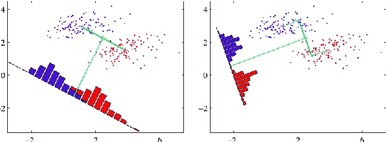
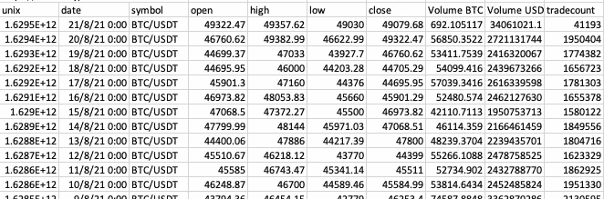
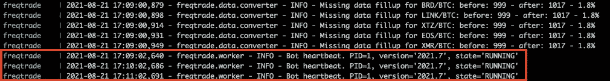
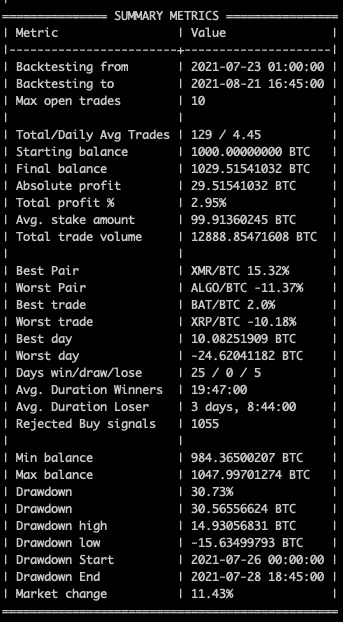
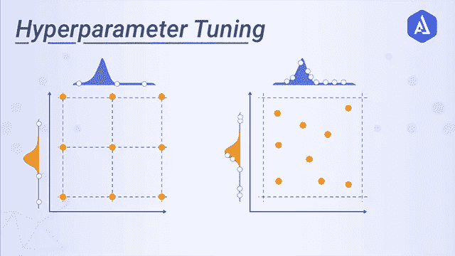

# 如何制作低频量化密码交易机器人

> 原文：<https://medium.com/coinmonks/how-to-make-a-low-frequency-quantitative-trading-crypto-bot-47095f83e332?source=collection_archive---------0----------------------->


Source: Quora

*注意:本文并不旨在提供任何专业的金融/投资建议。这只是为了教育目的。*

我有丰富的经验，使用自己的策略为现货和期货加密市场创建算法交易机器人。

在大多数情况下，创建一个有利可图的交易机器人是一个复杂而漫长的过程，需要进行定量和数学分析，寻找图表模式，然后将交易策略准确地转化为应用程序。

在本文中，我将向您展示使用 Freqtrade 创建自己的交易机器人的最简单方法之一。**freq trade**([freq trade . io](https://www.freqtrade.io/))是一款用 Python 制作的开源交易软件。

量化交易实际上做两件事:

1.建立一个数学模型(人)

2.根据数学模型，在合适的时间买入或卖出(电脑)

在开发一个 bot 之前，你首先需要一个策略(数学模型)。创造一个好的策略可能会很棘手。我使用各种工具来设计我的策略，**神经网络算法**、**线性/非线性回归**、**数据挖掘、**和 **Fisher 线性判别**等等。



An illustration of the Fisher Linear Discriminant (Source: SemanticsScholar.org)

然而，在这个教程中，我会用模板策略做一个非常基础的交易者，因为我想让这个教程对初学者友好。

**在我们开始之前**

这种方法有各种限制。

*   一个主要的限制是你不能开发一个期权和期货交易机器人。期权市场规模巨大，币安和德里比特等各种交易所提供的杠杆作用，使其成为一个利润颇丰的领域。
*   您不能使用 Freqtrade 开立空头头寸
*   如果你的策略需要极高频率的交易，延迟是关键，我不推荐使用 Freqtrade

说到这里，让我们开始这个教程吧！

# **步骤 1:使用 Docker** 安装 Freqtrade

对于那些不知道的人来说，Docker 是一个用于构建、部署和管理容器化应用程序的开源平台。你可以在这里阅读文件:[https://docs.docker.com/](https://docs.docker.com/)

在您的目标目录中:

```
mdkir ft_userdata
```

在 ft_userdata 中一次:

```
curl [https://raw.githubusercontent.com/freqtrade/freqtrade/stable/docker-compose.yml](https://raw.githubusercontent.com/freqtrade/freqtrade/stable/docker-compose.yml) -o docker-compose.yml# Pull the freqtrade image 
docker-compose pull # Create user directory structure 
docker-compose run --rm freqtrade create-userdir --userdir user_data 
```

# 第二步:机器人配置

既然我们已经设置了 docker 和基本 repo，现在我们将进入 bot 的基本配置。我将采用模板化的方法，但是，这些值将取决于您的策略。

此外，对于本教程，我们将坚持币安交易所，因为它是一个更受欢迎的。

```
# Create configuration - Requires answering interactive questions docker-compose run --rm freqtrade new-config --config user_data/config.json? Do you want to enable Dry-run (simulated trades)? (Y/n) Yes
? Please insert your stake currency: BTC
? Please insert your stake amount: unlimited
? Please insert max_open_trades (Integer or 'unlimited'): 10
? Please insert your desired timeframe (e.g. 5m): 15m
? Please insert your display Currency (for reporting): USD
? Select exchange binance
? Do you want to enable Telegram? No
? Do you want to enable the Rest API (includes FreqUI)? Yes
? Insert Api server Listen Address (best left untouched default!) 127.0.0.1
? Insert api-server username freqtrader
? Insert api-server password test123
```

# **第三步:实施战略**

现在让我们看看我们的基本配置。导航到 config.js 文件，如下所示:

```
ft_userdata
   -config.js
```

在这个配置文件中，在 dry_run: true 下面添加以下内容

```
“dry_run_wallet": 1000
```

这让我们可以在沙盒模式下用一个模拟钱包进行测试和实验。

我们要查看的主文件位于“策略”文件夹中， **sample_strategy.py** 。

策略工作流程非常简单。根据您在配置中提供的时间框架，您可以获得 OHLC 数据框架，然后将其用作您正在使用的任何指标的输入。



An example of BTCUSD 24hr dataframe

在我们的示例中，我们配置了 15 分钟的时间范围，这意味着我们将每隔 15 分钟从币安获得一个新的数据帧。

下面我解释了 Freqtrade 中策略配置的核心组件:

*   **minimal_roi** :根据相应时间的指定 roi，指定何时卖出头寸(x 分钟后)
*   **止损**:这是一个压倒性的属性，当你遭受特定的损失(以百分比表示)时卖出你的头寸。理想情况下，对于厌恶风险的投资者来说，这个值不应该低于-0.10 (-10%)
*   **order_types** :这个对象定义了您想要允许的订单类型
*   **def informational _ pairs(self)**:定义要从交换缓存的附加信息对/区间组合。这些对/区间组合是不可交易的，除非它们也是白名单的一部分。
*   **def populate _ indicators(self，dataframe: DataFrame，metadata: dict):** 这是实例化指示器的地方。一些流行的指标是相对强弱指标，布林线，MACD 等。您可以创建自己的指标，使用第三方库或使用 Freqtrade 默认提供的库(**塔利布**和 **qtypylib** )


Bollinger bands example (Source: Investopedia)

*   **def populate_buy_trend(self，dataframe: DataFrame，metadata: dict):** 这里是你指定买入指标的地方。每当你得到一个新的时间框架时，这个方法就会被调用。购买趋势/指标是根据您指定的指标标准创建的。下面是一个例子。这个函数返回一个数据帧。该数据框架有一个“买入”列，当设置了买入趋势时，该列的值为 1。这将引发买入。

```
dataframe.loc[
(
# Signal: RSI crosses above 30(qtpylib.crossed_above(dataframe['rsi'], self.buy_rsi.value)) &(dataframe['tema'] <= dataframe['bb_middleband']) &  # Guard: tema below BB middle(dataframe['tema'] > dataframe['tema'].shift(1)) &  # Guard: tema is raising
(dataframe['volume'] > 0)  # Make sure Volume is not 0),'buy'] = 1
```

*   **def populate _ sell _ trend(self，dataframe: DataFrame，metadata: dict):** 这是你指定卖出趋势的地方。当满足此处指定的条件时，将执行卖出。下面显示了一个示例:

```
dataframe.loc[
(
# Signal: RSI crosses above 70
(qtpylib.crossed_above(dataframe[‘rsi’], self.sell_rsi.value)) &(dataframe[‘tema’] > dataframe[‘bb_middleband’]) & # Guard: tema above BB middle
(dataframe[‘tema’] < dataframe[‘tema’].shift(1)) & # Guard: tema is falling
(dataframe[‘volume’] > 0) # Make sure Volume is not 0),‘sell’] = 1
```

# **第四步:在沙盒模式下运行**

为了在沙盒中测试这个机器人，我们需要在 Docker 中将它作为一个守护进程启动，这样它就可以持续运行。在这样做之前，请确保策略名称是正确的。为了验证，检查 **docker-compose.yml** 中的命令部分。

现在在您的终端中运行以下命令。

```
docker-compose up -d
```

要检查日志，

```
docker-compose logs -f
```

当您检查日志时，您应该看到 bot 状态为“正在运行”,如下所示:



# **第五步:下载历史 OHLCV 数据集**

在配置文件中，在“pair_whitelist”对象中指定要为其下载数据的配对。我将下载这些对的数据:

```
"pair_whitelist": [
"ALGO/BTC",
"ATOM/BTC",
"BAT/BTC",
"BCH/BTC",
"BRD/BTC",
"EOS/BTC",
"ETH/BTC",
"IOTA/BTC",
"LINK/BTC",
"LTC/BTC",
"NEO/BTC",
"NXS/BTC",
"XMR/BTC",
"XRP/BTC",
"XTZ/BTC"
]
```

现在，在一个新的终端窗口中，输入以下命令，该命令将为您的指定对下载 15 分钟蜡烛线数据，然后我们可以在这些数据上运行回溯测试。

```
docker-compose run --rm freqtrade download-data --exchange binance -t 15m
```

# **第六步:回溯测试**

现在，要对我们下载的数据运行回溯测试，请使用以下命令:

```
docker-compose run --rm freqtrade backtesting --strategy SampleStrategy --datadir user_data/data/binance
```

我们的回溯测试显示了每一对的以下结果:



Backtesting results

**我们一个月总共赚了 2.95% (29.15 BTC)！😂**

显然，这是模板化的策略，在实时模式下可能表现不佳。但是，正如我之前所说的，创建一个良好执行的策略是一个非常复杂的过程，超出了本教程的范围。

**闭幕词**

对于 Freqtrade 的功能，我只是略知皮毛。您可以进一步绘制您的结果，通过 REST API 做进一步的增强，您也可以使用 HyperOpt，它使用机器学习来进一步为您的策略找到最佳参数，这一过程称为**超参数优化**。



Source: Akira AI

Freqtrade 是一个很好的学习工具，但它也有缺点。我个人不使用 Freqtrade 或任何其他交易软件，因为大多数时候需要的是高频交易者，效率是关键。

如果你想建立自己的高频算法交易者，或者如果你有任何问题，请随时联系我！

> 加入 Coinmonks [电报频道](https://t.me/coincodecap)和 [Youtube 频道](https://www.youtube.com/c/coinmonks/videos)了解加密交易和投资

# 另外，阅读

*   [3 商业评论](/coinmonks/3commas-review-an-excellent-crypto-trading-bot-2020-1313a58bec92) | [Pionex 评论](https://coincodecap.com/pionex-review-exchange-with-crypto-trading-bot) | [Coinrule 评论](/coinmonks/coinrule-review-2021-a-beginner-friendly-crypto-trading-bot-daf0504848ba)
*   [莱杰 vs Ngrave](/coinmonks/ledger-vs-ngrave-zero-7e40f0c1d694) | [莱杰 nano s vs x](/coinmonks/ledger-nano-s-vs-x-battery-hardware-price-storage-59a6663fe3b0) | [币安评论](/coinmonks/binance-review-ee10d3bf3b6e)
*   [Bybit Exchange 审查](/coinmonks/bybit-exchange-review-dbd570019b71) | [Bityard 审查](https://coincodecap.com/bityard-reivew) | [Jet-Bot 审查](https://coincodecap.com/jet-bot-review)
*   [3 commas vs Cryptohopper](/coinmonks/3commas-vs-pionex-vs-cryptohopper-best-crypto-bot-6a98d2baa203)|[赚取加密利息](/coinmonks/earn-crypto-interest-b10b810fdda3)
*   最好的比特币[硬件钱包](/coinmonks/hardware-wallets-dfa1211730c6) | [BitBox02 回顾](/coinmonks/bitbox02-review-your-swiss-bitcoin-hardware-wallet-c36c88fff29)
*   [block fi vs Celsius](/coinmonks/blockfi-vs-celsius-vs-hodlnaut-8a1cc8c26630)|[Hodlnaut 审核](/coinmonks/hodlnaut-review-best-way-to-hodl-is-to-earn-interest-on-your-bitcoin-6658a8c19edf) | [KuCoin 审核](https://coincodecap.com/kucoin-review)
*   [Bitsgap 审查](/coinmonks/bitsgap-review-a-crypto-trading-bot-that-makes-easy-money-a5d88a336df2) | [Quadency 审查](/coinmonks/quadency-review-a-crypto-trading-automation-platform-3068eaa374e1) | [Bitbns 审查](/coinmonks/bitbns-review-38256a07e161)