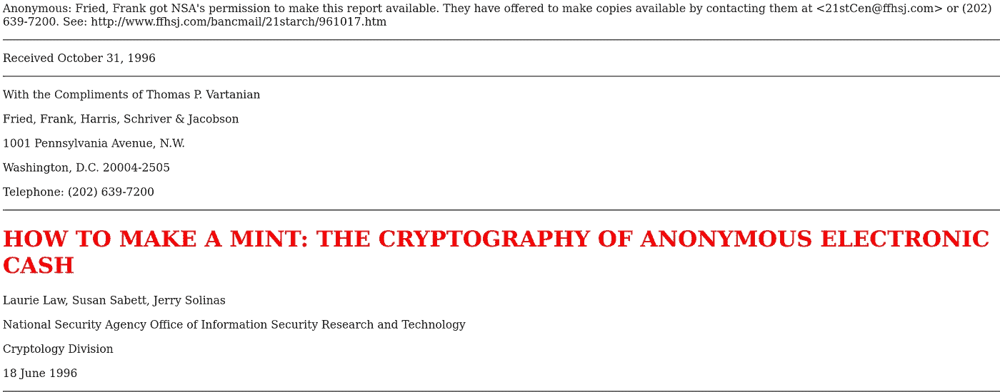
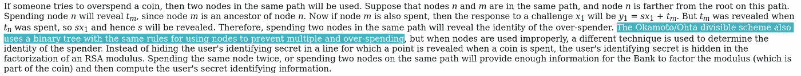
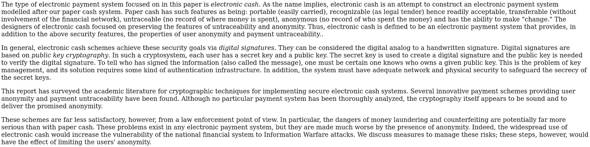
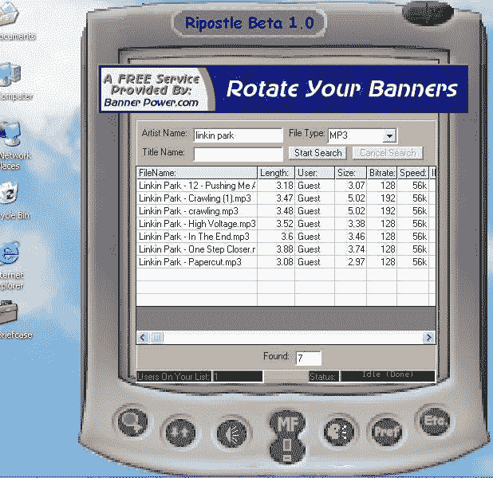
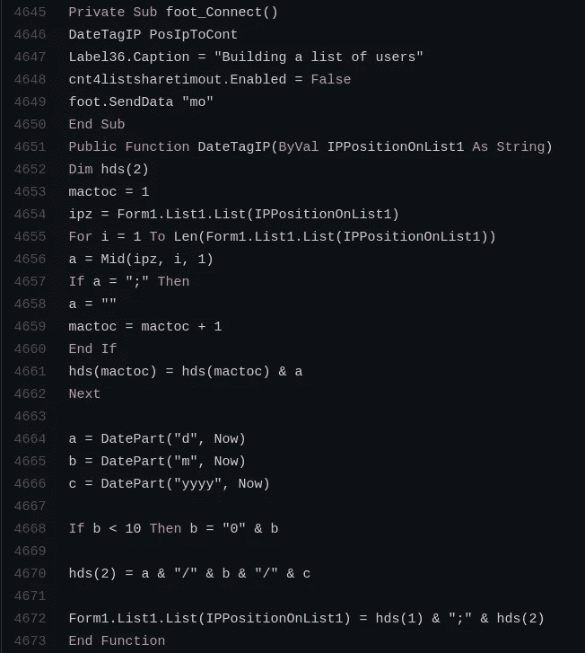
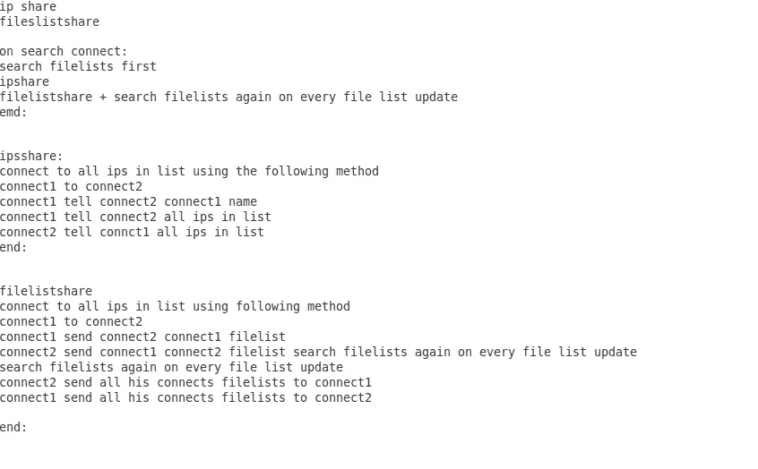
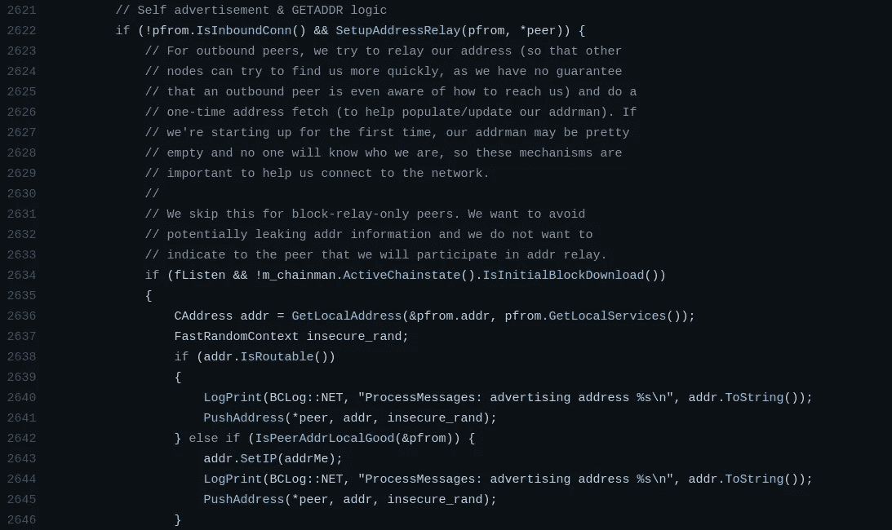

# 如何赚大钱:匿名电子现金网络

> 原文：<https://medium.com/coinmonks/how-to-make-a-mint-the-network-of-anonymous-electronic-cash-91b461e237e5?source=collection_archive---------4----------------------->

几乎所有了解“比特币或加密货币”的人都对一些关键方面的理解非常零散。我想讨论一个经常被忽视并且可能有争议的话题，网络本身。

# 过去:

[1]

自现代计算机问世以来，美国国家安全局一直在积极研究一个在许多方面类似于比特币的项目；1996 年作为理论研究课题公开发布。

[1]

除了“Okamoto”关键字与中本聪明显相似之外，这个概念与比特币中的“双倍消费”非常相似！

不幸的是，这个项目从来没有完成，由于关键的技术部分的拼图失踪创造一个功能性的计算机程序与目前的先进概念。更不用说，当时计算机硬件和互联网服务提供商的限制也是一个瘫痪因素。

美国国家安全局造币项目的一个基本缺陷是围绕隐私和金融服务执法的法律，以及发行人的信任因素。如果创造了一种基于密码的货币，谁会保存数字记录，并在保护用户权利的同时向需要它的当局提供访问权限？一些非常关键的问题仍然没有答案。

[1]

> “系统必须有足够的网络和物理安全性…”

对于所有基于集中的系统来说，这可能是一个挑战；专家们在报告中指出。安全专业人员很难在防止入侵的同时始终保持系统的可访问性，需要零停机时间，是的，还需要真正的物理防护！

# 简单的 P2P 实验:

> " 2001 年 7 月 11 日，为了遵守禁令，Napster 关闭了它的整个网络."

我一点也不鼓励侵犯版权，作为一个年轻的程序员，我很好奇为什么一个价值数百万美元的网络会因为几个“糟糕的金属上传者”而不再运行。对我来说，网络设计从一开始就有多糟糕是显而易见的；它依靠一个中枢来连接所有使用该软件的人，以提供搜索和下载功能。当时，互联网基础设施是基于“服务器-客户端”的，而对等网络仍然是一个新的讨论话题。服务器和客户端功能传统上是两个独立的可执行程序，将它们包含在同一个应用程序中的边缘概念不仅在技术上具有挑战性，而且我可以向谁寻求帮助，还没有人这样做…我想，为什么不呢？但后来我开始意识到一个痛苦的事实:如果你真的需要，你怎么能控制一个无法控制的野兽？你不能。

在 20 世纪 90 年代末和 21 世纪初，我在自学微软 Visual Studio 编程的时候，就在尝试这个想法。我能够基于 Napster 的文件共享服务编写一个基本的功能对等网络，但由于法律问题，我决定不“按原样”发布它。

[2]

相反，我把源代码给了一个朋友，他和另一个朋友分享，然后另一个朋友都在从事加密和其他相关技术的工作。这是不太可能的造币厂项目需要的不太可能的安全网络，但从来没有！

无人控制的网络——基于加密和数学。网络本身比任何人或机构都更值得信任，因为它们拥有私有密钥！这是一个以前从未尝试过的激进概念，有许多挑战和陷阱——在一个不太可能的实现中，它实际上比预期的更好……赚了一大笔钱！

[2]

# Ripostle 协议基础:

[2]

# 比特币/net_processing.cpp 源代码:

[3]

如果你将 Ripostle 中发现的一些连接代码与最新的比特币代码进行比较，相似之处是显而易见的。该软件有一个本地保存的 IP 地址列表，连接到其中一个地址，请求 IP 列表，给出 IP 列表，并合并到一个本地列表中，以便在将来与不同的对等方共享。这些简单的代码步骤自动构建了一个“自我发现”网络，不需要路由服务器或集线器来进行对等操作。

如何建立一个分散的、不可信的、安全的薄荷网络，非常简单？呃？

**参考文献:**

[1]造币厂:匿名电子现金的密码学
https://groups . csail . MIT . edu/MAC/classes/6.805/articles/money/NSA MINT/NSA MINT . htm

[2] Ripostle —真正的 P2P 匿名文件共享程序
[https://github . com/biznatchen enterprises/Ripostle/blob/master/form 1 . frm](https://github.com/BiznatchEnterprises/Ripostle/blob/master/Form1.frm)

[3]比特币
[https://github . com/bit coin/bit coin/blob/master/src/net _ processing . CPP](https://github.com/bitcoin/bitcoin/blob/master/src/net_processing.cpp)