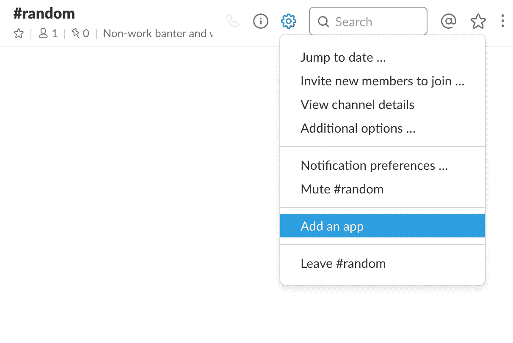
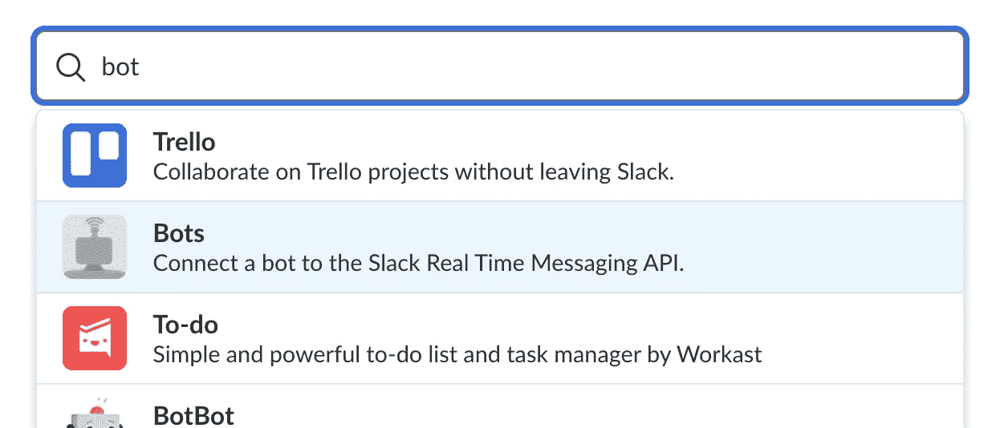
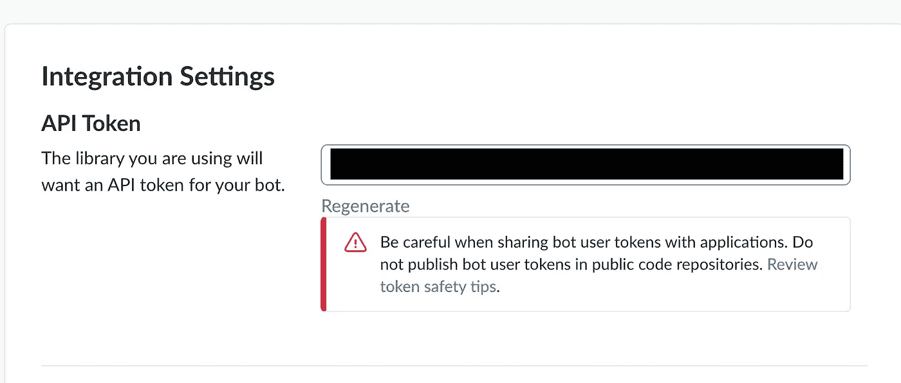
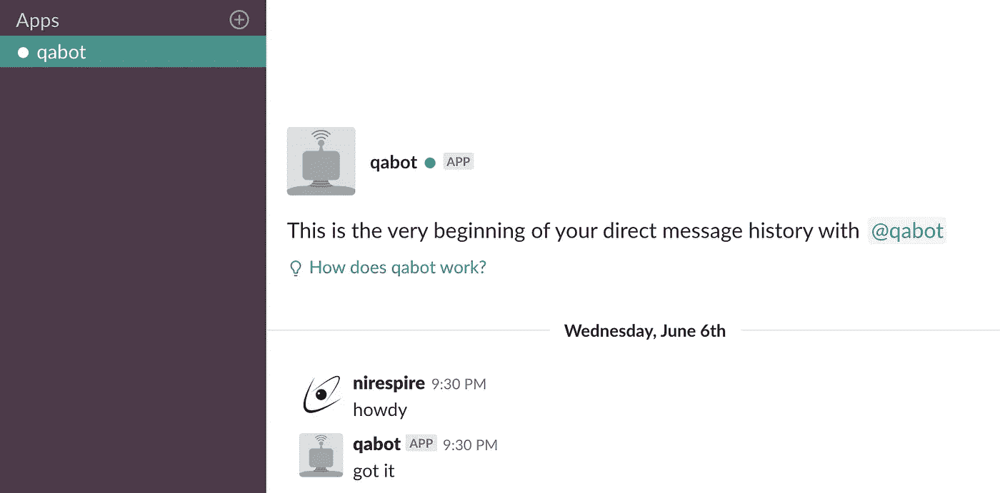
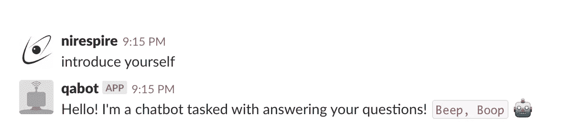
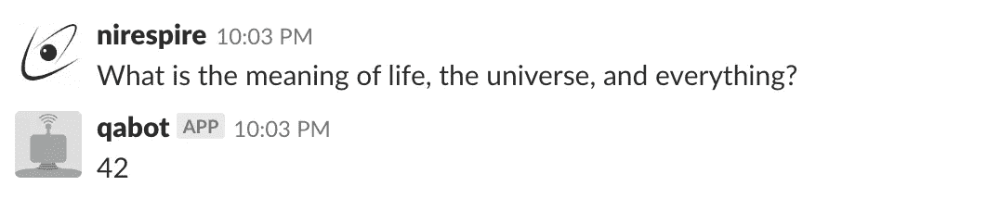
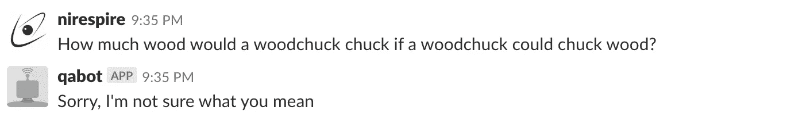

# 如何用机器学习制作问答聊天机器人

> 原文：<https://medium.com/coinmonks/how-to-make-a-q-a-chatbot-with-machine-learning-1c90207bde7b?source=collection_archive---------0----------------------->

这篇文章将教你如何编写自己的 Slack 聊天机器人，使用一些基本的机器学习工具来回答简单的问题。创建机器学习模型背后的大多数围绕自然语言处理和数学的更复杂的东西大多被抽象出来，为我们在相当短的时间内轻松构建成品留下了空间。如果你正在寻找一种简单有效的方法让一个半智能机器人快速回答 Slack 上的问题，那么这个指南就是适合你的。

如果你想跳到完成的代码，请点击这里或文章末尾的 Github repo [链接。](https://github.com/Nirespire/FAQBot)

> 2019 年 10 月 27 日编辑
> 
> 因为我使用的库(Botkit)有一些严重的安全漏洞，我不能让最新版本的库工作，我切换到了 [Slack RTM API](https://slack.dev/node-slack-sdk/rtm-api) 。下面的代码示例应该可以正常工作，但是如果你有兴趣使用最新版本的代码，请查看底部的示例 repo。[链接到所有代码更改的拉请求](https://github.com/Nirespire/FAQBot/pull/2)。

# 一些设置

本指南假设您对节点开发有基本的了解，因为这将是我们用来构建的主要工具。您还需要在您的机器上安装并运行以下软件。我通常在类似 unix 的终端环境中工作效率最高，也就是 bash。以下是你还需要的东西:

1.  使用 npm 软件包管理器安装 NodeJS。当我写这篇文章的时候，我使用了 Node v10.1.0 和 npm v6.1.0，但是任何相对较新的版本都可以工作(比如 v6 和更高版本)。
2.  您拥有管理权限的宽松工作区。如果找不到，就[做一个新的](https://slack.com/get-started#create)。这是我们将开发和测试机器人能力的操场。
3.  代码编辑器。我是 [VS 代码](https://code.visualstudio.com/)的忠实粉丝。

打开松弛工作空间后，进入任意频道，点击设置齿轮图标。我们将向工作区添加一个应用程序。



How to add an integration to a Slack workspace

搜索 bot 并添加 bot 集成。



Searching for the “Bots” integration in Slack

添加配置，并给它一个您喜欢的名称。这基本上会在您的工作区中创建一个特殊类型的用户，您可以向其发送消息，就像任何其他用户一样。您可以稍后更改 bot 的名称和图标，但是我们现在需要的是 get 生成的 **API 令牌**值。 ***一定要对这个值保密*** 。如果有人可以访问此内容，他们就可以免费在您的工作区中阅读和发布消息。



Copy the API token generated on this page (blacked out in this picture)

将该值放在手边。当我们开始写一些代码的时候，我们将会用到它。

# 编码时间到了

## 基本机器人设置

为了进行一些设置，让我们从一些样板代码开始。下面的 npm 命令应该可以完成基本的设置。

```
# Starting in the directory where your code is goingnpm init -f
npm i --save natural botkit@0.7.4 dotenv
```

请注意我们将使用的三个库。

*   n[natural](https://github.com/NaturalNode/natural):提供基本的文本处理和分类功能
*   b[ot kit](https://github.com/howdyai/botkit):Slack API 的包装器，可以轻松编写与 Slack 集成的程序
*   让我们在一个文件中管理环境变量，用于本地开发和测试

从那里我们可以开始写一些代码。让我们首先确保我们可以使用之前设置的 API 令牌连接到 Slack。创建一个名为`.env`的文件并粘贴以下内容，用您的 API 令牌替换`=`之后的部分。

```
SLACK_API_TOKEN=
```

> 如果你使用 git 之类的东西来维护你的代码变更，确保将`.env`添加到你的`.gitignore`文件中，这样你就不会不小心把它推到别人可以看到的地方！

接下来让我们来看看真正的代码。我们将从一些简单的设置开始，以确保我们可以使用 API 令牌并在 botkit 库的帮助下连接到我们的 Slack 工作区。我们可以从这样一个`index.js`文件开始:

```
const botkit = require('botkit)// Load our environment variables from the .env file
require('dotenv').config();// What are the types of chats we want to consider
// In this case, we only care about chats that come directly to the bot
const scopes = [
    'direct_mention',
    'direct_message',
    'mention'
];// Get our Slack API token from the environment
const token = process.env.SLACK_API_TOKEN;// Create a chatbot instance using Botkit
const Bot = BotKit.slackbot({
    debug: true,
    storage: undefined
});// Function to handle an incoming message
// In this example function the bot will just reply with "got it"
function handleMessage(speech, message) {
    console.log(speech, message);
    speech.reply(message, "got it");
}// Configure the bot
// .* means match any message test
// The scopes we pass determine which kinds of messages we consider (in this case only direct message or mentions)
// handleMessage is the function that will run when the bot matches a message based on the text and scope criteria
Bot.hears('.*', scopes, handleMessage);// Instantiate a chatbot using the previously defined template and API 
// Open a connection to Slack's real time API to start messaging
Bot.spawn({
    token: token
}).startRTM();
```

上面的代码应该足够简单，可以让你的机器人启动并运行。你只需要执行`node index.js`，你的 bot 应该连接到 Slack API，并在你的工作区显示为“Active”。如果你给它发信息，它应该回复“收到”。您还可以修改代码，让机器人以您喜欢的任何方式进行响应。



It’s alive!

## 加入一些机器学习

现在我们已经完成了基本的设置，我们可以开始给我们的机器人添加一些智能。因为我们的目标是让我们的机器人回答问题，我们需要采取一点开放式的方法。不是每个人都用同样的方式提问。因此，我们需要一种方法来将不同的问题或短语与它们相关的主题相匹配，然后给出适当的答案。

就像我可能会问:“几点了？”而你可以通过输入“给我当前时间”来问同样的问题这两个短语都可以匹配“当前时间”的主题，所以我们不能在代码中只使用严格的等式。我们将采用一些机器学习来完成这种模糊匹配。

为此，我们首先需要一个训练数据集，其中包含一组预先填充的短语、相关标签和适当的响应或答案。训练数据格式将是 JSON，它概述了一些代表一种问题类型的短语和关键字，以及当机器人看到类似这些短语或关键字的问题时应该做出响应的单个答案。例如，这里有一个只有两个主题的训练数据集，每个主题都有一组可能的短语和一个适当的响应:

```
{
    "self": {
        "questions": [
            "introduce yourself",
            "sup",
            "hi",
            "hello"
        ],
        "answer": "Hello! I'm a chatbot tasked with answering your questions! `Beep, Boop` :robot_face:"
    },
    "world": {
        "questions": [
            "what is the world",
            "answer to the universe and everything"
        ],
        "answer": "42"
    }
}
```

将它放在项目根目录下名为`trainingData.json`的文件中。

每组问题和答案都有一个标签。这就是我们的机器人将如何尝试分类它收到的所有输入，并找出如何响应。

现在，让我们添加一些代码来消耗数据并训练一个分类器，我们稍后可以使用它来智能地匹配和响应问题。我们可以创建一个简单的函数来读取我们的`trainingData.json`文件，并将其转换成我们可以读取的 JavaScript 对象。

```
/**
 * Function to easily parse a given json file to a JavaScript Object
 * 
 * [@param](http://twitter.com/param) {String} filePath 
 * [@returns](http://twitter.com/returns) {Object} Object parsed from json file provided
 */
function parseTrainingData(filePath) {
    const trainingFile = fs.readFileSync(filePath);
    return JSON.parse(trainingFile);
}
```

然后我们可以像这样使用函数加载我们的训练数据。

```
// Load our training data
const trainingData = parseTrainingData('./trainingData.json');
```

接下来是创建一个所谓的分类器来消耗我们的训练数据，并创建一个机器学习模型，以便稍后根据它所学习的内容对传入的问题做出决策。基本上，给定我们提供的一组短语和响应，模型应该能够推断出对它认为与它以前见过的短语相似的短语提供什么响应。如果你想更多地了解机器学习中的分类器到底是什么，[看看这个](https://www.udacity.com/course/intro-to-machine-learning--ud120)。

我们将为此使用一个图书馆。因此，首先导入我们之前安装的`natural`库，并在文件顶部创建一个新的`LogisticRegressionClassifier`。

```
const NLP = require('natural');
// Create a new classifier to train
const classifier = new NLP.LogisticRegressionClassifier();
```

接下来，我们需要一个分类器能够摄取训练样本的功能。在这种情况下:什么问题(短语)符合给定的答案类型(标签)。

```
/**
 * Will add the phrases to the provided classifier under the given label.
 * 
 * [@param](http://twitter.com/param) {Object} classifier
 * [@param](http://twitter.com/param) {String} label
 * [@param](http://twitter.com/param) {Array.String} phrases
 */
function trainClassifier(classifier, label, phrases) {
    console.log('Teaching set', label, phrases);
    phrases.forEach((phrase) => {
        console.log(`Teaching single ${label}: ${phrase}`);
        classifier.addDocument(phrase.toLowerCase(), label);
    });
}
```

现在我们有了一种方法让我们的机器人学习一些它可能看到的短语的例子，并对它们进行适当的分类，我们需要一种方法让它处理发送回一个适当的回复。

由于我们的训练数据包括一个标签下的一组示例短语的答案，我们可以使用它让机器人发送回相同的回复。因此，如果我们的聊天机器人看到一条看起来像“sup”的传入消息，根据我们的训练数据，它应该用标签“self”对其进行分类，并发回与该标签相关联的答案:“Hello！我是负责回答你问题的聊天机器人！`哔，Boop` :robot_face:"。如果你需要再看一遍那个例子，回头看看`trainingData.json`。

它考虑的一件事是，我们的分类器的猜测通常不会是完美的。每个猜测将具有与其相关联的不同置信度值，该置信度值对应于分类器将标签匹配到所提供的短语的置信度。因此，我们需要放入一些逻辑，只有当分类器非常确定它对如何标记输入短语有正确的猜测时才给出响应。如果没有，我们基本上会回答“\_(ツ)_/不知道你在说什么。我没有受过这方面的训练。”

解释了很多，让我们看看我们解释输入文本的函数是什么样子的。

```
/**
 * Uses the trained classifier to give a prediction of what
 * labels the provided pharse belongs to with a confidence
 * value associated with each and a a guess of what the actual
 * label should be based on the minConfidence threshold.
 * 
 * [@param](http://twitter.com/param) {String} phrase 
 * 
 * [@returns](http://twitter.com/returns) {Object}
 */
function interpret(phrase) {
    console.log('interpret', phrase);
    const guesses = classifier.getClassifications(phrase.toLowerCase());
    console.log('guesses', guesses);
    const guess = guesses.reduce((x, y) => x && x.value > y.value ? x : y);
    return {
        probabilities: guesses,
        guess: guess.value > (0.7) ? guess.label : null
    };
}
```

注意我们在哪里检查`guess.value > 0.7`。这意味着，如果我们的分类器不匹配置信度至少为 70%的标签，那么我们说我们没有找到匹配。无论收到什么消息，都不匹配我们训练分类器响应的任何消息，所以我们返回`null`和我们的\_(ツ)_/响应。

这就像有人问你“几点了？”你确切地知道如何回答，因为你知道那个问题意味着什么，以及如何得到答案。如果有人在游戏中说“布拉根·弗洛斯特·比格巴”,你可能永远也不知道如何回应，所以你可能会吐出一个\_(ツ)_/。

所以现在我们需要一个函数来匹配这个标签和对应于这个标签的答案。让我们修改我们的`handleMessage`函数来做这件事。让我们`interpret`消息是什么，然后使用我们的分类器生成的标签，根据我们的训练数据提供适当的答案，而不是对所有事情都发送相同的回复。如果我们解释消息的尝试没有产生结果，机器人可以简单地回答它不理解。

```
/**
 * Callback function for BotKit to call. Provided are the speech
 * object to reply and the message that was provided as input.
 * Function will take the input message, attempt to label it 
 * using the trained classifier, and return the corresponding
 * answer from the training data set. If no label can be matched
 * with the set confidence interval, it will respond back saying
 * the message was not able to be understood.
 * 
 * [@param](http://twitter.com/param) {Object} speech 
 * [@param](http://twitter.com/param) {Object} message 
 */
function handleMessage(speech, message) {
    const interpretation = interpret(message.text);
    console.log('InternChatBot heard: ', message.text);
    console.log('InternChatBot interpretation: ', interpretation);if (interpretation.guess && trainingData[interpretation.guess]) {
        console.log('Found response');
        speech.reply(message, trainingData[interpretation.guess].answer);
    } else {
        console.log('Couldn\'t match phrase')
        speech.reply(message, 'Sorry, I\'m not sure what you mean');
    }
}
```

最后，让我们通过调用我们刚刚创建的所有函数和现有的函数来让我们的机器人启动并运行。注意底部的代码基本上是一样的，除了我们这次修改了`handleMessage`函数，使其更加智能。

```
// For each of the labels in our training data,
// train and generate the classifier
var i = 0;
Object.keys(trainingData).forEach((element, key) => {
    trainClassifier(classifier, element, trainingData[element].questions);
    i++;
    if (i === Object.keys(trainingData).length) {
        classifier.train();
        const filePath = './classifier.json';
        classifier.save(filePath, (err, classifier) => {
            if (err) {
                console.error(err);
            }
            console.log('Created a Classifier file in ', filePath);
        });
    }
});// Configure the bot
// .* means match any message test
// The scopes we pass determine which kinds of messages we consider (in this case only direct message or mentions)
// handleMessage is the function that will run when the bot matches a message based on the text and scope criteria
Bot.hears('.*', scopes, handleMessage);// Instantiate a chatbot using the previously defined template and API token
// Open a connection to Slack's real time API to start messaging
Bot.spawn({
    token: token
}).startRTM();
```

# 带它去兜风

让我们看看我们的机器人能做什么！继续运行控制台中项目目录根目录下的`node index.js`。如果一切按计划进行，您应该看到您的机器人注入您的训练数据示例，并开始等待输入。

回到 Slack，试着让它介绍一下自己！



It’s alive! (and a little intelligent)

问它一些你训练它去回应的事情！



Such wisdom

如果你问它一些它没有被训练过的问题，期待一个合适的回答。



But not magic

但是你可以通过将它添加到你的训练数据中来训练机器人对此做出反应！只需创建一个新标签，并添加一些问题和您希望机器人回复的答案。

# 结论

我本来打算写一些额外的东西，关于如何在某个地方部署机器人以及潜在的增强想法，但是这篇文章已经比我预期的要长了。我计划把这些想法写在后续的帖子里，并链接到这里。同时，请提出您的反馈意见。跟着走够容易吗？您在节点开发或 ML 概念方面的技能水平如何？也不要忘记分享你创造的酷机器人！

## 其他资源

此处提供完整的代码示例:

[](https://github.com/Nirespire/FAQBot) [## Nirespire/FAQBot

### FAQBot -一个 Slackbot，用于使用基本的机器学习来回答问题

github.com](https://github.com/Nirespire/FAQBot) 

Udacity 机器学习简介:[机器学习简介- ud120](https://www.udacity.com/course/intro-to-machine-learning--ud120)

> 加入 Coinmonks [电报频道](https://t.me/coincodecap)和 [Youtube 频道](https://www.youtube.com/c/coinmonks/videos)获取每日[加密新闻](http://coincodecap.com/)

## 另外，阅读

*   [复制交易](/coinmonks/top-10-crypto-copy-trading-platforms-for-beginners-d0c37c7d698c) | [加密税务软件](/coinmonks/crypto-tax-software-ed4b4810e338)
*   [网格交易](https://coincodecap.com/grid-trading) | [加密硬件钱包](/coinmonks/the-best-cryptocurrency-hardware-wallets-of-2020-e28b1c124069)
*   [密码电报信号](http://Top 4 Telegram Channels for Crypto Traders) | [密码交易机器人](/coinmonks/crypto-trading-bot-c2ffce8acb2a)
*   [Pionex 双重投资](https://coincodecap.com/pionex-dual-investment) | [AdvCash 审查](https://coincodecap.com/advcash-review) | [光宗耀祖审查](https://coincodecap.com/uphold-review)
*   [面向开发者的 8 个最佳加密货币 API](https://coincodecap.com/best-cryptocurrency-apis)
*   [维护卡审核](https://coincodecap.com/uphold-card-review) | [信任钱包 vs MetaMask](https://coincodecap.com/trust-wallet-vs-metamask)
*   [赢取注册奖金——10 大最佳加密平台](https://coincodecap.com/earn-sign-up-bonus)
*   [最佳加密交易所](/coinmonks/crypto-exchange-dd2f9d6f3769) | [印度最佳加密交易所](/coinmonks/bitcoin-exchange-in-india-7f1fe79715c9)
*   [面向开发人员的最佳加密 API](/coinmonks/best-crypto-apis-for-developers-5efe3a597a9f)
*   最佳[密码借贷平台](/coinmonks/top-5-crypto-lending-platforms-in-2020-that-you-need-to-know-a1b675cec3fa)
*   杠杆代币的终极指南