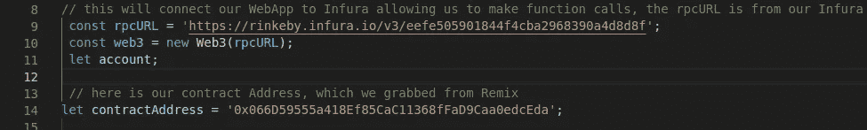

# 如何在 Remix 上制作智能合约，并将其连接到 Web 应用程序

> 原文：<https://medium.com/coinmonks/how-to-make-a-smart-contract-on-remix-and-connect-it-to-a-web-app-24b957164df2?source=collection_archive---------0----------------------->


Photo by [Pankaj Patel](https://unsplash.com/@pankajpatel?utm_source=medium&utm_medium=referral) on [Unsplash](https://unsplash.com?utm_source=medium&utm_medium=referral)

本指南适用于任何希望学习制作一个分散式应用程序以及以太坊智能合约的人。本指南假设您对 javascript、html、节点包管理器和区块链生态系统有基本的了解。

你需要什么

*   像 Visual Studio 代码这样的代码编辑器
*   已安装节点 JS
*   带有 testnet Ether 的 Metamask 钱包
*   新闻报道

## **第一步。让 testnet ether 进入我们的 Metamask 帐户**

首先，在这里创建一个元掩码账户[，建议您仅将这个钱包账户用于测试目的，而不是实际存储真实的代币。](https://metamask.io/)

在以太坊主网上创建智能合约，或者与大多数智能合约功能交互时，我们需要花费以太。在测试网上这样做可以更好地模拟智能合约的实际功能，而不是像 Truffle 那样在个人区块链上这样做。

为了让我们与 testnet 交互，创建智能契约并发送事务，我们将需要 test Ether。我们可以从 https://rinkeby.faucet.epirus.io/的 T4 得到这个，但是网上还有其他免费的水龙头。

在 Metamask 插件上，切换到窗口顶部 Networks 选项卡下的 Rinkeby 测试网络。将您的公钥地址复制并粘贴到 Rinkeby 水龙头网站，等待您的免费测试网！

一旦你有了你的 testnet ether，你就可以马上在 Remix 上制作和部署一个合同！

## **第二步。创建一个混合智能合同**

Remix 是一个在线 IDE，使开发人员能够在区块链上轻松创建和部署智能合约。在本教程中，我们将部署默认的智能合约，它是在您转到 [Remix](https://remix.ethereum.org/) 时提供给我们的。

当你打开 Remix.ethereum.org，你会看到三个默认的智能合同已经为我们做好了。Select 1_Storage.sol。这个智能契约所做的只是存储一个整数，并允许您检索它。这很简单，但出于本教程的目的，我们不会深入讨论如何编写智能合同的细节。如果你有兴趣学习以太坊区块链上用于编写智能合约的语言 Solidity，我推荐 [Cryptozombies.io.](https://cryptozombies.io/)

首先，我们要编译，然后将这个智能契约发布到 Rinkeby 测试网络。转到 Remix IDE 左侧的第二个标签，点击编译按钮。确保您选择了存储合同。编译完成后，看看右下角的**编译细节**。以下是对您编译的智能合约的详细说明。


我们关心的是函数散列，我们稍后将使用它来调用我们的智能契约函数！它应该看起来像这样…

```
{
 “2e64cec1”: “retrieve()”,
 “6057361d”: “store(uint256)”
}
```

在下一个选项卡 Deploy and Run transactions 中，我们希望将我们的环境切换到 Injected Web3。点击 deploy，您的元掩码应该会自动提示您是否要签订智能合同。不要担心天然气价格或天然气限额，因为 Metamask 应该已经根据交易成本设置了这些价格或限额。反正是试验乙醚！一旦您确认了交易，等待几秒钟，您的智能合约应该已经部署在 Rinkeby Testnet 上了！


The contract address will be under your Deployed Contracts tab

在 Remix 中，我们能够在 IDE 中调用函数，但是我们想要做的实际上是从我们的 Web 应用程序中调用函数，类似于 dApp 的工作方式！如果你喜欢的话，可以玩玩这些函数，你会发现在智能合约中存储一个整数需要花费很多钱，而检索数字是免费的，不会提示你签署交易。这是因为从智能合同中读取值不会耗费任何汽油，而创建、删除或更新值则需要。

尝试使用 store 函数存储一个数字，稍后我们将在我们的 Web 应用程序中检索该值！


我们从智能契约中需要的三样东西是契约公共地址和两个函数散列。

## **第三步。创建一个保险账户**

Infura 是什么，我们为什么需要它？

Infura 提供了工具和基础设施，允许开发人员轻松地将他们的区块链应用程序从测试阶段部署到大规模部署阶段——简单、可靠地访问以太坊和 IPFS。(来自 Infura 文档)

基本上，它允许我们与以太坊区块链互动，而不必维护我们自己的以太坊节点！

在 Infura 上，注册一个免费帐户，并创建一个新项目。在你的仪表板上，进入以太坊选项卡，用你喜欢的名字创建一个新项目。我们关心的是端点选项卡指向 Rinkeby testnet，以及我们的 Rinkeby URL。我们稍后将在 Javascript 文件中需要这些来将我们的 Web 应用程序连接到以太坊区块链。应该是这样的[https://rinke by . in fura . io/v3/eefe 505901844 f 4 CBA 2968390 a 4d 8d 8 f](https://rinkeby.infura.io/v3/eefe505901844f4cba2968390a4d8d8f)。


## **第四步。创建我们的网络应用**

首先，确保安装了[节点](https://nodejs.org/en/)。

创建一个样板 HTML 文件命名为 index.html 和！和一个空的 app.js

在我们的 HTML 页面中，我们现在想要的只是两个按钮。一个用于将用户连接到 Metamask，另一个用于调用我们的智能契约。

我们的 app.js 页面暂时为空

在命令终端用 **npm init** 制作 package.json。我们需要从 npm 安装 web3。制作 ur package.json 时选择所有默认值，然后运行 **npm install web3** 。

最后，在我们的 app.js 中，我会一步一步地介绍每一行在做什么。

这是我们的按钮，提示用户连接他们的元掩码钱包


还记得我们的 Infura 网址吗？我们需要这个和区块链联系。我们的协定地址是来自我们部署的 testnet 智能协定的公共地址



下面是我们的函数调用，用于检索我们存储在智能合约中的号码！


现在，如果你想在你的 Web 应用程序中添加存储功能，我建议你看看 Metamask 文档，想出办法来！提示:该方法不是“eth_call ”,而是另一个字符串！

点击查看 [github 的最终代码](https://github.com/rj13371/remixTutorial)

如果您有兴趣了解更多关于 Web 3 编程的知识，请查阅这些文档！感谢阅读！

 [## 入门|元蒙版文档

### 要为元掩码进行开发，请在您的开发计算机上安装元掩码。。快速笔记...本指南假设…

docs.metamask.io](https://docs.metamask.io/guide/getting-started.html) [](https://ethereum.org/se/developers/docs/apis/javascript/) [## JavaScript API 库| ethereum.org

### JavaScript 客户端库简介，可让您通过应用程序与区块链进行交互。

ethereum.org](https://ethereum.org/se/developers/docs/apis/javascript/) [](https://blog.coincodecap.com/metamask-for-binance-smart-chain) [## 为币安智能链设置元掩码

### 在本文中，我们将向您展示如何为币安智能链设置元掩码？在进行设置步骤之前…

blog.coincodecap.com](https://blog.coincodecap.com/metamask-for-binance-smart-chain) 

> 加入 [Coinmonks 电报频道](https://t.me/coincodecap)，了解加密交易和投资

## 另外，阅读

*   [比特币基地赌注](https://blog.coincodecap.com/coinbase-staking) | [热点评论](/coinmonks/hotbit-review-cd5bec41dafb) | [库币评论](https://blog.coincodecap.com/kucoin-review)
*   [最佳加密交易信号电报](/coinmonks/best-crypto-signals-telegram-5785cdbc4b2b) | [MoonXBT 评论](/coinmonks/moonxbt-review-6e4ab26d037)
*   [Coinswitch 俱吠罗评论](/coinmonks/coinswitch-kuber-review-1a8dc5c7a739) | [电网交易机器人](https://blog.coincodecap.com/grid-trading) | [比特币基地收费](/coinmonks/coinbase-fees-831e77d4f2c5)
*   [Bitget 回顾](https://blog.coincodecap.com/bitget-review) | [双子 vs 区块链](https://blog.coincodecap.com/gemini-vs-blockfi) | [OKEx 期货交易](https://blog.coincodecap.com/okex-futures-trading)
*   [OKEx vs KuCoin](https://blog.coincodecap.com/okex-kucoin) | [摄氏替代品](https://blog.coincodecap.com/celsius-alternatives) | [如何购买 VeChain](https://blog.coincodecap.com/buy-vechain)
*   [币安期货交易](https://blog.coincodecap.com/binance-futures-trading)|[3 comas vs Mudrex vs eToro](https://blog.coincodecap.com/mudrex-3commas-etoro)
*   [如何购买 Monero](https://blog.coincodecap.com/buy-monero) | [IDEX 评论](https://blog.coincodecap.com/idex-review) | [BitKan 交易机器人](https://blog.coincodecap.com/bitkan-trading-bot)
*   [币安 vs 比特邮票](https://blog.coincodecap.com/binance-vs-bitstamp) | [比特熊猫 vs 比特币基地 vs Coinsbit](https://blog.coincodecap.com/bitpanda-coinbase-coinsbit)
*   [如何购买 Ripple (XRP)](https://blog.coincodecap.com/buy-ripple-india) | [非洲最好的加密交易所](https://blog.coincodecap.com/crypto-exchange-africa)
*   [非洲最佳加密交易所](https://blog.coincodecap.com/crypto-exchange-africa) | [胡交易所评论](https://blog.coincodecap.com/hoo-exchange-review)