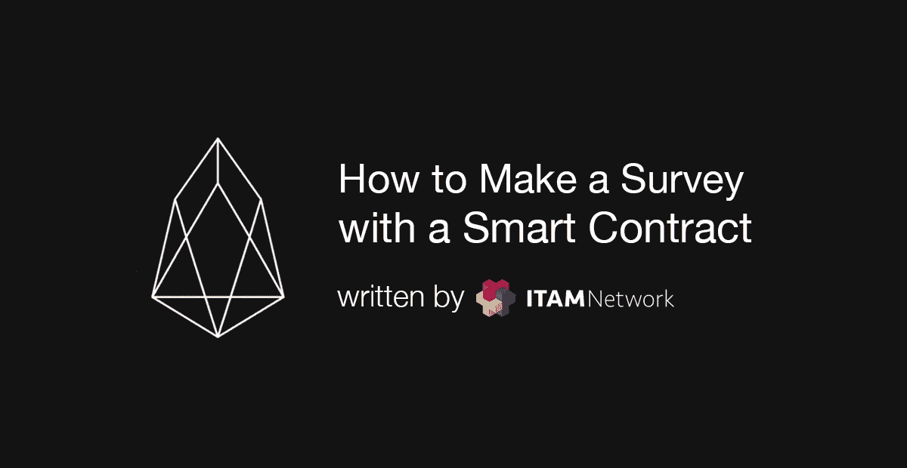
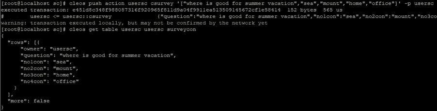
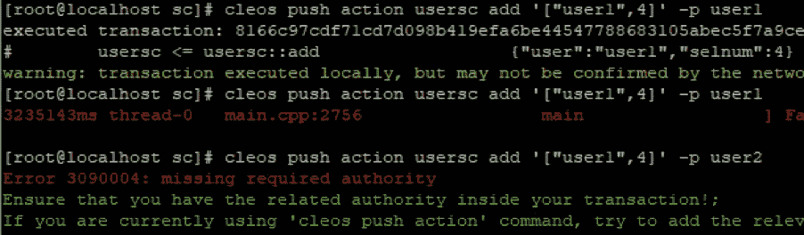
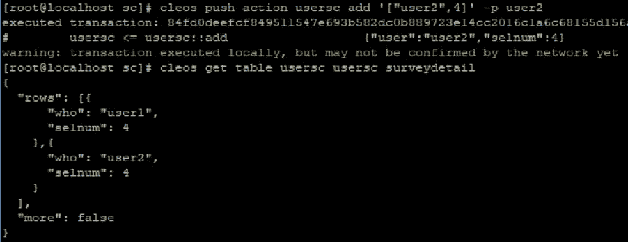
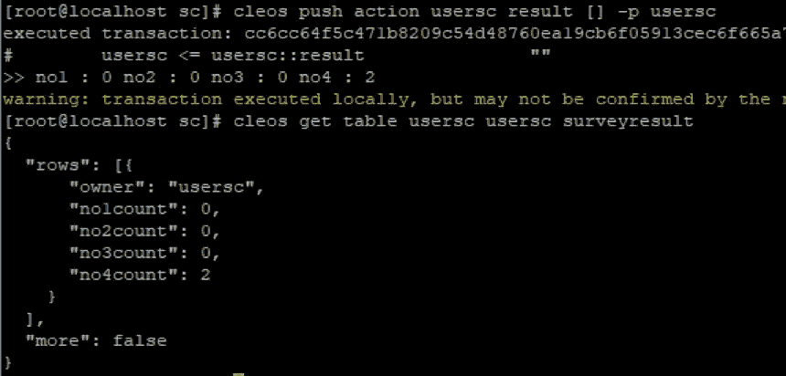

# 如何使用 EOS 智能合同进行调查(2)

> 原文：<https://medium.com/coinmonks/how-to-make-a-survey-with-a-smart-contract-2-b1fe0d83a358?source=collection_archive---------8----------------------->

## 使用智能合同进行抽样调查。



继续如何做调查(1)，我将从解释第三部分开始。

配置存储第三个结果的表。

```
/// [@abi](http://twitter.com/abi) table surveyresult i64
    struct surveyresult
    {
      account_name owner;
      uint64_t no1count;
      uint64_t no2count;
      uint64_t no3count;
      uint64_t no4count;uint64_t primary_key() const {return owner;}EOSLIB_SERIALIZE(surveycon,(owner)(no1count)(no2count)(no3count)(no4count))
    };
    typedef multi_index<N(surveyresult),surveyresult> _result;
```

根据设置为主键的所有者，声明一个表，其中调查的第 1 个累积响应数为第 1 个计数，其余按第 2 个计数、第 3 个计数、第 4 个计数的顺序排列。

现在，添加现有的添加操作功能，以便在用户调用添加操作时修改结果表。

```
auto iter=result.find(_self);
      if(iter!=result.end())
      {
        result.modify(iter,_self,[&](auto& surveyresult)
        {
          surveyresult.no1count = (selnum==1)?iter->no1count+1:iter->no1count;
          surveyresult.no2count = (selnum==2)?iter->no2count+1:iter->no2count;
          surveyresult.no3count = (selnum==3)?iter->no3count+1:iter->no3count;
          surveyresult.no4count = (selnum==4)?iter->no4count+1:iter->no4count;
        });
      }
      else
      {
        result.emplace(_self,[&](auto& surveyresult)
        {
          surveyresult.owner = _self;
          surveyresult.no1count = (selnum==1)?1:0;
          surveyresult.no2count = (selnum==2)?1:0;
          surveyresult.no3count = (selnum==3)?1:0;
          surveyresult.no4count = (selnum==4)?1:0;
        });
      }
```

在现有 add action 函数的返回之上编写源代码的添加；。源代码可能看起来很多，但是如果没有结果表，那么就放置。如果有结果表，那么修改。在放置的情况下，根据 selnum 将初始值初始化为 1 或 0，sel num 是选定的响应方。在修改的情况下，根据 selnum 加 1 修改现有值，sel num 是选择的 responder。

最后，查看结果的操作。这个动作并不是必需的，因为在真实情况下，我们可以直接从 eos.js 或 rpc 通信中查看结果表。

```
void result()
    {
      _result result(_self,_self);
      uint64_t no1;
      uint64_t no2;
      uint64_t no3;
      uint64_t no4;auto iter=result.find(_self);
      if(iter!=result.end())
      {
        no1=iter->no1count;
        no2=iter->no2count;
        no3=iter->no3count;
        no4=iter->no4count;
      }
      print("no1 : ",no1," no2 : ",no2," no3 : ",no3," no4 : ",no4);return;
    }
```

调用结果表的数据并打印。这个动作没有任何异常。

现在编译并部署源代码进行测试。文章末尾附有完整的源代码。因为这篇文章的源代码不检查表的重复数据，所以建议按顺序进行。为了解决测试期间的数据问题，我们添加了一个 delall 操作来删除所有表的信息，你可以在帖子底部的整个源代码中看到这一点。

首先，写调查报告。



该调查已注册。我已经检查了 surveycon 表以确认数据。

在用户 1 的许可下，选择数字 4。



如果您选择了重复的帐户，或者帐户不是指定给操作的帐户，将会出现错误。

在用户 2 的许可下，选择数字 4。



选择之后，我检查了 surveydetail 表，以检查为每个客户选择了什么。

最后打印结果。



我已经搜索了 surveyresult 表来检查打印结果。

下面是带有 delall 操作的完整源代码，它从表中删除信息以使测试更容易。

这篇文章的源代码不应该用于实际用途，因为它是作为一个例子，因此为了使代码更容易理解，许多代码被省略和简化了。实际的代码应该在安全性、成本和速度方面进行适当的设计和实现。感谢您的关注。

## ITAM 游戏是一个透明的游戏生态系统的区块链平台

订阅 ITAM 游戏并接收最新信息。

访问 ITAM 游戏电讯，就 ITAM 游戏和区块链进行交流。点击下面的链接加入！👫

网址:**[https://itam . games](https://itam.games)电报:[https://t.me/itamgames](https://t.me/itamgames)**