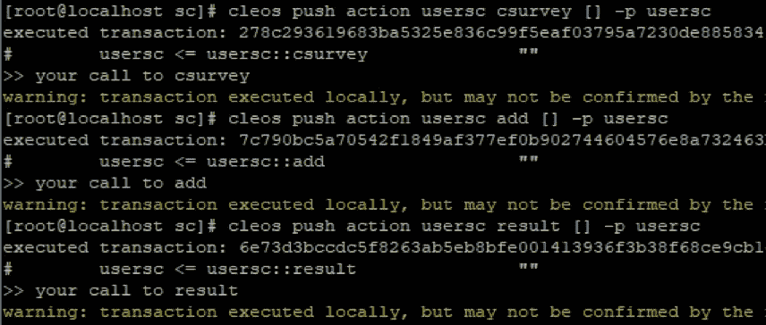

# 如何使用 EOS 智能合同进行调查(1)

> 原文：<https://medium.com/coinmonks/how-to-make-a-survey-with-an-eos-smart-contract-1-ac13852405c1?source=collection_archive---------2----------------------->

## 使用智能合同进行抽样调查。


你好，我是 ITAM 游戏公司的沈在贤。在这篇文章中，我将给出一个使用智能合同进行调查的例子。

请记住，这个示例是为了保持一定的简单性，因此在实际使用中可能不实用，但是固定的要求都包括在内。

# 开始

首先，让我们在头脑中把它画出来。

1.  合同创建者输入调查的描述和四个选项的内容。
2.  普通用户将他们的账号和他/她选择的号码发送到合同上。
3.  所有用户都使用合同来查看结果。
4.  一般用户一旦选择，就不能修改调查结果。

需求在组织的时候已经被结构化了，为了简单地结构化，似乎需要有 3 个。意为 2~3 桌。

## **动作配置**

操作配置如下。

1.  **调查**:进入新的调查
2.  **增加**:参加调查
3.  **结果**:查看调查结果

## **工作台配置**

该表也被配置成如下 3 个部分。

1.  包含调查信息和 4 个选项的表格。
2.  保存调查参与者及其选择的表格。
3.  收集和保存结果的表。

我认为如果你混合 1 和 3 应该不会有任何问题，但是为了确保组件是可见的，我将在这个例子中分开。

```
#include <eosiolib/eosio.hpp>
#include <eosiolib/print.hpp>using namespace eosio;class survey : public eosio::contract 
{
  public:
    using contract::contract;/// [@abi](http://twitter.com/abi) action
    void csurvey() 
    {
      print("your call to csurvey");
    }/// [@abi](http://twitter.com/abi) action
    void add() 
    {
      print("your call to add");
    }/// [@abi](http://twitter.com/abi) action
    void result()
    {
      print("your call to result");
    }
};EOSIO_ABI( survey, (csurvey) (add) (result) )
```

做一个简单的骨架，我们会在每个动作中输入一个测试代码打印(“你对 csurvey 的调用”)。发布后编译源代码并测试。(关于合同的编制、发布和执行方法，请参考[上一篇文章](/coinmonks/using-table-on-eos-smart-contract-291f98312b80)



你可以看到每个动作都工作正常，没有任何问题。

# **实施**

首先，制作一个用于 csurvey 动作的表格

```
using namespace eosio;
using namespace std;
.
.
.
/// [@abi](http://twitter.com/abi) table surveycon i64
    struct surveycon
    {
      account_name owner;
      string question
      string no1con;
      string no2con;
      string no3con;
      string no4con;uint64_t primary_key() const {return owner;}EOSLIB_SERIALIZE(surveycon,(owner)(question)(no1con)(no2con)(no3con)(no4con))
    };
typedef multi_index<N(surveycon),surveycon> _survey;
```

为了使用字符串变量，首先使用 std 命名空间(使用命名空间 STD；).然后将智能协定所需的表定义为结构。这些表必须有一个用于搜索的主键。主键不能重复或为空。在本例中，因为我们将只进行一项调查，所以使用主键作为智能合约的帐户，并且调查的剩余数据 answer1、answer2、answer3、answer4 已被声明为 string 类型。

现在实现 action csurvey 特性。

```
/// [@abi](http://twitter.com/abi) action
    void csurvey(string question,string no1con,string no2con,string no3con,string no4con) 
    {
      _survey survey(_self,_self);

      survey.emplace(_self,[&](auto& surveycon)
      {
        surveycon.owner=_self;
        surveycon.question=question;
        surveycon.no1con=no1con;
        surveycon.no2con=no2con;
        surveycon.no3con=no3con;
        surveycon.no4con=no4con;
      });return;
    }
```

首先，定义要传递给操作的数据。我们得到了将要输入到表上的问题的字符串数据，以及 1~4 的答案。现在将来自 csurvey 的数据输入到表格中。为了简单说明，我们没有讨论密钥复制的问题。

接下来，创建用户用来保存投票信息的表。

```
/// [@abi](http://twitter.com/abi) table surveydetail i64
    struct surveydetail
    {
      account_name who;
      uint64_t selnum;uint64_t primary_key() const {return who;}EOSLIB_SERIALIZE(surveydetail,(who)(selnum))
    };
    typedef multi_index<N(surveydetail),surveydetail> _items;
```

要存储谁保存了什么号码，请定义 who 变量和所选号码 selnum。我使用 who(帐户)作为主键，使用 _items 作为类型。

现在实现添加操作。

```
/// [@abi](http://twitter.com/abi) action
    void add(account_name user,uint64_t selnum) 
    {
      require_auth(user);_items item(_self,_self);item.emplace(_self,[&](auto& surveydetail){
        surveydetail.who=user;
        surveydetail.selnum=selnum;
      });
    return;
    }
```

这段代码与上面的 csurvey 操作没有什么不同。这可能很奇怪，因为我们所做的只是将调查参与情况存储到表中，但是我们将在下面的代码中添加该功能。代码顶部的 require_auth (user)比较验证契约的执行权限是否与用户一致。因为 eosio 允许您调用多个帐户的执行权限的操作，所以很难区分执行合同的权限和执行操作的权限。因此，我们使用函数来检查在将必要帐户的名称放入操作的数据中之后，是否使用必要的帐户执行权限执行了合同。

由于篇幅原因，此内容将在下一篇文章中继续。

## ITAM 游戏是一个透明的游戏生态系统的区块链平台

订阅 ITAM 游戏并接收最新信息。

访问 ITAM 游戏电讯，就 ITAM 游戏和区块链进行交流。点击下面的链接加入！👫

网址:**[https://itam . games](https://itam.games)电报:[https://t.me/itamgames](https://t.me/itamgames)**