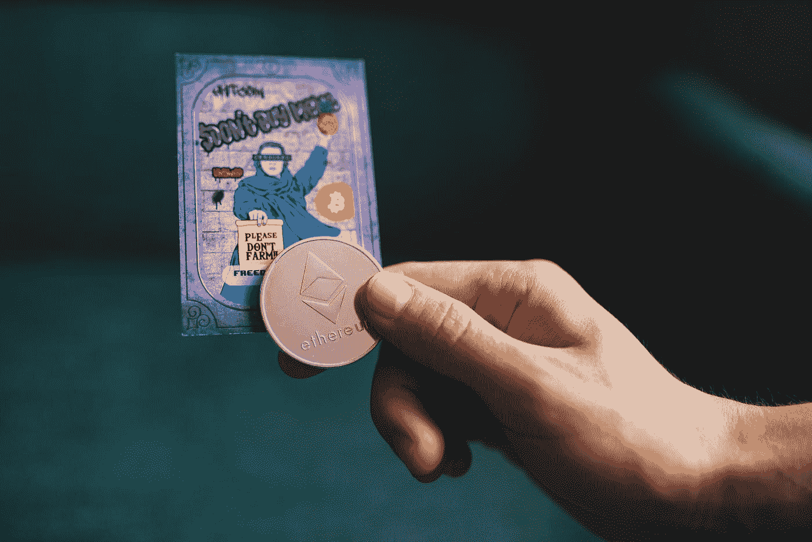

# 如何创建一个 NFT——没有过去的经验！

> 原文：<https://medium.com/coinmonks/how-to-make-an-nft-no-experience-7e1951d82b17?source=collection_archive---------9----------------------->

Photo by [Old Money](https://unsplash.com/@moneyphotos?utm_source=medium&utm_medium=referral) on [Unsplash](https://unsplash.com?utm_source=medium&utm_medium=referral)

在过去的一年里，不可替换令牌(NFT)变得越来越流行！创建自己的 NFT 从未如此简单！事实上，你可以在 5 分钟内轻松创建一个！

无论你是一个有着广泛作品的艺术家还是仅仅出于好奇，制作一个 NFT 就像上传一个文件一样简单！通过探索一些不同的平台和方式，艺术家薄荷代币，你会准备好…