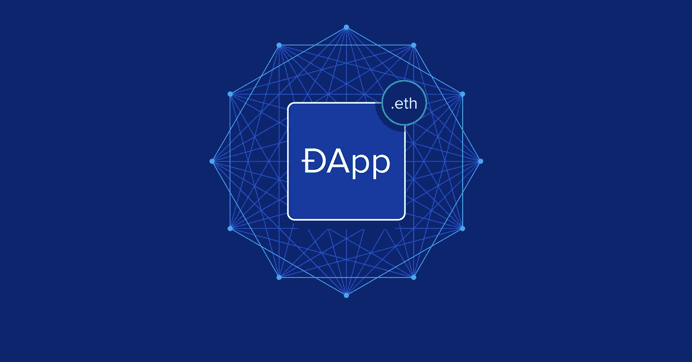

# 如何使用 solidity 和 web3js 制作 Dapp

> 原文：<https://medium.com/coinmonks/how-to-make-dapp-using-solidity-and-web3js-1c758628033?source=collection_archive---------1----------------------->



# 我们在做什么？

一个基本的计数器应用程序，它将在 solidity 中具有递增和递减功能，我们将能够在浏览器中使用 web3.js 与这些功能进行交互

# **Dapp 是什么？**

一个 **Dapp** ，或者分散式应用，是一个运行在分布式网络上的软件应用。它不是托管在一个中央服务器上，而是托管在一个点对点的分散网络上。

# **什么是固态语言？**

**Solidity** 是一种高级的面向合同的语言**，用于**编写智能合同。由以太坊区块链平台的核心贡献者开发，用于**在以太坊虚拟机和其他区块链开发平台内**设计和实现智能合约。

# 什么是 Web3.js，我们为什么要使用 Web3.js？

**Web3.js** 是一个库集合，允许你使用 HTTP、IPC 或 WebSocket 与本地或远程以太坊节点进行交互。web 3 JavaScript 库与以太坊区块链交互。它可以检索用户帐户，发送交易，与智能合同交互，等等。

# 先决条件 **:**

Npm: npm 是 JavaScript 编程语言的一个包管理器。链接:[https://nodejs.org/en/T21](https://nodejs.org/en/)

**Ganache:**[Ganache](https://www.trufflesuite.com/ganache)是一款用于快速以太坊和 Corda 分布式应用开发的个人区块链。您可以在整个开发周期中使用 Ganache 使您能够在安全和确定的环境中开发、部署和测试您的[dapp](https://blog.coincodecap.com/what-are-dapps-an-ultimate-guide)。成功安装 npm 后，安装 ganache-cli。命令:

```
npm install ganache-cli
```

**Web3.js 命令:**

```
npm install web3
```

**Solcjs:** 是一个节点。用于编译实体文件的 js 库和命令行工具。命令:

```
npm install solc
```

# 开始使用:

该项目将被分为 3 个主要文件，counter.sol 将是我们的 solidity 合同，counter.js 将由我们的部署代码组成，counter.sol 将使用 web3js 连接到合同，并有我们的应用程序的前端。

完成所有步骤后，将获得项目结构:


File system structure

# 写我们的第一份合同

**Counter.sol**

```
// SPDX-License-Identifier: MIT
pragma solidity >=0.7.4;
contract FirstContract {
int public count = 0;
  function incr() public{
    count++;
  }
  function decr() public{
    count--;
  }
  function display() public view returns (int){
    return count;
  }
}
```

你可以把可靠性和 java 联系起来，因为它和 java 有相似的结构。正如在 java 中，我们有类，我们有契约。契约是驻留在以太坊区块链上特定地址的功能和数据的集合。

所以在上面的代码中，我们有 3 个函数和一个维护计数器的公共变量。

默认情况下，契约状态是**只读的**，除非它被指定为**公共的**，所以我们将所有的函数都设置为公共的。

**视图函数**是只读函数，确保状态变量在调用后不能被修改。由于 **display()** 函数不会修改该变量，因此该变量将保留给 **view** 函数。

使用 solc 编译代码:

```
solcjs --bin --abi -o ./build counter.sol
```


因为我们在需要启动 ganache 之前安装了 **ganache** 。命令:

```
ganache-cli
```

# 在我们的本地服务器上部署

**Deploy.js**

```
const fs = require('fs');
const Web3 = require('web3');
const web3 = new Web3('http://localhost:8545');
const bytecode = fs.readFileSync('build/counter_sol_FirstContract.bin');
const abi = JSON.parse(fs.readFileSync('build/counter_sol_FirstContract.abi'));(async function () {
  const ganacheAccounts = await web3.eth.getAccounts();
  const myWalletAddress = ganacheAccounts[0];
  const myContract = new web3.eth.Contract(abi);
  myContract.deploy({
    data: bytecode.toString()
  }).send({
    from: myWalletAddress,
    gas: 5000000
  }).then((deployment) => {
    console.log('voting was successfully deployed!');
    console.log('voting can be interfaced with at this address:');
    console.log(deployment.options.address);
  }).catch((err) => {
    console.error(err);
  });
})();
```

一旦完成了 solidity 代码的编译并启动了 ganache，我们需要部署上面的脚本。上面的脚本并不太复杂，无法理解，所以请冷静下来。

前 3 行是基本的包含语句，我们将需要部署脚本。

接下来的两个变量，即**字节码**和 **abi** 是在**编译期间构建的文件。sol** 脚本。 **ABI** 是一个`.json`文件，描述部署的契约及其功能。它允许我们将契约上下文化并调用它的函数。`bin`只是编译后的字节码的压缩二进制表示。`PUSH`、`PULL`或`DELEGATECALL`引用的不是操作码，而是它们的二进制表示，在文本编辑器中读起来就像随机数。

接下来的几行接受不同的参数，如 ganache 帐户、钱包地址和合同的 abi，一旦部署，我们将从 web3.js 获得用于 intract 的合同地址

部署命令:

```
node counter.js
```


Contract address

# 我们 Dapp 的前端

Counter.html

```
 <!DOCTYPE html>
<html>
<head>
  <title>First DApp</title>
</head>
<body>
  Increment
  <button id="incr">+</button>
  <br>
  Decrement
  <button id="decr">-</button>
  <br />
  <label id="myLabel"></label>
</body>
<script src="[https://code.jquery.com/jquery-3.6.0.min.js](https://code.jquery.com/jquery-3.6.0.min.js)"
  integrity="sha256-/xUj+3OJU5yExlq6GSYGSHk7tPXikynS7ogEvDej/m4=" crossorigin="anonymous"></script>
<script src="[https://cdn.jsdelivr.net/npm/web3@1.2.6/dist/web3.min.js](https://cdn.jsdelivr.net/npm/web3@1.2.6/dist/web3.min.js)"></script>
```

Html 代码的前半部分只有 2 个按钮，它们被分配了 2 个 id 来增加和减少值。我的标签将显示显示柜台。之后它包含 2 个 CDN 脚本，第一个是用于处理点击事件的 **JQuery** ，第二个是用于与契约交互的 **web3js**

```
<script>
  const **web3** = new Web3('[http://localhost:8545'](http://localhost:8545'));
  const **myContractAddress** = //paste the address generated during deployment with single quotes;
  const **myAbi** = // paste your abi code as it is.
  const myContract = new web3.eth.Contract(myAbi, myContractAddress);
  const **htmlLabel** = document.getElementById('myLabel');
  myContract.methods.display().call().then((jsonRpcResult) => {
    htmlLabel.innerHTML = jsonRpcResult;
    console.log(jsonRpcResult);
  });
  $('#incr').click(function () {
myContract.methods**.incr**().send({from:'**//paste avaiable accounts from ganache**'},function () {
      myContract.methods.**display**().call((error, result) => { htmlLabel.innerHTML = result; console.log(result) })
    })
  });
  $('#decr').click(function () {
    myContract.methods.**decr**().send({from:'**//paste avaiable accounts from ganache**'}, function () {
      myContract.methods.**display**().call((error, result) => { htmlLabel.innerHTML = result; console.log(result) })
    })
  });
</script>
</html>
```

将部署过程中生成的合同地址粘贴到 **myContractAddress** 变量中。

从编译期间生成的 abi 文件中粘贴 **abi** 代码。sol 文件。

Htmllabel 只是获取对 **myLabel** 的引用，以便在单击按钮时更新。

每当我们试图访问函数时，我们需要传递一个 from 变量，即我们从哪个帐户访问合同，这可以从 ganache cli 获取，粘贴到任何一个地址中。


# 输出:

完成所有步骤后，在 chrome 或任何其他网络浏览器中打开你的 HTML 文件，看看你的第一个 Dapp 是如何工作的！Woho！


恭喜你！你正在写你的第一个 Dapp，希望你会喜欢。如果你需要更多关于分散式网络应用的有趣文章，请放弃你的建议！

感谢阅读！👋👋

**做检查我的网站**[**Sagar gada . me**](https://sagargada.me/)**和 GitHub** [**这里**](http://github.com/sagargada73/) **关注我的**[**LinkedIn**](https://www.linkedin.com/in/sagar-gada-7631b6108/)