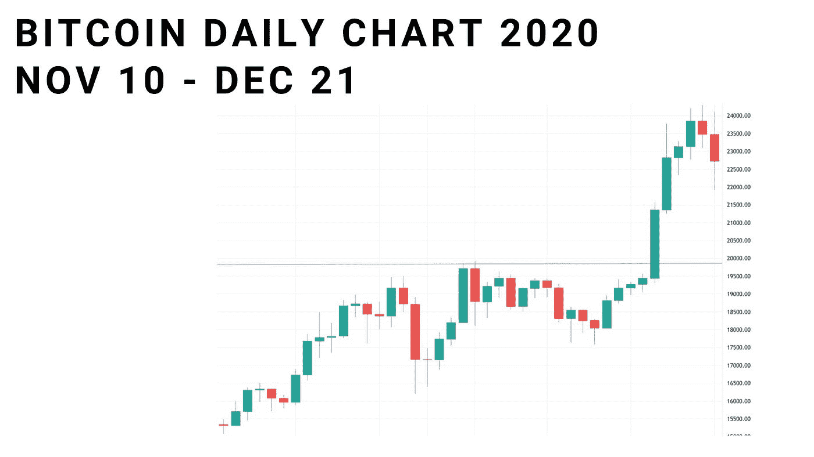
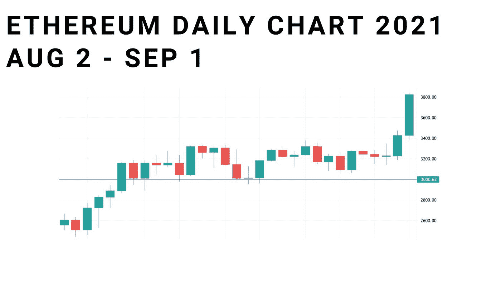
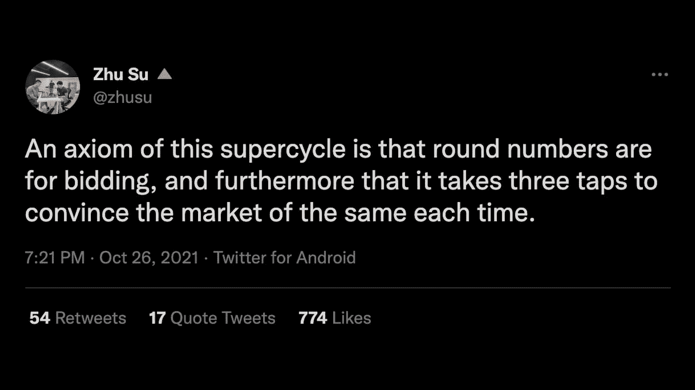
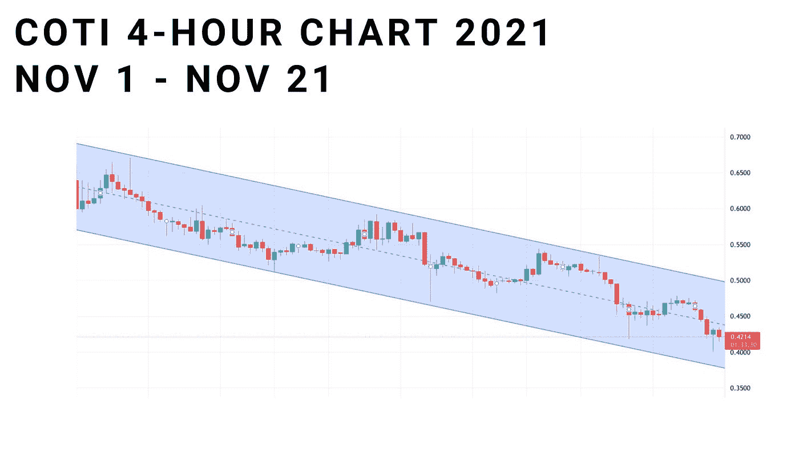
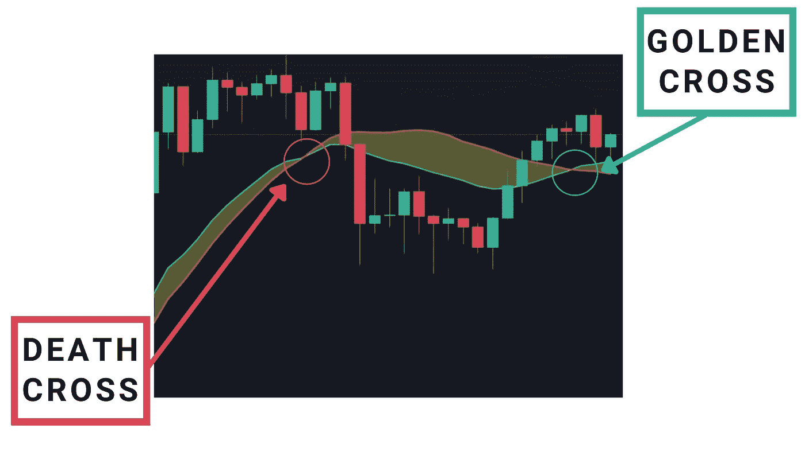
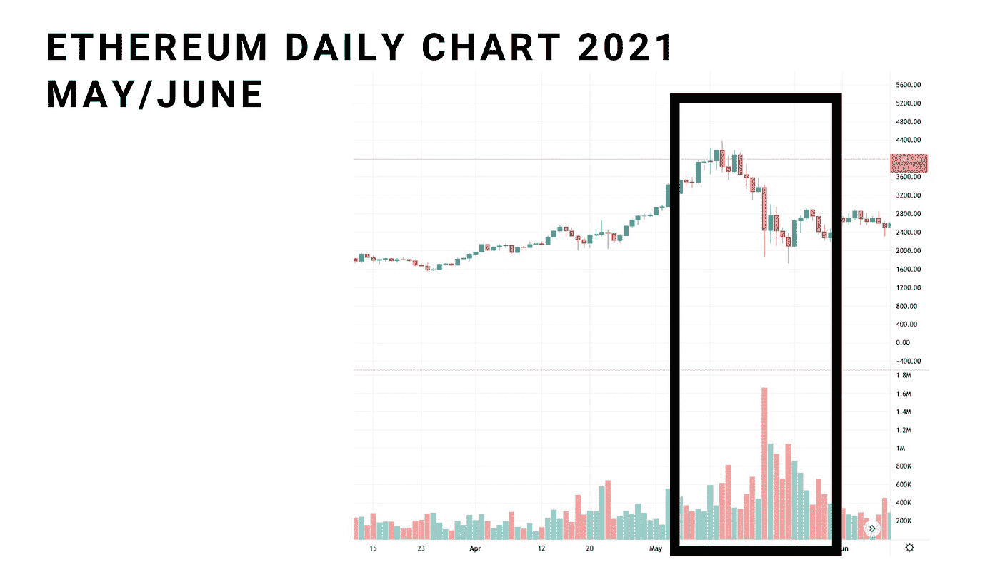
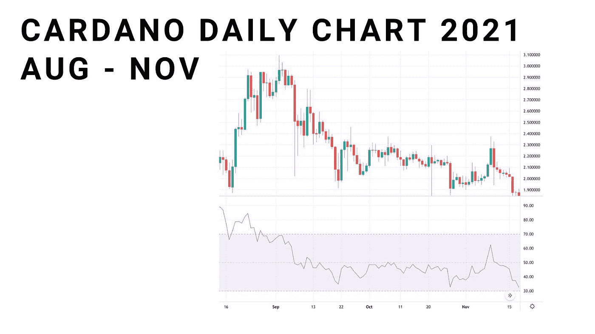

# 如何通过分析加密图表赚钱

> 原文：<https://medium.com/coinmonks/how-to-make-money-analyzing-crypto-charts-66ffa7e58108?source=collection_archive---------4----------------------->

## 我只把一小部分内容放在媒体上。如果你想获得所有加密实用主义新闻更新、投资公告和 altcoin 报告的全部信息，请在此免费注册简讯。

技术分析(缩写为 TA)是解读资产过去价格变动以猜测未来价格的策略。这是一种提取市场信息的方式，以便在购买或出售资产时做出更好的决策。

最纯粹的形式，它包括看图表，识别价格趋势，确认你看到的趋势是否有效，并根据这些信息做出交易决定。听起来不错——看看图表，算出未来的价格。很简单。

然而，实际上，这要更棘手一些。数以百万计的市场参与者都在玩同样的游戏，都在寻找优势，都在根据自己的心理进行交易，在信号和你之间有大量的静电干扰。

​

# 支持技术分析的数据

很多更保守的 ETF 型投资者会告诉你，技术分析完全没有意义。我觉得不是这样的。大量的学术(和轶事)证据告诉我们，TA 优于被动投资策略。

我们关于这一学科的大部分数据来自股票市场。虽然肯定有学者说 TA 一文不值，但以下研究都证实了基础 TA 可以胜过被动策略:

*   Errunza 和 Losq ( [1985](https://www.sciencedirect.com/science/article/abs/pii/037842668590007X?via%3Dihub)
*   乌鲁蒂亚( [1995](https://onlinelibrary.wiley.com/doi/10.1111/j.1475-6803.1995.tb00568.x)
*   索布雷罗等人( [2016](https://www.sciencedirect.com/science/article/abs/pii/S1062940816300742?via%3Dihub) )
*   诺克斯和拉贾拉特南( [2014](https://link.springer.com/article/10.1007%2Fs10479-014-1751-y) )

最近，2018 年的研究 [de Souza，M.J.S .，Ramos，D.G.F .，Pena，M.G. *等人*](https://doi.org/10.1186/s40854-018-0087-z) 对金砖国家股票市场的 TA 策略进行了广泛的回顾，得出了以下结论:

平均而言，使用技术分析获得的回报超过了投资价值

这些研究有时相互矛盾，但几乎所有的研究都有共同点:

*   在效率较低的市场中，技术援助更有效
*   交易频率越高，通过 TA 获得的回报越低
*   基本面分析辅助下的 TA 更有效
*   TA 在不太成熟的市场更有效

也许这些点有助于解释为什么 TA 在加密市场如此有效，特别是在替代硬币方面。替代硬币市场不成熟，效率较低，可以从根本上进行评估。散户投资者还有一个优势，那就是他们不需要频繁交易。

**技术分析什么时候有效？**

我不认为普通的加密投资者能让他们的整个交易生涯脱离技术分析，但它肯定能帮助你:

*   为长期投资决策和基本面分析提供信息
*   帮助你及时退出
*   获得更好的进场点

所有这些优势都很有价值，至少值得了解基本的基础。

**一注**

在本次分析中，我将从最基本的 TA 概念开始。如果你已经理解了技术分析，这篇文章可能只是一种复习基础知识的方法，或者可以跳过。

​

# 基础:供给和需求

所有的技术分析都归结为一点:理解供给和需求。如果买方(需求)多于卖方(供给)，价格就会上涨。供不应求？价格会上涨。很多技术分析都归结于识别供求关系，并根据这些信息进行投资。

我发现反思以下事实是有益的:在每笔交易中，都有一个买方和一个卖方:对于你的任何投资想法，另一边都有人在想完全相反的事情。你们中的一个会错。这是一个令人谦卑的概念，但绝对会让你三思而行。

​

# 阻力/支持

当一种加密货币两次从某一价格水平反弹时，这可能表明存在阻力或支撑。也就是说，有很多人希望以这个价格交易，密码将很难突破或跌破。

**电阻**

阻力是资产接近给定价格并在触及之前或之后回落的趋势。这种情况经常发生在整数上，因为卖家将供应集中在 100 美元、1000 美元或 6 万美元左右。

看看下面的例子，比特币在突破之前从之前的历史高点(阻力)反弹回来:

​

**支持**

一旦密码突破阻力位，它通常会成为支撑位。支撑是资产价格反弹的底线。这可能是一个很好的购买机会，因为通常情况下，在一个密码进行这种关键测试后，势头会发生变化。许多投资者等待反弹，进行定向交易，以尽可能低的价格买入。

举例来说，看看下面以太坊的图表，它突破了 3000 美元的价格水平，然后反弹了几周。

​

我喜欢三箭资本投资人苏竹关于交易支持和阻力的这条推文:

# 
渠道

通道就像它们听起来的那样，是两堵价格墙，资产就在其中。通道可以上升，下降，或者横向变化。当通道横盘时，通常被视为积累秘密的机会。当这些渠道存在时，有几种赚钱的可能性:

*   在底部交易，期待反弹
*   在顶部交易，希望被拒绝
*   突破后进行定向交易

​

# 突围

当一个密码移动到一个支持区域之上或一个阻力区域之下时，就会发生突破。如果判断正确，这往往伴随着大幅上涨或下跌，因此是一个巨大的机会。当一个密码达到，然后超过一个历史高点时，这种情况经常发生。

下面是比特币去年的图表，在 2017 年 ATH 上遇到阻力，然后爆发了一次大的上涨:

​

# 移动平均线

像价格的支撑位和阻力位一样，均线通常也是阻力位和支撑位。

**简单移动平均线**

简单移动平均线的概念实际上有点复杂:它是“算术移动平均线，计算方法是将最近的价格相加，然后将该数字除以计算中的时间段数。”它基本上是过去一段时间的平均价格，绘制在一条连续的线上。

这些移动平均线是在牛市时低于资产价格，在熊市时高于资产价格的价格带。

如果你听说过“死亡交叉”或“黄金交叉”这个术语，它来自移动平均线。黄金交叉是指短期移动平均线向上穿过长期移动平均线，通常是价格上涨的信号。死亡交叉是指短期均线向下穿过长期均线。

你可以从下面的图表中看到均线的样子，以及它们交叉时的样子。

**指数移动平均线**

均线类似于均线，虽然它更看重最近的价格。它以类似的方式使用，当它作为阻力或支撑或当它穿过另一条移动平均线时，寻找买卖信号。

​

# 卷

你知道价格图表底部的那些小条吧，在图表下面？这些条形反映了一段时间内以美元计算的特定加密货币的交易量。成交量可以帮助我们检测动量——当加密货币的趋势伴随着大的成交量时，可以使用这个词。增加的交易量表明你看到的任何趋势都是重要的。

随着交易量的增加，我们可以看到越来越多的参与者在新信息中定价，越来越多的参与者进入或退出该资产的市场。数量非常少的价格下跌可能不是一个值得担心的重大原因。巨大交易量的价格下跌意味着有大事发生。

请看 5 月以太坊的抛售，这是一个很好的例子，说明高成交量是空头熊市的信号:

# RSI

RSI，或相对强度指数，是一个介于 1 和 100 之间的统计数据，试图显示势头。计算有点粗糙，但基本思想是，如果 RSI 高于 70，加密超买，可能会出现趋势反转。低于 30，它可能被低估，准备走出下滑。

它有点微妙，必须与价格数据结合使用才能很好地理解。事实上，加密技术可能会长期处于“超买”或“低估”状态，这使得正确操作变得更加困难。

# 技术分析平台

对于图表来说， [TradingView](https://app.convertkit.com/campaigns/7530494/tradingview.com) 无疑是最受欢迎的服务，而且是免费的，尽管它有高级订阅服务。本文中的图表均来自 TradingView。Coinigy 和 Cryptowat.ch 也是知名服务。我会推荐 TradingView，因为它被广泛使用。

​

# 技术分析的局限性(和无限的可能性)

技术分析是一棵树，向无尽的方向分枝。链上分析师(查看公开区块链数据的市场观察者)将 ta 与其他指标结合起来。他们结合这些新指标，从第一层 TA 统计数据中获得更多指标。它会让你头晕目眩。

有如此多的信号和模式需要识别，以至于很难找到真正重要的模式。和所有事情一样，它归结于实践、经验、自省、研究和学习。

成为一个单纯技术分析的交易者是非常非常困难的。当你的钱岌岌可危时，你很容易变得情绪化或者在叙述中过度投入。一枚正在膨胀的代用币很难卖出去，而且看起来会永远无法使用。故事可以在你自己的头脑中构建。

我认为 TA 最好与其他技能结合使用:仓位大小、基本面分析、多样化、获利回吐。作为投资者，这是提高你的武器库的另一种方式，而不是金子弹。​

祝你好运！

[**点击这里**](https://cryptopragmatist.com/sign-up-medium/) **每周从 Crypto Pragmatist 获取内容，绝对免费。**

> 加入 Coinmonks [电报频道](https://t.me/coincodecap)和 [Youtube 频道](https://www.youtube.com/c/coinmonks/videos)了解加密交易和投资

## 另外，阅读

*   [7 个最佳零费用加密交易平台](https://blog.coincodecap.com/zero-fee-crypto-exchanges)
*   [最佳网上赌场](https://blog.coincodecap.com/best-online-casinos) | [期货交易机器人](/coinmonks/futures-trading-bots-5a282ccee3f5)
*   [分散交易所](https://blog.coincodecap.com/what-are-decentralized-exchanges) | [比特恩斯 FIP](https://blog.coincodecap.com/bitbns-fip) | [宾邦评论](https://blog.coincodecap.com/bingbon-review)
*   [用信用卡购买密码的 10 个最佳地点](https://blog.coincodecap.com/buy-crypto-with-credit-card)
*   [加拿大最佳加密交易机器人](https://blog.coincodecap.com/5-best-crypto-trading-bots-in-canada) | [Bybit vs 币安](https://blog.coincodecap.com/bybit-binance-moonxbt)
*   [火币加密交易信号](https://blog.coincodecap.com/huobi-crypto-trading-signals) | [Swapzone 审查](/coinmonks/swapzone-review-crypto-exchange-data-aggregator-e0ad78e55ed7)
*   最佳[密码交易机器人](https://blog.coincodecap.com/best-crypto-trading-bots) | [购买索拉纳](https://blog.coincodecap.com/buy-solana) | [矩阵导出评论](https://blog.coincodecap.com/matrixport-review)
*   [Coldcard 评论](https://blog.coincodecap.com/coldcard-review) | [BOXtradEX 评论](https://blog.coincodecap.com/boxtradex-review)|[uni swap 指南](https://blog.coincodecap.com/uniswap)
*   [阿联酋 5 大最佳加密交易所](https://blog.coincodecap.com/best-crypto-exchanges-in-uae) | [SimpleSwap 评论](https://blog.coincodecap.com/simpleswap-review)
*   购买 Dogecoin 的 7 种最佳方式
*   [最佳期货交易信号](https://blog.coincodecap.com/futures-trading-signals) | [期交所评论](https://blog.coincodecap.com/liquid-exchange-review)
*   [3 商业评论](/coinmonks/3commas-review-an-excellent-crypto-trading-bot-2020-1313a58bec92) | [Pionex 评论](https://blog.coincodecap.com/pionex-review-exchange-with-crypto-trading-bot) | [Coinrule 评论](/coinmonks/coinrule-review-2021-a-beginner-friendly-crypto-trading-bot-daf0504848ba)
*   [莱杰 vs n rave](/coinmonks/ledger-vs-ngrave-zero-7e40f0c1d694)|[莱杰 nano s vs x](/coinmonks/ledger-nano-s-vs-x-battery-hardware-price-storage-59a6663fe3b0) | [币安评论](/coinmonks/binance-review-ee10d3bf3b6e)
*   [by bit Exchange Review](/coinmonks/bybit-exchange-review-dbd570019b71)|[bit yard Review](https://blog.coincodecap.com/bityard-reivew)|[coin spot Review](https://blog.coincodecap.com/coinspot-review)
*   [3 commas vs crypto hopper](/coinmonks/3commas-vs-pionex-vs-cryptohopper-best-crypto-bot-6a98d2baa203)|[赚取加密利息](/coinmonks/earn-crypto-interest-b10b810fdda3)
*   最好的比特币[硬件钱包](/coinmonks/hardware-wallets-dfa1211730c6) | [BitBox02 回顾](/coinmonks/bitbox02-review-your-swiss-bitcoin-hardware-wallet-c36c88fff29)