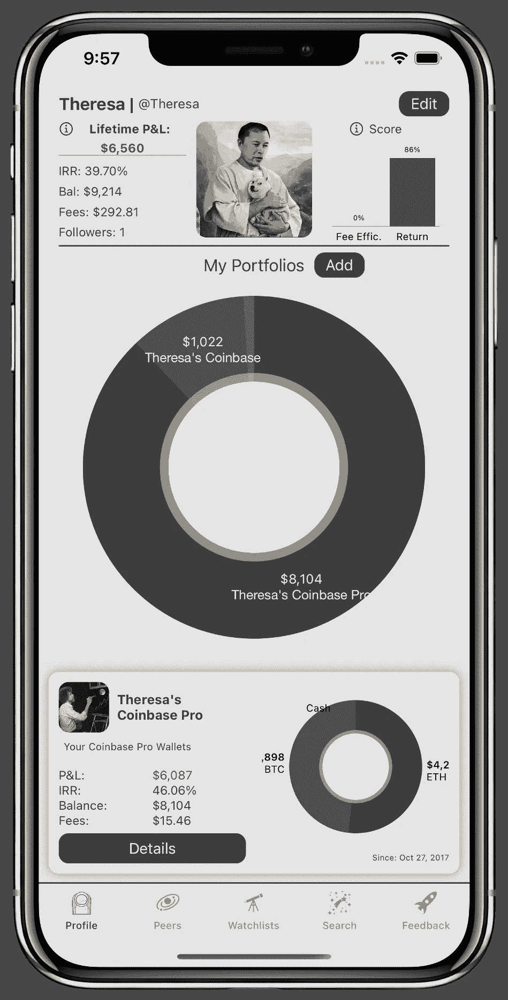
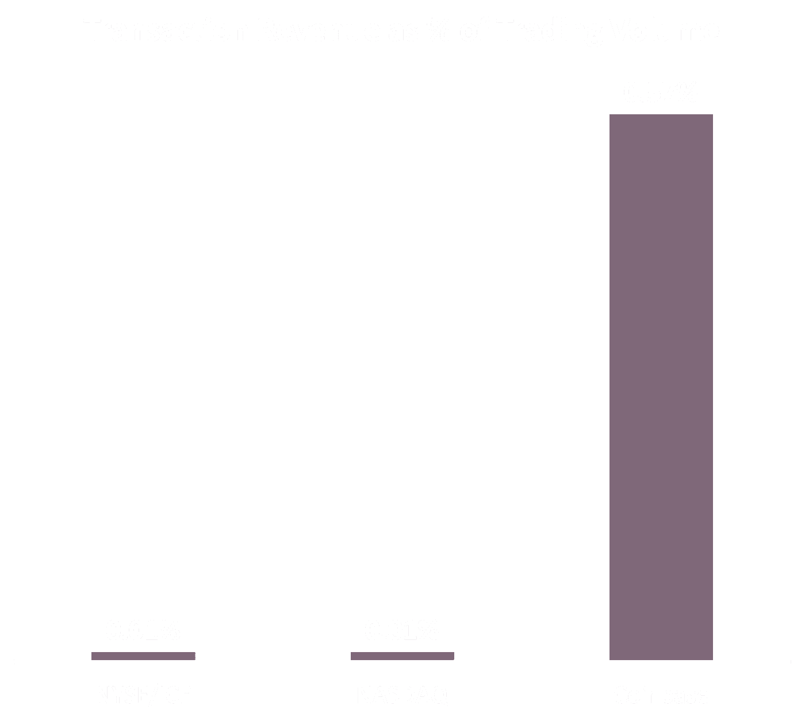
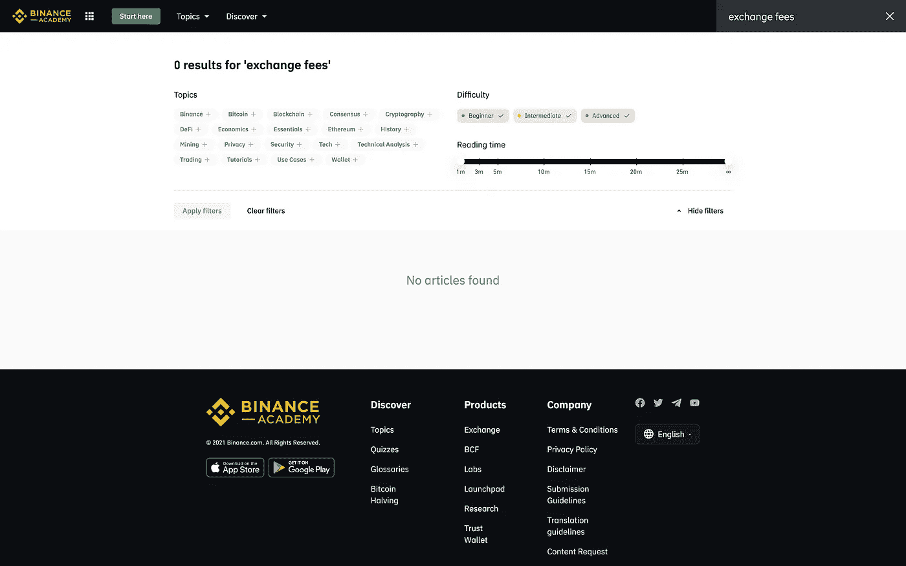
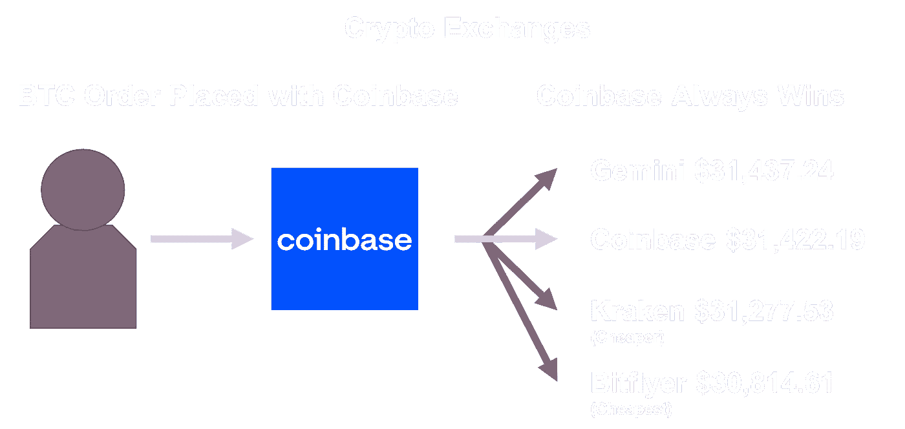
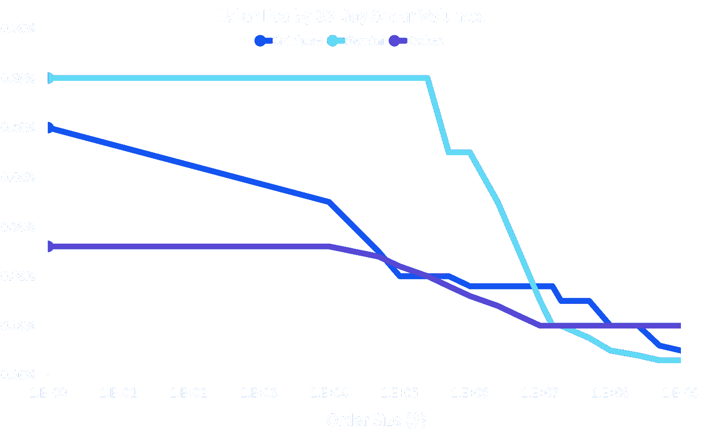
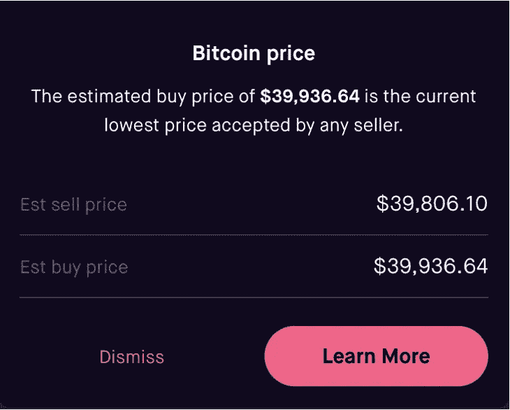
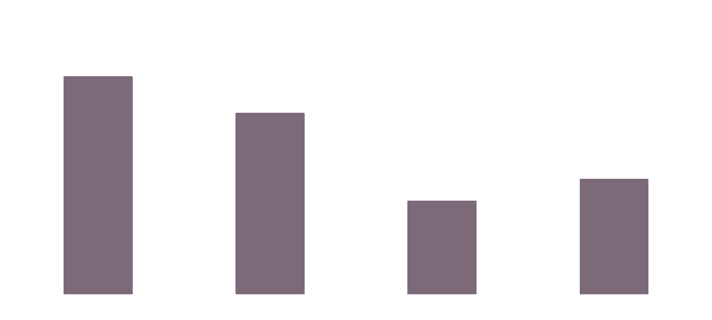

# 如何从交易加密赚更多的钱，保证！

> 原文：<https://medium.com/coinmonks/how-to-make-more-money-from-trading-crypto-guaranteed-4b5ab801dc28?source=collection_archive---------4----------------------->

博士:在加密交易中赚更多钱的唯一有保证的方法就是**降低你的费用**。即使你不去想它们，加密中的**费用也是相当可观的**，并且会让你付出超乎想象的代价。Theresa 持有密码已经有几年了，在使用 Stardust Wealth 之前，她从来不知道自己因为费用而损失了 974.72 美元的未实现收益。在本文中，我们将讨论隐性费用的真实成本，如何衡量它们，以及如何将这笔钱留在自己的口袋里。

Theresa’s Summary on Stardust Wealth

过去一年，加密货币的估值完全是过山车。我敢肯定，读到这里的许多人已经看到了惊人的回报，许多人也经历了痛苦的损失，但无论你的投资组合是涨是跌，你支付的费用可能比你想象的要多。

Theresa 是 Stardust 的联合创始人之一，在过去的几年里，她在加密投资组合方面做得相当不错。她不是一个活跃的日内交易者，自 2017 年以来一直持有硬币。截至发稿时，她的硬币已经增值超过 6500 美元，但这些年来，她还支付了 292.81 美元的费用。然而，这些费用要追溯到 2017 年，应该在比今天便宜的时候给她买更多的 BTC 回来。这些费用让她付出了比名义上损失的收益更多的代价，确切地说是 974.72 美元。

**那可是一大笔钱，她甚至都没意识到她要把它留在桌子上……**

不管加密估值会发生什么，每个认真的投资者都需要关注他们的费用。让我们谈一谈为什么费用如此之低，以及加密交易所是如何利用监管松懈和新投资者的。如果你只是想知道如何减少你的费用，请跳到文章的末尾，在那里我们有减少费用的方法和具体文章的链接，这取决于你使用的交易所。

# **相对于成本而言，加密交换费用过高。**

我们已经写了大量关于加密交易所收取的各种费用，但是 TL；DR 简单；加密费很贵，真的很贵，比传统银行业贵 50 倍。

One of these exchanges is not like the others…

缺乏监管、用户意识和强大的竞争力量意味着主要交易所在收费结构上并没有真正的下行压力。更不幸的是，交易所正在加倍下注，并利用加密货币的复杂性和新颖性向不太老练的用户收取更高的利率。

“0 Results for Exchange Fees” sadly does not mean $0 Exchanges Fees

让我解释一下你面对的是什么，更重要的是，尝试证明交易所是如何故意混淆收费以提高利润的。浏览一下[双子座的加密教育资源](https://www.gemini.com/cryptopedia/explore)，看看你是否能找到一篇关于交易或管理费的文章，也许在[币安的](https://academy.binance.com/en/articles?page=1)、[比特币基地的](https://www.coinbase.com/learn)或[北海巨妖的](https://www.kraken.com/en-us/learn)中有一篇。我翻遍了这些资料，没有一处提到交易费，比如交易费或转让费，或者它们的影响，我向你保证这不是巧合或偶然的疏忽。

费用昂贵，并为这些交易所带来巨大的持久利润。比特币基地在 1，930 亿美元的交易量中获得了 11 亿美元的交易收入，约占每笔交易费用的 0.57%。传统交易所收取 0.01%的费用，这就是为什么比特币基地的市值超过了三大传统交易所在 IPO 时的总和。

他们以几种方式维持这些超额利润，让我们将其分解为缺乏监管和竞争，以及他们如何捕食不老练的交易者。

# 缺乏监管和竞争

支持和反对监管加密货币都有合理的理由。截至发稿时，加密货币交易所仍然不受大多数金融监管的约束，其运作方式与传统资产完全不同。监管费用和成本方面有好处，但缺点之一是消费者福利恶化，因为交易所可以维持高得多的费用利润率。让我们分析一下发生了什么，并比较购买传统金融资产和购买加密资产。

## 首先，传统金融

Not Pictured: The part where Robinhood takes a bribe to help them decide where to route your order. That’s “Payment for Order Flow” and deserves its own article.

当你通过传统经纪人购买传统资产时，比如通过查尔斯·施瓦布购买 AAPL 的股票，一些真正重要的事情会在幕后发生。当您的经纪人收到您的订单时，他们需要将其发送到某个地方执行，即对于所有购买 AAPL 的订单，他们需要找到卖出订单(至少同等数量的股票)。

一般来说，人们认为交易所类似于一个“股票商店”,在那里你有一个固定的出售价格，这个订单将被发送到交易所，在那里他们将按挂牌价格卖给你一份 AAPL 股票。

现实中完全不一样。交易所的工作方式不像商店，它不持有任何资产，它更像是双边拍卖行的拍卖人，那里有数百份订单在不断谈判、匹配和结算。这种自动谈判和匹配通常在交易所发挥作用的方式是，有一个[订单簿](https://www.investopedia.com/terms/o/order-book.asp)，上面有希望以什么价格出售或购买股票的人。

经纪人可以看到这本书，如果现有订单是您订单的良好交易对手，就可以与您匹配，但可能会让您惊讶的是，他们不必去交易所。经纪人有无数的其他选择来完成这个订单。比方说，就在你向嘉信理财提交买入指令的同时，有人同时提交了卖出指令。嘉信理财可以将你们两人撮合在一起，在内部执行你的订单，而无需接触交易所，这个过程被称为[内部化](https://www.investopedia.com/terms/i/internalization.asp)。

那么，在给定一堆选项的情况下，他们如何选择如何发送订单呢？[重要的一点是，法律要求所有经纪自营商为您提供“最佳执行”](https://www.sec.gov/reportspubs/investor-publications/investorpubstradexechtm.html)。一般来说，这意味着最好的价格，但你的经纪人也可以考虑其他变量来确定“最佳”路线，如可用容量和填充时间。简而言之，法律要求你的经纪人将你的订单发送到你最划算的地方，你的订单最有可能被匹配，从而为你省钱。

> 本文范围之外的一个小问题是，这些第三方中的任何一方都可以向经纪人付费，将交易发送给他们，只要价格高于或等于 11 个国家交易所之一的最佳价格，这是完全合法的[，这个过程被称为“](https://www.sec.gov/spotlight/emsac/memo-rule-611-regulation-nms.pdf)[订单流付款](https://www.investopedia.com/terms/p/paymentoforderflow.asp)”。

## 让我们看看如何最好地执行加密工作！

首先让我们来谈谈加密交换的一些奇怪之处。像比特币基地、双子、北海巨妖和币安这样的大多数加密交易所实际上既是交易所又是经纪人。

在传统金融中，这两者总是独立的实体。我雇佣像 Schwab、E*TRADE 或 Robinhood 这样的经纪人，向他们下订单，他们给我“最好的价格”([记住他们在法律上有义务给我最好的执行](https://www.sec.gov/spotlight/emsac/memo-rule-611-regulation-nms.pdf))。最佳价格可能在纽约证券交易所(NYSE)，也可能不在。此外，像纽约证券交易所这样的交易所不会直接与我交易，即使我想从他们那里购买股票，他们只与经纪自营商[谈判，除非在非常有限的情况下](https://www.investopedia.com/terms/d/directstockpurchaseplan.asp)。

通过既是交易所又是经纪人，加密交易所可以做一些真正偷偷摸摸的事情，他们可以避免“最佳执行”，而是中饱私囊。

Long story short.. there’s no routing…

让我们用一个基本的例子，一个用户想在比特币基地上购买一个比特币(1 BTC)。如果这是一个传统的经纪公司，比特币基地会去所有的交易所给我找到最好的价格。这将非常有帮助，因为不同交易所 [**的资产价格相差很大**](https://www.gemini.com/cryptopedia/crypto-arbitrage-crypto-exchange-prices) (通常总是 1-2%，但也可能高达 4-5%)。在这里，由于是**购买**，他们的订单应该以可用的最低价格执行，Bitflyer 上的 30，814.61 美元。

> 顺便说一句，如果阅读不同交易所之间[价格的巨大差异](https://coinmarketcap.com/how-to-buy-bitcoin/)让你想到了[加密套利](https://www.investopedia.com/terms/a/arbitrage.asp)的机会，请务必阅读我们关于加密交易和转让费的[初级读本，以真正理解为什么 1-2%的差价套利是无利可图的。](https://medium.com/p/6fd8d5aaebea/edit)

不幸的是，对于加密交换的最佳执行没有法律要求。因此，比特币基地不必查看其他交易所，并以比特币基地的内部价格执行交易，这让我们可怜的用户多花了 607.58 美元，并使比特币基地(至少是交易所方面)免受竞争对手交易所的损失。

> 由于交易所没有任何最佳执行要求，而且转让和购买费用非常高，它们相对不受竞争压力的影响，能够承受比传统金融经纪公司或交易所高得多的费用。

我希望您能理解为什么密切关注您的加密投资组合的费用如此重要，但让我们使用一个真实的例子来深入讨论这些高费用的实际成本，让我们看看 Theresa 的加密投资组合。

# 这些费用对你的投资组合是一个巨大的拖累。

几十种不同类型的费用很快就会累积起来，尤其是如果你没有记录它们的话。特里萨的投资组合价值 9214 美元，但多年来她已经支付了 292.14 美元的费用。换句话说，她支付了投资组合中约 3%的费用。

不过，这只是她支付的所有费用的字面总和。

# 当你的投资组合升值时，情况会变得更糟。

特里萨不仅仅因为学费损失了 292.81 美元。记住她的投资组合在增长，所以她也损失了那笔钱的机会成本，这比 T1 多得多。

特里萨的第一笔交易是在 2017 年 10 月 23 日。她买了 150 美元的比特币。只不过她是在比特币基地上买的，他向她收取了 5.76 美元的 T2 交易费，所以她只收到了 144.24 美元的 BTC，价格是 6019.93 美元。今天，当 BTC 的价值是现在的 5 倍时，那些丢失的硬币总计为**28.51 美元**。几个月前，在比特币的历史高点，这些丢失的硬币价值 **$60.97** 。

这就是为什么，虽然标题数字是 292.81 美元，但实际损失要严重得多，特别是如果你的投资组合随着加密硬币资产的升值而获得了强劲的回报。

# 你能做些什么。

虽然费用是当前加密生态系统中不可避免的罪恶，但我们会尽最大努力提供帮助。不过首先，你需要能够衡量和跟踪你的费用。我见过有人用谷歌表单、Quicken、Excel 来追踪你的费用，这没有错。如果你不想麻烦或者太困难，我们的应用程序可以为你处理所有的困难工作，并且自动更新你在所有交易所的交易。如果你走的是 Stardust 路线，我们也会比较你的有效回报和费用，给你一个简单的分数，告诉你是否多付了钱，多付了多少。

一旦你知道你做得如何，让我们谈谈你可以采取的行动。尽管对日常用户的收费过高，但交易所无法真正逃脱向老练的投资者收取高额费用的惩罚。精通金融的用户和活跃的交易者知道如何通读披露信息，并在注册交易所之前货比三家，寻找最佳交易。更有眼光的是机构投资者，他们让自己的团队产生财务预测和交易量，迫使交易所在费用上让步。

Fee comparison of the three main US-based regulated crypto exchanges.

你可能不认为你可以利用它，但如果你在他们的专业平台上交易，每个交易所的价格都非常便宜。

在美国三大交易所中，北海巨妖的 delta 最大，对小投资者的收费最低。(注意:我们不是由北海巨妖赞助的，他们只是对小额交易收取最低的费用)

当然，还有交易量折扣，虽然普通投资者不可能每 30 天就达到数百万美元的订单量，但需要说的是，根据你的交易量，这些交易所都可能成为最便宜的选择。

This spread between the price when selling and buying is how Robinhood makes its money and is effectively its transaction fee.

我们已经在这些平台的专业版和普通版交易所进行了交易，没有发现使用专业版有任何缺点。虽然这个界面可能会用所有的图形和烛台图表吓到你，但节省 2/3 的费用或更多是 100%值得的。

> 如果你仍然感到害怕，我们也在撰写关于每个交易所以及如何在每个交易所省钱的深度文章！查看我们的文章:
> 
> [比特币基地/比特币基地职业队](/@StardustWealth/saving-on-fees-coinbase-vs-coinbase-pro-38e5531ba95f)
> 
> Gemini/ActiveTrader(即将推出)
> 
> 北海巨妖/北海巨妖专业版(即将推出)

# 罗宾汉呢，他们没有费用

Robinhood profits from a large spread for any crypto transaction

如果你想知道 Robinhood 的“无交易费”，很不幸，这是一个“好得难以置信”的故事。

罗宾汉**上的利差实际上是 0.32%** 左右，而其他平台上通常是 0.00 - 0.04%。这使得他们的有效交易费与专业平台相比普遍具有竞争力，但高于北海巨妖专业平台的收取率。

如果你深入了解一下，你会发现，虽然你在罗宾汉网上的股票交易是由一家名为罗宾汉金融有限责任公司(“RHF”)的公司执行的，但加密交易是由一家名为罗宾汉加密公司(“RHC”)进行的。这是因为加密货币不受最佳执行要求的约束，而股票或期权交易则受此约束。Robinhood Crypto 可以在他们选择的交易所以他们喜欢的任何价格有效地执行您的交易。当货币价格[在交易所](https://www.tokenspread.com/)之间变化如此之大时，这真的很重要，任何 delta 对他们来说都是纯利润。

Robinhood crypto’s effective trading fees are inline with the pro platforms.

# 你是谁，你为什么知道那么多关于费用的事，我为什么要听你的？

你应该就你读过的每篇文章问一些很棒的问题。如果到这里时你还没有问自己这个问题，你需要更明智地选择从哪里和向谁学习 crypto。

你会注意到[双子座的加密教育资源](https://www.gemini.com/cryptopedia/explore)没有一篇关于交易或管理费的文章，[币安的](https://academy.binance.com/en/articles?page=1)，[比特币基地的](https://www.coinbase.com/learn)，或者[北海巨妖的](https://www.kraken.com/en-us/learn)也没有。我向你保证这不是巧合或意外的疏忽。了解你在听谁说话以及他们可能有什么动机很重要，因为这可能会造成一个非常昂贵的盲点。

我是艾迪特，星尘的另一位联合创始人。我对财务和费用有相当的了解，因为我曾经是一家银行的分析师。我甚至可能亲自建造和设计收取大量费用的产品。我从来都不喜欢付费的想法，我的朋友们**讨厌**不知道他们在投资方面积累了多少。

这就是为什么 Theresa 和我创建了 Stardust，为用户提供工具，以 21 世纪的方式监控和跟踪你的财务状况，完全透明，并能够使用他们的社交网络来获得支持。我们不会向您出售或收取任何费用。根据我们的经验，解析来自交易所的金融文档、构建一个 excel 来跟踪这一切并进行所有计算是很烦人的，因此我们构建了一个超级应用程序，通过强大的社交反馈工具来实现这一切。如果你想建立你自己的 excel 并自己跟踪它，你会有更多的权力，否则[来看看一个更简单的方法来管理你的加密](https://www.stardust.finance/)。

**无论哪种解决方案对你有效，只要开始跟踪这些费用，停止超额支付！！**

## 也阅读

 [## 2021 年 9 大最佳加密借贷平台

### 当谈到加密货币贷款时，大量因素等同于良好的收入状况。此外，借款的一部分…

blog.coincodecap.com](https://blog.coincodecap.com/crypto-lending)