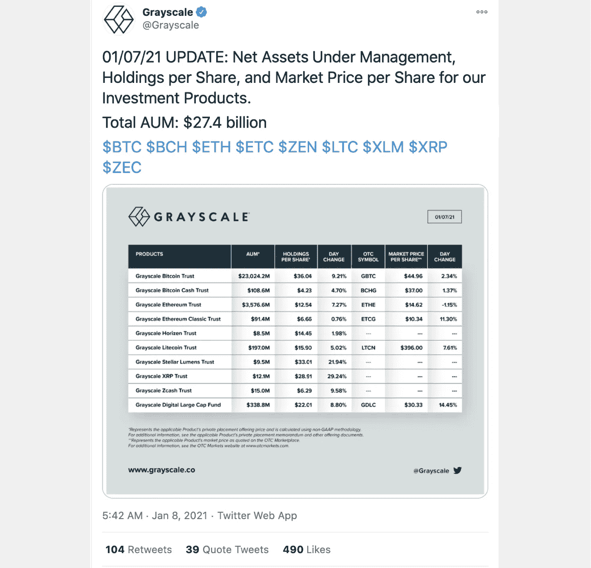
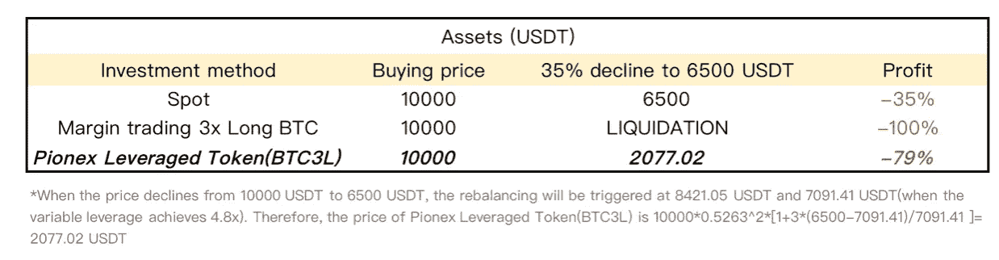
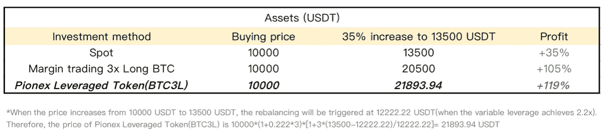
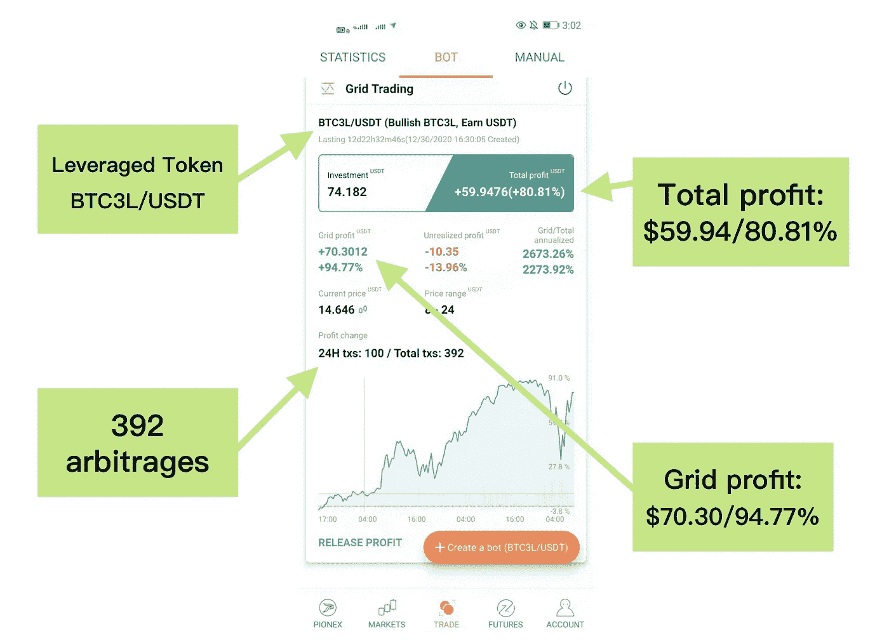

# 杠杆代币|如何在牛市中获取更多利润

> 原文：<https://medium.com/coinmonks/how-to-make-more-profits-in-the-bull-market-with-leveraged-token-f0e6328dab04?source=collection_archive---------0----------------------->

最近，越来越多的机构投资者越来越多地购买比特币。此外，gray、MicroStrategy 等几家主要公司已经集体购买了价值数亿美元的比特币和其他加密货币。

# 更多的大公司正在收购 BTC，这可能会带来下一个牛市！



在所有机构投资平台中，gray 拥有最大的比特币投资组合，目前超过 274 亿美元。

越来越多的人在谈论比特币，这为现在可以被认为是自 2017 年以来最大的牛市增添了一把火。而与此同时，比特币已经破 40k。ETH 破 1.3K 如果最大的牛市来了，你准备好了吗！

# 杠杆代币是牛市中获取高额利润的好选择

如果牛市来了，[杠杆代币](https://blog.coincodecap.com/leveraged-token)将是获取更多利润的好方法。因为有杠杆，所以会比现货交易获利更多。与传统的保证金交易相比，杠杆代币允许投资者获得杠杆敞口，而不用担心清算风险。

杠杆代币是衍生品的一种，它提供了比现货更高的波动性。通常，杠杆令牌名称由 3 部分组成。资产、杠杆倍数和做空/做多。比如说。BTC3L 的意思是 3 倍长的比特币。BTC3S 的意思是比特币短 3 倍

**我们可以以 BTC 为例:**
1。假设比特币现价为 10000 USDT
2。突然下降 35%到 6500 USDT 作为情况 1
3。突然上涨 35%到 13500 USDT 作为情况二
当 BTC 价格为 10000 USDT 时，我们分别用 10000 USDT 投资现货 BTC，3x 做多 BTC(保证金交易)，以及 **Pionex 杠杆代币** BTC3L。

1.  **当比特币跌至 6500 USDT:**



**2。当比特币涨到 13500 USDT:**



> [点击此处了解杠杆代币如何运作>](https://pionex.zendesk.com/hc/en-us/articles/360049185674-What-are-Pionex-Leveraged-Tokens)

正如我们所见，如果你在硬币上涨时交易 3L 代币，杠杆代币可以比现货和保证金交易获得更多利润。然而，如果你错误地预测了硬币的走势，你也会损失更多。

因此，正确预测硬币的走势至关重要。如果牛市来了，大多数顶级硬币都会上涨，所以杠杆代币是在牛市中获取高额利润的好选择。

# 杠杆代币交易策略——网格交易 bot +杠杆代币

电网交易 Bot 适合波动和上涨的市场。因此，电网交易 Bot 可以在波动和上涨的市场中获得巨大的电网利润，这意味着波动和上涨的市场持续的时间越长，电网交易 Bot 获得的电网利润就越多。

[**Pionex**](/coinmonks/pionex-review-exchange-with-crypto-trading-bot-1e459d0191ea) 杠杆代币+网格交易机器人将帮助客户通过杠杆敞口和价格波动赚取更多，同时规避价格突破正常范围时的风险。

正如下面的真实 bot 所示，我用 BTC3L/USDT 连续运行这个网格交易 Bot 大约 12 天。因为杠杆代币会比现货波动 3 倍左右的杠杆，那么我的 BTC3L/USDT 电网交易机器人只用 74.18 的 USDT 投资就赚了 **$70.32/94.77%的利润。**



# 警告

[*Pionex*](/coinmonks/pionex-review-exchange-with-crypto-trading-bot-1e459d0191ea) *杠杆代币可以避免平仓，但是如果你对市场判断失误，价格向相反的方向涨跌，可能会让你损失很大。即使价格再次回到正常范围，由于再平衡机制，价格需要增加/减少更多来弥补损失。*

*因此，*[*Pionex*](https://blog.coincodecap.com/pionex-review-exchange-with-crypto-trading-bot)*杠杆代币更适合短期投资而长期持有会增加亏损风险。另外，在极端波动中可能会出现多空杠杆代币同时亏损的情况，请注意投资风险。*

你也可以加入我们的电报组，获得进一步的帮助。

```
👉 Our telegram Group: [https://t.me/pionexen](https://t.me/pionexen)👉 Download Pionex: [www.pionex.com/download](http://www.pionex.com/download)
```

# **牛市中交易杠杆代币的 2 个技巧**

**(1)不要在杠杆代币上留太多头寸** 杠杆代币确实比交易现货和保证金赚得多。然而，如果你对市场判断错误，价格反方向上涨/下跌，这可能会让你损失惨重。

**(2)杠杆代币不是买入并持有的投资** 如果你购买杠杆代币作为长期投资，那你就用错了工具。理论上，长期投资杠杆代币听起来可能有利可图。然而，在现实中，这样做有很大的风险。杠杆化的代币会根据市场走势进行再平衡和再杠杆化，而大多数投资者未能认识到这种影响。因此，杠杆代币的长期表现是不可预测的，因为复利效应的工作方式不同。

> 加入 Coinmonks [Telegram group](https://t.me/joinchat/EPmjKpNYwRMsBI4p) 并了解加密交易和投资

## 另外，阅读

*   什么是[闪贷](https://blog.coincodecap.com/what-are-flash-loans-on-ethereum)？
*   最好的[密码交易机器人](/coinmonks/crypto-trading-bot-c2ffce8acb2a) | [网格交易](https://blog.coincodecap.com/grid-trading)
*   [3 商业评论](/coinmonks/3commas-review-an-excellent-crypto-trading-bot-2020-1313a58bec92) | [Pionex 评论](/coinmonks/pionex-review-exchange-with-crypto-trading-bot-1e459d0191ea) | [Coinrule 评论](https://blog.coincodecap.com/coinrule-review-a-perfect-trading-bot)
*   [AAX 交易所评论](/coinmonks/aax-exchange-review-2021-67c5ea09330c) | [德里比特评论](/coinmonks/deribit-review-options-fees-apis-and-testnet-2ca16c4bbdb2) | [FTX 交易所评论](/coinmonks/ftx-crypto-exchange-review-53664ac1198f)
*   [n 零审查](/coinmonks/ngrave-zero-review-c465cf8307fc) | [Phemex 审查](/coinmonks/phemex-review-4cfba0b49e28)
*   [Bybit Exchange 审查](/coinmonks/bybit-exchange-review-dbd570019b71) | [Bityard 审查](https://blog.coincodecap.com/bityard-reivew) | [CoinSpot 审查](https://blog.coincodecap.com/coinspot-review)
*   [3Commas vs Cryptohopper](/coinmonks/3commas-vs-pionex-vs-cryptohopper-best-crypto-bot-6a98d2baa203)
*   最好的比特币[硬件钱包](/coinmonks/the-best-cryptocurrency-hardware-wallets-of-2020-e28b1c124069?source=friends_link&sk=324dd9ff8556ab578d71e7ad7658ad7c) | [BitBox02 回顾](/coinmonks/bitbox02-review-your-swiss-bitcoin-hardware-wallet-c36c88fff29)
*   [莱杰 vs n rave](https://blog.coincodecap.com/ngrave-vs-ledger)|[莱杰 nano s vs x](https://blog.coincodecap.com/ledger-nano-s-vs-x)
*   [加密复制交易平台](/coinmonks/top-10-crypto-copy-trading-platforms-for-beginners-d0c37c7d698c) | [比特码复制交易](https://blog.coincodecap.com/bityard-copy-trading)
*   [沃德评论](https://blog.coincodecap.com/vauld-review) | [尤霍德勒评论](/coinmonks/youhodler-4-easy-ways-to-make-money-98969b9689f2) | [区块链评论](/coinmonks/blockfi-review-53096053c097)
*   最好的[加密税务软件](/coinmonks/best-crypto-tax-tool-for-my-money-72d4b430816b) | [硬币追踪评论](/coinmonks/cointracking-review-a-reliable-cryptocurrency-tax-software-5114e3eb5737)
*   最佳[加密借贷平台](/coinmonks/top-5-crypto-lending-platforms-in-2020-that-you-need-to-know-a1b675cec3fa) | [杠杆令牌](/coinmonks/leveraged-token-3f5257808b22)
*   [莱杰纳米 S vs 特雷佐 one vs 特雷佐 T vs 莱杰纳米 X](https://blog.coincodecap.com/ledger-nano-s-vs-trezor-one-ledger-nano-x-trezor-t)
*   [block fi vs Celsius](/coinmonks/blockfi-vs-celsius-vs-hodlnaut-8a1cc8c26630)|[Hodlnaut 审查](https://blog.coincodecap.com/hodlnaut-review)
*   [Bitsgap 审查](/coinmonks/bitsgap-review-a-crypto-trading-bot-that-makes-easy-money-a5d88a336df2) | [四国审查](/coinmonks/quadency-review-a-crypto-trading-automation-platform-3068eaa374e1)
*   [埃利帕尔泰坦评论](/coinmonks/ellipal-titan-review-85e9071dd029) | [赛克斯斯通评论](https://blog.coincodecap.com/secux-stone-hardware-wallet-review)
*   [DEX Explorer](https://explorer.bitquery.io/ethereum/dex) | [区块链 API](https://explorer.bitquery.io/graphql)|[local bitcoins 评论](https://blog.coincodecap.com/localbitcoins-review)
*   最佳[区块链分析](https://bitquery.io/blog/best-blockchain-analysis-tools-and-software)工具| [赚比特币](https://blog.coincodecap.com/earn-bitcoin)
*   [加密套利](/coinmonks/crypto-arbitrage-guide-how-to-make-money-as-a-beginner-62bfe5c868f6)指南:新手如何赚钱
*   最佳[加密制图工具](/coinmonks/what-are-the-best-charting-platforms-for-cryptocurrency-trading-85aade584d80) | [最佳加密交易所](/coinmonks/crypto-exchange-dd2f9d6f3769)
*   了解比特币的[最佳书籍有哪些？](/coinmonks/what-are-the-best-books-to-learn-bitcoin-409aeb9aff4b)

> [直接在您的收件箱中获得最佳软件交易](/coinmonks/newsletters/coinmonks)

[](https://medium.com/coinmonks/newsletters/coinmonks)