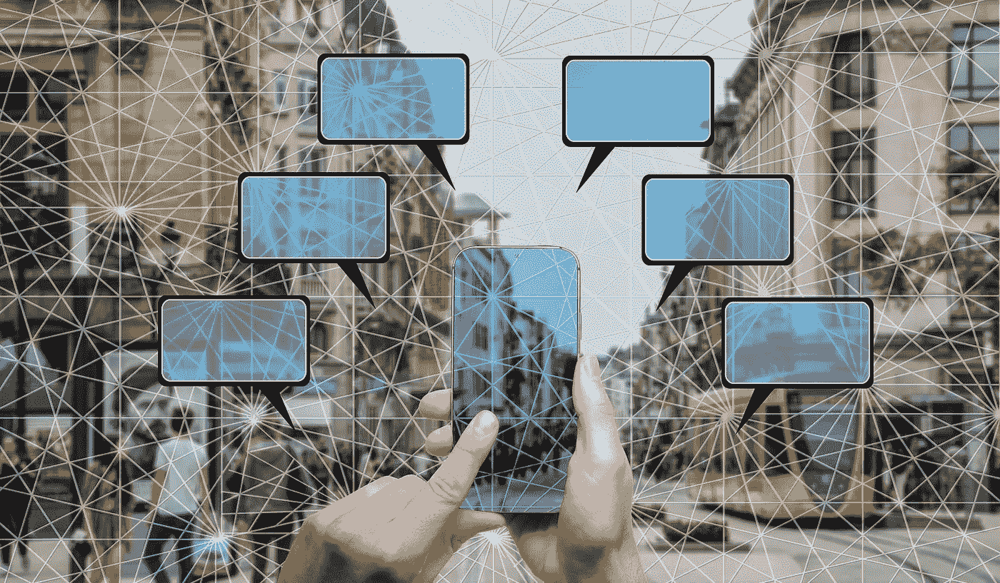

# 如何利用 Masternode 跑马圈地获得被动收入

> 原文：<https://medium.com/coinmonks/how-to-make-passive-income-with-masternode-staking-9d261c95110d?source=collection_archive---------0----------------------->

Masternodes are likes the hubs of a blockchain network that verify transactions and write them to the blockchain to make it even more secure and tamper-proof. With each successive block of data added to the previous, the string of information spread across the globe makes a blockchain incredibly difficult to hack. The more nodes, the more secure.

在你的个人资料被一个小众社区搜刮之前，你还没有真正活过。但是你知道吗？我很高兴他们这么做了。让我解释一下…

我的网站*旨在分享我所知道的如何在网上赚钱，具体来说，就是源源不断的被动收入——那种你不必为之工作的收入。不幸的是，我能放在那个网站上的东西仅限于…*