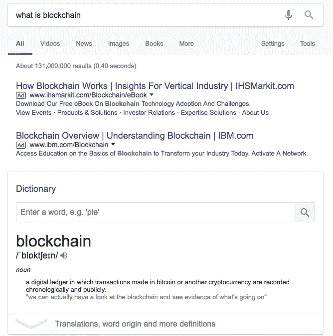
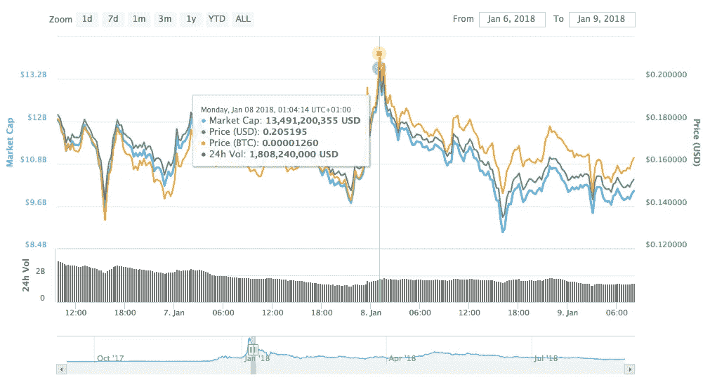

# 如何用密码赚到你的第一个十亿

> 原文：<https://medium.com/coinmonks/how-to-make-your-first-billion-in-crypto-d351322b7ad0?source=collection_archive---------6----------------------->

如果你用谷歌搜索“区块链是什么？”，这是你可以在互联网上找到的答案——“一个数字账本，用比特币或另一种加密货币进行的交易按时间顺序公开记录。”

然而，今天我在这里不是为了给你们讲解“区块链”和“加密货币”的基础知识。在这个行业工作了将近五年，我经历并学到了很多东西，所以今天我在这里谦卑地分享我作为一个五岁的加密女孩/婊子从我周围不同的人那里学到的经验。

或者你可以把这篇文章叫做“如何向别人借一只鸡来下我自己的蛋”或者“当到处都是贪婪的投机者的时候，你如何把他们口袋里的钱拿出来？”

**第一课:你的区块链白皮书**

建立一个好的布局是这个区块链游戏最关键的部分。回顾所有那些“成功”的 ICO 项目，他们的一个共同点是，他们甚至在开始项目之前就已经规划好了完美的布局。

白皮书是 ICO 中最重要的东西？… **其实那是扯淡**。你的白皮书的内容都只是 ctrl+C 和 ctrl+V。白皮书只是一些有文字的纸。最重要的是，少即是多——事实上，风投们根本不在乎！

谁是这个行业中白皮书游戏玩得最好的人？李笑来先生。你可能不认识他，但你一定知道如何谷歌。

李先生去年分叉了比特币，他分叉的币叫“超级比特币(SBTC)”。SBTC 既没有官方网站，也没有白皮书。拜托，那又怎样？哥们绝对是个玩家，这才是我们需要学习的。

中国有句话叫“没有策略比任何策略都好”。我坚信这是区块链这个行业中每个 CEO 都应该运用的最佳商业策略。

**第二课:主宰你的社区——或者，你的派对屋**

好吧，如果白皮书不重要，那什么重要？

没错！**令牌分发**！

比如说有这个 token/shitcoin，分发量是 1000 亿。然而，该团队将其中的 500 亿保存到了一个地址，只向那些零售“投资者”发放了 9%的代币。

如果你们中的任何一位首席执行官能够走到这一步，那么恭喜你们！你已经跑完了马拉松的一半，金牌在等着你！

你已经读到这里，所以不要告诉我你不知道控制大多数代币的真正原因是——支配代币在市场上的价格。

现在你的路线图已经确定，你可以坐下来，开始在推特上向你的社区/粉丝/追随者/傻瓜/金鱼表达“正能量”(我会在第四课解释为什么我称它们为金鱼)——无论你想怎么称呼它们。通常，大部分的能量来自重复的咒语，如“你是你自己的银行”，“摧毁传统的金融系统”，“真正的银行革命”，“去中心化是金融的未来”，“第四次工业革命”等，因为这些是区块链行业最时髦的信仰，每个人都向他们鞠躬，好像他们是神圣的教义。

看看这张美丽的图表——特别是如果你知道如何实际操纵它的起伏，你会发现它是世界上最美丽的东西。

在过山车时期，无数超级英雄无畏地投入市场，帮助这位 28 岁的 CEO 连续 19 天每天套现 2 亿，并以 120 亿日元退出。你能成为那样一个坏坏的年轻企业家吗？出去抽吧！

**第三课:不耻下问，不要害怕争论**

在上一课中，我提到令牌分发非常重要。在这节课中，我想分享区块链最重要的东西——营销和开发。你应该永远记住这个事实——即使是那些讨厌你、反对你、不同意你的人，也能给你带来追随者，帮助你扩大你的社区，成为你的追随者。只要这个人比你出名，比你有更多的追随者。去吧！给它们贴上标签，哈希标签——在区块链的圣杯字典里没有也不应该有这个“羞耻”的词。

是的，这就是我被打碎的[眼镜蛇](https://twitter.com/CobraBitcoin)那天让我成为一个辣妹，也让我获得了几百个追随者。谢谢眼镜蛇！

第四课:寻找新的金鱼——或者重新使用旧的

每个人都知道金鱼的记忆只能持续三秒钟。在这个信息不对称的市场中，他们在这场游戏中是无能为力的。我可以预测他们的命运——泡沫。

因为这种短暂的记忆，那些金鱼永远不会记得他们最后一个令牌被打破时所遭受的痛苦。当他们再次看到鱼食时，他们就会来。所以我们唯一需要做的就是找到那些新的金鱼，因为总会有新的金鱼，因为“贪婪是好的”。金鱼最大的好处是你可以继续向你已经有的金鱼扔食物。

在今年的熊市中，我感觉到很多金鱼已经忘记了它们的痛苦，正在等待下一次开始投入更多资金的机会。我闻到了！

我希望所有那些目前参与传统制造业，建设互联网经济，保持古典气质的企业家，都能体会到这些新时代积累财富的法则。毕竟，这个行业每天都有很多成功的白手起家的亿万富翁的故事发生。别告诉我你对钱不感兴趣！

> [在您的收件箱中直接获得最佳软件交易](https://coincodecap.com/?utm_source=coinmonks)

