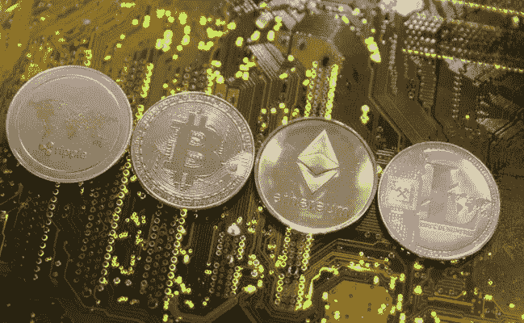

# 如何制作自己的加密货币

> 原文：<https://medium.com/coinmonks/how-to-make-your-own-cryptocurrency-e1146cb1d11e?source=collection_archive---------2----------------------->

创建自己的加密货币并不难。互联网上有很多指南，但不幸的是，它们并不总是容易遵循。至少如果你对这个过程有点熟悉的话。

在 2020 年上半年，当疫情还是一个新生事物的时候，我在家完成了大部分的学习和工作，我比以前拥有更多的空闲时间。我很好奇你如何制作自己的加密货币，以及你可能用它们做什么。我发现很多我在网上找到的指南很难遵循，很多时候我根本没有让它们发挥作用。因此，现在我将尝试制作一个简短的指南，填补我认为其他指南的空白。

***本文已永久移动，可在此免费阅读全文:*** [**智能合约简介**](https://www.creepybits.bet/an-introduction-to-smart-contracts/)

> ***本文已永久移动，可在此免费阅读全文:*** [***智能合约简介***](https://www.creepybits.bet/an-introduction-to-smart-contracts/)

如果你喜欢你读到的内容，欢迎你通过下面的选项来表达你的支持。

任何人都可以通过 my [PayPal](https://paypal.me/ZannoJacklin) 或向以下任何一个地址发送加密货币来表达他们的支持。

比特币地址:**BC 1 q 3 yweqw 6 dvdr DJ 999 prmuxzuw 6y 6 C3 Sam 3 e 2 PAC**

Litecoin 地址:**ms 6 nu 4 e 4r w6 z 5z 53 fy 2 TF 6 fvkxeawr 4 szt**

ETH/BSC 地址:**0x 662 BD 246 ebb 857 f1 ab 368500527 c 54 ef 0 b 864 BD 8**

联系人:zanno@creepybits.org

> 加入 Coinmonks [电报频道](https://t.me/coincodecap)和 [Youtube 频道](https://www.youtube.com/c/coinmonks/videos)了解加密交易和投资

## 也阅读

 [## 杠杆代币[多头代币]终极指南

### 杠杆化令牌是具有杠杆化风险敞口的 ERC20 令牌，不考虑保证金、要求、管理…

medium.com](/coinmonks/leveraged-token-3f5257808b22)  [## 最佳加密交易所| 2021 年十大加密货币交易所

### 编辑描述

blog.coincodecap.com](https://blog.coincodecap.com/crypto-exchange)  [## 2021 年最佳加密交换平台| CoinCodeCap

### 编辑描述

blog.coincodecap.com](https://blog.coincodecap.com/best-swap-platforms)  [## 2021 年最佳加密借贷平台| 6 大比特币借贷平台

### 获得比特币和其他加密货币的最佳贷款利率

medium.com](/coinmonks/top-5-crypto-lending-platforms-in-2020-that-you-need-to-know-a1b675cec3fa)  [## 2021 年 6 大最佳硬件钱包|顶级加密硬件钱包[更新]

### 最好的加密货币硬件钱包是绝对必要的。我们将在 NGRAVE、Ledger Nano X 和…

medium.com](/coinmonks/the-best-cryptocurrency-hardware-wallets-of-2020-e28b1c124069)  [## 2021 年最佳免费加密交易机器人

### 2021 年币安、比特币基地、库币和其他密码交易所的最佳密码交易机器人。四进制，位间隙…

medium.com](/coinmonks/crypto-trading-bot-c2ffce8acb2a)  [## 最佳 4 个加密交易信号电报通道

### 这是乏味的找到正确的加密交易信号提供商。因此，在本文中，我们将讨论最好的…

medium.com](/coinmonks/best-crypto-signals-telegram-5785cdbc4b2b)  [## 获取信号、交易机器人和套利

### 在本文中，我们将讨论 bits gap——一个满足您所有交易需求的一站式加密交易平台…

blog.coincodecap.com](https://blog.coincodecap.com/bitsgap-review)  [## 40 个最佳电报频道，用于加密、电影、表演和演讲| CoinCodeCap

### 编辑描述

blog.coincodecap.com](https://blog.coincodecap.com/best-telegram-channels)  [## 5 个最佳社交交易平台[2021] | CoinCodeCap

### 编辑描述

blog.coincodecap.com](https://blog.coincodecap.com/best-social-trading-platforms)