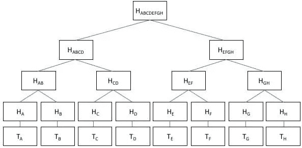

# 如何手动验证一个比特币块的 merkle 根(命令行)

> 原文：<https://medium.com/coinmonks/how-to-manually-verify-the-merkle-root-of-a-bitcoin-block-command-line-7881397d4db1?source=collection_archive---------7----------------------->

我们再来一次！(参见[如何手动验证块哈希](/@jordan.baczuk/how-to-manually-verify-the-hash-of-a-bitcoin-block-command-line-80c71d4c50f2))获取类似文章

Source: Investopedia

# Merkle 树

哈希树是一种哈希树[通常是二叉树]，其中的叶子是例如一个文件或一组文件中的数据块的哈希[1]为什么不直接散列所有的数据呢？因为它是…