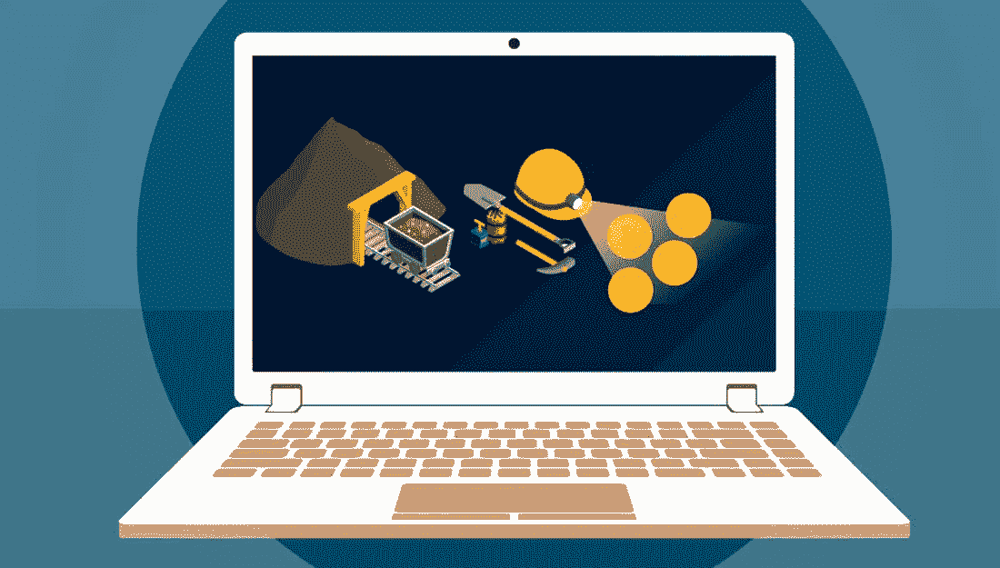
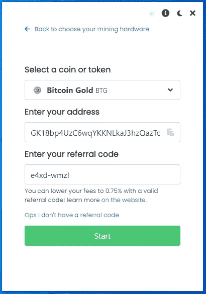
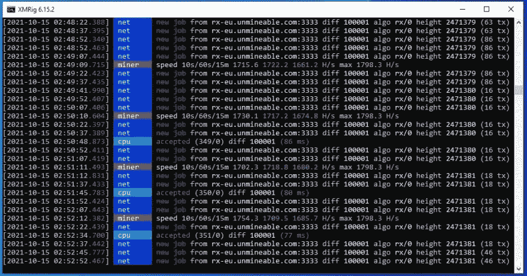

# 2021 年如何用笔记本电脑开采比特币 BTC

> 原文：<https://medium.com/coinmonks/how-to-mine-bitcoin-btc-with-a-laptop-in-2021-56ab8164fc60?source=collection_archive---------3----------------------->



一步一步的指南池挖掘比特币 BTC 在 2021 年与 CPU 或 GPU！

有时挖掘对于普通计算机用户来说似乎太复杂了，所以我想整理一个快速指南，让你对挖掘加密货币特别是 BTC 感到兴奋。

使用本指南，任何人都可以用任何笔记本电脑在 5 分钟内开始挖掘比特币 BTC，无论你的技术技能水平如何，你都可以增加你的加密知识，并从今天开始用你的 CPU 和 GPU 挖掘 BTC！！

现在让我们开始吧！！

**第一步:**准备一个钱包和一个公共地址，这样你就可以在区块链为你想要开采的硬币获得资金。

使用您的币安帐户、Crypto 或 Guarda 钱包。如果您没有帐户，请通过下面的链接创建帐户。

[币安](https://accounts.binance.com/en/register?ref=K5XIYGD8)
[Crypto.com](https://crypto.com/app/az7qh3qye4)
[瓜达](https://grd.to/ref/GcgX)

其他选项可能包括*原子钱包*、*出埃及记*、*信任钱包*。

**第二步:**下载不可开采的矿工软件

在下载文件之前，在 Windows Defender、防病毒软件和浏览器中设置一些文件夹排除，这样你就可以下载文件，而不会受到危险文件通知的困扰。

官方的无敌软件可以从这个网站下载:[无敌下载](https://www.unmineable.com/miner)

下载 MFI 版本(包括矿工文件)。

不可挖掘的软件只是一个可执行文件，它已经包含了所有的配置，所以这是最好的和最容易的方式来挖掘 BTC。

**在 windows 中以管理员身份运行文件。**

当您运行它时，它看起来就像这样:


可以选择 GPU 卡或者 CPU。

这将带你进入第二个屏幕，在那里你将输入你的比特币 BTC 地址和**代码，这将允许你把你的开发费从 1%降到 0.75%** 。

使用代码: **e4xd-wmzl** 将您的开发费用从 1%降至 0.75%(这有所不同)。

您的屏幕应该是这样的:



单击开始按钮后，您应该会看到一个类似的屏幕:


此时，我建议您单击底部的选项来显示日志(看起来像一张纸)，这里单击强制停止。

然后点击设置图标(看起来像一个齿轮)，在弹出的屏幕中你要仔细检查几件事情:

1.  确保选择的算法是 etcash 如果您使用 4GB 卡进行挖掘，使用 ETHASH 用于 6GB 或更大的卡，如果您选择了 CPU，一切都准备好开始挖掘，不需要选择任何东西。
2.  确保代码 **e4xd-wmzl** 显示在推荐框中(推荐，非强制)。
3.  为您的员工(您从中进行挖掘的计算机)设置一个名称。
4.  将你的挖掘强度设置为最高，我建议你在不使用电脑的时候使用高强度。

它看起来像这样:


点击保存和重启按钮开始挖掘！！

一旦它开始，你可以检查你的图形卡的速度，显示为当前的哈希值。

你也可以点击右上角的统计按钮，直接转到 Unmineable 网站，在那里你可以检查你的余额，并要求手动支付。

**注意:**建议您更改 Windows 中的一些设置，有人会禁用更新，还会禁用睡眠模式、休眠或任何可以在电脑不使用时关闭电脑的功能。

使用笔记本电脑时，确保它有一些电池或插上电源，这样它就不会关机。

恭喜，如果你正在使用不可采矿，你现在是一名矿工了！！

如果你想对采矿软件和配置有更多的控制，那么你可以下载矿工和手动设置它们。

**对于那些用 CPU 采矿的人来说，你可以遵循下面的:**

请访问 xmrig 网站下载最新版本(MSVC)或从官方 github 资源库下载:

[https://github.com/xmrig/xmrig/releases](https://github.com/xmrig/xmrig/releases)

一旦你下载了最新版本，你必须编辑一个名为“pool_mine_example.bat”或“start.com”或“start.bat”的文件，在这个文件中你需要修改 2 行。

*如果文件不存在，您必须创建它*

它可能看起来像这样:

```
cd %~dp0
xmrig.exe -o rx.unmineable.com:3333 -u BTC:GK18bp4UzC6wqYKKNLkaJ3hzQazTc3TWBw.wrkID#e4xd-wmzl -p x
pause
```

在-o 之后的第二行中，您可以看到池 URL，在这种情况下，根据您的位置，您只需使用以下 URL 之一(选择离您的位置更近的一个)。

**美国:**rx-us.unmineable.com:3333
欧洲:rx-eu.unmineable.com:3333
亚洲:rx-asia.unmineable.com:3333

然后，第三行是你将输入你的钱包的公共地址(在步骤 1 中复制)，把它放在 BTC 之后:和第一个点之前。

地址的一般结构需要是:

【硬币】:【钱包地址】。[worker id]#[降低采矿费用的代码]

workerID 是您希望为运行 miner 的每台计算机指定的任何名称，以便稍后在池统计信息下可以很容易地识别它。

**#后面的代码很重要**因为用那个代码采矿会把采矿费从 1%降到 0.75%(有区别)。你可以使用那个代码 **e4xd-wmzl** 开始采矿。

以管理员身份运行该文件。



如果一切顺利，你现在运行 XMRig，正在采矿。恭喜你。！

**对于那些用 GPU 采矿的人:**

我会推荐你去弄:Teamredminer (AMD 卡)，Phoenixminer (AMD/NVIDIA)或者 Trex (Nvidia)。

从官方网站下载这些矿工:

*   凤凰矿工:[比特币对话论坛](https://bitcointalk.org/index.php?topic=2647654.0)
*   Teamred miner: [Github](https://github.com/todxx/teamredminer/releases)
*   Trex: [Github](https://github.com/trexminer/T-Rex/releases)

然后用上面 CPU 部分提到的 smilar Start.bat 文件来设置它们。

请注意您需要实现的一些更改:

*   如果你用 4gb 的卡采矿，你需要设置采矿者的算法为 ETCHASH，硬币为 ETC。(检查 miner CLI 参数)
*   如果你用 6gb 或更多的卡采矿，那么你需要把采矿者的算法设置为 ETHAS，硬币设置为 ETH。(检查 miner CLI 参数)

确保也相应地设置池 url:

*   蚀刻:etchash.unmineable.com:3333
*   伊沙什:ethash.unmineable.com:3333

完成后，以管理员身份运行该文件。

**现在你可以登录 Unmineable 查看你的状态:**

Unmineable.com 是一个采矿池，允许你用你的 CPU 使用 RandomX 或 GPU 使用 etcash 或 Ethash 采矿，并支付你选择的任何硬币。


还记得在 Miner starter 文件中设置地址吗？

好吧，在那里你只需要让采矿者知道你想要的硬币，在这个例子中是 BTC，然后是他们转移开采的硬币的地址。

为了检查您的余额，请登录[不可挖掘的](https://unmineable.com/)，然后选择您想要挖掘的硬币。在这个例子中，比特币 BTC。

然后，您可以根据您的算法选择显示 RandomX 或 ETCHAS 或 ETHASH 的选项卡，并在显示“输入您的地址以检查您的统计数据:”的框中输入您的地址。

这样做后，你会看到你的帐户余额，你甚至可以要求付款。

恭喜你，你现在是矿工了！

如果你正在寻找一种方法来获得额外的投资回报，那么我建议你看看这篇文章:

# [2022 年如何购买 Crypto 折 8 返现](/@lumabooks/how-to-buy-crypto-with-10-discount-and-8-cashback-in-2022-4488c1bde8d1)

我推荐下载一些软件来监控你的 CPU 和 GPU 的运行温度，一个好的免费的就是硬件监控器。

尽量不要超过 90 摄氏度以上的温度。如果你用笔记本电脑采矿，更换你的 CPU 的导热膏，清理内部，并为笔记本电脑准备一些排热器。

如果你注意到温度，你的电脑应该会工作得很好，你可以挖掘的硬币数量将取决于你的 CPU 和 GPU 的速度。

对于 GPU 下载微星加力，并设置适当的超频配置文件，以便您可以获得更高的哈希拉特。

> 记得为每枚硬币使用有效的地址，例如，如果你想用 ADA 支付，你需要一个有效的卡尔达诺区块链地址。在此示例中，使用了币安智能链，您将在 BSC 区块链上收到一个蛋糕代币。

*如果你有任何困难，请加入我的讨论，这样我可以进一步帮助你*

【https://discord.gg/KNwsgX7uN5 

如果您正在寻找更多关于 CPU 挖掘的信息，PDF 电子书中有很好的指南，并且是免费的，请访问:


**推荐披露:**

请阅读以下链接中的不可撤销转介政策，以更好地了解转介代码如何详细工作[不可撤销转介](https://www.unmineable.com/referrals)。

> 加入 Coinmonks [电报频道](https://t.me/coincodecap)和 [Youtube 频道](https://www.youtube.com/c/coinmonks/videos)了解加密交易和投资

## 另外，阅读

*   [MoonXBT vs Bybit vs 币安](https://blog.coincodecap.com/bybit-binance-moonxbt) | [Arbitrum:第二层解决方案](https://blog.coincodecap.com/arbitrum)
*   [买 PancakeSwap(蛋糕)](https://blog.coincodecap.com/buy-pancakeswap)|[matrix export Review](https://blog.coincodecap.com/matrixport-review)
*   [最佳免费加密信号](https://blog.coincodecap.com/free-crypto-signals) | [YoBit 评论](/coinmonks/yobit-review-175464162c62) | [Bitbns 评论](/coinmonks/bitbns-review-38256a07e161)
*   [OKEx 回顾](/coinmonks/okex-review-6b369304110f) | [Kucoin 交易机器人](/coinmonks/kucoin-trading-bot-automate-your-trades-8cf0ca2138e0) | [期货交易机器人](/coinmonks/futures-trading-bots-5a282ccee3f5)
*   [AscendEx Staking](https://blog.coincodecap.com/ascendex-staking)|[Bot Ocean Review](https://blog.coincodecap.com/bot-ocean-review)|[最佳比特币钱包](https://blog.coincodecap.com/bitcoin-wallets-india)
*   [霍比审核](https://blog.coincodecap.com/huobi-review) | [OKEx 保证金交易](https://blog.coincodecap.com/okex-margin-trading) | [期货交易](https://blog.coincodecap.com/futures-trading)
*   [比特币基地跑马圈地](https://blog.coincodecap.com/coinbase-staking) | [Hotbit 评论](/coinmonks/hotbit-review-cd5bec41dafb) | [KuCoin 评论](https://blog.coincodecap.com/kucoin-review)
*   [最佳加密交易信号电报](/coinmonks/best-crypto-signals-telegram-5785cdbc4b2b) | [MoonXBT 评论](/coinmonks/moonxbt-review-6e4ab26d037)
*   [Coinswitch 俱吠罗评论](/coinmonks/coinswitch-kuber-review-1a8dc5c7a739) | [电网交易机器人](https://blog.coincodecap.com/grid-trading) | [比特币基地收费](/coinmonks/coinbase-fees-831e77d4f2c5)
*   [Bitget 评论](https://blog.coincodecap.com/bitget-review)|[Gemini vs BlockFi](https://blog.coincodecap.com/gemini-vs-blockfi)|[OKEx 期货交易](https://blog.coincodecap.com/okex-futures-trading)
*   [OKEx vs KuCoin](https://blog.coincodecap.com/okex-kucoin) | [摄氏替代品](https://blog.coincodecap.com/celsius-alternatives) | [如何购买 VeChain](https://blog.coincodecap.com/buy-vechain)
*   [币安期货交易](https://blog.coincodecap.com/binance-futures-trading)|[3 commas vs Mudrex vs eToro](https://blog.coincodecap.com/mudrex-3commas-etoro)
*   [在印度利用加密套利赚取被动收入](https://blog.coincodecap.com/crypto-arbitrage-in-india)
*   [德国最佳加密交易所](https://blog.coincodecap.com/crypto-exchanges-in-germany) | [WazirX P2P](https://blog.coincodecap.com/wazirx-p2p)
*   [如何购买 Monero](https://blog.coincodecap.com/buy-monero) | [IDEX 评论](https://blog.coincodecap.com/idex-review) | [BitKan 交易机器人](https://blog.coincodecap.com/bitkan-trading-bot)
*   [如何在 Bitbns 上购买柴犬(SHIB)币？](https://blog.coincodecap.com/buy-shiba-bitbns)
*   [币安 vs Bitstamp](https://blog.coincodecap.com/binance-vs-bitstamp)|[bit panda vs 比特币基地 vs Coinsbit](https://blog.coincodecap.com/bitpanda-coinbase-coinsbit)
*   [如何购买 Ripple (XRP)](https://blog.coincodecap.com/buy-ripple-india) | [非洲最好的加密交易所](https://blog.coincodecap.com/crypto-exchange-africa)