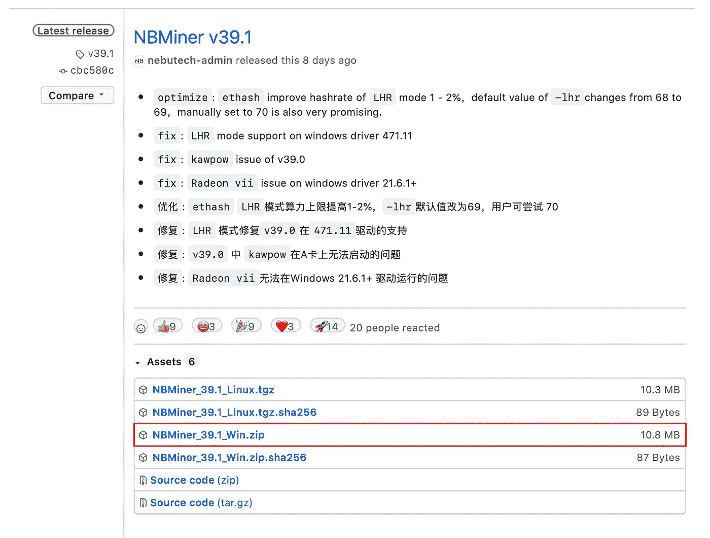
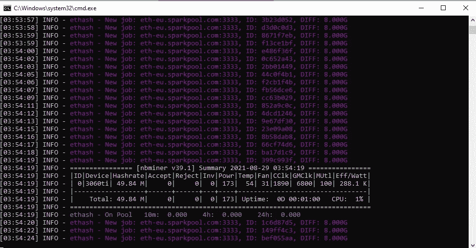
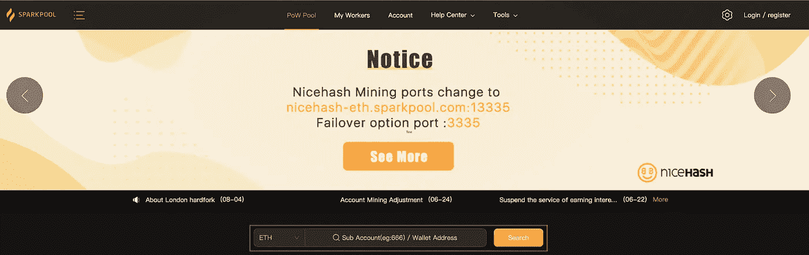

# 如何挖掘加密货币？

> 原文：<https://medium.com/coinmonks/how-to-mine-cryptocurrency-6b3fb85ac2ec?source=collection_archive---------2----------------------->

## 采矿以太坊分步指南

由于目前(2021 年 8 月 29 日)加密货币的价格，开采它们是极其有利可图的。在这篇文章中，我将只关注挖掘以太坊所需的步骤，我假设你已经有了专用的硬件——我将很快写一篇文章来更详细地讨论硬件，并帮助你决定是否应该开始挖掘。同时，如果你很着急，这里有一个很棒的工作站我推荐:[https://amzn.to/2Xl81qF](https://amzn.to/2Xl81qF)。

**1)** 打造一款以太坊钱包。直到现在，我一直使用 [MEW 钱包](https://www.mewwallet.com)。它允许在几分钟内设置一个钱包，这个应用程序很棒。其他钱包都可以。

**2)** 选择一个矿池加入。我正在使用 [SparkPool](https://www.sparkpool.com/en/) ，我强烈推荐它。这是超级容易加入，因为你不需要做什么…你可以匿名开采，因此，不需要注册。您唯一需要做的事情是与挖掘软件通信，您将在 SparkPool 中进行挖掘(下一步将详细介绍)。

我们已经到了第三步，也是最后一步！你需要下载 [NBMiner](https://github.com/NebuTech/NBMiner) 代码。点击项目页面中的[下载链接](https://github.com/NebuTech/NBMiner/releases)，安装 zip 文件(假设你用的是 Windows)。如果您使用的是 Linux，下载 tgz 文件。

当你解压下载的压缩文件夹时，你的杀毒软件可能会删除一些文件，这是一个问题。我建议你在设置时关闭杀毒软件的实时扫描。您可能更喜欢将下载的文件列入白名单。当你成功下载并解压了压缩文件夹后，你就离开矿只有一步之遥了！你会看到一堆。bat 文件是挖掘不同加密货币所需的文件。比如 *start_eth.bat* 是为了挖掘 eth。让我们编辑这个文件，配置它并运行它。打开记事本应用程序，然后从应用程序中打开文件 *start_eth.bat* 。您应该会看到类似这样的内容:

你需要改变两件事。**第一个**，更新后面的-o 标志来表示你的矿池。在我的例子中，我将*stratum+TCP://cn . sparkpool . com:13333*替换为*eth proxy+TCP://eth-eu . spark pool . com:3333*(位于欧洲的 spark pool)。看看这个来自 SparkPool 的快速[教程](https://help.sparkpool.com/hc/kb/article/1413416/?lang=en)就知道你应该根据你的位置使用什么了。**第二个**，更新*0x 4296116d 44 a 4a 7259 b 52 B1 a 756 e 19083 e 675062 a . default*by*your _ ether eum _ wallet _ address*。 *rig_name* 其中*your _ ether eum _ wallet _ address*是您的 **Ethereum** wallet 的地址，而 *rig_name* 是您为自己的装备选择的名称(可以是任何名称)。然后，保存该文件并双击它来启动它。如果一切顺利，你现在应该在挖掘以太坊。

稍等一会儿(大约 10 分钟)，在[sparkpool.com](https://www.sparkpool.com)检查你的数据。

我希望这个故事对你有用。如果你喜欢它，请留下掌声支持我的工作，它将推动其他类似的故事。

*免责声明:我不是财务顾问。以上参考意见，仅供参考。它无意成为投资建议。找一个有正式执照的专业人士寻求投资建议。再者，我只推荐我自己用的产品。这个帖子可能包含附属链接，对你没有额外的费用，我可能会赚一小笔佣金。*

> 加入 Coinmonks 电报频道，了解加密交易和投资

## 另外，阅读

*   [比特币主根](https://blog.coincodecap.com/bitcoin-taproot) | [Bitso 点评](https://blog.coincodecap.com/bitso-review) | [排名前 6 的比特币信用卡](/coinmonks/bitcoin-credit-card-bc8ab6f377c6)
*   [双子座 vs 比特币基地](https://blog.coincodecap.com/gemini-vs-coinbase) | [比特币基地 vs 北海巨妖](https://blog.coincodecap.com/kraken-vs-coinbase)|[coin jar vs coin spot](https://blog.coincodecap.com/coinspot-vs-coinjar)
*   [印度密码交易所](/coinmonks/bitcoin-exchange-in-india-7f1fe79715c9) | [比特币储蓄账户](/coinmonks/bitcoin-savings-account-e65b13f92451) | [Paxful 审核](/coinmonks/paxful-review-4daf2354ab70)
*   [杠杆令牌](/coinmonks/leveraged-token-3f5257808b22) | [最佳加密交易所](/coinmonks/crypto-exchange-dd2f9d6f3769) | [AscendEX 评论](/coinmonks/ascendex-review-53e829cf75fa)
*   [Stormgain 回顾](https://blog.coincodecap.com/stormgain-review) | [Bexplus 回顾](https://blog.coincodecap.com/bexplus-review) | [币安 vs Bittrex](https://blog.coincodecap.com/binance-vs-bittrex)
*   [Bookmap 评论](https://blog.coincodecap.com/bookmap-review-2021-best-trading-software) | [美国 5 大最佳加密交易所](https://blog.coincodecap.com/crypto-exchange-usa)
*   [如何在 FTX 交易所交易期货](https://blog.coincodecap.com/ftx-futures-trading) | [OKEx vs 币安](https://blog.coincodecap.com/okex-vs-binance)
*   [如何在势不可挡的域名上购买域名？](https://blog.coincodecap.com/buy-domain-on-unstoppable-domains)
*   [印度的秘密税](https://blog.coincodecap.com/crypto-tax-india) | [altFINS 审查](https://blog.coincodecap.com/altfins-review) | [Prokey 审查](/coinmonks/prokey-review-26611173c13c)
*   [布洛克菲 vs 比特币基地](https://blog.coincodecap.com/blockfi-vs-coinbase) | [比特坎评论](https://blog.coincodecap.com/bitkan-review) | [币安评论](/coinmonks/binance-review-ee10d3bf3b6e)