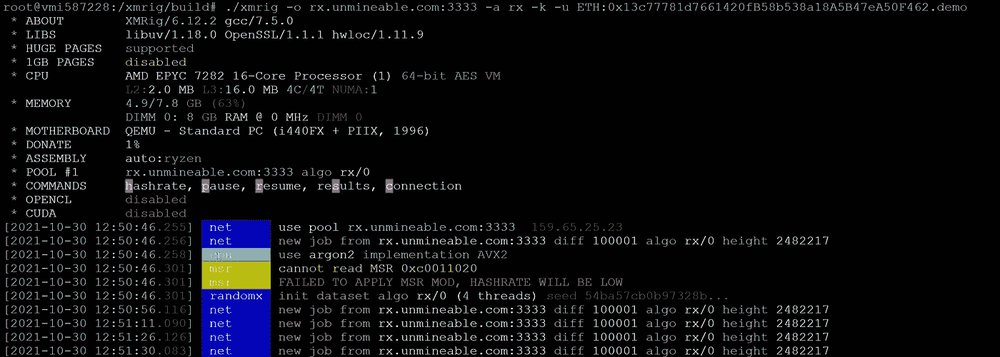
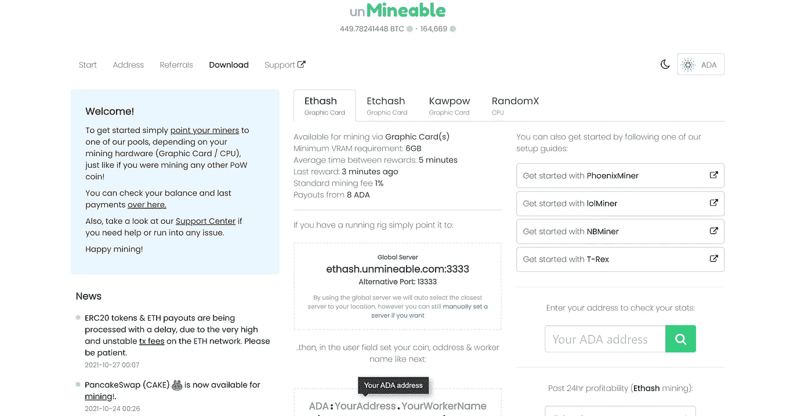
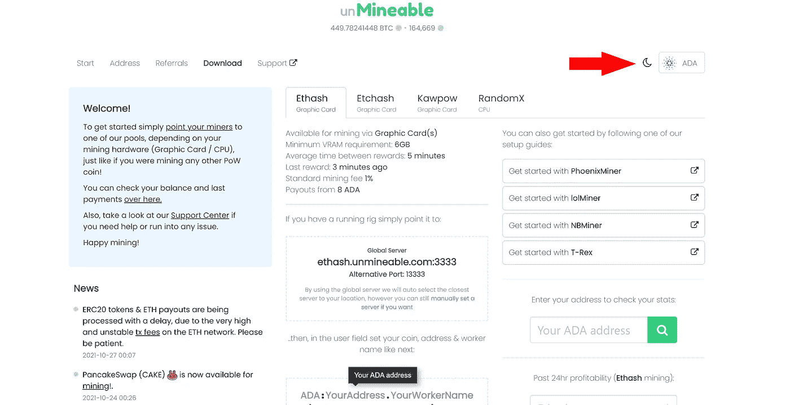
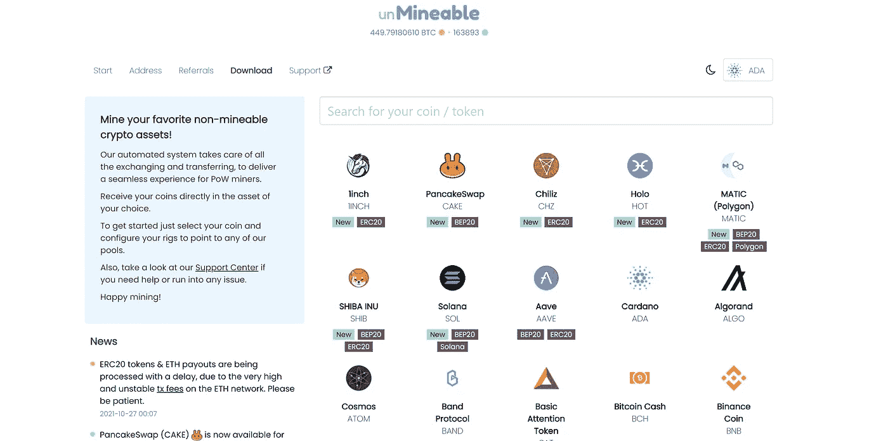
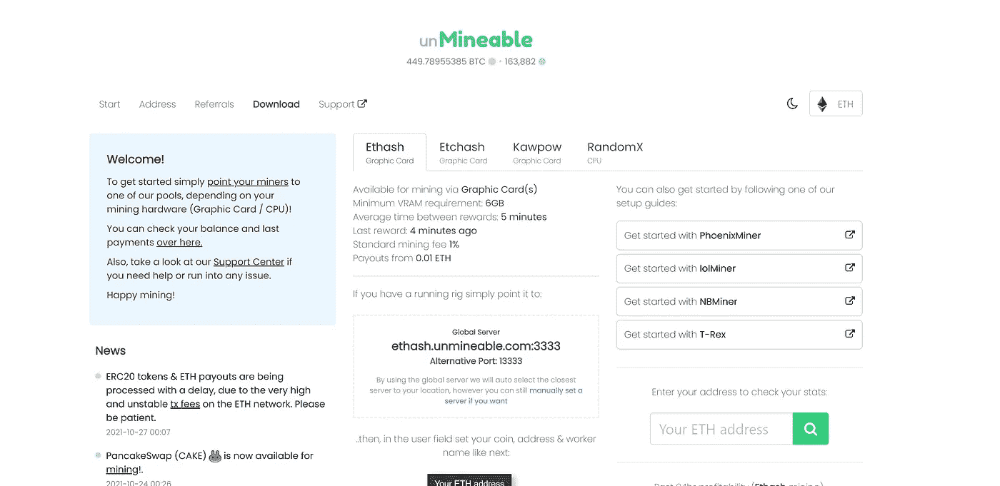
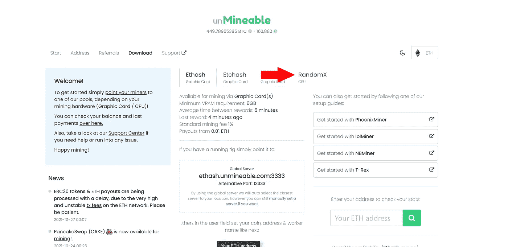
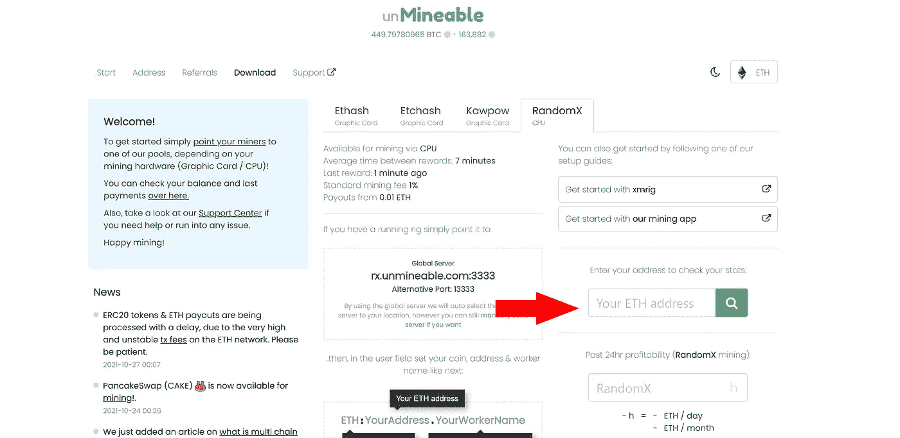
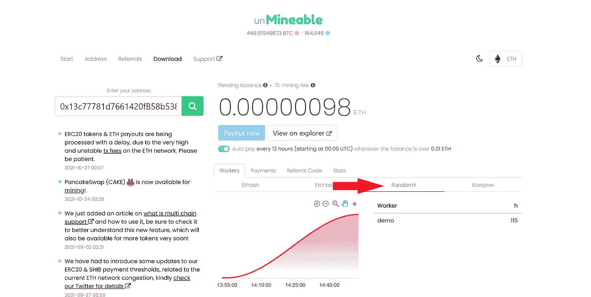

# 当以太网转移到利益证明(PoS)时，如何在 Linux 上挖掘以太网

> 原文：<https://medium.com/coinmonks/how-to-mine-eth-on-linux-when-etherum-shifts-to-proof-of-stake-pos-36d16c82ab5c?source=collection_archive---------3----------------------->

当开采以太网变得非常有利可图时，以太网从工作证明(PoW)到工作证明(PoS)对矿工来说是个坏消息。然而，即使在 PoS 模型下，它们仍然是挖掘 ETH 的混合解决方案。并不总是有利可图的解决方案，事实是采矿是很多加密迷的热情所在。让我们记住，当第一次开采时，BTC 并不有利可图，只是一个你不能购买、出售或交换的数字硬币。然而，历史证明，开采它的人获得了一些现金回报。也就是说，是我的时候了，让我们开始吧！

## 在 Ubuntu 上设置 XMR Miner

为什么选择 Linux Ubuntu？因为它非常便宜、安全、可靠。您需要 root 权限或在命令前使用 sudo。

## 更新 Ubuntu

让我们在您的 Linux 终端上输入:

apt-get 更新&& apt-get 升级-y

## 从 GitHub 安装 XMRIG

按顺序执行下面的命令并键入:

1.  apt-get install git build-essential cmake lib uv1-dev libssl-dev libhwloc-dev

2.https://github.com/xmrig/xmrig.git

3.mkdir xmrig/build & & CD xmrig/build

4.cmake..

5.make -j$(nproc)

## 启动 XMRIG Worker 并将其设为不可使用

类型:

。/xmrig-o rx.unmineable.com:3333-a rx-k-u ETH:0x13c 77781d 7661420 FB 58 b 538 a 18 a5 b47 ea 50 f 462 . demo

其中:

rx.mineable.com:3333 是不可逾越的鸿沟和港口

和

ETH:0x13c 77781d 7661420 FB 58 b 538 a 18 a5 b47 ea 50 f 462 . demo

*(币到我的)* :( *你的钱包地址)*。(*您的工人姓名)*

瞧啊。

看着上面的屏幕，你会注意到一行失败的代码:“未能应用 MSR 模式，HASHRATE 将会很低”。如果您在 vCPU(虚拟 CPU)上运行您的工作器，您将始终收到此 MSR MOD 消息。要运行 MSR MOD，您需要使用专用物理 CPU 进行挖掘。在本教程中，我在带有 vCPU 的 VPS 上运行 worker

## 配置不可挖掘

转到[www.unminable.com](https://unmineable.com)

点击右上角的硬币符号

你将被重定向到硬币列表页面

选择以太网

然后点击 RandomX 选项卡

输入您的 ETH 地址并点击搜索

这可能需要几分钟才能显示出来，但是您的实际工作人员将显示在 RandomX 选项卡下。

## 考虑

*   这本质上是交换，因此 XMR 值越高，ETH 值越低，你赚的 ETH 就越多，典型的配对交易。
*   你也可以使用这种方法通过 Unmineable.com 找到你最喜欢的硬币，这里是可用硬币的列表推荐链接:[https://unmineable.com](https://unmineable.com/?ref=a0vj-p5u9)
*   要将您的 worker 作为后台作业发送，请使用 Linux nohup 命令，参见博客中的示例:[在 Ubuntu 上快速挖掘 XMR！](https://tcoridonjeremie.medium.com/mining-xmr-on-ubuntu-in-a-flash-3d1d0776c337)

挖掘愉快！如果你有任何问题，请随时联系我。

*免责声明:*

*我不是金融顾问，我的博客仅用于教育目的。*

*如果你喜欢这个博客并从中受益，欢迎加密捐款来帮助支持我未来的博客:*

*BTC:BC 1 QM 3 F8 ky 4x cwg 62 nn 9n 9 nx5 dnmtkklehwkhz 5753*

*ETH:0x13c 77781d 7661420 FB 58 b 538 a 18 a5 b47 ea 50 f 462*

*XMR:4 as 1 jsypye 84 b 7 dyd 4 crvdk qjhwxkcy 6 kgc 8 njxcyr 2s d 9 qqlvvdkneke 4 eerdbkrrviutg 1j 8 ce 7 qjujcugw 6 w7 deno*

*ADA:addr 1 q 8 VW 4c T4 zgsv 4 qan 0 nyl cnk 82 gngsqtukyz 43 ms 9 htuthmcatsh 2y 3 QE 2 pmxlxfl 38 VW 53 x 3 qqhevg 9 trhqtwhch 0 ks 8 js 0um*

*SOL:7 evtsvhfzjrdennhmawbk zqmkqi 8 ytv 1 fkj 3g p9 S2 yw 6*

*LTC:lxhgacqmwcr 2 vkuangvf 81 gsfzejvyfjz*

SHIB:0x13c 77781d 7661420 FB 58 b 538 a 18 a5 b47 ea 50 f 462

> 加入 Coinmonks [电报频道](https://t.me/coincodecap)和 [Youtube 频道](https://www.youtube.com/c/coinmonks/videos)了解加密交易和投资

## 也阅读

 [## 最佳加密交易所| 2021 年十大加密货币交易所

### 编辑描述

blog.coincodecap.com](https://blog.coincodecap.com/crypto-exchange)  [## 2021 年 10 大最佳加密贷款平台| CoinCodeCap

### 编辑描述

blog.coincodecap.com](https://blog.coincodecap.com/crypto-lending)  [## 2021 年最佳免费加密交易机器人

### 2021 年币安、比特币基地、库币和其他密码交易所的最佳密码交易机器人。四进制，位间隙…

medium.com](/coinmonks/crypto-trading-bot-c2ffce8acb2a)  [## 最佳 4 个加密交易信号电报通道

### 这是乏味的找到正确的加密交易信号提供商。因此，在本文中，我们将讨论最好的…

medium.com](/coinmonks/best-crypto-signals-telegram-5785cdbc4b2b)  [## BlockFi 评论 2021:利弊和利率| CoinCodeCap

### 编辑描述

blog.coincodecap.com](https://blog.coincodecap.com/blockfi-review)  [## 如何在印度购买比特币？2021 年购买比特币的 7 款最佳应用[手机版]

### 如何使用移动应用程序购买比特币印度

medium.com](/coinmonks/buy-bitcoin-in-india-feb50ddfef94)  [## 加密税务软件——五大最佳比特币税务计算器[2021]

### 不管你是刚接触加密还是已经在这个领域呆了一段时间，你都需要交税。

medium.com](/coinmonks/best-crypto-tax-tool-for-my-money-72d4b430816b)  [## 存储比特币的最佳加密硬件钱包[2021] | CoinCodeCap

### 编辑描述

blog.coincodecap.com](https://blog.coincodecap.com/best-hardware-wallet-bitcoin)  [## Pionex 评论 2021 |免费加密交易机器人和交换

### Pionex 是为交易自动化提供工具的后起之秀。Pionex 上提供了 9 个加密交易机器人…

medium.com](/coinmonks/pionex-review-exchange-with-crypto-trading-bot-1e459d0191ea)