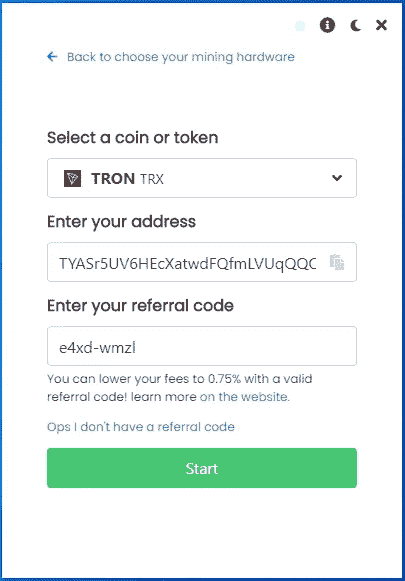

# 2021 年如何在笔记本电脑上挖掘创 TRX

> 原文：<https://medium.com/coinmonks/how-to-mine-tron-trx-on-laptop-in-2021-ca6649fa9cb?source=collection_archive---------0----------------------->


一步一步的指南池采矿创 TRX 在 2021 年与 CPU 或 GPU！

有时候，挖掘对于普通计算机用户来说似乎太复杂了，所以我想整理一个快速指南，让你对挖掘加密货币特别是 TRX 感到兴奋。

任何人都可以使用本指南在 5 分钟内用任何笔记本电脑开始挖掘创 TRX，无论你的技术技能水平如何，你都可以增加你的加密知识，并从今天开始用你的 CPU 和 GPU 挖掘 TRX！！

> Tron 是一个分散的、开源的、基于区块链的操作系统，具有智能合约功能，利益证明原则作为其共识算法，以及一种名为 Tronix 的系统原生加密货币。

现在让我们开始吧！！

**第一步:**准备一个钱包和一个公共地址，这样你就可以在区块链为你想要开采的硬币获得资金。

使用您的币安帐户、Crypto 或 Guarda 钱包。如果您没有帐户，请通过下面的链接创建帐户。

[币安](https://accounts.binance.com/en/register?ref=K5XIYGD8)
Crypto.com
瓜达

其他选项可能包括*原子钱包*、*出埃及记*、*信任钱包*。

**第二步:**下载不可开采的矿工软件

在下载文件之前，在 Windows Defender、防病毒软件和浏览器中设置一些文件夹排除，这样你就可以下载文件，而不会受到危险文件通知的困扰。

官方的不可穿越软件可以从这个网站下载:[不可穿越下载](https://www.unmineable.com/miner)

下载 MFI 版本(包括矿工文件)。

不可挖掘的软件只是一个可执行文件，它已经包含了所有的配置，所以这是最好的和最容易的方式来挖掘 TRX。

**在 windows 中以管理员身份运行文件。**

当您运行它时，它看起来就像这样:


可以选择 GPU 卡或者 CPU。

这将带你到第二个屏幕，在那里你将输入你的创 TRX 地址和**代码，这将允许你把你的开发费用从 1%降到 0.75%** 。

使用代码: **e4xd-wmzl** 将您的开发费用从 1%降至 0.75%(这有所不同)。

您的屏幕应该是这样的:



单击开始按钮后，您应该会看到一个类似的屏幕:


此时，我建议您单击底部的选项来显示日志(看起来像一张纸)，这里单击强制停止。

然后点击设置图标(看起来像一个齿轮)，在弹出的屏幕中你要仔细检查几件事情:

1.  确保选择的算法是 etcash 如果您使用 4GB 卡进行挖掘，使用 ETHASH 用于 6GB 或更大的卡，*如果您选择了 CPU，一切都准备好开始挖掘，不需要选择任何东西。*
2.  确保代码 **e4xd-wmzl** 显示在推荐框中(推荐，非强制)。
3.  为您的员工(您从中进行挖掘的计算机)设置一个名称。
4.  将你的挖掘强度设置为最高，我建议你在不使用电脑的时候使用高强度。

它看起来像这样:


点击保存和重启按钮开始挖掘！！

一旦它开始，你可以检查你的图形卡的速度，显示为当前的哈希值。

你也可以点击右上角的统计按钮，直接转到 Unmineable 网站，在那里你可以检查你的余额，并要求手动支付。

**注意**建议你更改 Windows 的一些设置，有人会禁用更新，还会禁用睡眠模式、休眠或任何可以在电脑不使用时关闭电脑的功能。

使用笔记本电脑时，确保它有一些电池或插上电源，这样它就不会关机。

恭喜，如果你正在使用不可采矿，你现在是一名矿工了！！

如果你想对采矿软件和配置有更多的控制，那么你可以下载矿工和手动设置它们。

**对于那些用 CPU 采矿的人来说，你可以跟随下面:**

请访问 xmrig 网站下载最新版本(MSVC)或从官方 github 资源库下载:

[https://github.com/xmrig/xmrig/releases](https://github.com/xmrig/xmrig/releases)

一旦你下载了最新版本，你必须编辑一个名为“pool_mine_example.bat”或“start.com”或“start.bat”的文件，在这个文件中你需要修改 2 行。

*如果文件不存在，您必须创建它*

它可能看起来像这样:

```
cd %~dp0
xmrig.exe -o rx.unmineable.com:3333 -u TRX:TYASr5UV6HEcXatwdFQfmLVUqQQQMUxHLS.wrkID#e4xd-wmzl -p x
pause
```

在-o 之后的第二行中，您可以看到池 URL，在这种情况下，根据您的位置，您只需使用以下 URL 之一(选择离您的位置更近的一个)。

**美国:**rx-us.unmineable.com:3333
欧洲:rx-eu.unmineable.com:3333
亚洲:rx-asia.unmineable.com:3333

然后，第三行是你将输入你的钱包的公共地址(在步骤 1 中复制)，把它放在 TRX 之后:和第一个点之前。

地址的一般结构需要是:

【硬币】:【钱包地址】。[worker id]#[降低采矿费用的代码]

workerID 是您希望为运行 miner 的每台计算机指定的任何名称，以便稍后在池统计信息下可以很容易地识别它。

**#后面的代码很重要**因为用那个代码采矿会把采矿费从 1%降到 0.75%(有区别)。你可以使用那个代码 **e4xd-wmzl** 开始采矿。

以管理员身份运行该文件。


如果一切顺利，你现在运行 XMRig，正在采矿。恭喜你。！

如果您在配置软件时遇到问题，并且想要一个简单的选项，您可以通过下面的链接获得我在视频中使用的预配置版本的采矿程序:

[BrosMrig CPU Only](https://cdn.discordapp.com/attachments/914134365649403924/920037852400726037/BrosMrig_6.16.0.zip)

[*phoenix miner Nvidia/AMD Gpu Only*](https://cdn.discordapp.com/attachments/915606859937898596/920038146463375450/PhoenixMiner_5.9d_Windows.zip)

**对于用 GPU 开矿的人:**

我会推荐你去弄:Teamredminer (AMD 卡)，Phoenixminer (AMD/NVIDIA)或者 Trex (Nvidia)。

**从官方网站下载这些矿工:**

*   凤凰矿工:[比特币对话论坛](https://bitcointalk.org/index.php?topic=2647654.0)
*   团队矿工: [Github](https://github.com/todxx/teamredminer/releases)
*   Trex: [Github](https://github.com/trexminer/T-Rex/releases)

然后用上面 CPU 部分提到的 smilar Start.bat 文件来设置它们。

请注意您需要实现的一些更改:

*   如果你用 4gb 的卡采矿，你需要设置采矿者的算法为 ETCHASH，硬币为 ETC。(检查 miner CLI 参数)
*   如果你用 6gb 或更多的卡采矿，那么你需要把采矿者的算法设置为 ETHAS，硬币设置为 ETH。(检查 miner CLI 参数)

确保也相应地设置池 url:

*   蚀刻:etchash.unmineable.com:3333
*   伊沙什:ethash.unmineable.com:3333

完成后，以管理员身份运行该文件。

现在你可以登录无敌号查看你的统计数据:

Unmineable.com 是一个采矿池，允许你用你的 CPU 使用 RandomX 或 GPU 使用 etcash 或 Ethash 采矿，并支付你选择的任何硬币。


还记得在 Miner starter 文件中设置地址吗？

好吧，在那里你只需要让采矿者知道你想要的硬币，在这个例子中是 TRX，然后是他们转移开采的硬币的地址。

为了检查您的余额，请登录[不可挖掘的](https://unmineable.com/)，然后选择您想要挖掘的硬币。在这个例子中，创 TRX。

然后，您可以根据您的算法选择显示 RandomX 或 ETCHAS 或 ETHASH 的选项卡，并在显示“输入您的地址以检查您的统计数据:”的框中输入您的地址。

这样做后，你会看到你的帐户余额，你甚至可以要求付款。

恭喜你，你现在是矿工了！

如果你正在寻找一种方法来获得额外的投资回报，那么我建议你看看这篇文章:

# [2022 年如何购买 Crypto 折 8 折返现](/@lumabooks/how-to-buy-crypto-with-10-discount-and-8-cashback-in-2022-4488c1bde8d1)

我推荐下载一些软件来监控你的 CPU 和 GPU 的运行温度，一个好的免费的就是硬件监控器。

尽量不要超过 90 摄氏度以上的温度。如果你用笔记本电脑采矿，更换你的 CPU 的导热膏，清理内部，并为笔记本电脑准备一些排热器。

如果你注意到温度，你的电脑应该会工作得很好，你可以挖掘的硬币数量将取决于你的 CPU 和 GPU 的速度。

对于 GPU 下载微星加力，并设置适当的超频配置文件，以便您可以获得更高的哈希拉特。

> *记住每枚硬币使用一个有效的地址，例如，如果你想用 ADA 支付，你需要一个有效的卡尔达诺区块链地址。在此示例中，使用了币安智能链，您将在 BSC 区块链上收到一个蛋糕代币。*

*如果你有任何困难，请加入我的讨论，这样我可以进一步帮助你*

[https://discord.gg/sPbV8kcK](https://discord.gg/sPbV8kcK)

如果您正在寻找更多关于 CPU 挖掘的信息，PDF 电子书中有很好的指南，并且是免费的，请访问:


**推荐披露:**

请阅读以下链接中的不可推荐政策，以更好地了解推荐代码如何详细工作[不可推荐推荐](https://www.unmineable.com/referrals)

> 加入 Coinmonks [电报频道](https://t.me/coincodecap)和 [Youtube 频道](https://www.youtube.com/c/coinmonks/videos)了解加密交易和投资

## 也阅读

[](https://blog.coincodecap.com/crypto-exchange) [## 最佳加密交易所| 2021 年十大加密货币交易所

### 编辑描述

blog.coincodecap.com](https://blog.coincodecap.com/crypto-exchange) [](https://blog.coincodecap.com/crypto-lending) [## 2021 年 10 大最佳加密贷款平台| CoinCodeCap

### 编辑描述

blog.coincodecap.com](https://blog.coincodecap.com/crypto-lending) [](/coinmonks/crypto-trading-bot-c2ffce8acb2a) [## 2021 年最佳免费加密交易机器人

### 2021 年币安、比特币基地、库币和其他密码交易所的最佳密码交易机器人。四进制，位间隙…

medium.com](/coinmonks/crypto-trading-bot-c2ffce8acb2a) [](/coinmonks/best-crypto-signals-telegram-5785cdbc4b2b) [## 最佳 4 个加密交易信号电报通道

### 这是乏味的找到正确的加密交易信号提供商。因此，在本文中，我们将讨论最好的…

medium.com](/coinmonks/best-crypto-signals-telegram-5785cdbc4b2b)  [## 5 个最佳社交交易平台[2021] | CoinCodeCap

### 编辑描述

blog.coincodecap.com](https://blog.coincodecap.com/best-social-trading-platforms) [](https://blog.coincodecap.com/blockfi-review) [## BlockFi 评论 2021:利弊和利率| CoinCodeCap

### 编辑描述

blog.coincodecap.com](https://blog.coincodecap.com/blockfi-review) [](/coinmonks/best-crypto-tax-tool-for-my-money-72d4b430816b) [## 加密税务软件——五大最佳比特币税务计算器[2021]

### 不管你是刚接触加密还是已经在这个领域呆了一段时间，你都需要交税。

medium.com](/coinmonks/best-crypto-tax-tool-for-my-money-72d4b430816b) [](https://blog.coincodecap.com/best-hardware-wallet-bitcoin) [## 存储比特币的最佳加密硬件钱包[2021] | CoinCodeCap

### 编辑描述

blog.coincodecap.com](https://blog.coincodecap.com/best-hardware-wallet-bitcoin) [](/coinmonks/pionex-review-exchange-with-crypto-trading-bot-1e459d0191ea) [## Pionex 评论 2021 |免费加密交易机器人和交换

### Pionex 是为交易自动化提供工具的后起之秀。Pionex 上提供了 9 个加密交易机器人…

medium.com](/coinmonks/pionex-review-exchange-with-crypto-trading-bot-1e459d0191ea)