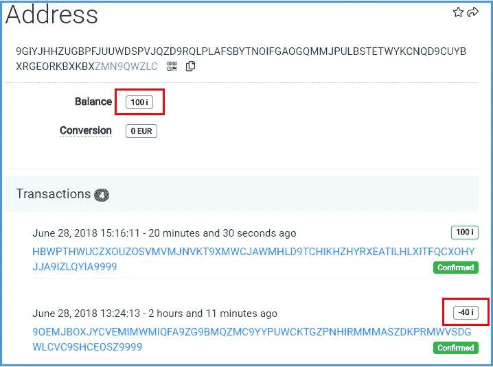

# [已弃用]如何通过重新附加旧包来从已用地址移动 iotas

> 原文：<https://medium.com/coinmonks/how-to-move-iotas-from-a-used-address-by-reattaching-old-bundles-a916f80e64f7?source=collection_archive---------8----------------------->

编辑:

这篇文章的目标是老(前蛹)网络。由于新网络于 2021 年 4 月 28 日启动，它不再有效。

在另一篇文章中([检测到私钥重用—这意味着什么以及如何解冻您的资金](/coinmonks/private-key-reuse-detected-what-it-means-and-how-to-unblock-your-funds-383eeb8ca036))，我解释了为什么您的资金可能会由于密钥重用警告而在 iota 钱包中被冻结。参考文章还描述了如何使用 iota 命令行 wallet (cli wallet)转移您的资金，但这总是会产生资金被盗的风险，因为您实际上必须重复使用受影响地址的私钥。

在这篇新文章中，我想讨论另一种没有任何额外风险的移动 iotas 的选择。它不需要您再次签署任何交易，因此它不发布地址的私钥的任何附加部分。完全没有风险！

## 它是如何工作的？

如果你在一个用过的地址上有资金，这意味着至少已经有一笔汇出交易。iota 协议允许重放相同的事务，而不必再次签名。通过简单地重新附加原始输出事务，iotas 被从使用的地址移动到先前事务的目标地址。不需要重复使用密钥，资金也不会有风险。

## 听起来好得难以置信？

不错，这是事实，但不幸的是，这种选择只适用于某些情况下，并不会帮助所有人。执行起来也有点复杂，所以只有当您对使用 tangle explorers 感到舒适并且对 iota 事务如何工作有基本了解时，才应该尝试这样做。如果您的地址以前只使用过一次，并且被冻结的资金数额不大，您可以使用命令行 wallet 来转移您的资金，如上文所述。无论如何，如果您感到不确定或有任何公开的问题，您可以随时在 iota 的 Discord 服务器上的#help 频道寻求帮助。很明显，我不能对你的资金承担任何责任。

## 为什么它不是对每个人都有效？

当然，每个人都可以这样做，因为底层协议允许这样做，但是在某些情况下，不建议这样做。重要的是要明白，你不能改变原来的交易，你只能重复它。这意味着被阻止的 iotas 将被传送到先前传出事务的原始目标地址。如果你对这个地址没有任何控制权(因为它不是你的),那么你只需要把你的资金送走。此外，很有可能这个目标地址本身也已经被用于发送，所以你只会在另一个使用的地址再次被冻结资金。

## 你要怎么做才能让这个工作成功？

1.  [确定被冻结资金的受影响地址](#20c3)
2.  [识别目标地址](#50a5)
3.  [您需要访问地址](#116c)
4.  [目标地址本身不得有传出交易](#4ae6)
5.  [确保您的地址上至少有原始交易发送时的 iotas 数量](#bd26)

## 1.确定受冻结资金影响的地址

首先，您需要找到实际阻止您的地址。如果你使用三一钱包，这是一个相当简单的任务，因为有一个很好的概述显示您的地址和他们的余额。点击*设置* → *账户管理* → *查看地址*可以找到这个列表(在 Trinity 桌面上使用*账户*菜单)。滚动你的列表，找到一个有资金的用过的地址。使用的地址用红色突出显示，并带有删除的字符。

在上面的截图中，你可以看到地址 [9GIYJ…](https://thetangle.org/address/9GIYJHHZUGBPFJUUWDSPVJQZD9RQLPLAFSBYTNOIFGAOGQMMJPULBSTETWYKCNQD9CUYBXRGEORKBXKBX) 被使用，但仍然有 100 i 在上面。为了保护您的安全，这些类型的资金现在被钱包阻止，因为通过发送新的交易来移动它们将需要重新使用密钥。将受影响的地址复制到文本文件中，以便于使用。

如果你使用的不是 Trinity，而是官方的 GUI 钱包，事情就有点棘手了。这个钱包没有显示地址列表中的余额，这使得识别罪犯更加困难。要找到受影响的地址，你必须手动检查 tangle explorer 中的每个地址。打开历史记录部分，点击地址按钮*。*

**

*从顶部(最新地址)开始，通过单击将其复制到剪贴板。现在把它输入一个纠结浏览器，例如 theTangle.org。*

*如果你的钱包连接到一个同步节点，你应该看到所有使用的地址被删除的文本。首先检查所有使用过的地址，直到你找到一个仍然有余额的地址。*

**

*[show on theTangle.org](https://thetangle.org/address/9GIYJHHZUGBPFJUUWDSPVJQZD9RQLPLAFSBYTNOIFGAOGQMMJPULBSTETWYKCNQD9CUYBXRGEORKBXKBX)*

## *2.确定目标地址*

*识别出受影响的地址后，我们可以查看原始的传出事务。在 tangle explorer 中输入受影响的地址后，单击传出事务(红色框中的负值)，然后单击其 bundle hash 以显示完整的 bundle。为了便于说明，我们将使用截图中的交易( [9OEMJ…](https://thetangle.org/transaction/9OEMJBOXJYCVEMIMWMIQFA9ZG9BMQZMC9YYPUWCKTGZPNHIRMMMASZDKPRMWVSDGWLCVC9SHCEOSZ9999) )及其捆绑包( [PXFXH…](https://thetangle.org/bundle/PXFXHCZWTTDNBKDWJBU9FKVLYPNAUCPIYBBNOQHAHHKHTKPBJQXOGAYGQCUPGFQCRKL9LYLEYXFSWFG9D) )。*

**

*[show on theTangle.org](https://thetangle.org/bundle/PXFXHCZWTTDNBKDWJBU9FKVLYPNAUCPIYBBNOQHAHHKHTKPBJQXOGAYGQCUPGFQCRKL9LYLEYXFSWFG9D)*

*典型的束将在左侧显示一个输入(-40 i)，在右侧显示一个或两个非零值输出。如果您的捆绑包不是这种情况，请先阅读特殊情况部分的相应段落([情况 1:复杂捆绑包](#a357))。*

*右上角的目标地址是 iota(5i)被发送到的地址，第二个值事务(35 i)是去往种子的另一个新地址的余数，因为原始地址上有 40 i。*

## *3.您需要访问该地址*

*现在，您需要记住在您的案例中，当时您将 iotas 发送给了谁。是你控制的地址吗？也许是从你的另一个种子，一个交易所的存款地址或者你信任的朋友的地址？*

*如果你能以任何方式控制它，你可以继续这个过程，如果不能，那么重新附加这个捆绑包对你来说不是一个解决方案，因为你会失去这些资金。*

## *4.目标地址本身不得有传出交易*

*单击目标地址，查看这些地址是否仍未使用。地址以黑色显示，前面有一个箭头。在任何目标地址上都不应该有任何传出的事务。如果你看到外发交易，使用这整个过程不是不可能的，但是它变得更加复杂。阅读 [*案例 2:目标地址已经被使用*](#b418) 在特例部分，看看它是否仍然是你的一个选项。*

**

*[show on theTangle.org](https://thetangle.org/address/TYLZSZAJVDZKVQAGKYVRCEWFERNXXUJFBTGPABZWKGD9ZUVOPJK9RMNDWGSFBRPGA99R9SKKBA9JQFIPZ)*

## *5.确保您的地址上至少有原始交易发送时的 iotas 数量*

*现在回到最初受影响的地址。如果您重复旧的转出交易，您将无法更改此交易的金额。这意味着，如果您看到一个 1 Mi 的传出交易，重新附加该包将再次减少该地址上 1 Mi 的余额。如果你的余额高于这个，你可以重复重新连接，直到没有余额了。*

*如果余额小于外发交易的金额，您可以故意将 iotas 再次发送到该地址，使其与外发金额相匹配。由于 Trinity 和官方 GUI wallet 不允许您向已使用的地址发送邮件，因此您必须使用 iota cli wallet。参见*案例 3:* [*资金不足输入地址*](#afad) 特殊案例部分如何到达。*

*在上面显示的情况中，有一个超过 40 i 的传出事务，而受影响的地址上仍有 100 i。我们可以将旧的包重新连接两次，每次都将 40 i 再次发送到相同的目标地址。在那之后再次尝试将不再起作用，因为地址上只剩下 20 个 I。然而，再向其发送 20 i 将能够确认第三次重新连接，并且该地址将最终为空。*

# *重新连接旧包*

*最后，如果您已经做到了这一步，并确保满足所有的先决条件，那么您可以继续重新挂接这个包。这在钱包中是不可能的，因为该功能不适用于已确认的捆绑包。相反，您可以使用以下网站之一来重新附加旧捆绑包:*

*[pro.iota.fm](http://pro.iota.fm)*

*[tangleTools.org](https://tangletools.org/)*

*[iotarietta . ch](https://www.iotareatta.ch/)*

*要重新附加该包，您需要输入一个散列值。虽然有些网站也可以使用捆绑包散列，但它们通常特别需要尾部事务散列。这是捆绑包中索引为 0 的事务哈希。使用 theTangle.org 时，应该是右上角的交易。*

**

*[show on theTangle.org](https://thetangle.org/bundle/PXFXHCZWTTDNBKDWJBU9FKVLYPNAUCPIYBBNOQHAHHKHTKPBJQXOGAYGQCUPGFQCRKL9LYLEYXFSWFG9D)*

*单击蓝色的事务散列(不是黑色的地址)后，您可以通过简单地单击它旁边的复制图标来复制该散列。*

**

*确保捆绑包中的事务索引为 0。如果不是，您可以使用蓝色箭头浏览该包，直到找到正确的交易。*

*使用复制的散列将该包重新附加到上面列出的一个站点上(此处显示的[tangleTools.org](https://tangletools.org/))。*

**

*重新附加捆绑包后，您可以通过使用相同的网站来推广它，从而增加它获得确认的机会。升级只对新的包有意义，所以您不应该使用以前的相同散列，而是应该找到包的新副本的尾部事务散列。如果你在 tangle explorer 上查看原始包，你会看到第二个副本。检查日期以确保你找到了最新的。导航到其尾部事务哈希，并使用它进行提升。*

*一旦交易被确认，您将看到受影响的地址上的余额又减少了传出交易的金额。如果还有足够的余额，你可以重复重新连接的过程。*

*现在，您受影响的地址是空的，资金被转移到目标地址。钱包现在可以再次免费使用。*

# *特殊情况*

## *案例 1:复杂捆绑包*

*如上所述，一个简单的标准包由一个输入事务和一个或两个输出事务组成。我们将省略签名所需的 0 值交易。*

*但是当然，一个包可能看起来不一样。如果原始交易有必要从多个地址收集输入，以匹配您想要发送的金额，您将在捆绑包中看到多个输入交易。在这种情况下，您仍然可以使用重附属方法，但是重附属的包将只确认所有输入地址是否有足够的余额，与用作输入的数量相匹配。*

*在这种情况下，您可以使用 cli wallet 在所有输入地址中填入适当的金额。详见[案例 3](#afad) 。*

## *情况 2:目标地址已经被使用*

*并非不可能的是，目标地址已经被用于同时发送 iotas。如果你按照描述的重新连接过程，你只需将你的资金发送到其他使用的地址，并再次阻止它们。即使在这种情况下不建议前进，但还是有可能的。如果风险很高，并且你觉得再深入一点就足够了，你可以在 tangle explorer 上跟踪你的 iotas，直到它们到达一个未使用的地址。如果你控制了所有的目标地址，你实际上可以一遍又一遍地重复同样的过程，直到资金到达这些地址。请注意，这不是一个初学者的解决方案，最好先在 iota 不和谐中寻求帮助，然后再尝试继续。*

## *案例 3:输入地址资金不足*

*在大多数情况下，您最终在受影响的地址上获得的 iotas 数量小于传出交易的数量。在这种情况下，可以向其发送 iotas，以精确匹配进行另一次最终重新附加所需的量。不幸的是，这并不像听起来那么简单。*

*一个复杂的问题是，标准钱包(官方 GUI 钱包和 Trinity)有一个内置的检查功能，可以防止你向一个用过的地址发送邮件。因此，您必须使用 iota 命令行 wallet 进行传输，因为它不会阻止您发送到这样的地址。*

*第二个问题是你不能使用当前的种子发送。如果您这样做，您可能会从被阻止的地址发送信息，这将使他们处于危险之中。因为您遵循这种相当复杂的方法的原因是为了避免这种情况，所以您必须为此使用不同的种子。*

*确保在第二个种子上有足够的余额，并使用它将丢失的 iotas 发送到受影响的地址。关于如何安装和使用 cli wallet 的简短教程可以在另一篇文章的[这里](/coinmonks/private-key-reuse-detected-how-to-unblock-your-funds-3d75d182bbf7/#3425)找到。*

*如果您有任何问题或评论，或者只是喜欢阅读这篇文章，请访问并在 iota Discord 服务器上 ping 我。*

*HBMY289*