# 如何将令牌从 Polygon (Matic Network)转移到以太坊区块链(全教程)

> 原文：<https://medium.com/coinmonks/how-to-move-tokens-from-polygon-matic-network-to-ethereum-blockchain-full-tutorial-2f4ebade2e49?source=collection_archive---------0----------------------->

在本指南中，您将学习如何更快且无误地将任何令牌从 polygon (Matic 网络)传输到以太坊区块链。这个过程被分解成任何新手都可以立即理解和应用的方式。

Matic 区块链也被称为多边形网络，它是以太坊区块链的第 2 层解决方案，允许轻松、快速地交换数字资产。很长一段时间以来，以太坊区块链的交易成本一直在持续增加，而且由于其采用水平，交易速度每年都在放缓。

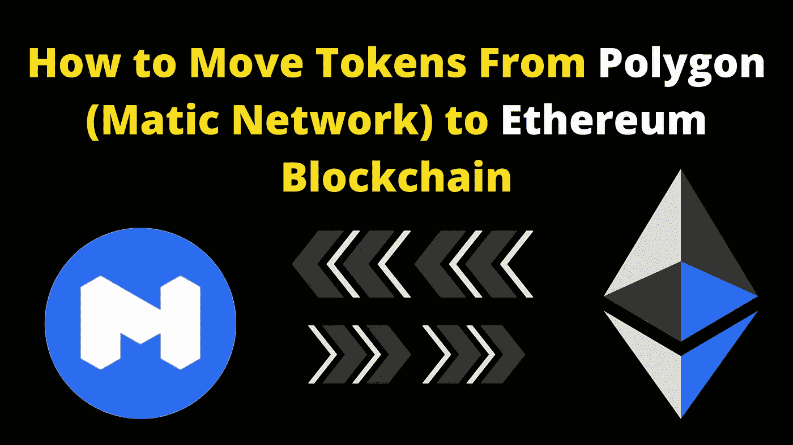

客观地说，当像 Bounty0x 这样的项目代表建立在以太坊区块链上的项目举办加密赏金活动时，向赏金猎人分发令牌需要花费 3000 多美元，因为令牌是 ERC20。这是一笔荒谬的费用。

最近，该平台开始使用多边形桥分发令牌，这将分发成本降低了 99%。当赏金猎人收到这些代币时，他们发现很难使用多边形桥离开以太坊区块链。因此，本教程包含了如何使用多边形桥并在 45 分钟内移动你选择的任何标记的信息。不到一个小时，你就可以把一个令牌从 Matic 移动到以太坊。

## 这是一个如何使用多边形(自动网络)桥的实用指南

**步骤 1:** 访问 polygon 网站，但要确保你的 PC 上安装了 metamask，然后为 Polygon (Matic Network)进行配置。如果你不知道如何做到这一点，阅读完整的教程在这里。

**第二步:**访问截图中看到的[https://wallet . matic . network/log in/](https://wallet.matic.network/login/)，用你的元掩码登录。如果你是第一次这样做，你会在你的钱包里发现一些$Matic，这足够做大约 5 笔交易。

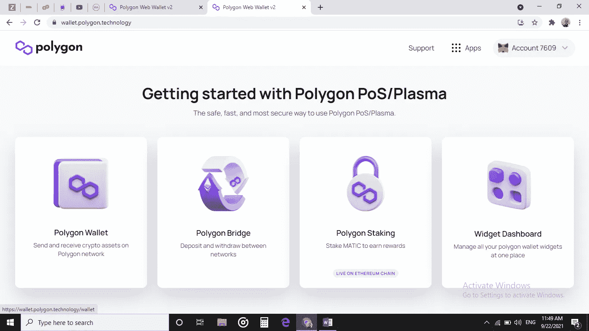

**第三步:**当您看到所有的代币都显示成这样时，请单击您想要移到以太坊区块链的代币右侧的“提取”按钮。

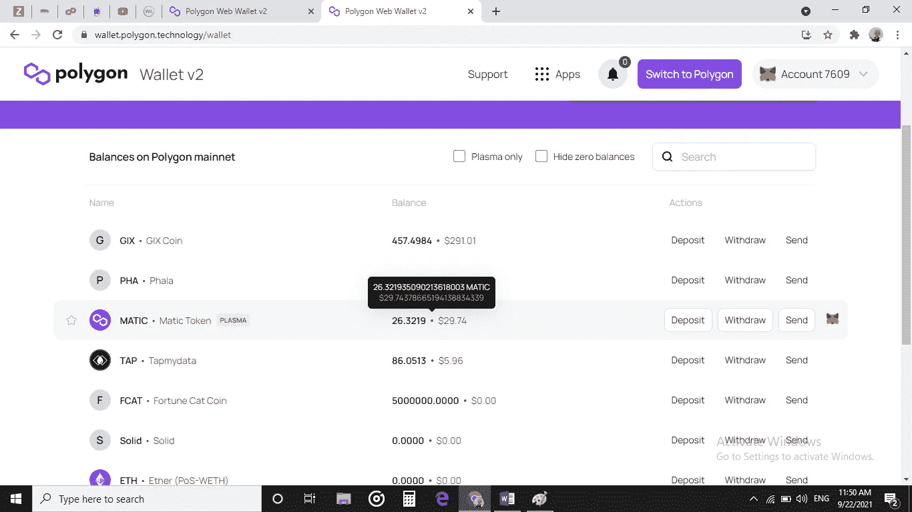

**第四步:**查看以太坊网络费用，确保你有足够的以太作为气费支付，否则你的交易会被拒绝。如果你有足够的乙醚，你可以点击“继续”进行下一步

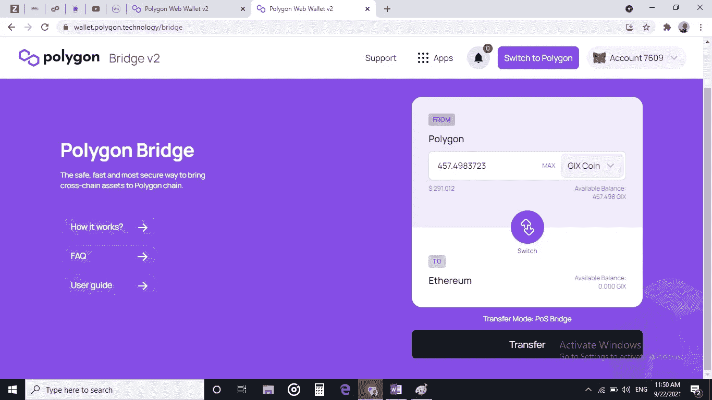

**步骤 5:** 它将显示正在过桥的代币数量，再次检查以确认您移动的数量正确。然后点击“继续”这就要求在 Polygon (Matic Network)上几乎是零费用。

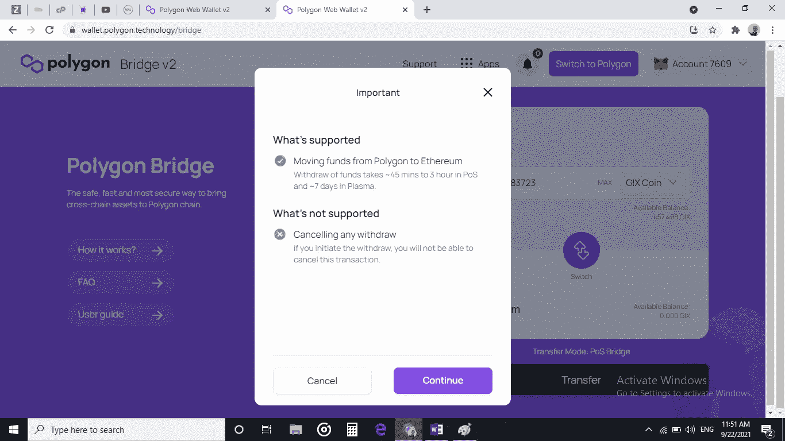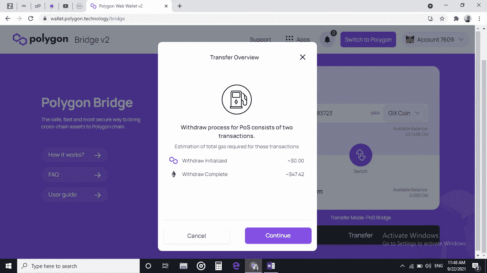

**第六步:**在 Metamask 上确认交易，您将支付约 0.02 美元作为交易费用。

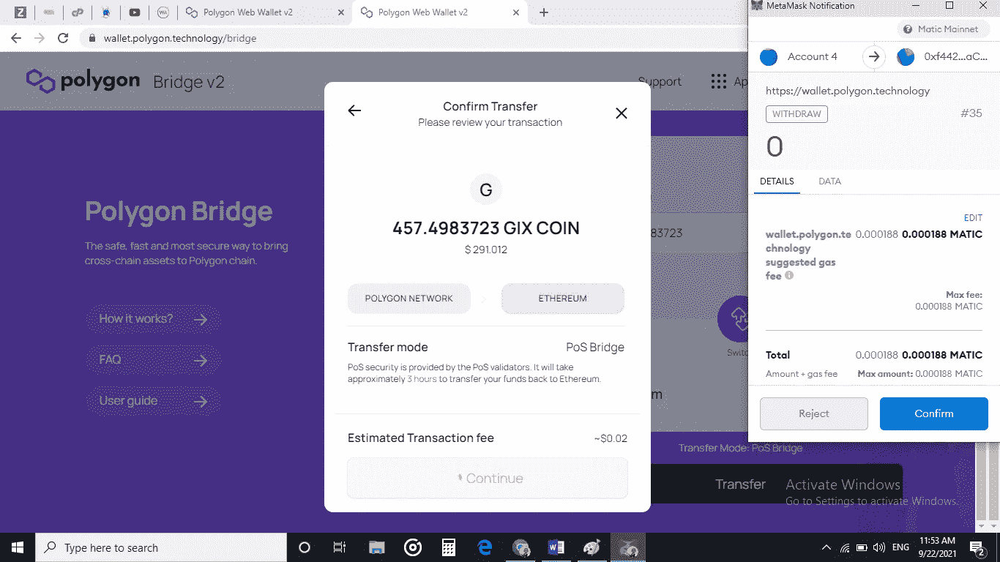

第七步:等待 45 分钟或 3 小时，让 toke 通过桥上的所有检查站

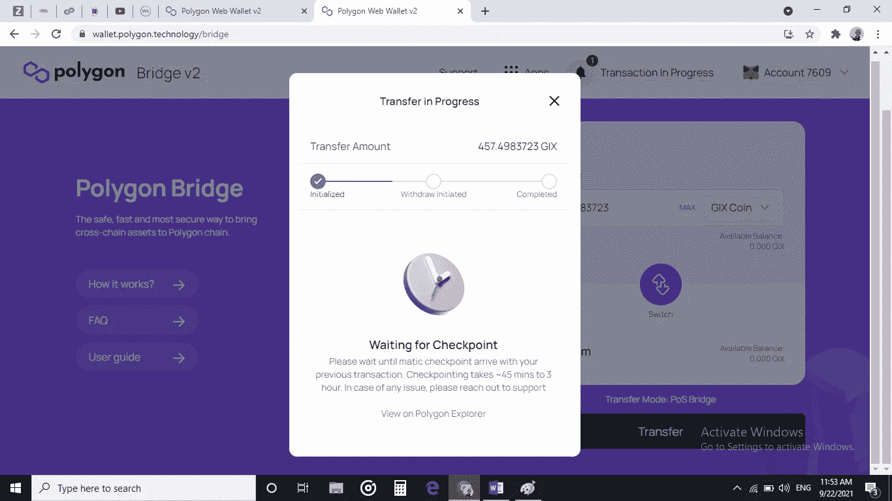

**第八步:**当所有的桥都通过后，你的代币就会到达最后一个该付油费的检查站，这样代币就可以到达最终目的地了。点击“继续”交易费为 42 美元，根据以太坊区块链站的拥堵情况，交易费可能高达 200 美元。

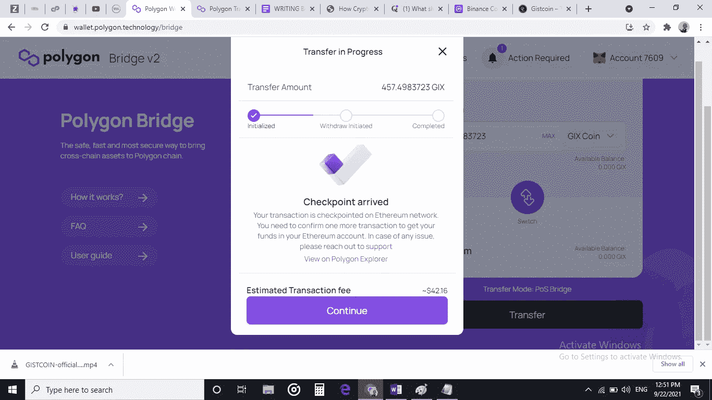

**第九步:**与 Metamast 确认交易

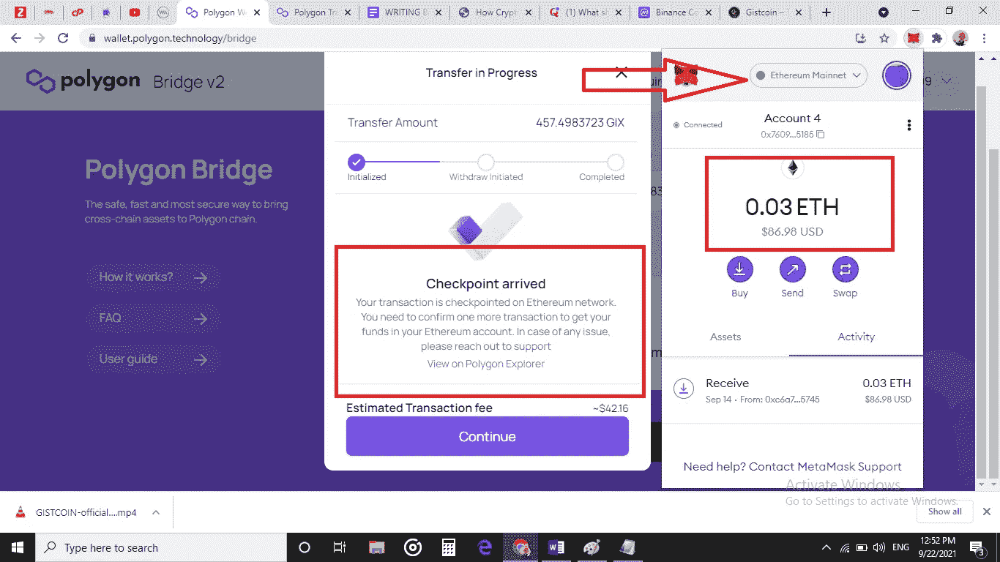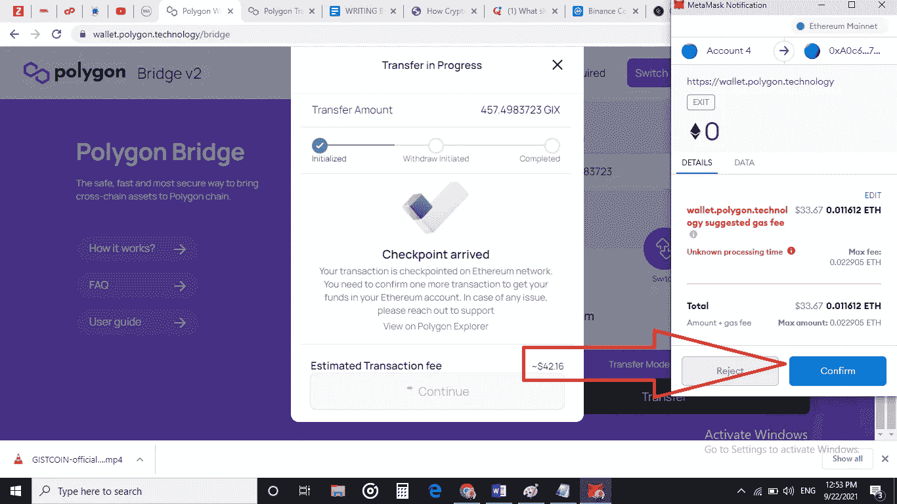

**第 10 步:**等待交易在以太坊区块链得到确认，这可能需要 5-25 分钟

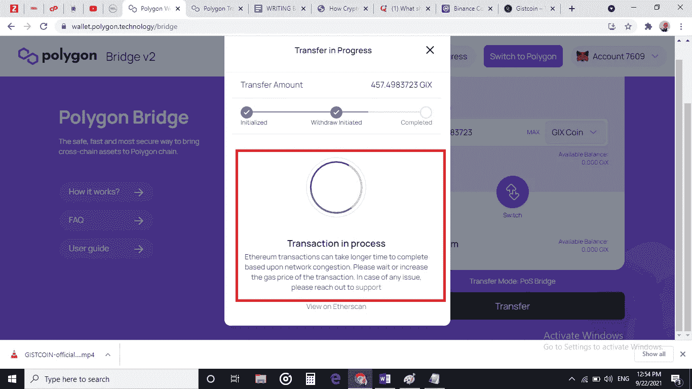

**第十一步:**转账成功完成！检查以太扫描，以确保您的令牌已被移动到以太坊链。

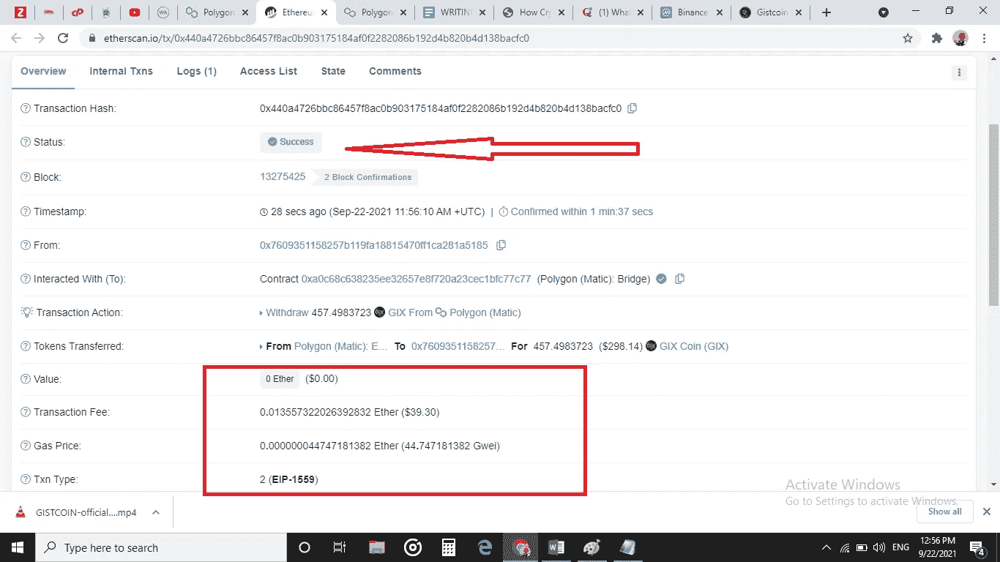

**第十二步:**恭喜你！使用等离子体桥，它已经从多边形(自动网络)移动到以太坊块

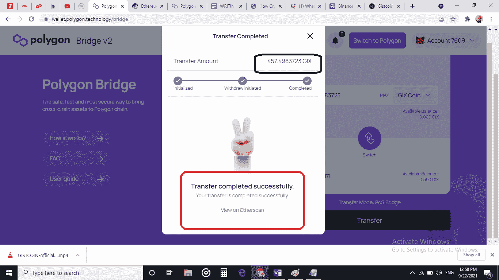

你刚刚学会了如何通过 12 个步骤将任何代币从 Matic 移动到以太坊。

如果这篇文章对你有帮助，请在这里 给我买杯咖啡

**

[**Source**](https://tenor.com/view/coffee-gif-23439328)** 

# **关于作者**

****Ojeniyi Ayobami Abimbola** 自 2015 年以来一直从事加密货币交易，他是区块链的内容创作者，也是 Cryptoniche 的加密教练。你可以和他联系:[https://t.me/cryptoniche_hangout](https://t.me/cryptoniche_hangout)**

**你想一辈子被动收入？在这里阅读他的最后一篇文章 [**！！！**](https://contentking.medium.com/this-undoubtly-the-best-way-to-earn-passive-income-through-cryptocurrency-7ce547cedbe)**

****联系人****

**推特:https://mobile.twitter.com/ojeniyi_ayobami**

**电报:@Crypto_Niche**

**订阅 CryptoNiche 频道:[https://www.youtube.com/channel/UCKS5QfDvvtOMU6_2Fqy59jA](https://www.youtube.com/channel/UCKS5QfDvvtOMU6_2Fqy59jA)**

**订阅我的频道，了解如何在加密货币领域赚钱。**

**我如何建立有利可图的加密货币交易机器人**

**[https://www.youtube.com/watch?v=iJpm3mUOM6k&t = 14s](https://www.youtube.com/watch?v=iJpm3mUOM6k&t=14s)**

**您可能感兴趣的其他视频**

**立即申领价值 183 美元的 ZKS 代币**

**[https://www.youtube.com/watch?v=dOgAwAmq6aY](https://www.youtube.com/watch?v=dOgAwAmq6aY)**

**立即获得免费的通用基本收入令牌**

**https://www.youtube.com/watch?v=JB5nxAWZTJk&t = 1s**

> **加入 Coinmonks [电报频道](https://t.me/coincodecap)和 [Youtube 频道](https://www.youtube.com/c/coinmonks/videos)获取每日[加密新闻](http://coincodecap.com/)**

## **另外，阅读**

*   **[复制交易](/coinmonks/top-10-crypto-copy-trading-platforms-for-beginners-d0c37c7d698c) | [加密税务软件](/coinmonks/crypto-tax-software-ed4b4810e338)**
*   **[网格交易](https://coincodecap.com/grid-trading) | [加密硬件钱包](/coinmonks/the-best-cryptocurrency-hardware-wallets-of-2020-e28b1c124069)**
*   **[密码电报信号](http://Top 4 Telegram Channels for Crypto Traders) | [密码交易机器人](/coinmonks/crypto-trading-bot-c2ffce8acb2a)**
*   **[最佳加密交易所](/coinmonks/crypto-exchange-dd2f9d6f3769) | [最佳加密交易所](/coinmonks/bitcoin-exchange-in-india-7f1fe79715c9)**
*   **开发人员的最佳加密 API**
*   **最佳[密码借贷平台](/coinmonks/top-5-crypto-lending-platforms-in-2020-that-you-need-to-know-a1b675cec3fa)**
*   **杠杆代币的终极指南**
*   **[7 个最佳零费用加密交易平台](https://coincodecap.com/zero-fee-crypto-exchanges)**
*   **[最佳网上赌场](https://coincodecap.com/best-online-casinos) | [期货交易机器人](/coinmonks/futures-trading-bots-5a282ccee3f5)**
*   **[分散交易所](https://coincodecap.com/what-are-decentralized-exchanges) | [比特 FIP](https://coincodecap.com/bitbns-fip)**
*   **[用信用卡购买密码的 10 个最佳地点](https://coincodecap.com/buy-crypto-with-credit-card)**
*   **[加拿大最佳加密交易机器人](https://coincodecap.com/5-best-crypto-trading-bots-in-canada) | [Bybit vs 币安](https://coincodecap.com/bybit-binance-moonxbt)**