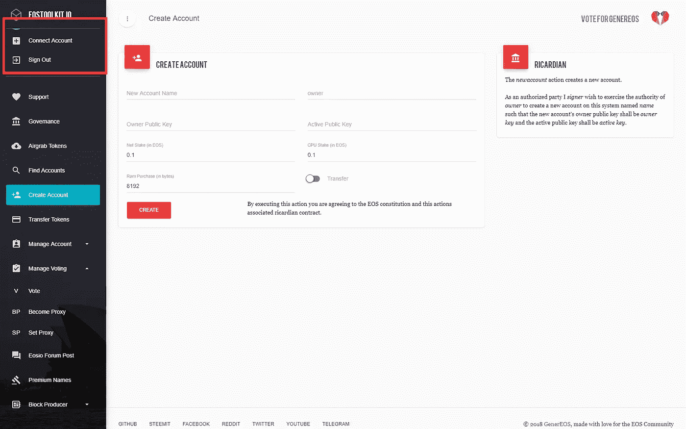
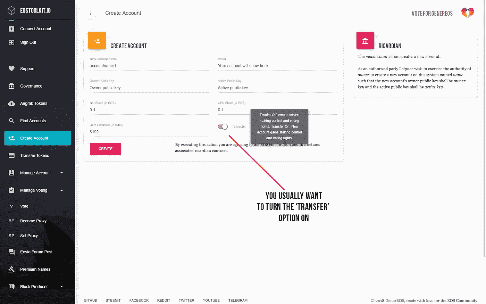

# 如何将您的 EOS 移出交易所并使用它

> 原文：<https://medium.com/coinmonks/how-to-move-your-eos-off-exchanges-and-use-it-bc0f83ea9326?source=collection_archive---------2----------------------->

我能赌我的代币吗？我能投票吗？我会收到空投吗？如果你持有交易所账户中的 EOS，这些问题的答案就是否定的。把你的 EOS 放在一个交易所账户里可能会很方便，但是你将无法充分发挥你的 EOS 的潜力。这就是为什么我们创建了这个指南，它将解释你需要采取的所有步骤来控制你的 EOS。

# 如何开始

如果您正在阅读本指南，您很可能已经将 EOS 放在了交易所中，但您不知道如何将它们从交易所中取出。所以让我们从基础开始。

第一件事，你应该知道之前，试图撤回你的 EOS 到自己的钱包，是 EOS 有一个帐户系统。这意味着您需要在 EOS 网络上创建一个帐户，然后才能从交易所提取代币。

## EOS 帐户如何工作

> 帐户是存储在区块链上的可读名称。根据权限配置，它可以由一个人或一组人拥有。向区块链转账或推送交易需要账户。— [*EOSIO Wiki*](https://github.com/EOSIO/eos/wiki/Accounts%20%26%20Permissions)

每个 EOS 帐户的长度为 12 个字符，包含字符 a-z 和 1–5。EOS 帐户由两个密钥组成，即激活密钥和所有者密钥。活动密钥可用于转移资金、为块生产者投票、购买 ram 等。所有者密钥显示帐户的所有权，需要它来更改帐户的所有权。这个密钥最好(安全地)离线保存，因为在 EOS 网络上做大多数事情都不需要它。

## 如何获得 EOS 帐户

创建 EOS 帐户有多种方法，例如使用 cleos 或使用可用的工具包之一。在本指南中，我们将使用[这个](https://toolkit.genereos.io/home)工具包。要创建新的 EOS 帐户，您需要使用现有的 EOS 帐户。如果您没有现有帐户，您可以使用工具为您创建一个帐户，例如 EOSVibes 的 [EOS 帐户生成器，或](https://eos-account-creator.com/)[Zeos](https://zeos.co/)*使用这些工具风险自担，并始终研究工具是否可信。*

首先，你必须下载一个浏览器扩展。你可以在这里得到散点。[按照说明设置您的分散账户并登录您的分散扩展](https://helpdesk.eostoolkit.io/hc/en-us/articles/360009426951-How-do-I-set-up-and-attach-a-Scatter-account-to-EOSToolKit-)。之后进入[工具箱](https://toolkit.genereos.io/home)，连接你现有的 EOS 账户。

连接帐户后，您可以转到“创建帐户”并填写空白处。您可以使用现有的密钥对作为所有者公钥和活动公钥，也可以在“密钥对”选项卡下的分散位置生成新的密钥对。

我们建议不要更改“净股份”、“CPU 股份”和“RAM 购买”，除非您计划进行大量交易，或者计划积极使用您的 EOS。如果是这种情况，以 10:1 的比率加大对 CPU 和 net 的投入(因为您用完 CPU 的速度会比用完 net 的速度快得多)。为了给你一个应该下注多少的概念，为 CPU 下注 1 EOS 足以每小时进行多个交易。

创建帐户的成本(使用上述设置)可以通过以下方式计算:([当前 RAM 价格/Kb](https://eos.feexplorer.io/))* 3+0.1+0.1 =创建新帐户所需的 EOS 的最小数量。

# 如何提取你的 EOS 到你的帐户

现在你已经创建了一个 EOS 帐户，你可以开始提取你的 EOS 到你的帐户。首先，请确保您仍然能够登录到您的分散扩展。如果仍有可能，继续。

登录您的交易所并搜索取款或余额页面。在本教程中，我们将使用币安。输入您的 EOS 帐户名称，而不是您的*活动*或*所有者*键。你不需要添加备忘录，因为这没有任何作用。在您仔细检查了账户名称后，您可以提交取款。

取款完成后，您可以在 block explorer 上检查 EOS 是否在您的帐户中，例如 [bloks.io](https://bloks.io/) 。如果 EOS 在你的账户里，你就可以开始用了！

# 如何使用你的 EOS

现在您已经成功地将您的 EOS 提取到您自己的帐户，您可以开始使用它了！你可能想知道如何做到这一点，所有的可能性是什么，所以我们将把它们放在一起。

首先，你现在可以在你的账户上接收空投，你不需要做任何事情！

现在，如果你想发送交易，赌注，投票，空中抓取一个令牌，你可以访问一个工具包。下面我们将为您提供入门所需的所有有用指南，它们所在的帮助台是由 Genereos 和 Blockgenic 联合开发的。

## 如何发送交易

[https://help desk . EOS toolkit . io/HC/en-us/articles/360012849792-Transfer-EOS-and-Airdrop-Tokens](https://helpdesk.eostoolkit.io/hc/en-us/articles/360012849792-Transfer-EOS-and-Airdrop-Tokens)

## 如何下注您的代币

[https://help desk . EOS toolkit . io/HC/en-us/articles/360013090031-How-to-Stake-and-un Stake-your-token-on-the-EOS-block chain](https://helpdesk.eostoolkit.io/hc/en-us/articles/360013090031-How-to-Stake-and-Unstake-your-Tokens-on-the-EOS-Blockchain)

## 如何给街区制作人投票

[https://help desk . EOS toolkit . io/HC/en-us/articles/360012862312-How-to-Vote-for-Block-Producers](https://helpdesk.eostoolkit.io/hc/en-us/articles/360012862312-How-to-Vote-for-Block-Producers)

## 如何空中抓取代币

[https://help desk . EOS toolkit . io/HC/en-us/articles/360013714051-How-to-Claim-air grabs](https://helpdesk.eostoolkit.io/hc/en-us/articles/360013714051-How-to-Claim-Airgrabs)

# 如何保护您的 EOS 安全

现在你也熟悉了如何使用你的 EOS，你可以考虑让你的帐户更安全。虽然这不是必需的，但如果您与许多人共享您的 EOS 帐户，持有大量 EOS 或担心您的 EOS 的安全，建议您这样做。

## 多重签名账户

更好地保护你的帐户的第一个选择是把它变成一个多重签名帐户。这意味着，您可以更改您的帐户，需要多个密钥来执行某些与帐户相关的操作，如发送交易、更改所有权、投票等。

你也可以设置不同的权限，这样你就不用用你的*激活*键来投票了比如。

关于如何做的完整指南，请阅读我们关于如何创建自己的多签名帐户的指南:[https://medium . com/block genic/advanced-EOS-multi signature-tutorial-BF 4d a94f 8360](/blockgenic/advanced-eos-multisignature-tutorial-bf4da94f8360)

## 分类帐

另一个让你的 EOS 账户更安全的选择是把你的 EOS 存储在一个分类账设备上。虽然这是安全的，但它限制了 EOS 的可用性。如果你还想学习如何使用你的分类帐来存储你的 EOS，请阅读他们的官方指南:[https://support . Ledger wallet . com/HC/en-us/articles/360008913653-EOS-EOS-](https://support.ledgerwallet.com/hc/en-us/articles/360008913653-EOS-EOS-)

## 我们的社交

[网站](https://blockgenic.website/)
[推特](https://twitter.com/blockgenic)
[Youtube](https://www.youtube.com/channel/UCXTaehuAs3UWKnMVnT71MMQ)
[Meetup](https://www.meetup.com/nl-NL/Seattle-EOS/)
[Steem](https://steemit.com/@block21)

*由* [写成*由*](https://www.linkedin.com/in/yannick-slenter/) *为* [*为*](https://blockgenic.website/)

> [直接在您的收件箱中获得最佳软件交易](https://coincodecap.com/?utm_source=coinmonks)

