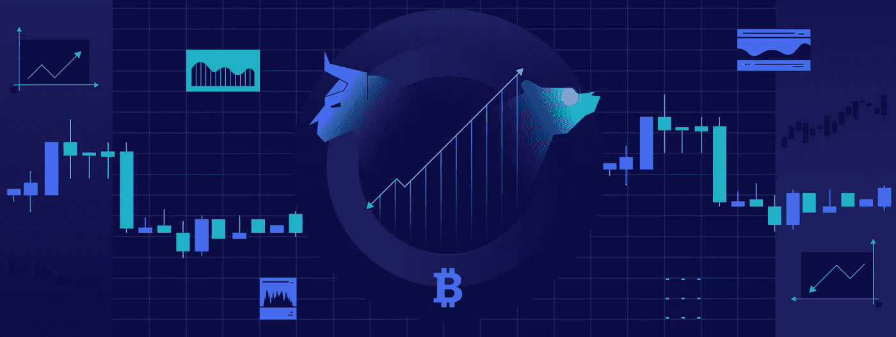

# 如何导航加密牛市和熊市

> 原文：<https://medium.com/coinmonks/how-to-navigate-the-crypto-bull-and-bear-markets-d3af841fb4c6?source=collection_archive---------3----------------------->

How to Navigate the Crypto Bull and Bear Markets

在进行加密货币交易时，您可能会遇到“牛市”和“熊市”这两个术语。无论是证券交易所、房地产还是加密货币，牛市和熊市在定义市场趋势和投资者心态方面都起着至关重要的作用。

简单来说，牛市描述的是上涨趋势，熊市描述的是下跌趋势。市场趋势在很大程度上受到投资者情绪和认知的影响，这种现象被称为[市场情绪](https://www.cryptohopper.com/blog/4198-what-is-crypto-market-sentiment-and-why-does-it-matter)。由于市场情绪和许多其他因素，加密货币在牛市和熊市之间波动，无论是长期市场运动还是短期市场波动。

# 什么是加密牛市？

牛市，通常被称为“牛市”，是一个乐观的市场。这是一个对加密货币的需求超过供应的时期。结果，价格上涨。市场信心高涨，投资者显得乐观或“看涨”。

投资者在这里被称为“多头”。他们相信未来价格会上涨，因此会加大投资。这在市场上创造了一个积极的趋势，因此，更多的投资者进入市场。

牛市可能不会永远持续下去。在任何市场中，都会有短期波动和下跌，价格趋势可能会持续一段时间。它还受到不可预见事件、政府政策、市场情绪等的影响。例如，随着新冠肺炎疫情的爆发，市场遭受了突然的打击，而[见证了](https://www.cnbc.com/2020/03/13/bitcoin-loses-half-of-its-value-in-two-day-plunge.html)价格的急剧下降趋势。当投资者失去信心，为了避免损失，他们开始抛售资产时，这种情况就会发生。这可能会导致价格下跌。

要撬动牛市，宜早交易。在牛市的开始，价格有上涨的趋势。对于交易者，尤其是新手投资者来说，最好是利用这种上升趋势，在价格达到顶峰时卖掉资产。如果他们注意到熊市趋势，最好卖掉不太成熟的加密货币，离开市场。

# 牛市特征

加密牛市将显示以下特征的某种组合:

*   长期可持续的价格上涨
*   巨大的交易量
*   需求增加
*   供应不足
*   乐观的投资者
*   大企业、名人等突然要求秘密投资。
*   价格的小幅下跌
*   好的活动价格大幅上涨
*   高流动性

# 什么是秘密熊市？

在熊市中，供大于求。投资者的信心降低，价格开始下跌。在这种情况下，这里的投资者是悲观主义者，被称为“熊”。他们认为，从长远来看，价格将进一步下跌，并开始出售他们的资产，以避免进一步的损失。

熊市是具有挑战性的，尤其是对新手交易者来说。熊市不可预测，反弹缓慢。也很难预测价格的下滑何时会结束。投资者情绪、经济、低交易量、过度风险和不可预见事件等外部因素会影响熊市。

熊市可能具有挑战性，但投资者也有机会获利。长期来看，熊市可以逆转。所以，寻求长期利润的投资者可以等待价格上涨。就像牛市一样，熊市也会经历短暂的价格上涨。这是投资者赚取一些短期利润的绝佳机会。

许多有经验的交易者根据加密货币的价格下跌来押注加密货币。这就是所谓的“卖空”。另一个重要的策略被称为“美元成本平均法”，交易者根据价格的涨跌定期(每周或每月)投资少量资产。这有助于分散风险，避免长期的重大损失。

在熊市中，策略之一是在价格较低时买入资产，并等待一段时间。然后，投资者可以在进入牛市时卖出这些资产。另一个策略是当市场显示熊市趋势时卖出资产。然后，交易者可以在价格进一步下跌时回购资产。这就创造了在下一轮牛市中赚取更大利润的机会。

# 熊市特征

加密牛市将显示以下特征的某种组合:

*   低需求
*   增加供应
*   交易量下降
*   投资者缺乏信心
*   低流动性
*   高失业率

# 加密牛市对熊市

牛市可能是有利的，但在熊市中有充足的机会获利。投资者需要熟悉市场趋势，研究市场，并采取策略在两个市场中工作。关键是实施正确的策略。

与股票交易所不同，加密牛市和熊市的运作方式不同。与股票市场相比，它们是短暂的，更不稳定。加密市场的趋势很大程度上取决于加密投资者的反馈。因此，当熊市到达底部并进入牛市时，它可能会迅速恢复。同样，牛市可能只会持续几天或一个月，然后就会回到熊市。发生这种情况是因为随着牛市的增长，投资者套现他们的资产并开始出售。这导致了对资产需求的下降。

在这篇[文章](https://www.cryptohopper.com/blog/1318-tips-for-trading-crypto-s-in-bearish-market)中，研究在加密熊市中交易的最佳实践和技巧。

# 投资牛市和熊市前需要考虑的因素

*   **置身于谣言和市场消息之上。** FUD(恐惧、不确定和怀疑)让投资者产生怀疑，损害了他们的情绪。由于担心将来会亏钱，交易者倾向于出售他们的资产。FOMO(害怕错过)与 FUD 正好相反——投资者被一些好消息或事件冲昏了头脑，卖掉手中的股票赚取巨额利润，忽视了当前的市场趋势。
*   **分散投资。**扩展您的投资组合。最好考虑不同的加密货币，而不是投资一种特定的资产。研究市场，制定策略，想象你进入和退出市场的情景。
*   最好是长期持有资产。加密市场不稳定，但它一直对长期持有资产的投资者有利。
*   **利用市场趋势。密码市场总是会波动。牛市只会持续一段特定的时间，随后就是熊市。即使是熊市，也有你可以获利的循环和漏洞。投资者可以通过下注、卖空和下注来获得短期利润。**
*   掌控你的情绪。密码市场可能会波动。不要让你的情绪左右你的交易..相反，重要的是根据市场调整你的策略。这也有助于分散你的资产。

*原载于*[*https://www.cryptohopper.com*](https://www.cryptohopper.com/blog/5079-how-to-navigate-the-crypto-bull-and-bear-markets)*。*

> 加入 Coinmonks [电报频道](https://t.me/coincodecap)和 [Youtube 频道](https://www.youtube.com/c/coinmonks/videos)了解加密交易和投资

## 另外，阅读

*   [顶级付费加密货币和区块链课程](https://blog.coincodecap.com/blockchain-courses)
*   [在美国如何使用 BitMEX？](https://blog.coincodecap.com/use-bitmex-in-usa) | [BitMEX 评论](https://blog.coincodecap.com/bitmex-review)
*   [最佳期货交易信号](https://blog.coincodecap.com/futures-trading-signals) | [期交所评论](https://blog.coincodecap.com/liquid-exchange-review)
*   [南非的加密交易所](https://blog.coincodecap.com/crypto-exchanges-in-south-africa) | [BitMEX 加密信号](https://blog.coincodecap.com/bitmex-crypto-signals)
*   [MoonXBT 副本交易](https://blog.coincodecap.com/moonxbt-copy-trading) | [阿联酋的加密钱包](https://blog.coincodecap.com/crypto-wallets-in-uae)
*   [Remitano 审查](https://blog.coincodecap.com/remitano-review)|[1 英寸协议指南](https://blog.coincodecap.com/1inch) | [购买 Floki](https://blog.coincodecap.com/buy-floki-inu-token)
*   [MoonXBT vs Bybit vs 币安](https://blog.coincodecap.com/bybit-binance-moonxbt) | [Arbitrum:第二层解决方案](https://blog.coincodecap.com/arbitrum)
*   [买 PancakeSwap(蛋糕)](https://blog.coincodecap.com/buy-pancakeswap)|[matrix export Review](https://blog.coincodecap.com/matrixport-review)