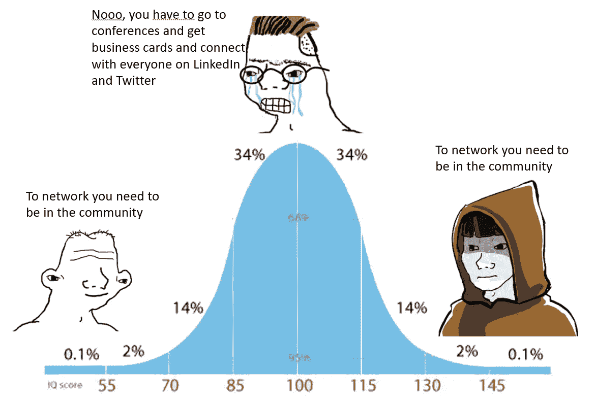

# 如何在密码网络和交朋友

> 原文：<https://medium.com/coinmonks/how-to-network-and-make-friends-in-crypto-796e123e9584?source=collection_archive---------1----------------------->

## 停止在 LinkedIn 上试图接近别人；你需要了解内容、对话和社区的结构。

Asking people about networking looks like this. It all sounds like common sense, but most people have a chaotic or non-actionable approach to it. Let me try and help you make it more organized and actionable.

网络是一个令人兴奋的话题，多年来发生了巨大的变化，尤其是在新冠肺炎时期。它曾经意味着得到某人的名片，然后在数字世界里，那张名片变成了…