# 如何拥有 SubstraPunks，Live Substrate 区块链第一 NFTs(Polkadot)

> 原文：<https://medium.com/coinmonks/how-to-own-substrapunks-the-first-nfts-in-live-substrate-blockchain-polkadot-f6c14531f039?source=collection_archive---------0----------------------->

SubstraPunks 最近引起了一些很大的反响。有人指责亚庞克仅仅是以太坊的密码庞克的复制品。Substrapunks 最初由 Unique Network 创建为 Testnet NFTs。只有 10，000 个被创造出来，并在 2020 年 8 月免费发放。他们被创造出来是为了向最初的以太坊密码朋克致敬。社区很快开始通过场外交易进行同样的交易。看到社区的兴奋，Unique 在 2020 年 11 月设计了一个市场。

在接下来的 3 个月里，SubstraPunks 被反复交易:

市场上交易的朋克总人数:514 人

总营业额:546.88 KSM

平均价格:1.06 KSM

密码朋克(以及密码小猫)将仍然是原始的 OGs。然而，不可否认的事实是，Substrapunks 将永远是第一个在活的底层网络中创建的 NFT。还有，Cryptopunks 有自己的 OGs，价值涨的很高。随着整个世界都在等待加入区块链，SubstraPunks 可以在新一代 OGs 中找到自己的位置。

2020 年 8 月所有的 Substrapunks 都被免费认领了。他们的交易开始时的底价大约是 10-15 美元，一段时间后，底价上升到 50 美元左右。请注意，这些朋克仍然在测试网，并会在几个月后自动转移到独特的主网。

**那么如何抓住一个亚朋克呢？这里是一个逐步指南**

**得到草间弥生(KSM)**

草间弥生在多个交易所上市，有多对。这种交流的清单如下

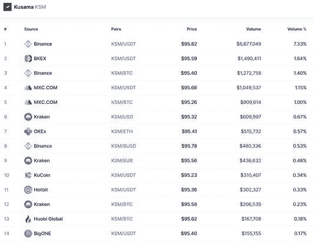

让我们以币安为例。

登录[币安网站](https://binance.com/en)。去市场搜索 KSM。选择您想要的任何一对。

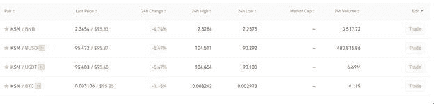

开始交易，买 KSM。记得一次买你需要的草间弥生，收集和交易它们会上瘾。

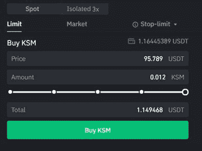

**下载 Polkadot.js**

从[官方 Polkadot Github](https://github.com/polkadot-js/extension) 下载 Polkadot.js。(始终仔细检查链接)

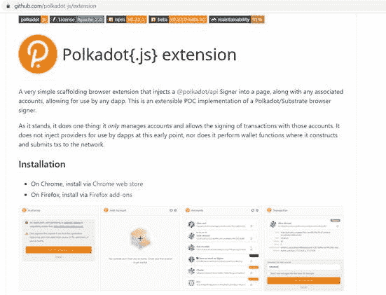

在本指南中，我们将为 chrome 扩展下载它。此应用没有完整的钱包功能，将用于签署交易。创建一个帐户并保存您的私钥。

分机将有你的基板地址。

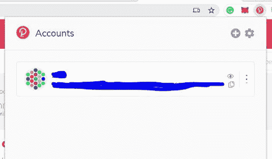

确保在设置中选择了草间弥生中继链的地址格式。

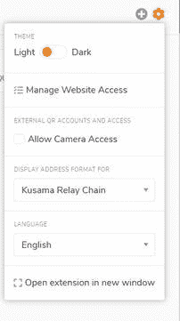

对于账户管理，使用[链接进入浏览器。](https://polkadot.js.org/apps#/explorer)

这将默认为 Polkadot。

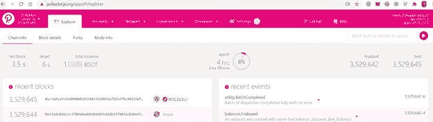

通过单击左上角的图标将其更改为草间弥生，然后单击切换。

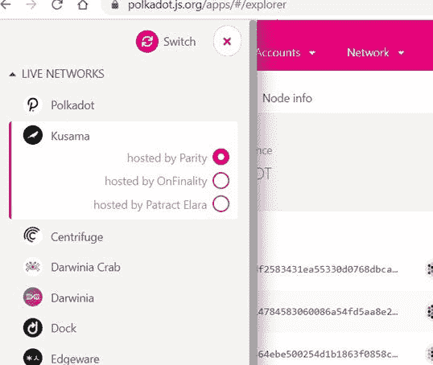

同时，将您的 KSM 从币安发送到 Polkadot.js 的 Kusama Wallet 地址。注意:您也可以在 Math Wallet 中添加相同的帐户，以防您想要以分散的方式访问它)

在浏览器中，转到帐户，您将能够找到您转移的 KSM 余额。

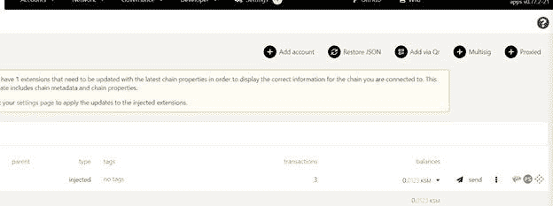

**获得独特的代币**

使用[链接](https://uniqueapps.usetech.com/#/nft)进入 Unique 的基板入口。

您可以用您的 Polkadot.js 签名。门户将自动获取您的 substrate(而非 KSM)地址。

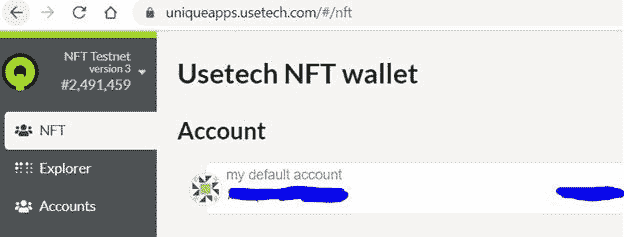

使用[唯一 Bot](https://web.telegram.org/#/im?p=@UniqueFaucetBot) 向基板地址发送唯一 Testnet。

您将能够在门户控制面板中看到您的唯一。请记住，这些是 Testnet 唯一的，不包含任何值。

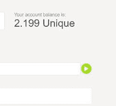

**访问市场**

通过[此链接](https://ipfs-gateway.usetech.com/ipns/QmaMtDqE9nhMX9RQLTpaCboqg7bqkb6Gi67iCKMe8NDpCE/index.html)访问市场

市场将要求签名。使用您的 Polkadot.js 扩展应用程序登录。

你可以看到所有列出的朋克。

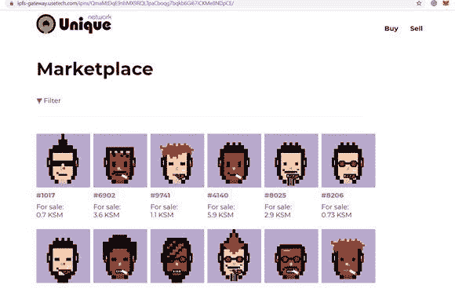

您可以使用过滤器选项来检查稀有性。使用我以前的文章(下面给出的链接)来理解朋克稀有是如何工作的。

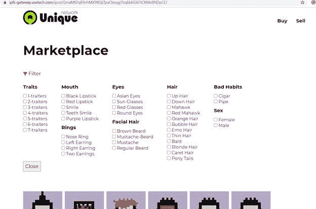

点击任何一个朋克看看他们的特点

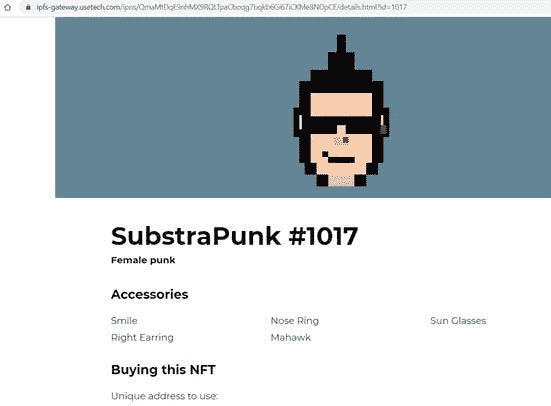

向下滚动，检查价格和费用，然后点击购买选项

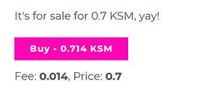

该平台将执行一个 3 步流程来完成交易

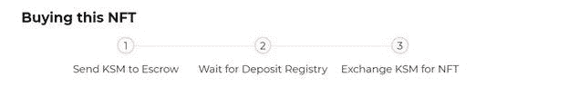

瞧啊。这个小混混现在是你的了。

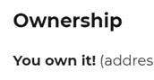

你总是可以在出售标题下看到你的朋克

您也可以使用您拥有的 NFT 的“出售”按钮来出售 NFT。

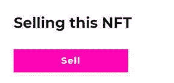

虽然灵感来自原始的密码朋克，但 SubstratePunks 完全有理由成为一个有价值的 NFT。小心他们！

注意，这不是财务建议。

***注:*** *本帖最初发表于* [*此处*](https://www.voice.com/post/@tulip/how-to-own-substrapunks-the-first-nfts-in-live-substrate-blockchain-polkadot-1611779831-1143660040) *为与 voice.com 有关联的密码作者。*

**阅读我之前的** [**指南，了解次级品系的稀有特征**](/coinmonks/the-first-polkadot-nfts-substrapunks-3398f33c8ae1)

**通过我的推荐加入**

[Crypto.com](https://binance.com/en/register?ref=E8PCD3AF)——[币安](https://platinum.crypto.com/r/sut3pd9bzn)

跟我来吧

**👉** [推特](https://twitter.com/rumadas123)

**👉** [领英](https://www.linkedin.com/in/ruma-das-a1439320/)

*包含附属链接*

> 加入 coin monks[Telegram group](https://t.me/joinchat/EPmjKpNYwRMsBI4p)并了解加密交易和投资

## 另外，阅读

*   什么是[闪贷](https://blog.coincodecap.com/what-are-flash-loans-on-ethereum)？
*   最好的[密码交易机器人](/coinmonks/crypto-trading-bot-c2ffce8acb2a) | [网格交易](https://blog.coincodecap.com/grid-trading)
*   [3 商业评论](/coinmonks/3commas-review-an-excellent-crypto-trading-bot-2020-1313a58bec92) | [Pionex 评论](/coinmonks/pionex-review-exchange-with-crypto-trading-bot-1e459d0191ea) | [Coinrule 评论](https://blog.coincodecap.com/coinrule-review-a-perfect-trading-bot)
*   [AAX 交易所评论](/coinmonks/aax-exchange-review-2021-67c5ea09330c) | [德里比特评论](/coinmonks/deribit-review-options-fees-apis-and-testnet-2ca16c4bbdb2) | [FTX 交易所评论](/coinmonks/ftx-crypto-exchange-review-53664ac1198f)
*   [n 零审核](/coinmonks/ngrave-zero-review-c465cf8307fc) | [Phemex 审核](/coinmonks/phemex-review-4cfba0b49e28) | [PrimeXBT 审核](/coinmonks/primexbt-review-88e0815be858)
*   [Bybit Exchange 审查](/coinmonks/bybit-exchange-review-dbd570019b71) | [Bityard 审查](https://blog.coincodecap.com/bityard-reivew) | [CoinSpot 审查](https://blog.coincodecap.com/coinspot-review)
*   [3Commas vs Cryptohopper](/coinmonks/3commas-vs-pionex-vs-cryptohopper-best-crypto-bot-6a98d2baa203)
*   最好的比特币[硬件钱包](/coinmonks/the-best-cryptocurrency-hardware-wallets-of-2020-e28b1c124069?source=friends_link&sk=324dd9ff8556ab578d71e7ad7658ad7c) | [BitBox02 回顾](/coinmonks/bitbox02-review-your-swiss-bitcoin-hardware-wallet-c36c88fff29)
*   [莱杰 vs n ave](https://blog.coincodecap.com/ngrave-vs-ledger)|[莱杰 nano s vs x](https://blog.coincodecap.com/ledger-nano-s-vs-x)
*   [密码拷贝交易平台](/coinmonks/top-10-crypto-copy-trading-platforms-for-beginners-d0c37c7d698c) | [比特码拷贝交易](https://blog.coincodecap.com/bityard-copy-trading)
*   [Vauld Review](https://blog.coincodecap.com/vauld-review)|[you hodler Review](/coinmonks/youhodler-4-easy-ways-to-make-money-98969b9689f2)|[BlockFi Review](/coinmonks/blockfi-review-53096053c097)
*   最好的[加密税务软件](/coinmonks/best-crypto-tax-tool-for-my-money-72d4b430816b) | [CoinTracking 评论](/coinmonks/cointracking-review-a-reliable-cryptocurrency-tax-software-5114e3eb5737)
*   最佳[加密借贷平台](/coinmonks/top-5-crypto-lending-platforms-in-2020-that-you-need-to-know-a1b675cec3fa) | [杠杆代币](/coinmonks/leveraged-token-3f5257808b22)
*   [莱杰纳米 S vs 特雷佐 one vs 特雷佐 T vs 莱杰纳米 X](https://blog.coincodecap.com/ledger-nano-s-vs-trezor-one-ledger-nano-x-trezor-t)
*   [block fi vs Celsius](/coinmonks/blockfi-vs-celsius-vs-hodlnaut-8a1cc8c26630)|[Hodlnaut Review](https://blog.coincodecap.com/hodlnaut-review)
*   [Bitsgap 审查](/coinmonks/bitsgap-review-a-crypto-trading-bot-that-makes-easy-money-a5d88a336df2) | [Quadency 审查](/coinmonks/quadency-review-a-crypto-trading-automation-platform-3068eaa374e1)
*   [埃利帕尔泰坦评论](/coinmonks/ellipal-titan-review-85e9071dd029) | [赛克斯斯通评论](https://blog.coincodecap.com/secux-stone-hardware-wallet-review)
*   [DEX Explorer](https://explorer.bitquery.io/ethereum/dex) | [区块链 API](https://explorer.bitquery.io/graphql)|[local bitcoins 审核](https://blog.coincodecap.com/localbitcoins-review)
*   最佳[区块链分析](https://bitquery.io/blog/best-blockchain-analysis-tools-and-software)工具| [赚比特币](https://blog.coincodecap.com/earn-bitcoin)
*   [加密套利](/coinmonks/crypto-arbitrage-guide-how-to-make-money-as-a-beginner-62bfe5c868f6)指南:新手如何赚钱
*   最佳[加密制图工具](/coinmonks/what-are-the-best-charting-platforms-for-cryptocurrency-trading-85aade584d80) | [最佳加密交易所](/coinmonks/crypto-exchange-dd2f9d6f3769)
*   了解比特币最好的[书籍有哪些？](/coinmonks/what-are-the-best-books-to-learn-bitcoin-409aeb9aff4b)

> [直接在您的收件箱中获得最佳软件交易](/coinmonks/newsletters/coinmonks)

