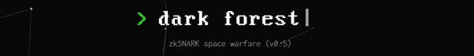
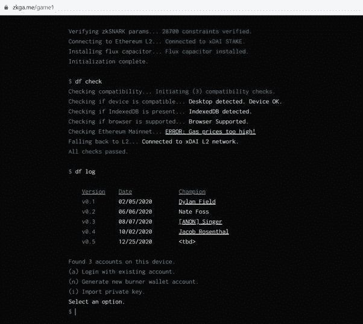
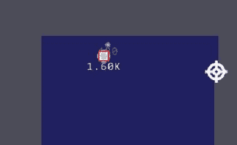
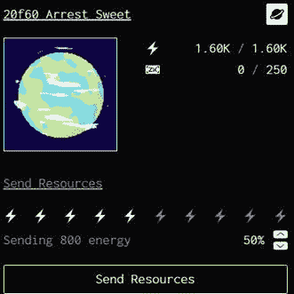
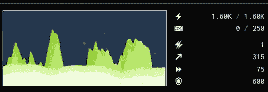
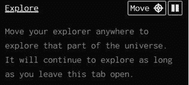
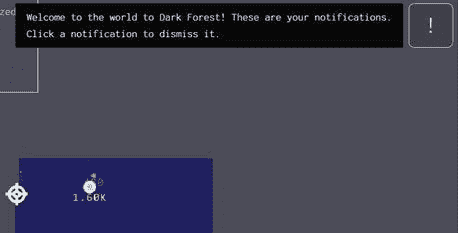

# 如何玩黑暗森林，zkSNARK powered MMO 游戏-第一部分

> 原文：<https://medium.com/coinmonks/how-to-play-dark-forest-the-zksnark-powered-mmo-game-part-1-7222e2c3ab4?source=collection_archive---------0----------------------->

## **简介**

《黑暗森林》是一款基于 zkSNARK 的分散式 MMO 太空征服游戏，zkSNARK 是一款强大的加密工具。玩家从一个母星开始，通过占领新的星球来扩大他/她的领土。宇宙是无限的，并且被密码化了。在整个征服过程中，玩家可以升级，占领另一个玩家的星球，还可以收集 ERC-721 收藏品。

## **为什么黑暗森林很重要？**

黑暗森林是**中的一款*第一次去中心化的“不完全信息”游戏*** 。

完全信息博弈的一个例子是 CryptoKitties。在这里，玩家知道游戏世界的全部状态，谁拥有什么小猫，小猫的特征。

不完全信息博弈具有隐藏属性。宇宙的完整状态是不公开的，玩家必须研究出来。黑暗森林可以保持类似的结构，保持行星位置的秘密，并且仍然保持分散。玩家不提交被征服星球的坐标。此外，检查黑暗森林散列将不会暴露其他玩家的实际位置。

## **从黑暗森林开始**

黑暗森林是目前最热门的游戏之一。这是 0.5 版，仍然只有邀请。最初的测试阶段是在 Ropsten 网络上进行的。有更多的重启和修复。现在游戏已经转移到 xDai 第二层了。人们可以通过在[https://zkka . me 订阅邮件列表来获得邀请密钥](https://zkga.me.)Twitter 上偶尔会有空投。

## **开始**

收到钥匙后，登录[黑暗森林网站](https://zkga.me/)。

使用导入私钥选项并输入您的密钥。系统会将你列入白名单，并给你 xDai 地址。请注意，您不需要多次使用键。一次性钱包将在浏览器中存储您的详细地址信息，并帮助您使用该信息登录。黑暗森林也会给你分数 xDai ($0.05)，足够你熟悉游戏了。

一旦你进入系统，将显示你的母星(注意:寻找母星可能需要一点时间，最多几分钟)。在我们进一步讨论之前，这里有一些基础知识。

你拥有的任何一颗行星都将以白色标出。在最开始，只有你的母星会被勾勒成白色。你必须征服其他人，把他们置于你的控制之下。除了你的母星，你还会得到一个探险家。探险家为你打开地图寻找更新的行星。

## **母星:**

如果你点击母星，会弹出两个新的屏幕。星球摘要标签显示了你的星球的能量/它的容量以及拥有的白银数量。捕获其他行星需要能量。就容量而言，白银是升级你的星球所必需的。

点击右上角的行星图标查看更多详情。

在你开始之前，了解这个星球的所有属性，并计划如何利用它们。重要的是节约能源，节约你的 xDai。

## **探索者:**

浏览器以一定的哈希速度打开地图。单击资源管理器以打开关于资源管理器的详细信息。

使用“移动”按钮，并在地图上您希望浏览器浏览的位置单击光标。你也可以改变哈希功率和速度。不和谐求个码。请仅使用来自可信人员的代码。

**通知**

任何交易通知应该在右上角弹出

## **宇宙**

每个玩家都从星云开始。它以蓝色为标志，是宇宙中最安全的区域。外层区域是黑暗的，包含更稀有和更强大的行星，但更容易受到其他玩家的攻击。

我将在下一部分继续这篇文章。我们将讨论如何占领一个星球，一个星球的范围是什么，准备战争的最佳策略应该是什么。希望你觉得这篇文章有趣。

**看我之前的文章:** [如何拥有 SubstraPunks，Live 区块链第一 NFTs(Polkadot)](/coinmonks/how-to-own-substrapunks-the-first-nfts-in-live-substrate-blockchain-polkadot-f6c14531f039)

***注:*** *本帖最初发表于* [*此处*](https://www.voice.com/post/@tulip/how-to-play-dark-forest-the-zksnark-powered-mmo-game-part-1-1613299680-234664232) *为与 voice.com 有关联的密码作者。*

**通过我的推荐加入**

[Crypto.com](https://binance.com/en/register?ref=E8PCD3AF)——[币安](https://platinum.crypto.com/r/sut3pd9bzn)

跟我来

**👉** [推特](https://twitter.com/rumadas123)

**👉**[**Linkedin**](https://www.linkedin.com/in/ruma-das-a1439320/)

***包含附属链接***

> **加入 T42 电报集团，学习加密交易和投资**

## **另外，阅读**

*   **什么是[闪贷](https://blog.coincodecap.com/what-are-flash-loans-on-ethereum)？**
*   **最好的[密码交易机器人](/coinmonks/crypto-trading-bot-c2ffce8acb2a) | [网格交易](https://blog.coincodecap.com/grid-trading)**
*   **[3 商业评论](/coinmonks/3commas-review-an-excellent-crypto-trading-bot-2020-1313a58bec92) | [Pionex 评论](/coinmonks/pionex-review-exchange-with-crypto-trading-bot-1e459d0191ea) | [Coinrule 评论](https://blog.coincodecap.com/coinrule-review-a-perfect-trading-bot)**
*   **[AAX 交易所评论](/coinmonks/aax-exchange-review-2021-67c5ea09330c) | [德里比特评论](/coinmonks/deribit-review-options-fees-apis-and-testnet-2ca16c4bbdb2) | [FTX 交易所评论](/coinmonks/ftx-crypto-exchange-review-53664ac1198f)**
*   **[n ave 零点回顾](/coinmonks/ngrave-zero-review-c465cf8307fc) | [Phemex 回顾](/coinmonks/phemex-review-4cfba0b49e28) | [PrimeXBT 回顾](/coinmonks/primexbt-review-88e0815be858)**
*   **[Bybit Exchange 审查](/coinmonks/bybit-exchange-review-dbd570019b71) | [Bityard 审查](https://blog.coincodecap.com/bityard-reivew) | [CoinSpot 审查](https://blog.coincodecap.com/coinspot-review)**
*   **[3 commas vs crypto hopper](/coinmonks/3commas-vs-pionex-vs-cryptohopper-best-crypto-bot-6a98d2baa203)|[赚取加密利息](/coinmonks/earn-crypto-interest-b10b810fdda3)**
*   **最好的比特币[硬件钱包](/coinmonks/the-best-cryptocurrency-hardware-wallets-of-2020-e28b1c124069?source=friends_link&sk=324dd9ff8556ab578d71e7ad7658ad7c) | [BitBox02 回顾](/coinmonks/bitbox02-review-your-swiss-bitcoin-hardware-wallet-c36c88fff29)**
*   **[总帐 vs n 平均](https://blog.coincodecap.com/ngrave-vs-ledger) | [总帐 nano s vs x](https://blog.coincodecap.com/ledger-nano-s-vs-x)**
*   **[加密复制交易平台](/coinmonks/top-10-crypto-copy-trading-platforms-for-beginners-d0c37c7d698c) | [比特码复制交易](https://blog.coincodecap.com/bityard-copy-trading)**
*   **[Vauld 评论](https://blog.coincodecap.com/vauld-review) | [YouHodler 评论](/coinmonks/youhodler-4-easy-ways-to-make-money-98969b9689f2) | [BlockFi 评论](/coinmonks/blockfi-review-53096053c097)**
*   **最好的[加密税务软件](/coinmonks/best-crypto-tax-tool-for-my-money-72d4b430816b) | [CoinTracking 评论](/coinmonks/cointracking-review-a-reliable-cryptocurrency-tax-software-5114e3eb5737)**
*   **最佳[加密借贷平台](/coinmonks/top-5-crypto-lending-platforms-in-2020-that-you-need-to-know-a1b675cec3fa) | [杠杆代币](/coinmonks/leveraged-token-3f5257808b22)**
*   **[莱杰纳米 S vs 特雷佐 one vs 特雷佐 T vs 莱杰纳米 X](https://blog.coincodecap.com/ledger-nano-s-vs-trezor-one-ledger-nano-x-trezor-t)**
*   **[block fi vs Celsius](/coinmonks/blockfi-vs-celsius-vs-hodlnaut-8a1cc8c26630)|[Hodlnaut 评论](https://blog.coincodecap.com/hodlnaut-review)**
*   **[Bitsgap 审查](/coinmonks/bitsgap-review-a-crypto-trading-bot-that-makes-easy-money-a5d88a336df2) | [Quadency 审查](/coinmonks/quadency-review-a-crypto-trading-automation-platform-3068eaa374e1)**
*   **[埃利帕尔泰坦评论](/coinmonks/ellipal-titan-review-85e9071dd029) | [赛克斯斯通评论](https://blog.coincodecap.com/secux-stone-hardware-wallet-review)**
*   **[DEX Explorer](https://explorer.bitquery.io/ethereum/dex) | [区块链 API](https://explorer.bitquery.io/graphql)|[local bitcoins 审核](https://blog.coincodecap.com/localbitcoins-review)**
*   **最佳[区块链分析](https://bitquery.io/blog/best-blockchain-analysis-tools-and-software)工具| [赚比特币](https://blog.coincodecap.com/earn-bitcoin)**
*   **[加密套利](/coinmonks/crypto-arbitrage-guide-how-to-make-money-as-a-beginner-62bfe5c868f6)指南:新手如何赚钱**
*   **最佳[加密制图工具](/coinmonks/what-are-the-best-charting-platforms-for-cryptocurrency-trading-85aade584d80) | [最佳加密交易所](/coinmonks/crypto-exchange-dd2f9d6f3769)**
*   **了解比特币的[最佳书籍有哪些？](/coinmonks/what-are-the-best-books-to-learn-bitcoin-409aeb9aff4b)**

> **[直接在您的收件箱中获得最佳软件交易](/coinmonks/newsletters/coinmonks)**

****