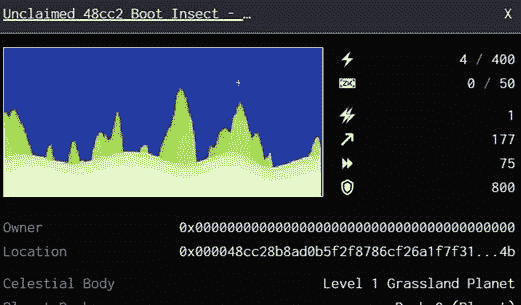
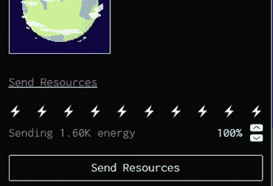
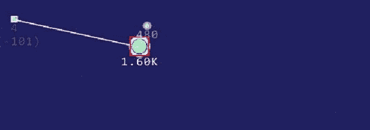
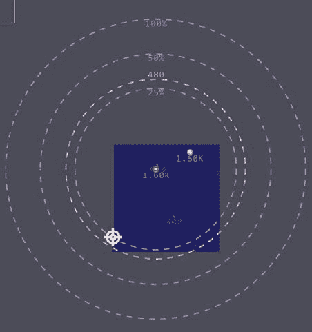

# 如何玩黑暗森林，zkSNARK powered MMO 游戏-第二部分

> 原文：<https://medium.com/coinmonks/how-to-play-dark-forest-the-zksnark-powered-mmo-game-part-2-816c45072f00?source=collection_archive---------2----------------------->

在本指南的第 1 部分中，我们讨论了黑暗森林的概况及其重要性。我们还讨论了如何开始玩游戏。在第 2 部分中，我们将进一步深入细节。

## **占领一颗行星**

所有的行星都会产生能量。你可以把能量从你拥有的行星转移到新的行星去征服它们。

请注意，您将从 1 级母星开始。尝试快速积累一小组 1 级行星，然后尝试持有更高的能量。能量可以通过从小行星上开采银来升级。

任何无人认领的星球将被命名为“无人认领”,其所有者也将是 00000…

为了占领这个星球，我需要发送 4 个以上的能量。点击母星并选择，你想发送多少能量。

现在，如果我按下并把光标从母行星移到无人认领的行星，根据能量，系统会显示你发送的能量是否足够。在同一个例子中，系统显示我正在发送 101 个能量来捕获这个星球，而 4 个就足够了。你可以相应地调整你发送的能量。能量转移需要时间才能到达。

一旦你占领了这个星球，它将会被勾勒成白色，它的主人将会变成你。有时，由于各种原因，捕获不会发生。以下是一些原因:

您没有 xDAI 余额。检查您的余额—单击游戏屏幕左上角菜单栏中的锁图标。如果您看到低余额，请从 Bitmax 购买 xDAI。否则，购买 DAI 并在 xDAI 令牌桥上将其交换为 xDAI。发送 xDAI 到你的黑暗森林地址。

你用更少的能量去占领这个星球。

有一个小型连锁店重组。刷新页面。

检查您的网络连接

注意一旦你从你的星球发出能量，你的星球的能量会在一段时间内自动补充。

## **范围:**

如果你点击一颗行星，你会看到它周围有 3 个圆圈。这基本上说明了你用 100%、50%和 25%的能量能达到多远。如果你点击并选择能量等级，会有另一个黄色圆圈告诉你所选择的能量，你能到达多远。注意，如果是捕捉行星，应该是到达+捕捉行星所需的能量。

## **银**

小行星开采白银。你需要银来升级你的星球。因此你需要捕捉一些小行星。生产和消费白银会增加你的分数。黄色数字突出显示了行星的银色。

## **工件**

有一个神器插件会给你包含神器的行星的坐标。可以收集神器，放在钱包里。这些是 ERC721 代币，以后可以和其他玩家交易。一个星球的神器被一个小礼品盒展示在这个星球的左上角。你需要领取神器并支付少量 xDai 费用。

## **战争**

快速开始建立你的领域。你永远不知道另一个人什么时候会突然出现并攻击你。不如快速升级，与其积累更低级别的行星，不如快速升级积累更高级别的行星，最好是 5 级及以上。用较高级别的行星更容易捕捉到较低级别的行星。有关更多说明，请参见下面的指南。在战争的情况下，你需要有一个非常强大的防御系统，位置战略，以及攻击力。

## **分数**

黑暗森林举办竞赛并奖励获胜者。分数的计算方法是:

十大行星大小之和+ 0.30 倍你开采的总银量

## **一些有用的提示:**

使用新账户。不要将您的主要交易帐户导入黑暗森林。黑暗森林私钥存储在浏览器的本地存储中。

将帐户从一个浏览器转移到另一个浏览器需要以下三样东西:

o 你的黑暗森林燃烧者钱包的私人钥匙

o 你们星球的坐标(任何人)

o 秘密地图数据

**结论**

《黑暗森林》是第一部，很多有影响力的人都在玩。这是一个巨大的成功。这个游戏将很快向更广泛的观众开放。游戏让人上瘾，总有先发优势。也许这些文物在未来会有价值。

我希望这个指南能帮助你对这个游戏产生兴趣，并在初始阶段开始游戏。

**阅读上一篇文章:** [如何玩黑暗森林，zkSNARK powered MMO 游戏—第一部分](https://tulip311bit.medium.com/how-to-play-dark-forest-the-zksnark-powered-mmo-game-part-1-7222e2c3ab4)

***注:*** *本帖最初发表于* [*此处*](https://www.voice.com/post/@tulip/how-to-play-dark-forest-the-zksnark-powered-mmo-game-part-2-1613300255-591588324) *为与 voice.com 有关联的密码作者。*

**通过我的推荐加入**

[Crypto.com](https://binance.com/en/register?ref=E8PCD3AF)——[币安](https://platinum.crypto.com/r/sut3pd9bzn)

跟我来吧

**👉** [推特](https://twitter.com/rumadas123)

**👉** [领英](https://www.linkedin.com/in/ruma-das-a1439320/)

> 加入 coin monks[Telegram group](https://t.me/joinchat/EPmjKpNYwRMsBI4p)学习加密交易和投资

## 另外，阅读

*   什么是[闪贷](https://blog.coincodecap.com/what-are-flash-loans-on-ethereum)？
*   最好的[密码交易机器人](/coinmonks/crypto-trading-bot-c2ffce8acb2a) | [网格交易](https://blog.coincodecap.com/grid-trading)
*   [3 商业评论](/coinmonks/3commas-review-an-excellent-crypto-trading-bot-2020-1313a58bec92) | [Pionex 评论](/coinmonks/pionex-review-exchange-with-crypto-trading-bot-1e459d0191ea) | [Coinrule 评论](https://blog.coincodecap.com/coinrule-review-a-perfect-trading-bot)
*   [AAX 交易所评论](/coinmonks/aax-exchange-review-2021-67c5ea09330c) | [德里比特评论](/coinmonks/deribit-review-options-fees-apis-and-testnet-2ca16c4bbdb2) | [FTX 交易所评论](/coinmonks/ftx-crypto-exchange-review-53664ac1198f)
*   [n 零审核](/coinmonks/ngrave-zero-review-c465cf8307fc) | [Phemex 审核](/coinmonks/phemex-review-4cfba0b49e28) | [PrimeXBT 审核](/coinmonks/primexbt-review-88e0815be858)
*   [Bybit Exchange 审查](/coinmonks/bybit-exchange-review-dbd570019b71) | [Bityard 审查](https://blog.coincodecap.com/bityard-reivew) | [CoinSpot 审查](https://blog.coincodecap.com/coinspot-review)
*   [3 commas vs crypto hopper](/coinmonks/3commas-vs-pionex-vs-cryptohopper-best-crypto-bot-6a98d2baa203)|[赚取加密利息](/coinmonks/earn-crypto-interest-b10b810fdda3)
*   最好的比特币[硬件钱包](/coinmonks/the-best-cryptocurrency-hardware-wallets-of-2020-e28b1c124069?source=friends_link&sk=324dd9ff8556ab578d71e7ad7658ad7c) | [BitBox02 回顾](/coinmonks/bitbox02-review-your-swiss-bitcoin-hardware-wallet-c36c88fff29)
*   [莱杰 vs n ave](https://blog.coincodecap.com/ngrave-vs-ledger)|[莱杰 nano s vs x](https://blog.coincodecap.com/ledger-nano-s-vs-x)
*   [密码拷贝交易平台](/coinmonks/top-10-crypto-copy-trading-platforms-for-beginners-d0c37c7d698c) | [比特码拷贝交易](https://blog.coincodecap.com/bityard-copy-trading)
*   [Vauld Review](https://blog.coincodecap.com/vauld-review)|[you hodler Review](/coinmonks/youhodler-4-easy-ways-to-make-money-98969b9689f2)|[BlockFi Review](/coinmonks/blockfi-review-53096053c097)
*   最好的[加密税务软件](/coinmonks/best-crypto-tax-tool-for-my-money-72d4b430816b) | [CoinTracking 评论](/coinmonks/cointracking-review-a-reliable-cryptocurrency-tax-software-5114e3eb5737)
*   最佳[加密借贷平台](/coinmonks/top-5-crypto-lending-platforms-in-2020-that-you-need-to-know-a1b675cec3fa) | [杠杆代币](/coinmonks/leveraged-token-3f5257808b22)
*   [莱杰纳米 S vs 特雷佐 one vs 特雷佐 T vs 莱杰纳米 X](https://blog.coincodecap.com/ledger-nano-s-vs-trezor-one-ledger-nano-x-trezor-t)
*   [block fi vs Celsius](/coinmonks/blockfi-vs-celsius-vs-hodlnaut-8a1cc8c26630)|[Hodlnaut Review](https://blog.coincodecap.com/hodlnaut-review)
*   [Bitsgap 审查](/coinmonks/bitsgap-review-a-crypto-trading-bot-that-makes-easy-money-a5d88a336df2) | [Quadency 审查](/coinmonks/quadency-review-a-crypto-trading-automation-platform-3068eaa374e1)
*   [埃利帕尔泰坦评论](/coinmonks/ellipal-titan-review-85e9071dd029) | [赛克斯斯通评论](https://blog.coincodecap.com/secux-stone-hardware-wallet-review)
*   [DEX Explorer](https://explorer.bitquery.io/ethereum/dex) | [区块链 API](https://explorer.bitquery.io/graphql)|[local bitcoins 审核](https://blog.coincodecap.com/localbitcoins-review)
*   最佳[区块链分析](https://bitquery.io/blog/best-blockchain-analysis-tools-and-software)工具| [赚比特币](https://blog.coincodecap.com/earn-bitcoin)
*   [加密套利](/coinmonks/crypto-arbitrage-guide-how-to-make-money-as-a-beginner-62bfe5c868f6)指南:新手如何赚钱
*   最佳[加密制图工具](/coinmonks/what-are-the-best-charting-platforms-for-cryptocurrency-trading-85aade584d80) | [最佳加密交易所](/coinmonks/crypto-exchange-dd2f9d6f3769)
*   了解比特币最好的[书籍有哪些？](/coinmonks/what-are-the-best-books-to-learn-bitcoin-409aeb9aff4b)

> [直接在您的收件箱中获得最佳软件交易](/coinmonks/newsletters/coinmonks)

