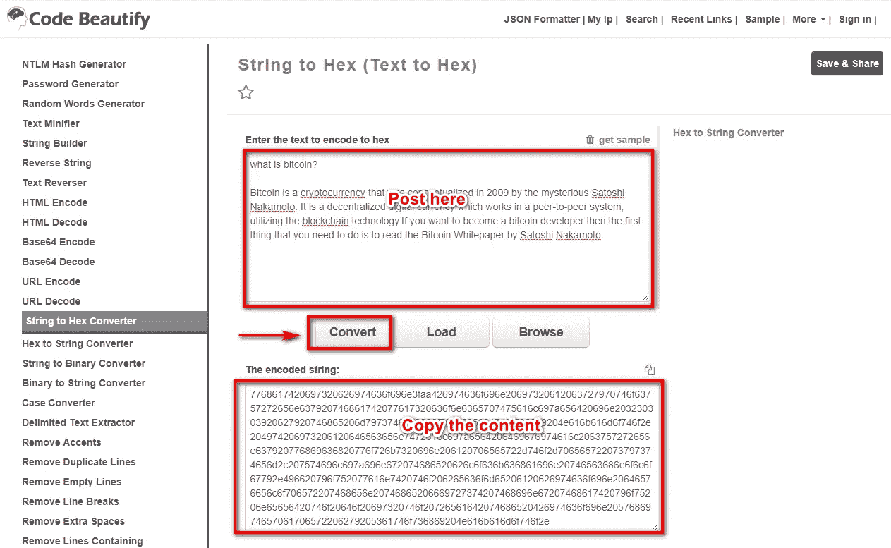
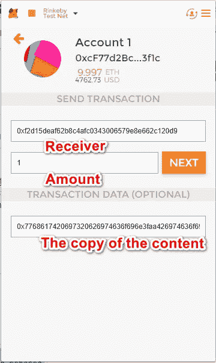
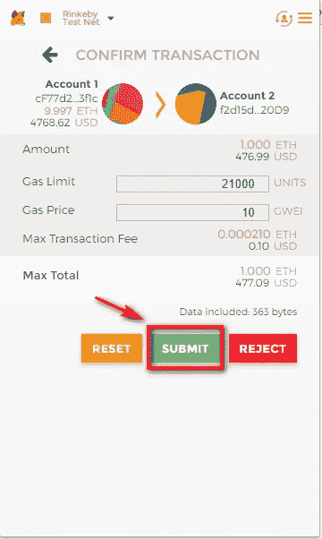
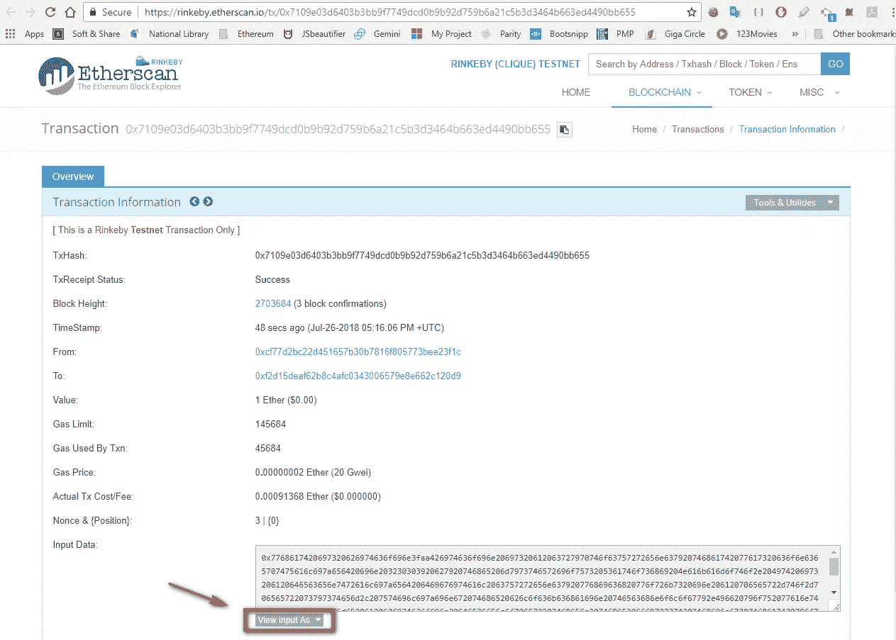
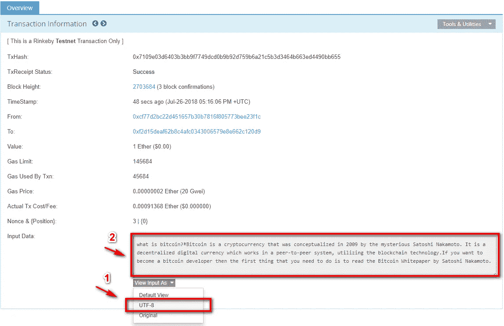

# 如何将你的文章发布到以太坊区块链

> 原文：<https://medium.com/coinmonks/how-to-post-your-article-into-ethereum-blockchain-e53ba71ec1?source=collection_archive---------9----------------------->

## 步骤:

1.  将字符串转换为十六进制数

[最好的字符串到十六进制转换器在线将文本转换成十六进制。
在线转换字符串为十六进制(文本为十六进制)并保存分享。弦向 Hexadecimalcodebeautify.org](https://codebeautify.org/string-hex-converter)

2.通过元掩码发送事务

*   Recipient Address：任意一個 ETH Address （ex: 0xf2d15dEAf62b8c4AFC0343006579E8E662c120D9）
*   金额:任何金额(例如:0.001 ETH)
*   事务数据:0x +"内容的副本"

# 如何阅读文章

1.  查看以太网扫描上的交易

[https://rinke by . ethers can . io/tx/0x 7109 e03d 6403 B3 bb 9 f 7749 DCD 0 b 9 b 92d 759 b 6 a 21 C5 b 3d 3464 b 663 ed 4490 bb 655](https://rinkeby.etherscan.io/tx/0x7109e03d6403b3bb9f7749dcd0b9b92d759b6a21c5b3d3464b663ed4490bb655)

2.找到“查看输入为”，然后更改为“UTF-8”

