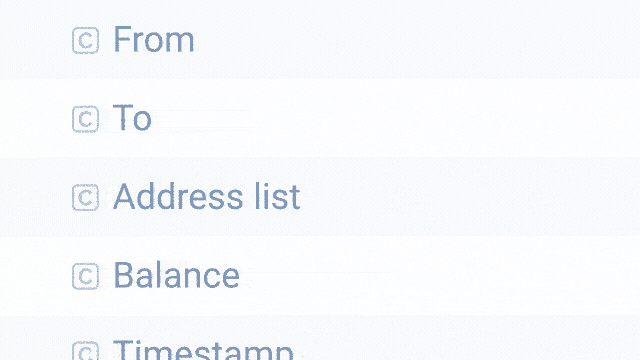

# 如何预测加密货币抛售？

> 原文：<https://medium.com/coinmonks/how-to-predict-cryptocurrency-selloffs-by-keeping-an-eye-on-blockchain-addresses-f086ec53289f?source=collection_archive---------3----------------------->

## 如果你更有创造性地进行钱包监控，它可以增强你的策略

[Pic credit: PARSIQ](https://parsiq.net)

加密货币和安全令牌的价值可能在很大程度上取决于几个市场因素，包括加密货币的供应和需求、交易量和交易量，以及正面或负面消息等外部冲击。