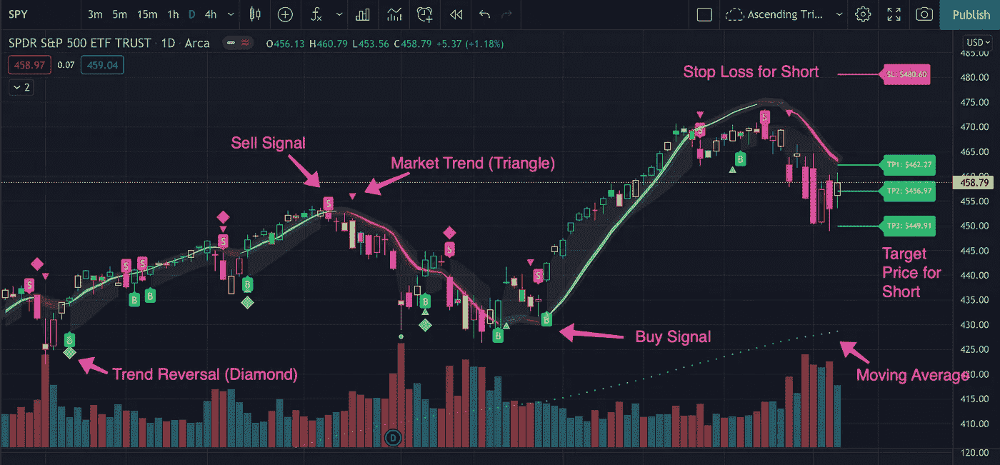

# 如何阅读任何价格图表

> 原文：<https://medium.com/coinmonks/how-to-read-a-stock-chart-364267fa8ec?source=collection_archive---------4----------------------->

There are simple and advanced chart indicators that can give you an EDGE in buying and selling just about anything that trades!

在假期里，我的一些家人问我一些如何挑选股票的技巧。我不想“承诺”给*买什么*，但是我可以帮助他们什么时候买。这里有一篇小文章，教你如何阅读加密和股票的价格图表，以及如何确定进场和出场的时间。

***作者注:*** *这不是贸易或金融方面的建议。这些信息是作为教育性信息提供给* …