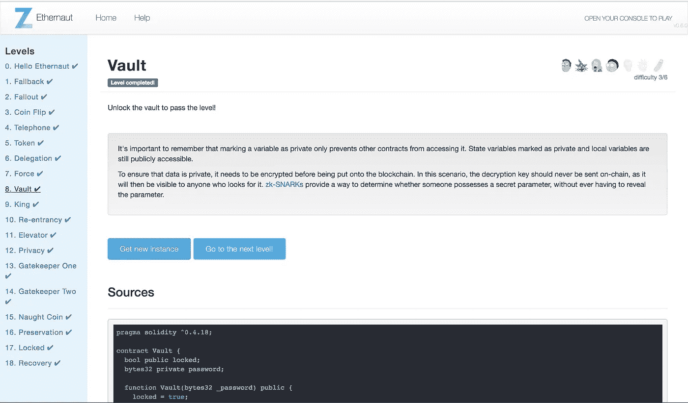

# Ethernaut Lvl 8 Vault 演练—如何读取契约存储中的“私有”变量(使用 Truffle)

> 原文：<https://medium.com/coinmonks/how-to-read-private-variables-in-contract-storage-with-truffle-ethernaut-lvl-8-walkthrough-b2382741da9f?source=collection_archive---------2----------------------->

## 这是一个围绕[齐柏林](https://openzeppelin.org/)团队的[智能合约安全拼图](https://ethernaut.zeppelin.solutions/)的[深度系列](/@nicolezhu)。我们学习关键的可靠性概念，以便 100%靠自己解决难题。

在这一关，我们学习用松露控制台读取契约存储，用“私人”存储的密码打开保险库。

# 以太坊存储的工作原理

在以太坊中，编程可以有两种不同的含义:

1.  以太坊如何在区块链上存储合同数据，以及
2.  Solidity 如何存储全局和局部变量。

在本帖中，我们将深入探讨以太坊如何在区块链上存储数据。

> **以太坊区块链上的存储**为 2 个⁵⁶槽，每个槽为 32 字节。

每个智能合约都有自己的存储来反映合约的状态。存储中的值在不同的函数调用中保持不变。每个存储都绑定到智能合约的地址。

## 数据的物理存储方式

数据按照声明的顺序存储在这些槽中。

存储经过优化以节省字节空间。因此，如果顺序变量适合一个 32 字节的槽，它们将共享同一个槽，从最低有效位开始索引(从右边开始)。

以太坊储物和空间优化的形象化展示:


Notice that bool and uint16 share slot 0, indicating this contract also costs less gas to instantiate!

## 访问存储

方便地， [Web3](https://github.com/ethereum/web3.js/) 允许您通过`web3.eth.getStorageAt(contractAddress, slotNumber)`进入合同仓库

# 详细演练



## **等级设置**

1.  请注意，您不能使用实时合同单步调试 Remix 调试器。所以让我们使用一个更强大的工具来与这个契约进行交互。遵循这个 [8 分钟 Truffle & Ropsten 教程](/coinmonks/5-minute-guide-to-deploying-smart-contracts-with-truffle-and-ropsten-b3e30d5ee1e)来熟悉使用 Truffle 框架与合同交互。

## 解决办法

2.编译你的`Vault.sol`合同，获得当地的 ABI。你可以只部署到本地网络——只要确保 [Ganache](https://truffleframework.com/ganache) 是打开的:

```
truffle deploy   // auto compiles and deploys to local network
```

EVM 会将编译后的契约保存在/build 中。

3.打开 truffle 控制台，进行 Ropsten:

```
truffle console --network Ropsten
```

4.注意“私人”密码存储在`index 1`的`slot 2`中

通过以下方式访问索引 1 处属于合同实例(由 Ethernaut 部署)的存储槽:

```
web3.eth.getStorageAt(instance.address, 1, (err,res)=>{console.log(res)});
```

> N 注:getStorageAt 返回一个承诺。

5.使用十六进制到字符串的转换器，或者`web3.utils.hexToAscii`辅助函数将 bytes32 变量转换成人类可读的文本，这显示了`“A very strong secret password :)”`

6.`unlock()`你与`bytes32 private password`的合同

# 关键安全要点

*   所有的存储在区块链上都是公开可见的，甚至是你的`private`变量！
*   不要在没有散列的情况下存储密码和私钥
*   当使用带有存储变量的契约的 [delegatecall](/coinmonks/ethernaut-lvl-7-walkthrough-how-to-selfdestruct-and-create-an-ether-blackhole-eb5bb72d2c57) 时，要小心数据损坏。

# 更多级别

[](/coinmonks/ethernaut-lvl-7-walkthrough-how-to-selfdestruct-and-create-an-ether-blackhole-eb5bb72d2c57) [## 以太吕 7 部队演练-如何自毁和创造一个以太黑洞

### 这是一个围绕齐柏林团队的智能合同安全难题的深入系列。我们学习关键的可靠性概念…

medium.com](/coinmonks/ethernaut-lvl-7-walkthrough-how-to-selfdestruct-and-create-an-ether-blackhole-eb5bb72d2c57) [](/coinmonks/ethernaut-lvl-9-king-walkthrough-how-bad-contracts-can-abuse-withdrawals-db12754f359b) [## 以太者 Lvl 9 国王演练:如何糟糕的合同可以滥用提款

### 这是一个围绕齐柏林团队的智能合同安全难题的深入系列。我们学习关键的可靠性概念…

medium.com](/coinmonks/ethernaut-lvl-9-king-walkthrough-how-bad-contracts-can-abuse-withdrawals-db12754f359b) 

> [直接在您的收件箱中获得最佳软件交易](https://coincodecap.com/?utm_source=coinmonks)

[](https://coincodecap.com/?utm_source=coinmonks)