# 如何为您的钱包地址注册一个 ENS 名称

> 原文：<https://medium.com/coinmonks/how-to-register-an-ens-name-for-your-wallet-address-190767641dae?source=collection_archive---------0----------------------->

## 为网络的未来保护您的用户名。

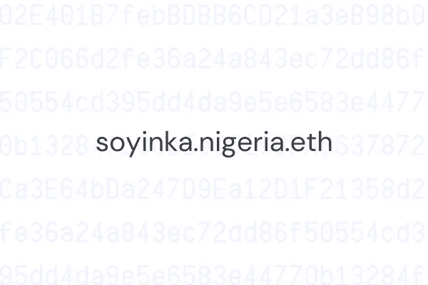

For illustrative purposes only

随着我们开始在支付、游戏、艺术甚至社交媒体中看到更多区块链技术的主流用例，进一步简化用户对加密的总体体验变得非常重要——从地址开始。

地址是我们与区块链交互的重要部分，因为它们是接收和发送事务的基本方式。然而，它们是字母和数字的长组合形式。例如，以太坊地址看起来像这样:“0x 6405 a 46 e 53680 ea 9 cc 68228 EC 3 a 459 C3 cedd 972”。

因此，很容易犯代价高昂的错误，比如把钱汇错了地址。这也影响了分散应用的用户体验，因为他们经常不得不通过这个不容易记住的字符串来识别你。

在数字技术的其他方面，没有人期望普通人会经常使用这样的东西。想象一下，如果我们在 Twitter 上没有用户名，每次你想在一个有趣的帖子上标记你的朋友，你必须先复制他们的 Twitter 用户 ID。或者每次你想访问一个网站，你必须找到并输入 IP 地址。在很大程度上，我们已经开发出了将容易记忆的名字映射到像这样复杂的 id 的方法。它通常有助于更好的用户体验，减少出错的倾向，并使围绕一个身份建立社区变得更容易。

这就是为什么以太坊名称服务(ENS)是一个非常重要的项目，我对此感到兴奋。ENS 是一项服务，可让您将人类可读的名称(ENS 名称)映射到以太坊区块链上的钱包地址。这使得区块链上的身份概念更加容易理解和用户友好，因为其他人(和 dApps)现在可以用一个难忘的名字来识别你。

你可以在 [ENS 应用](https://app.ens.domains/)上购买一个 ENS 名称，或者在二级市场上购买，如果其他人已经申请了你想要的名称。ENS 名称本质上是不可替换的令牌(NFT ),因此您可以在 OpenSea 等市场上进行交易。这类似于必须在 GoDaddy 上为自己喜欢的域名竞价。

获得 ENS 名称后，您可以:

*   接收任何加密货币、代币或基于区块链的物品(如 NFTs)。例如，您可以共享“teju.eth”而不是长地址来接收加密。
*   将你的 ENS 名称指向你的网站。有了为 ENS 提供原生支持的浏览器，如[勇敢](http://www.brave.com)和[歌剧](http://www.opera.com)，你可以简单地输入你的 ENS 名称直接访问网站。对于 Chrome 这样的非 web3 浏览器，可以加一个“.”。链接”后缀来打开网站。例如“teju.eth.link”。
*   设置你的反向记录，让分散的应用程序显示你的 ENS 名称，而不是你的钱包地址。
*   添加头像、电子邮件地址或 Twitter 账号等个人资料信息。这些也可以在区块链上看到。

现在你有了这些信息，下面是注册你的 ENS 名称并为它设置反向记录的一步一步的指南。

## **你需要:**

*   一个[非保管以太坊钱包。](https://tejuadeyinka.medium.com/exploring-crypto-wallets-your-portal-into-the-future-d1e15ee77492?source=your_stories_page-------------------------------------)在下面的例子中，我用的是[彩虹](http://rainbow.me)的手机钱包。
*   以太:你需要这个来支付注册费和交易费。目前，5 个字符或更长的域名续费为 5 美元/年，4 个字符的域名为 160 美元/年，3 个字符的域名为 640 美元/年。在开始这个过程之前，记得检查一下目前的油费是多少。
*   你需要把乙醚放在你的非保管钱包里。所以，如果你在交易所有，先把它发到你自己的钱包里。以下是从 [Buycoins](https://help.buycoins.africa/article/5shnmmtevz-example) 和[比特币基地](https://help.coinbase.com/en/coinbase/trading-and-funding/cryptocurrency-trading-pairs/how-to-send-and-receive-cryptocurrency)发送加密货币的指南。

## **第一步**

转到 [app.ens.domains →](http://app.ens.domains)

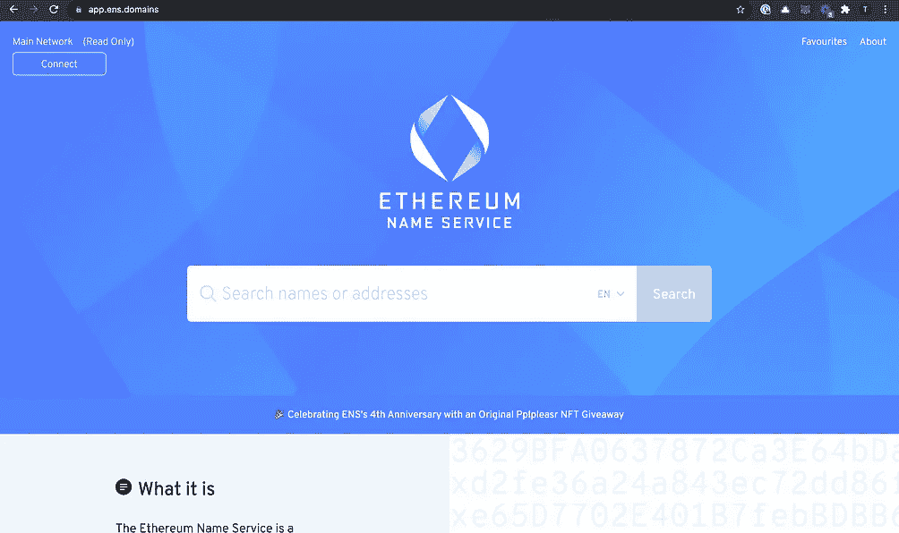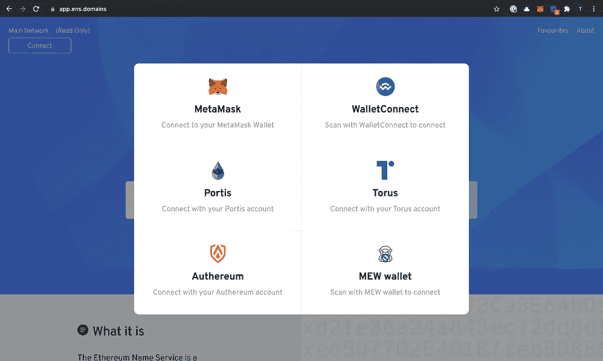

Visit app.ens.domains and connect your wallet.

点击左上方的“连接”按钮，选择您喜欢的钱包。如果您的未列出，请单击 WalletConnect 检查它是否受支持。

当您选择 WalletConnect 时，您将获得一个二维码进行扫描。如果您使用的是 Rainbow，请导航至“*发现*”页面，点击 QR 图标扫描代码。一旦它扫描成功，你会得到一个提示，将 ENS 应用程序连接到你的钱包。

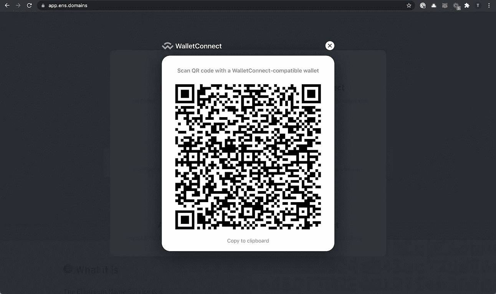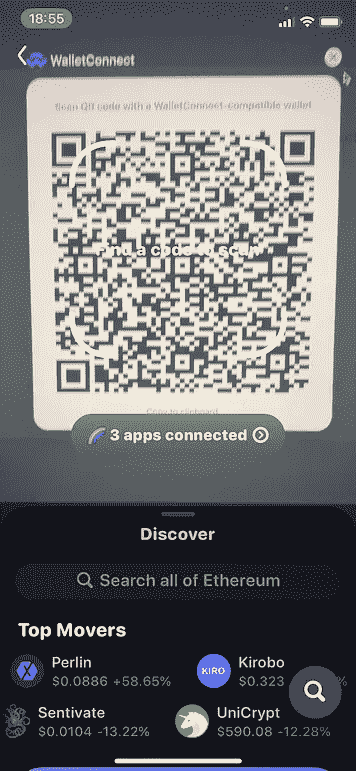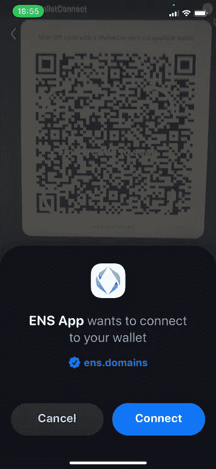

Connect the ENS app to your wallet

## **第二步**

你被录取了。

键入您试图购买的名称，查看它是否仍然可用。您可以选择一个时间段(以年为单位)进行注册。

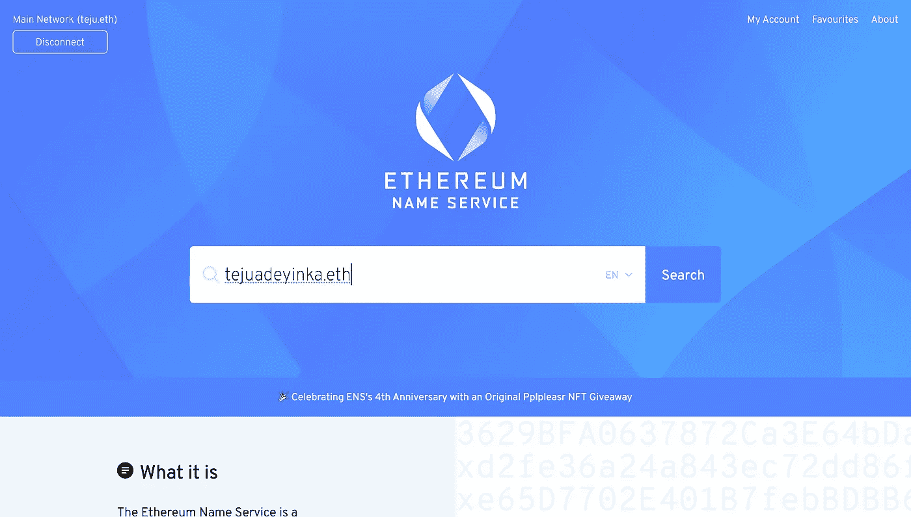

Search to see if your name is available

一旦你这样做了，你会看到它的费用估计，包括目前的汽油费。

在这种情况下，我得到了 30.97 美元的总美元估计数来支付一个超过 5 个字符的名称三年，但我最终支付了大约 25 美元。

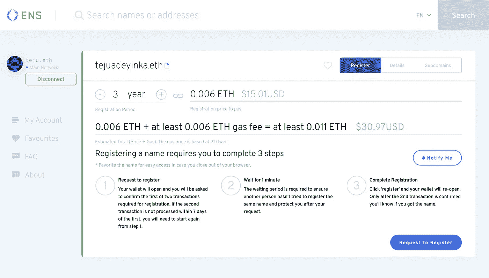

See how much you’ll have to pay.

## **第三步**

您需要签署两个交易——一个是请求注册，另一个是实际注册。

点击“请求注册”按钮，您将收到来自 Rainbow(或您的钱包)的推送通知，以确认此次交易。

在这里，你会注意到一个小的网络费用。对我来说，是 1.39 美元。你可以根据你希望交易完成的速度来调整支付金额，钱包应用程序通常会建议一个你可以接受的估计值。Rainbow 和大多数其他钱包允许你选择“慢”的金额🐌，正常⏱还是快🚀“交易。你愿意花的钱越多，你的交易就越快。

一旦您批准了交易，它将被提交到区块链，您将等待它被确认。

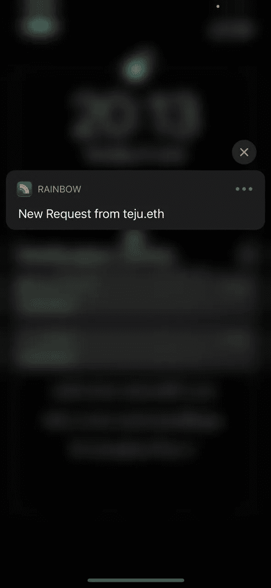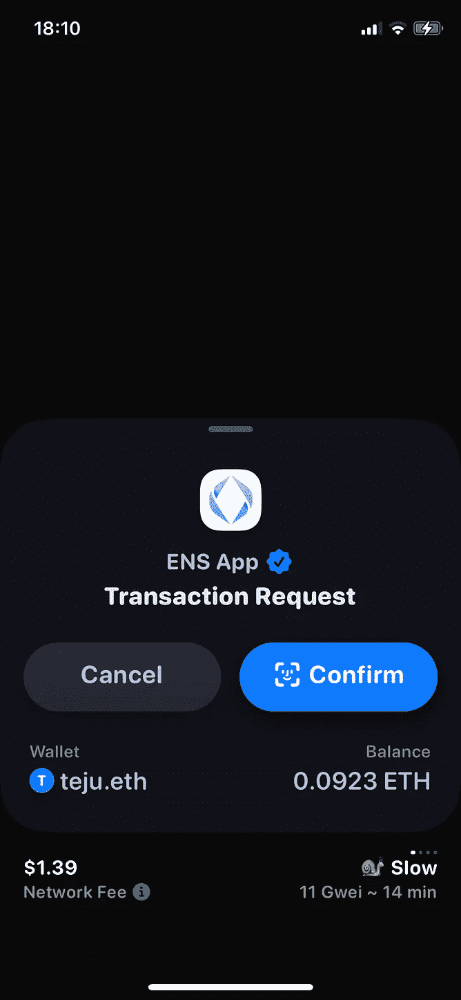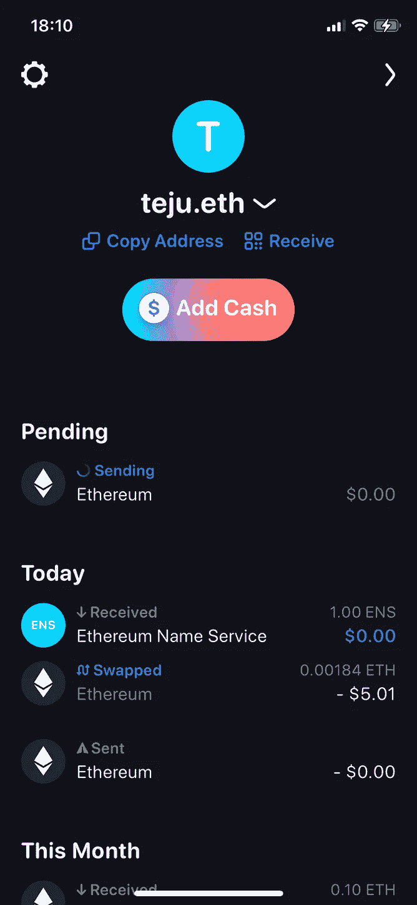

Request to Register

在 Rainbow 上，即使你已经提交了交易，你也可以点击它来加速(通过支付更多的汽油)，取消交易或在 [Etherscan](http://www.etherscan.io) (一种让你在区块链上看到你的交易的工具)上查看交易。

## 第四步

一旦您的交易在区块链上得到确认，您将需要等待一分钟，以确保在此期间没有其他人试图注册该名称。如果确认无误，您就可以通过单击“注册”来启动第二笔交易。

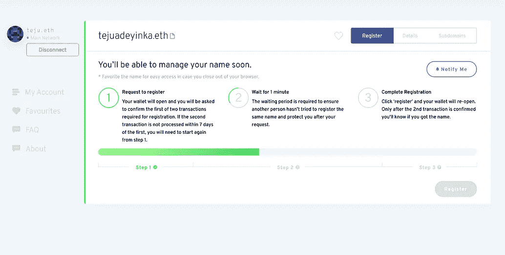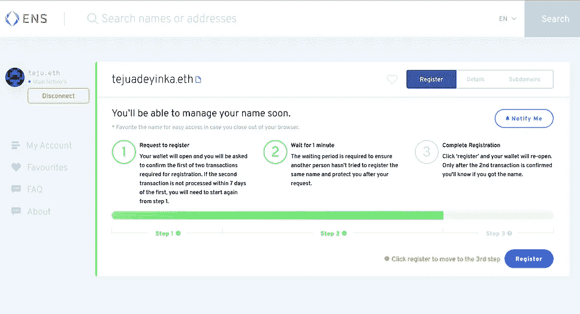

您将从钱包中收到另一个通知，要求您签署交易。这一次，您将看到 ENS 名称的成本(在本例中为三年 16.51 美元)，以及网络费用。

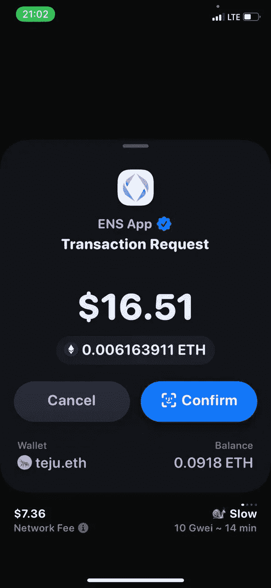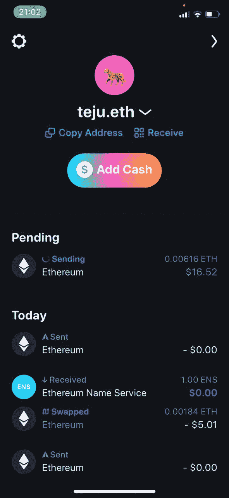

Pay to complete your registration

一旦此交易被确认，您现在拥有 ENS 名称，并将能够在您的钱包中看到它作为收藏品。

## 第五步

最后一件事——设置反向记录。这将允许分散的应用程序识别并显示您的地址作为您的 ENS 名称。

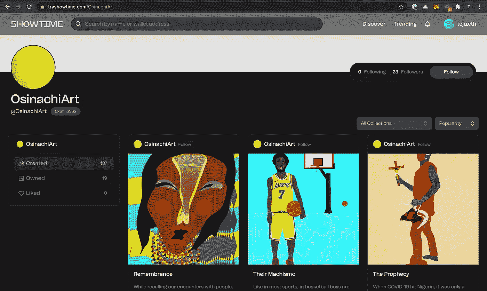

After setting the reverse record, dApps like Showtime will display your ENS name instead of your address

为此，请单击左边栏上的“我的帐户”,然后选择您想要设置地址的 ENS 名称。以你的情况来说，很可能是你刚买的。

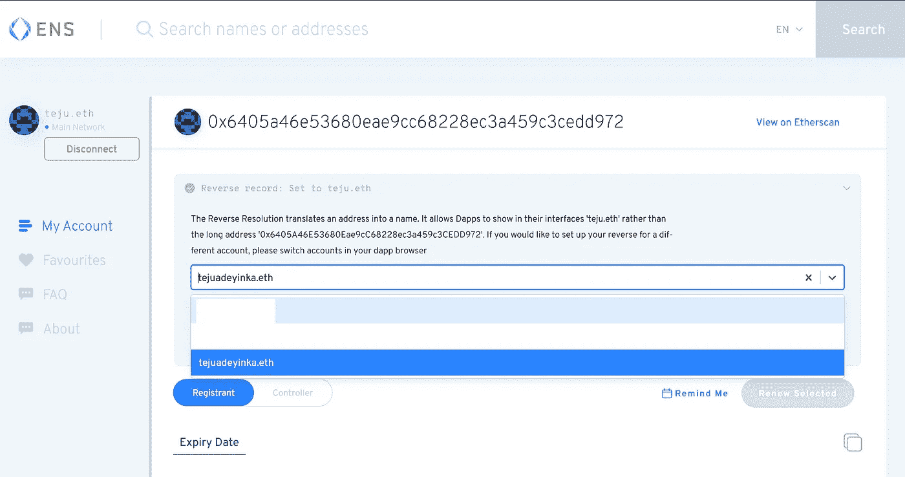

Set the reverse record

您必须从您的钱包中签署另一项交易才能完成此过程。完成后，当你使用设置的地址登录时，分散应用将能够显示你的 ENS 名称。

您还可以更新您的记录，并设置其他加密货币地址来链接到您的 ENS 名称。你也可以设置文本记录，如你的 Twitter 个人资料或公共网站等。

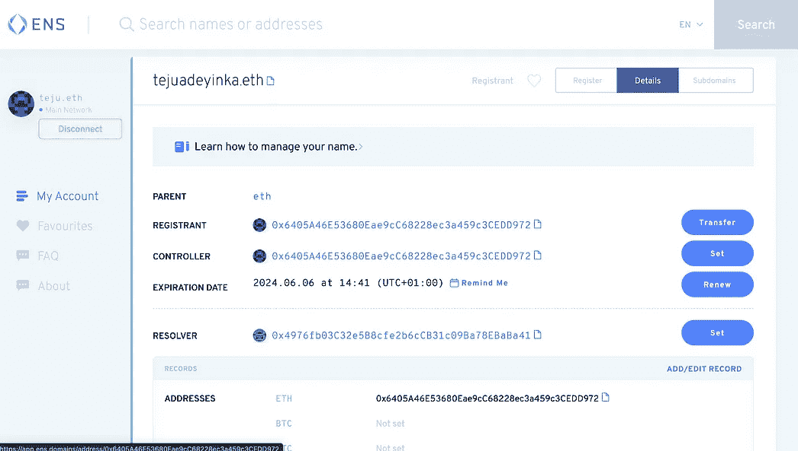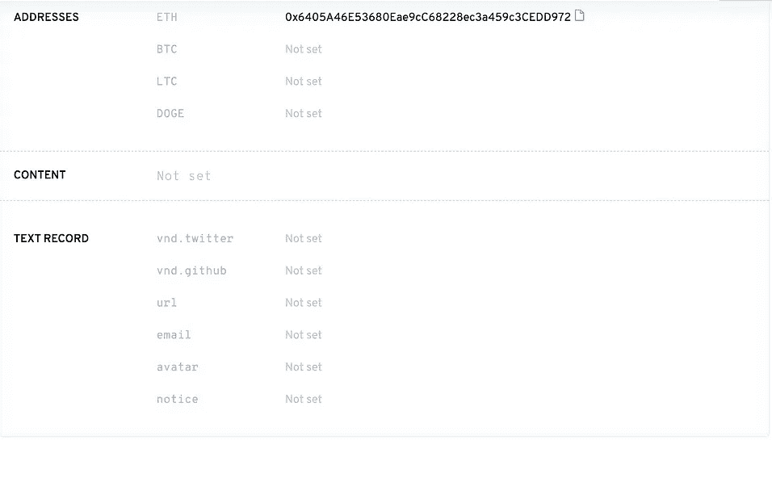

Edit your record

要了解更多关于 ENS 的信息，请参见 https://medium.com/the-ethereum-name-service 的[。](https://medium.com/the-ethereum-name-service)

> 加入 Coinmonks [电报频道](https://t.me/coincodecap)和 [Youtube 频道](https://www.youtube.com/c/coinmonks/videos)获取每日[加密新闻](http://coincodecap.com/)

## 另外，阅读

*   [复制交易](/coinmonks/top-10-crypto-copy-trading-platforms-for-beginners-d0c37c7d698c) | [加密税务软件](/coinmonks/crypto-tax-software-ed4b4810e338)
*   [电网交易](https://coincodecap.com/grid-trading) | [加密硬件钱包](/coinmonks/the-best-cryptocurrency-hardware-wallets-of-2020-e28b1c124069)
*   [密码电报信号](http://Top 4 Telegram Channels for Crypto Traders) | [密码交易机器人](/coinmonks/crypto-trading-bot-c2ffce8acb2a)
*   [有哪些交易信号？](https://coincodecap.com/trading-signal) | [比特斯坦普 vs 比特币基地](https://coincodecap.com/bitstamp-coinbase)
*   [ProfitFarmers 回顾](https://coincodecap.com/profitfarmers-review) | [如何使用 Cornix Trading Bot](https://coincodecap.com/cornix-trading-bot)
*   [如何在势不可挡的域名上购买域名？](https://coincodecap.com/buy-domain-on-unstoppable-domains)
*   [印度的秘密税](https://coincodecap.com/crypto-tax-india) | [altFINS 审查](https://coincodecap.com/altfins-review) | [Prokey 审查](/coinmonks/prokey-review-26611173c13c)
*   [最佳加密交易所](/coinmonks/crypto-exchange-dd2f9d6f3769) | [印度最佳加密交易所](/coinmonks/bitcoin-exchange-in-india-7f1fe79715c9)
*   开发人员的最佳加密 API
*   最佳[密码借贷平台](/coinmonks/top-5-crypto-lending-platforms-in-2020-that-you-need-to-know-a1b675cec3fa)
*   [杠杆代币](/coinmonks/leveraged-token-3f5257808b22)终极指南