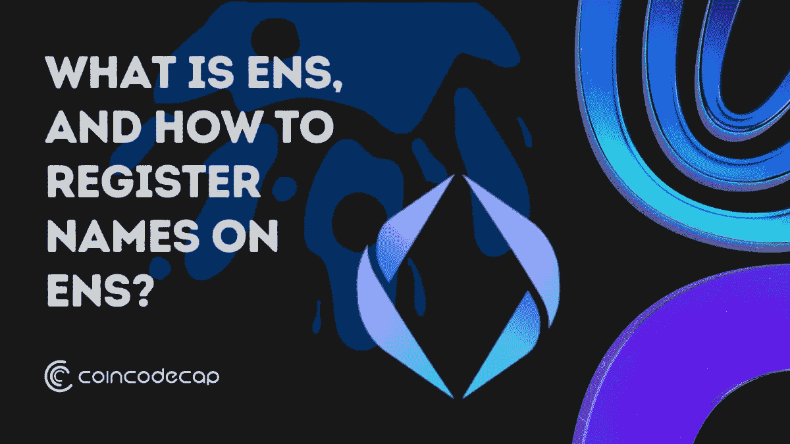
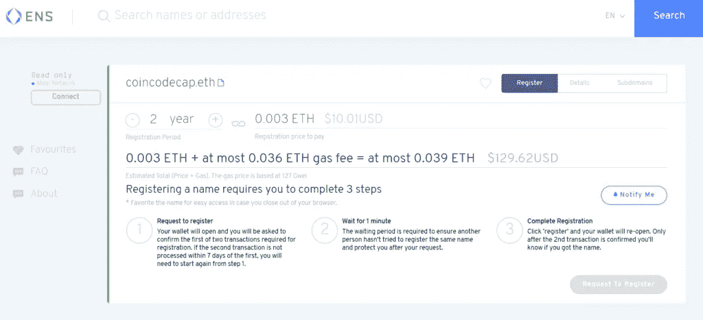
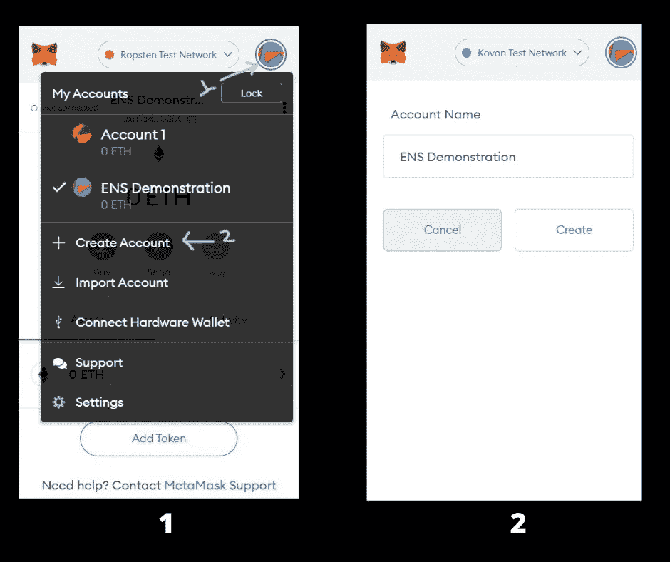
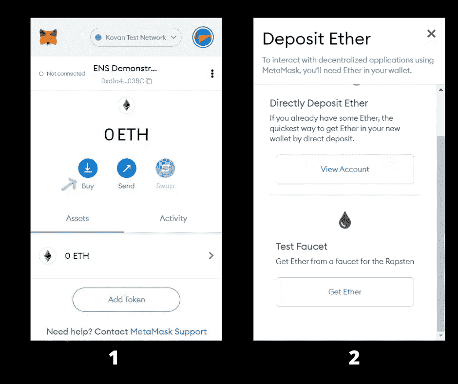
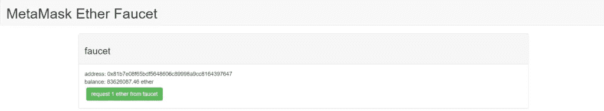
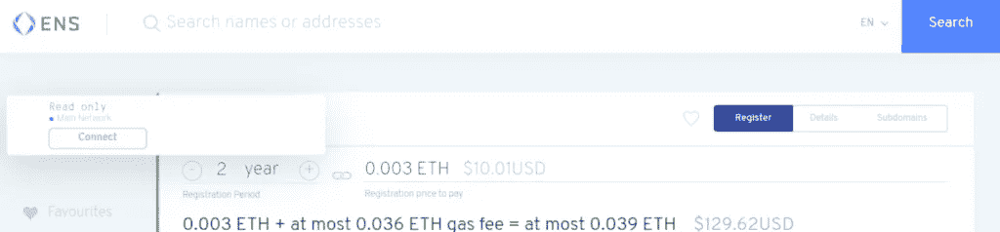
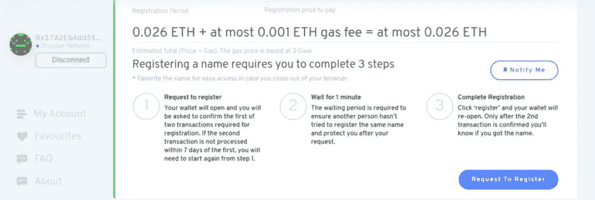
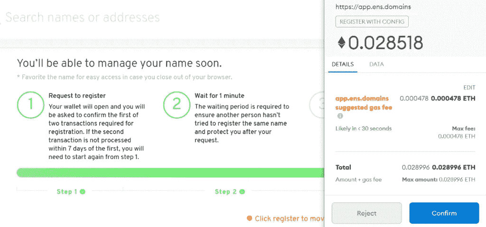
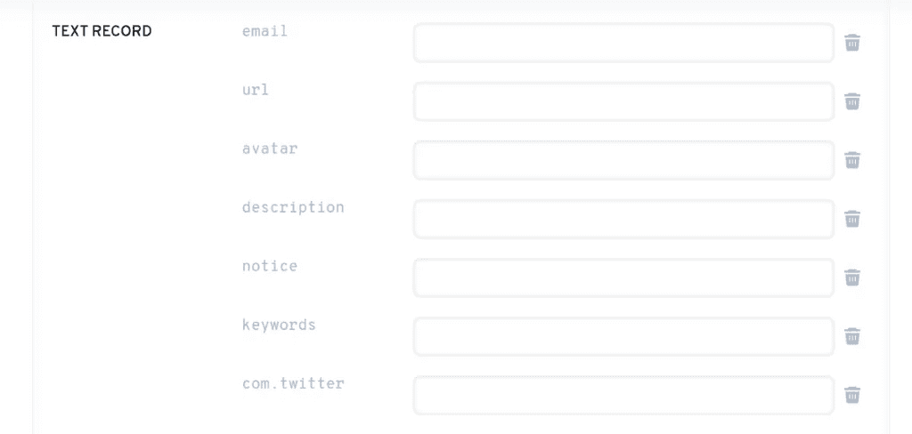

# 2021 年怎么在 ENS 上注册名字？

> 原文：<https://medium.com/coinmonks/how-to-register-names-on-ens-in-2021-4a2c95be40de?source=collection_archive---------6----------------------->

今天，我们甚至不能记住一个 10 位数的手机号码；我们被期望使用一个乏味的以太坊地址。这就是[以太坊名称服务](https://blog.coincodecap.com/ethereum-name-service-ens) (ENS)的用武之地。ENS 提供了一种安全的&去中心化的方法，使用简单的、人类可读的名称来寻址资源。比如，ENS 用一个. eth 名称代替了人类需要打字和识别 ETH 地址，比如 0x9dcb75b3m3eb…，像 ***coincodecap.eth*** 。在这篇文章中，我们将引导你完成在 ENS 上注册名字的详细步骤。

# 如何在 ENS 上注册姓名？

让我们一步一步地在 ENS 上注册名字。

# 步骤 1:设置钱包

有几个钱包可用的例子:Metamask，Rainbow 等。在本次演示中，我们将使用 Metamask 钱包。

*要安装 MetaMask 扩展，请访问* [*网站*](https://blog.coincodecap.com/go/metamask-2) *。然后，点击“下载”，你将被重定向到 Chrome 网络商店，在那里你可以下载 MetaMask 扩展。*

安装扩展后，为您的钱包设置一个密码，并安全地存储种子短语。

# 第二步:获取乙醚

你需要乙醚来完成这个过程。要么你可以从加密货币交易所获得以太，比如[比特币基地](https://blog.coincodecap.com/coinbase-review)、[瓦兹克斯](https://blog.coincodecap.com/wazirx-review)等。，或者你也可以在以太坊 Ropsten testnet 上这样做，因为你可以免费获得以太网。

我将在本教程中使用 Testnet，但如果你有兴趣在 ENS 上注册，你也可以使用 mainnet。

An estimated price for registering my domain.

我们给你拿些乙醚吧！

*   进入你的 Metamask 钱包，切换到“Ropsten 测试网络”。
*   在右上角，点击圆圈，点击“创建帐户”选项，并给你的帐户一个名字。我比较喜欢的帐户名是“ENS 演示”。

Creating Account on Ropsten Test Network

*   您的帐户已创建，以太坊地址已分配给您的网络。要获取乙醚，点击“购买”选项，然后在“测试水龙头”下点击“获取乙醚。”

Buying Ether on MetaMask

*   你将被引导到这个[网页](https://faucet.metamask.io/)。点击“从水龙头请求 1 乙醚”。接下来，进入 metamask 钱包，复制您的以太坊地址，将该地址粘贴到水龙头网站的必填字段中，清除验证码测试，然后提交。ETH 可能需要几分钟到几个小时才能体现在你的钱包里。耐心等待！

Test faucet

**PS:** *对于任何想真实注册域名的人来说，除了不使用 Ropsten 测试网络，你将不得不使用以太坊主网，你将花费的 ETH 必须是真实的，并且应该在你的钱包里*

# 步骤 3:用 ENS 连接元掩码

我希望你现在钱包里有 1 英镑。不，你不会突然变得富有！这是一个试验乙醚🙂

*   访问 [ENS](https://blog.coincodecap.com/go/ethereumnameservice) 并将您的 Metamask 钱包与 ENS 连接(确保您在“Ropsten 测试网络”上)。将弹出元掩码通知；点击“确认”。

Connect Metamask Wallet to ENS

# 第四步:搜索姓名

键入您要注册的域名。

Search the Domain Name

*   我选择了注册“***coincodecap . eth***”。如果您选择的域名已经注册，请搜索另一个。
*   接下来，有一页解释了注册域名的估计费用、燃气费和必须遵循的步骤。

Estimated Price of ENS

> 汽油费飞速上涨。比如写这篇文章的时候煤气费从 118 Gwei 变成了 218 Gwei。无论如何，我们将使用测试乙醚，所以没有必要担心。

# 第五步:注册名字。

Steps to Register a Domain Name

*   点击“请求注册”。将弹出元掩码通知，确认交易。必须对两个事务进行签名—第一个请求注册，另一个实际注册。

MetaMask Transaction

*   完成第 2 步后，另一个通知也会弹出“确认”。顺其自然，确认->确认->提交。
*   这一切结束后，点击“设置反向记录”。反向记录是一个可以用来代替你以太坊地址的名字。比如不使用地址 0x5c78r367，我们可以使用人类可读的地址***coincodecap . eth***。
*   您的域名现已注册。有几样东西你可以玩玩。您可以填写下面显示的所有记录。

Setting Records

# 注册人和控制人有什么区别？

控制器可以设置 ENS 记录、创建子域等。而注册人可以指定控制者地址并将注册转移给其他人。因此，基本上，注册人对域名拥有最终控制权，而控制人则负责日常运营。这是我的案例，我既是控制者又是注册者。

# 在 ENS 上登记姓名:结论

关键是，本文是为了演示的目的，我们使用 Testnet 而不是 Mainnet。我们在上面注册的名字实际上还没有被注册。没有对实际的[区块链](https://blog.coincodecap.com/blockchain-technology-and-crypto-vocabulary)进行任何更改。如果愿意实名购买，使用“以太坊 Mainnet”确认所有交易。煤气费随时都在变化，所以留意一下煤气费是明智的。每当你发现煤气费是最低的，你可以在主网上注册这个名字。

*原载于 2021 年 9 月 2 日*[*【https://blog.coincodecap.com】*](https://blog.coincodecap.com/register-names-on-ens)*。*