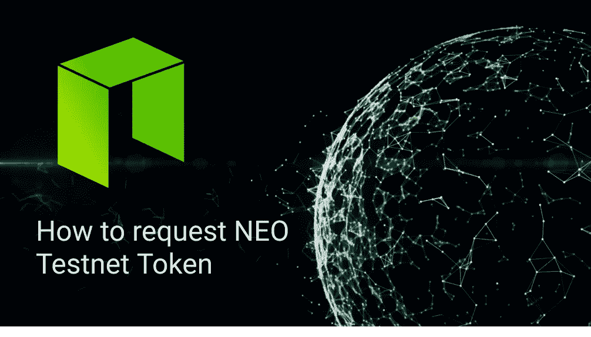

# 如何请求 NEO Testnet 令牌

> 原文：<https://medium.com/coinmonks/how-to-request-neo-testnet-token-9945574701e5?source=collection_archive---------6----------------------->

## 使用 python



## OSX:麦克

## 语言:Python

## 库:新 python

# 应用 Testnet 令牌:

你需要填写申请表:

[https://neo.org/Testnet/Create](https://neo.org/Testnet/Create)

# 设置环境:

# LevelDB

## OSX

```
brew install leveldb
```

# 新 python

```
pip3 install neo-python
```

# 自举区块链

如果您第一次使用 neo-python，您需要同步区块链，这可能需要很长时间。这个项目中包含的脚本`np-bootstrap`可以自动为你下载一个链目录。

一次下载所有链数据:

引导测试网数据

```
$np-bootstrap
```

引导 testnet 通知数据库

```
$np-bootstrap -n
```

然后启动 NEO testnet:

```
$np-prompt -n
```

等待几分钟(可能需要一段时间),直到测试网和你的钱包完全同步，否则你可能会出现以下警告:

```
[W 181101 12:31:59 Wallet:1071] Wait for your wallet to be synced before doing transactions. To check enter 'wallet' and look at 'percent_synced', it should be 100\. Also the blockchain should be up to the latest blocks (see Progress). Issuing 'wallet rebuild' restarts the syncing process.
insufficient funds
```

# 申请 NEO Testnet 令牌

在 testnet 和 wallet 完全同步后，我们现在可以添加一个多签名地址

```
neo> wallet
Wallet {
  ...
  "public_keys": [
      {
          "Address": "ARn9bHx2xtergBBz1Qt4Nrft136A7UcmGZ",
          "Public Key": "02dcb700b9bc49b9b2d39e5bfda4de8f5e9e50002f6c698399b0f33cadad07a60c" <--- take this
      }
  ],
  ...
}
```

使用 import mustisig_addr 获得 NEO dev 团队给我们的合同的所有权。

```
neo> import multisig_addr 02dcb700b9bc49b9b2d39e5bfda4de8f5e9e50002f6c698399b0f33cadad07a60c 1 02dcb700b9bc49b9b2d39e5bfda4de8f5e9e50002f6c698399b0f33cadad07a60c
​
e12 02380be6608d6fc594d2bcc4cca5f1b0af20cb55c6b4632477ee7176b6826c1cb4                                                                                        
​
[I 181101 14:20:18 UserWallet:193] contract does not exist yet
​
Added multi-sig contract address AWft67kcuRuLj7qTp1EnCTTWRaob9Su5ga to wallet
​
```

现在，您可以从合同中转移您的 NEO 资产

```
send {assetId or name} {to_addr} {amount} --from-addr={from_addr}
```

你可以通过这个网站查询你的余额。

[https://neoscan-testnet.io/address/](https://neoscan-testnet.io/address/)

现在我们终于可以开始在 NEO Testnet 上部署合同了。

> [直接在您的收件箱中获得最佳软件交易](https://coincodecap.com/?utm_source=coinmonks)

[](https://coincodecap.com/?utm_source=coinmonks)