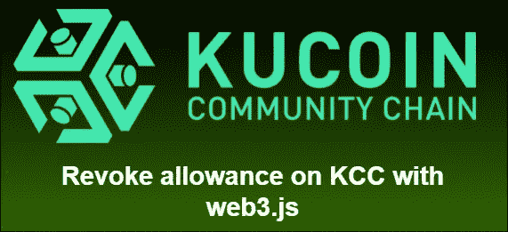
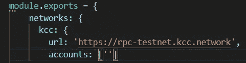

# 如何在 KCC 上使用 web3.js 撤销任何令牌批准

> 原文：<https://medium.com/coinmonks/how-to-revoke-any-token-approval-using-web3-js-on-kcc-187050067840?source=collection_archive---------2----------------------->



在 ERC-20 标准中，批准功能允许用户允许诸如智能合同或普通地址之类的其他方花费规定的数量。但是，由于交易需要重复批准，大多数 DEX 指定的金额大于第一次批准功能所需的金额，因此用户不必在以后批准相同的令牌。这导致了一些安全风险，尤其是对于不值得信任的站点/项目。为了应对这一点，建议删除你在看起来可疑的网站中给予的任何象征性的批准。在本教程中，我们将使用 web3.js 撤销令牌批准，还有其他方法可以做到这一点，如使用 KCC 浏览器，但如果合同未经验证，这是不可能的。

通常在两种情况下，您会允许使用某个地址:

*   在 DEX 上交易
*   转移到另一个地址

要找出一个 DEX 的路由器地址，你可以做一个小交易，在 explorer 上查看。

**先决条件:**

*   已安装安全帽

现在让我们开始撤销津贴吧！

**# 1:创建一个安全帽样本项目:**

您可以使用以下命令创建一个示例项目

```
npx hardhat 
```

**# 2:将 KCC 网络设置放入 hardhat.config.js:**



In this case we put the rpc of KCC testnet

在帐户数组中，您应该输入钱包的私钥，并在前面加上 0x。

**# 3:将 ERC-20 令牌复制到合约中，然后编译:**

在这种情况下，我从 Kuswap github 复制了 KUS 令牌。你可以从[这里](https://github.com/KuSwap/KuSwap-Core)下载。

然后使用以下命令编译合同:

```
npx hardhat compile
```

**# 4:将撤销权限代码复制到 sample-script.js:**

复制以下示例代码并替换 sample-script.js 主函数中的示例代码

```
const singAddress = await hre.ethers.getSigner()var RouterAddress = ‘0xc5f442007e08e3b13C9f95fA22F2a2B9369d7C8C’var TokenAdd = ‘0x67f6a7BbE0da067A747C6b2bEdF8aBBF7D6f60dc’var TokenCon = await hre.ethers.getContractFactory(“contracts/KUSToken.sol:KUSToken”);var Tokencontract = await TokenCon.attach(TokenAdd// The deployed contract address);await Tokencontract.approve(RouterAddress, 0)console.log(await Tokencontract.allowance(singAddress.address,RouterAddress));
```

**RouterAddress** 是您给予令牌津贴的地址。

**TokenAdd** 是你批准消费的令牌地址。

上面的脚本基本上是通过调用 approve 函数来工作的，但这一次使用的值是 0，这将覆盖以前批准的值，从而使它实际上取消了对路由器地址的允许。

**# 5:执行撤销脚本:**

```
npx hardhat run .\scripts\remove_approval.js --network kcc
```

**事后思考:**

在本文中，您已经学习了如何使用 web3.js 和 hardhat 撤销地址的消费津贴，虽然脚本很简单，但它肯定会让您安心，因为您知道您的令牌更安全。:)

不要忘记检查 KCC 更多可怕的加密项目。

社交网络
不和:[https://discord.gg/H5ucJydSyd](https://discord.gg/NhpWu5tqzc)推特:[https://twitter.com/KCCOfficialTW](https://twitter.com/KCCOfficialTW)电报:[https://t.me/KCCOfficialEnglishCommunity](https://t.me/KCCOfficialEnglishCommunity)电报频道:[https://t.me/KCCOfficialChannel](https://t.me/KCCOfficialChannel)

> 加入 Coinmonks [电报频道](https://t.me/coincodecap)和 [Youtube 频道](https://www.youtube.com/c/coinmonks/videos)了解加密交易和投资

# 另外，阅读

*   [德国最佳加密交易所](https://coincodecap.com/crypto-exchanges-in-germany) | [Arbitrum:第二层解决方案](https://coincodecap.com/arbitrum)
*   [币安交易机器人](/coinmonks/binance-trading-bots-d0d57bb62c4c) | [OKEx 评论](/coinmonks/okex-review-6b369304110f) | [阿塔尼评论](https://coincodecap.com/atani-review)
*   [最佳加密交易信号电报](/coinmonks/best-crypto-signals-telegram-5785cdbc4b2b) | [MoonXBT 评论](/coinmonks/moonxbt-review-6e4ab26d037)
*   如何在 Bitbns 上购买柴犬(SHIB)币？ | [买弗洛基](https://coincodecap.com/buy-floki-inu-token)
*   [CoinFLEX 评论](https://coincodecap.com/coinflex-review) | [AEX 交易所评论](https://coincodecap.com/aex-exchange-review) | [UPbit 评论](https://coincodecap.com/upbit-review)
*   [十大最佳加密货币博客](https://coincodecap.com/best-cryptocurrency-blogs) | [YouHodler 评论](https://coincodecap.com/youhodler-review)