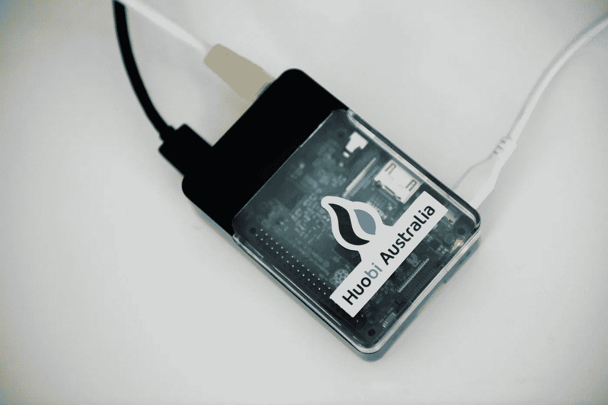

# 什么是比特币全节点，如何通过 6 个简单步骤运行一个比特币全节点？(1/4)

> 原文：<https://medium.com/coinmonks/how-to-run-a-bitcoin-full-node-in-6-simple-steps-a243189a5750?source=collection_archive---------0----------------------->

TLDR:运行一个[比特币](https://blog.coincodecap.com/tag/bitcoin/)全节点是一个令人兴奋的业余项目。这是一种有趣的方式，可以弄脏你的手，体验#构建比特币全节点的旅程，还可以接触 Linux。

我的[比特币](https://blog.coincodecap.com/tag/bitcoin/)全节点建立在树莓 Pi 上。

My Bitcoin Full Node on the Raspberry Pi

# 介绍

比特币区块链被设计成一个去中心化的 P2P 网络，没有人拥有或控制[比特币](https://blog.coincodecap.com/tag/bitcoin/)，每个人都可以参与其中。

完整节点是完全验证事务和块的程序。通过运行比特币全节点，你正在支持[比特币](https://blog.coincodecap.com/tag/bitcoin/)网络变得更加分散，并促进比特币的增长。

为了便于阅读，以下章节直接从“[什么是全节点](https://bitcoin.org/en/full-node#what-is-a-full-node)”中复制而来。

> 如果你不想麻烦，但仍然想支持比特币网络，请查看[顶级比特币节点提供商](https://blog.coincodecap.com/bitcoin-node-solutions/)。

# 成本和警告

运行一个比特币全节点需要一定的成本，并可能让你面临一定的风险。这一部分将解释这些成本和风险，这样你就可以决定你是否能够帮助网络。

> 保护好你的钱包

运行一个完整的节点来支持网络并使用其钱包来存储您的比特币是可能和安全的，但您必须采取与使用任何[比特币钱包](https://blog.coincodecap.com/tag/bitcoin-wallet/)时相同的预防措施。请参阅“保护您的钱包”页面了解更多信息。

> 最低要求

比特币核心满节点有一定要求。如果您尝试在较弱的硬件上运行一个节点，它可能会工作，但是您可能会花费更多的时间来处理问题。如果您能够满足以下要求，您将拥有一个易于使用的节点。

*   运行最新版本的 Windows、Mac OS X 或 Linux 的台式机或笔记本电脑硬件。
*   200 千兆字节的空闲磁盘空间，可以以 100 MB/s 的最低读/写速度访问。
*   2gb 内存(RAM)
*   上传速度至少为每秒 400 千比特(50 千字节)的宽带互联网连接
*   未计量的连接、具有高上传限制的连接或您定期监控以确保其未超过上传限制的连接。对于高速连接上的完整节点来说，每月使用 200 或更多的上传是很常见的。下载使用量大约是每月 20 千兆字节，加上第一次启动节点时额外的 195 千兆字节。
*   您的完整节点每天可以运行 6 小时。(在运行完整节点时，您可以使用计算机做其他事情。)更长的时间会更好，最好是您可以连续运行您的节点。

注:当今的许多操作系统(Windows、Mac 和 Linux)在屏幕保护程序激活后会进入低功耗模式，从而减慢或停止网络流量。这通常是笔记本电脑以及所有 Mac OS X 笔记本电脑和台式机的默认设置。检查您的屏幕保护设置并停用自动“睡眠”或“暂停”选项，以确保您的电脑在运行时支持网络。

> 可能的问题

*   合法:比特币的使用在某些地区被禁止或限制。
*   带宽限制:一些互联网计划将对计划之外的额外上传带宽收取额外费用。更糟糕的是，由于过度使用，一些提供商可能会在没有警告的情况下终止您的连接。我们建议您检查您的互联网连接是否受到此类限制，并监控您的带宽使用，以便您可以在达到上传限制之前停止比特币核心。
*   反病毒:一些人将部分已知的计算机病毒放入了比特币区块链。这些区块链数据不会感染你的电脑，但一些反病毒程序仍然会隔离这些数据，从而增加了运行比特币核心的难度。这个问题主要影响运行 Windows 的计算机。
*   攻击目标:比特币核心为[比特币](https://blog.coincodecap.com/tag/bitcoin/)点对点网络提供动力，因此想要破坏网络的人可能会以影响你用电脑做的其他事情的方式攻击比特币核心用户，例如限制你可用下载带宽的攻击。

# **#Buidl**

**第一步:硬件**

我决定用 Raspberry Pi 3+运行我的比特币全节点。

我收集了以下物品

*   树莓 Pi 3+完整入门套件
*   我的旧笔记本电脑的 1 TB 硬盘
*   HDMI 电缆
*   键盘和鼠标
*   班长

如果这是你第一次体验树莓 Pi，你需要购买全套的树莓 Pi 启动包:[https://Raspberry . piaustralia . com . au/little-bird-Raspberry-Pi-3-complete-starter-kit](https://raspberry.piaustralia.com.au/little-bird-raspberry-pi-3-complete-starter-kit)

第二步:选择你想运行的操作系统。

比特币全节点支持多种 OS，如 Windows 发行版(7、8、10)，Linux 发行版包括 Ubuntu、Debian 等和 Mac OS。我决定使用 Ubuntu Mate 16.04.2 LTS 运行我的完整节点，因为我对 Ubuntu 系统有很好的理解，并且我的 Pi 有一个兼容的映像。

只要满足完整节点的最低要求，您可以选择在任何版本的 Windows、Mac 或 Linux 上运行完整节点。

**第三步:设置硬件/操作系统**

安装系统。你可以在这里按照[的指示](http://www.hospitableit.com/howto/installing-ubuntu-mate-16-04-2-lts-on-a-raspberry-pi-3/)。

**第四步:安装比特币**

这里可以按照步骤[来。](https://bitcoin.org/en/full-node)

**步骤 5:配置路由器，允许 TCP/UDP 协议上的端口 8333**

您需要配置您的路由器，以接受端口 8333 上的传入连接。

**第六步:验证你的比特币节点可以到达。**

你可以使用 EARN 开发的便捷工具。https://bitnodes.earn.com/。该网站向您概述了全球比特币节点的分布情况。它还可以检查您的比特币客户端当前是否正在接受来自另一个节点的传入连接。

如果你想要一个循序渐进的指南来帮助你在装有 Ubuntu Mate 16.04.2 LTS 的 Raspberry Pi 3+上设置比特币全节点。可以看看我的文章[如何设置比特币全节点(2/4)](/p/52d108e48822?source=your_stories_page---------------------------)

# 后续步骤:

[如何设置比特币全节点(2/4)](/p/52d108e48822?source=your_stories_page---------------------------)

[雷电网络介绍(3/4)](/p/f92bf2d0ffde?source=your_stories_page---------------------------)

[如何设置一个闪电节点，连接到一个对等点，打开一个通道(4/4)](/p/efd627d7ff32?source=your_stories_page---------------------------)

> 参考资料:

 [## Linux 上安装比特币全节点的完全初学者指南(2018 版)

### 如何在没有任何 Linux 经验的情况下，在全新安装的 Kubuntu 18.04 上编译比特币全节点？

hackernoon.com](https://hackernoon.com/a-complete-beginners-guide-to-installing-a-bitcoin-full-node-on-linux-2018-edition-cb8e384479ea) 

> 加入 Coinmonks [电报频道](https://t.me/coincodecap)和 [Youtube 频道](https://www.youtube.com/c/coinmonks/videos)获取每日[加密新闻](http://coincodecap.com/)

## 另外，阅读

*   [密码电报信号](http://Top 4 Telegram Channels for Crypto Traders) | [密码交易机器人](/coinmonks/crypto-trading-bot-c2ffce8acb2a)
*   [复制交易](/coinmonks/top-10-crypto-copy-trading-platforms-for-beginners-d0c37c7d698c) | [加密税务软件](/coinmonks/crypto-tax-software-ed4b4810e338)
*   [网格交易](https://coincodecap.com/grid-trading) | [加密硬件钱包](/coinmonks/the-best-cryptocurrency-hardware-wallets-of-2020-e28b1c124069)
*   [加密交换](/coinmonks/crypto-exchange-dd2f9d6f3769) | [印度的加密应用](/coinmonks/buy-bitcoin-in-india-feb50ddfef94)
*   [开发人员的最佳加密 API](/coinmonks/best-crypto-apis-for-developers-5efe3a597a9f)
*   最佳[加密借贷平台](/coinmonks/top-5-crypto-lending-platforms-in-2020-that-you-need-to-know-a1b675cec3fa)
*   杠杆代币的终极指南
*   [ko only 回顾](https://coincodecap.com/koinly-review) | [Binaryx 回顾](https://coincodecap.com/binaryx-review)|[Hodlnaut vs CakeDefi](https://coincodecap.com/hodlnaut-vs-cakedefi-vs-celsius)
*   [40 个最佳电报频道](https://coincodecap.com/best-telegram-channels) | [1xBit 回顾](https://coincodecap.com/1xbit-review) | [Keevo 钱包回顾](https://coincodecap.com/keevo-wallet-review)
*   [如何在印度购买以太坊？](https://coincodecap.com/buy-ethereum-in-india) | [如何在币安购买比特币](https://coincodecap.com/buy-bitcoin-binance)
*   [在美国如何使用 BitMEX？](https://coincodecap.com/use-bitmex-in-usa) | [BitMEX 评论](https://coincodecap.com/bitmex-review) | [购买索拉纳](https://coincodecap.com/buy-solana)