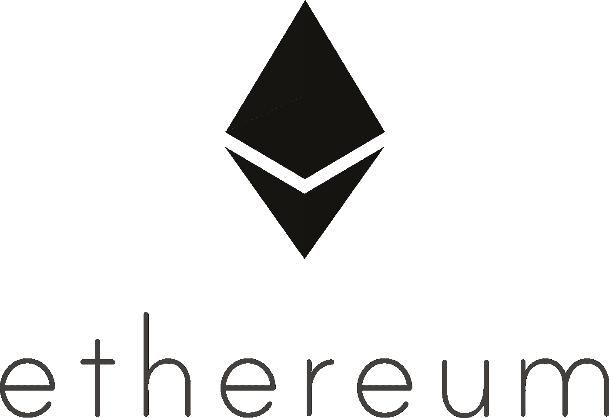
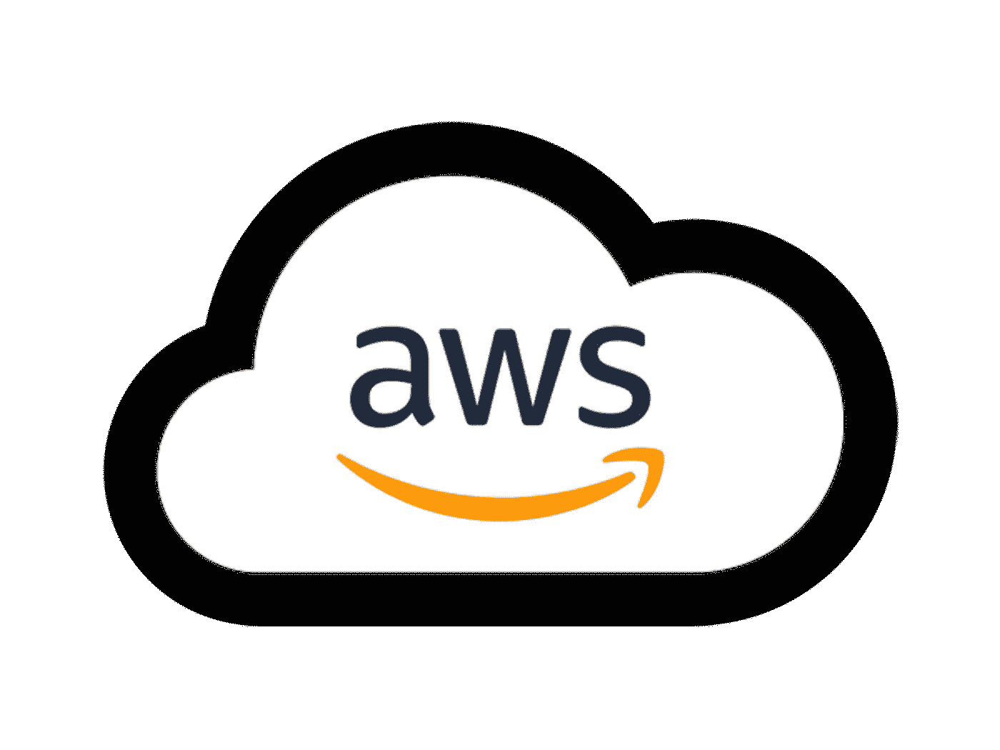
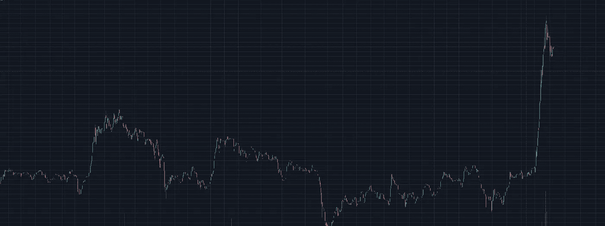
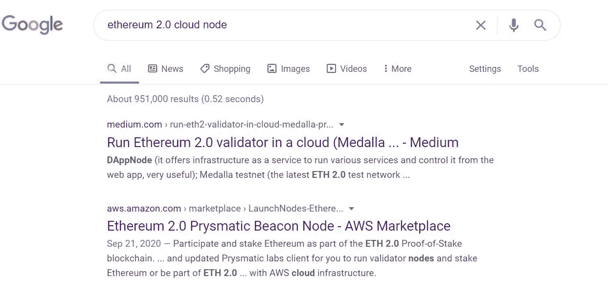
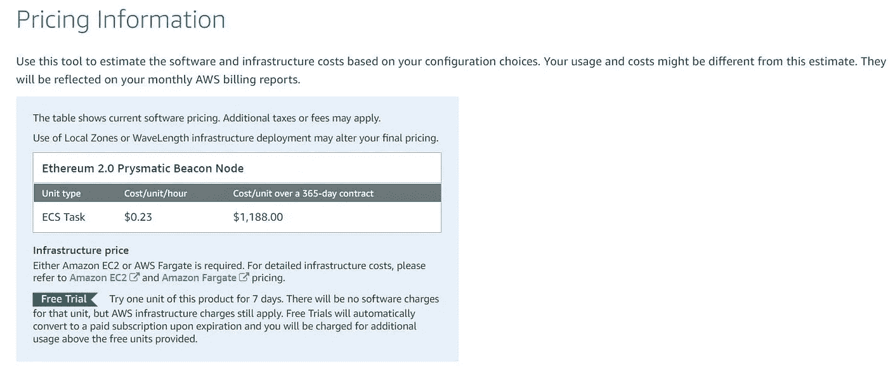

# 如何在 AWS 云基础设施上运行 ETH 2.0 节点

> 原文：<https://medium.com/coinmonks/how-to-run-an-eth-2-0-node-on-aws-cloud-infrastructure-df55101e670b?source=collection_archive---------1----------------------->

***免责声明*** *:本文仅作教育用途。我是* ***不是*** *理财顾问，以下内容都不是理财建议。我与以太坊、AWS、亚马逊、Launchnode 或我在下面的内容中提到的许多其他链接没有赞助或直接联系。一如既往，我将尽我所能，从一个热爱创新技术的人的中立角度来探讨这个话题。*

# 让我们开始吧。

自[2020 年 11 月 4 日起，](https://twitter.com/VitalikButerin/status/1324018999458295809)以太坊开始正式从*工作证明*过渡到*股权证明*。我非常支持区块链 T21 的利益证明，并且相信这是扩展智能合同解决方案的最佳途径。在 Vitalik 在 Twitter 上发布声明后，我们也看到了一些健康的价格变动。截至 2020 年 11 月，以太坊目前的交易价格约为 450 美元，高于 2020 年初的 130 美元。

**来源:**[**trading view—ETH/USD 对**](https://www.tradingview.com/symbols/ETHUSD/) **—紧接着 Vitalik 的推文**

由于我经常搬家，我对通过云计算验证 ETH 2.0 的解决方案非常感兴趣。许多人在考虑一笔大投资时，没有把沉没成本和可变成本都考虑进去。当有人开采比特币时，他们不仅需要购买非常昂贵的物理硬件，还必须维持高昂的电费。盈利的矿工不再是那些拥有地下钻机的人了——这些都是大玩家，不仅仅是玩钱。随着时间的推移，矿工们需要与最好的系统保持同步，在行业内保持相关性变得越来越困难。*利益证明*消除了这些问题，提供了一个环境友好的解决方案，也促进了进一步的分散化。

如果你对以太坊 2.0 不熟悉，下面的视频是对以太坊创始人的精彩概述。

 [## Eth2 发射台

### 成为验证者并帮助保护 Eth2。

launchpad.ethereum.org](https://launchpad.ethereum.org/) 

> 这个站点是 ETH 2.0 验证器的主要中心。

那么，我从这里去了哪里？我发现自己在谷歌上快速搜索“以太坊 2.0 云节点”。一如既往——谷歌做到了。第二个链接展示了 AWS Marketplace 上的一项新服务——“启动节点”。

 [## 以太坊 2.0 系统信标节点

### 作为 ETH 2.0 区块链的一部分，参与并入股以太坊。运行我们的信标节点，成为…

aws.amazon.com](https://aws.amazon.com/marketplace/pp/LaunchNodes-Ethereum-20-Prysmatic-Beacon-Node/B08GKY4BST#pdp-overview)  [## 启动节点-托管的 ETH 信标节点-使 ETH 2.0 信标节点变得简单

### LaunchNodes 为您提供了一个运行在以太坊 2.0 Mainnet 上的完全安全的信标节点，允许您将您的…

www.launchnodes.com](https://www.launchnodes.com/) 

和世界各地的许多其他人一样，我发现自己越来越不依赖任何一种特定的设备，而只是受限于我所熟知的数字应用。不管我用的是三星 S20、笔记本电脑、平板电脑还是我五年前生产的台式电脑，都没有关系。*关键是我可以访问哪些数据，可以用这些数据做什么，以及访问速度有多快？*

那么，为什么要在云上运行以太坊节点呢？

> 又念:[如何入股 32 ETH？—最佳实践(ETH2 打桩)](/coinmonks/how-to-stake-32-eth-the-best-practices-eth2-staking-e35dd0de1ff2)

# **在云中运行节点的好处**

> 在云上运行节点有很多好处。虽然不是唯一的优势，但我相信这个选项提供了灵活性和移动性，对许多高级用户来说非常有用。

# **不需要物理机**

对于任何在硬件方面保持最新的人来说，你知道很难用最好的来维护一台机器。新的硬件和 PC 组件不断发布和更新。当您选择在云上运行一个节点时，您不需要担心硬件！这意味着不存在计算机部件故障、物理财产被盗或处理最近供应链问题的风险。正如我们最近在新一代显卡/网络摄像头等组件上看到的那样，计算机供应链存在许多问题，甚至很难购买到您想要的组件。运行虚拟机可以让你避开所有这些问题。

# 没有额外的电力成本/消耗

虽然您需要维护一个 AWS 帐户并管理我将在下面直接提到的成本，但您不需要像通过工作证明挖掘那样将高额电费计算在内。当你通过工作证明开采一种加密货币时，你需要使用比其他方式多得多的电能。即使在实体资产上运行以太坊赌注节点，如果您想最大化您的赌注回报，您也需要一直让机器开着。这可能会增加你电费的平均成本。

# 没有停机时间

在物理机上运行节点的最大风险是停机时间。如果你的电脑崩溃或网络中断，你的以太坊奖励将迅速减少。虽然您的云节点可能会出现复杂情况，但您的停机风险却大大降低了。

# 随时随地访问您的节点

在云上维护您的节点消除了物理限制。需要搬家？想去度假一个月？你经常出差吗？这些都是您可能会在云节点中发现效用的常见原因。虽然您仍然需要设备和互联网连接来访问您的 AWS 帐户/云节点，但当您选择这一途径时，移动性是非常重要的。

# 入门指南

如果你从未在 AWS 上使用过以太坊，我建议你从亚马逊的以太坊模板开始。这个登录页面将允许您收集更多的背景知识，这些知识在为 ETH 2.0 设置云节点时非常有用。

# 成本和经济

在 AWS 上运行一个 Prysmatic Beacon 节点的成本相当合理。以每小时不到一刻钟的速度——这项服务每年将花费你一千多美元。

更重要的是，我强烈建议回顾 ETH 2.0 发布平台上关于成为网络验证者的详细经济学的[数据。这个文档中有大量的数据，如果你打算成为一名验证者，你应该深入了解。](https://docs.google.com/spreadsheets/d/15tmPOvOgi3wKxJw7KQJKoUe-uonbYR6HF7u83LR5Mj4/edit#gid=842896204)

**注意** —成为 ETH 2.0 genesis 周期的验证者需要锁定您的数字资产大约 2 年。有关以太坊 2.0 路线图的更多信息，[点击此处](https://ethereum.org/en/eth2/#roadmap)。

# **设置您的节点**

LaunchNodes 做得非常好，为如何使用他们的产品提供了简单的文档和教程。在正下方，您将看到一个 7 步视频系列，它将帮助您快速启动和运行 ETH 2.0 节点。

 [## 启动节点

### launch Nodes——启动以太坊 2.0 信标节点和服务的简单、安全的方法。加入以太坊…

www.youtube.com](https://www.youtube.com/channel/UC5tEUUlx11httS9Y9RvIzJw) 

如果你更喜欢书面文档，LaunchNodes 还通过 [Google Docs](https://docs.google.com/document/d/1ug-UruaXsghWy_0qvcUWOnJT9ltFho8rQxrIo7vv3Tk/edit) 创建了一步一步的指令。我建议选择你喜欢的学习媒介，然后使用至少有两个显示器的设备。这些步骤都不难，但是您需要理解 IAM、集群和任务创建等概念。最棒的是，你可以在支付一分钱之前试用这项服务整整 7 天。这使你在投资前对你的节点感到舒适。

如果您在设置云节点时遇到麻烦，Launch Nodes 会提供 3 级支持，声明请求会在当天得到答复。我直接从他们的 AWS 页面获取了以下信息。

> **支持信息**
> 
> 以太坊 2.0 系统信标节点
> 
> 请联系 support@launchnodes.com[寻求支持。请为第 3 级支持请求留出 8 个小时](mailto:support@launchnodes.com)[support@launchnodes.com](mailto:support@launchnodes.com)support@launchnodes.com

# **少技术选项**

如果你不想经历设置你自己的节点的技术麻烦，我会建议等待信誉良好的服务，如 [Stakefish](https://stake.fish/en/ethereum/) 的赌注池。目前，Stakefish 是其他利害关系证明区块链的最大验证者之一，如 Tezos，从 2000 多个独特的授权者中获得了超过 **13，380，032 XTZ** 。虽然 Stakefish 只是一种选择，但应该有更多的赌注池可供那些有兴趣参与而没有确切持有 32 ETH 的 cavoite 的人使用。我预计在接下来的几个月里，各种不同的 ETH 2.0 staking 服务将会出现。

# 结论

总的来说，我相信在云中运行以太坊 2.0 节点对于任何有兴趣参与以太坊生态系统的人来说都是一个可行的解决方案。对于以下用户来说，此选项更可行:

> 熟悉云计算(尤其是 AWS)
> 
> 没有在很多物理硬件上投资
> 
> 不局限于一个物理位置或家庭
> 
> 对购买或更换新的技术设备不感兴趣
> 
> 生活在电费非常高或互联网不可靠的地区

# 资源

> [以太坊 2.0 发射台](https://launchpad.ethereum.org/)
> 
> [以太坊 2.0 经济学](https://docs.google.com/spreadsheets/d/15tmPOvOgi3wKxJw7KQJKoUe-uonbYR6HF7u83LR5Mj4/edit#gid=842896204)
> 
> [以太坊 2.0 路线图](https://ethereum.org/en/eth2/#roadmap)
> 
> [发射节点技术文档](https://docs.google.com/document/d/1ug-UruaXsghWy_0qvcUWOnJT9ltFho8rQxrIo7vv3Tk/edit)
> 
> [发布节点视频教程系列](https://www.youtube.com/channel/UC5tEUUlx11httS9Y9RvIzJw)
> 
> [启动节点 AWS 系统信标节点服务](https://aws.amazon.com/marketplace/pp/LaunchNodes-Ethereum-20-Prysmatic-Beacon-Node/B08GKY4BST#pdp-overview)

如果这些内容对你有帮助，并且教会了你一些新的东西，你可以通过以下方式支持我。

> *关注我的* [*推特*](https://twitter.com/Onelemononelime)

**您可以使用下面我的推荐链接之一在交易所购买加密货币，在利息账户中保存加密货币或购买硬件钱包，以在冷存储中离线保护您的加密。我的目标是写一些内容，让世界各地的人们了解激动人心的全新技术。你的支持让我以后可以写更多的文章。**

> [T21 区块链](https://blockfi.com/?ref=426c0778)
> 
> 这项服务可以让你保存比特币，并获得以太坊的利息，这是一个真正令人惊讶和未被充分认识的功能
> 
> [**摄氏度网**](https://celsiusnetwork.app.link/1277423ac3)
> 
> 保存您的加密货币，并获得与您存款相同的抵押品的利息
> 
> [**北海巨妖**](http://r.kraken.com/DYqPb)
> 
> 买卖加密货币——这是获得比特币或以太网初始投资的最简单、最安全的方式之一
> 
> [**总账**](https://shop.ledger.com/?r=94304db10a14)
> 
> 使用支持蓝牙的硬件钱包保护您的加密货币
> 
> **捐赠 ETH**
> 
> 捐赠至—0 xb9 b 673 CB 2955d 99 cf E1 ad 31817d 60 b 2c 092 ab 41 a

> 加入 Coinmonks [电报频道](https://t.me/coincodecap)和 [Youtube 频道](https://www.youtube.com/c/coinmonks/videos)获取每日[加密新闻](http://coincodecap.com/)

## 另外，阅读

*   [复制交易](/coinmonks/top-10-crypto-copy-trading-platforms-for-beginners-d0c37c7d698c) | [加密税务软件](/coinmonks/crypto-tax-software-ed4b4810e338)
*   [网格交易](https://coincodecap.com/grid-trading) | [加密硬件钱包](/coinmonks/the-best-cryptocurrency-hardware-wallets-of-2020-e28b1c124069)
*   [密码电报信号](http://Top 4 Telegram Channels for Crypto Traders) | [密码交易机器人](/coinmonks/crypto-trading-bot-c2ffce8acb2a)
*   [最佳加密交易所](/coinmonks/crypto-exchange-dd2f9d6f3769) | [印度最佳加密交易所](/coinmonks/bitcoin-exchange-in-india-7f1fe79715c9)
*   [Bitget 回顾](https://coincodecap.com/bitget-review)|[Gemini vs block fi](https://coincodecap.com/gemini-vs-blockfi)|[OKEx 期货交易](https://coincodecap.com/okex-futures-trading)
*   [美国最佳加密交易机器人](https://coincodecap.com/crypto-trading-bots-in-the-us) | [不断回顾](https://coincodecap.com/changelly-review)
*   [在印度利用加密套利赚取被动收入](https://coincodecap.com/crypto-arbitrage-in-india)
*   [霍比审核](https://coincodecap.com/huobi-review) | [OKEx 保证金交易](https://coincodecap.com/okex-margin-trading) | [期货交易](https://coincodecap.com/futures-trading)
*   [开发人员的最佳加密 API](/coinmonks/best-crypto-apis-for-developers-5efe3a597a9f)
*   最佳[密码借贷平台](/coinmonks/top-5-crypto-lending-platforms-in-2020-that-you-need-to-know-a1b675cec3fa)
*   杠杆代币的终极指南