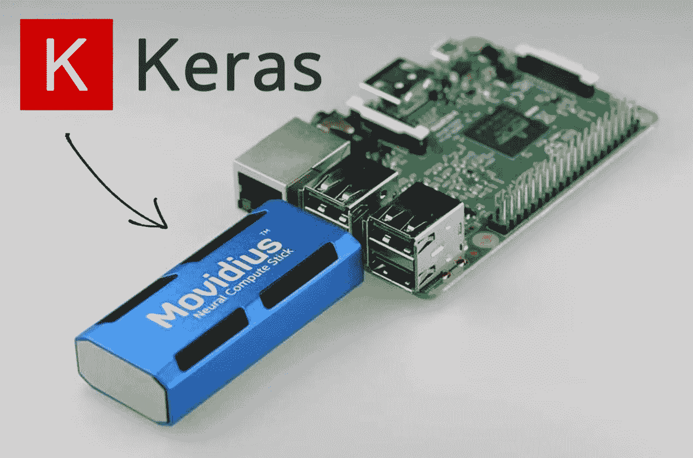

# 如何在 Movidius 神经计算棒上运行 Keras 模型

> 原文：<https://medium.com/coinmonks/how-to-run-keras-model-on-movidius-neural-compute-stick-d1a68fbd7c22?source=collection_archive---------6----------------------->

Movidius neural compute stick(NCS)以及其他一些硬件设备，如 UP AI Core、AIY vision bonnet 和最近发布的[谷歌 edge TPU](https://cloud.google.com/edge-tpu/) 正在逐步将深度学习引入资源受限的 IOT 设备。我们是不是离打造你一直期待的 DIY 猎杀者无人机又近了一步？过去用于实现严重深度学习图像处理的强大 GPU 可以…