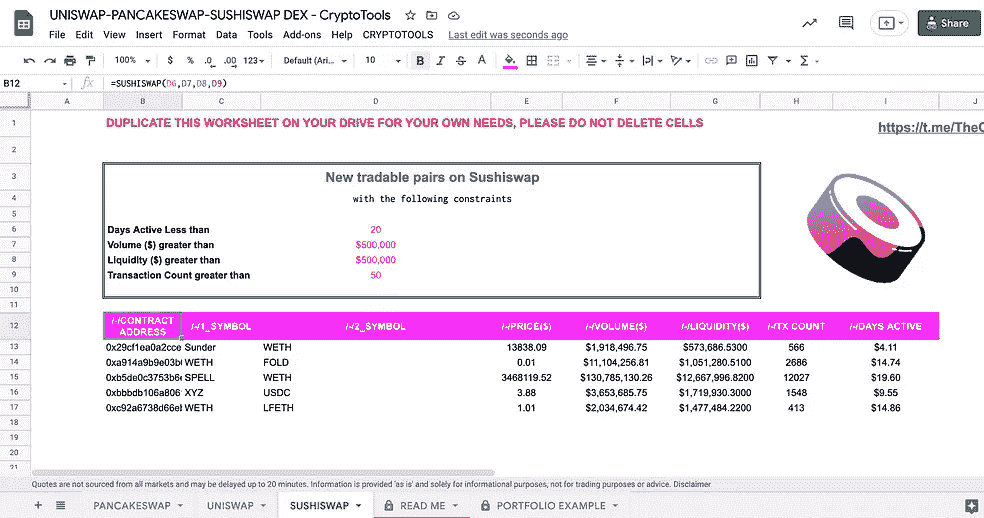

# 如何扫描最新加入 Pancakeswap 的对子？

> 原文：<https://medium.com/coinmonks/how-to-scan-the-latest-pairs-added-to-pancakeswap-c613c6c1bbe?source=collection_archive---------0----------------------->


[https://pancakeswap.finance/](https://pancakeswap.finance/)

[**NEW July->Telegram bot**](https://t.me/PancakeSwapNewPools)for:过去 15 分钟内创建的池&$成交量>$ 3000&$流动性>$ 10000&Nb 交易> 30

# 什么是 Pancakeswap？

P[**ancake swap**](https://academy.binance.com/en/articles/a-guide-to-pancakeswap)是去中心化的兑换 [BEP-20 代币](https://academy.binance.com/en/glossary/bep-20)。PancakeSwap 采用[自动做市商(AMM)](https://academy.binance.com/en/articles/what-is-an-automated-market-maker-amm) 模式。这意味着，虽然你可以在平台上交易数字资产，但没有一个订单簿可以让你与其他人匹配。相反，你交易的是流动性池。

这些资金池充满了其他用户的资金。他们将资金存入资金池，作为回报，他们会收到流动性提供者(LP)代币。他们可以用这些代币收回自己的份额，外加一部分交易费。

所以，简而言之，你可以交易 BEP-20 代币，或者增加流动性，赚取奖励。

Pancakeswap 的分散式交易所看起来是这样的:


The PancakeSwap exchange UI

一些 [CryptoTools 数据分析](https://medium.com/the-cryptocurious)用户一直有兴趣寻找一种方法来获得**Pancakeswap 上的最新代币交易，最有可能是作为一种交易分析工具**。

因此，我创建了一个谷歌表单模板，帮助你过滤新的可交易硬币。

> [*此处访问现场模板单*](https://docs.google.com/spreadsheets/d/1jKEhOi9gIcM9bKdn7rgJEK0RKpzbE1k6bPy_kJW75Aw/edit?usp=sharing)

**该表返回 Pancakeswap 上所有新的可交易对，给出对该对活跃的天数、交易量($)、流动性($)和交易数量的限制。**


为了获得 Pancakeswap 的分析，我使用了 GraphQL 查询。 [**GraphQL**](https://en.wikipedia.org/wiki/GraphQL) 是一种针对 API 的开源数据查询和操作语言，是一个用现有数据完成查询的运行时。

[**图**](https://thegraph.com/) 是用于查询以太坊和 IPFS 等网络的索引协议，帮助创建和测试 GraphQL 查询。使用图，您可以构建和发布开放的 API，称为子图，使数据易于访问。

为了让 Google 模板表全天候运行，我在私有服务器上构建了查询。

**示例【Pancakeswap GraphQL 查询代码片段**

获得前 100 双；返回 id、符号、价格和数量。


Example of Pancakeswap GraphQL query

```
query{
  pairs( first: 100) { 
    token0 {
      symbol
    }
    token0Price
    token1 {
      symbol
    }
    token1Price
    id
    volumeUSD   
  }
 }
```

[**GOOGLE SHEETS 中的 Pancakeswap 函数**](https://docs.google.com/spreadsheets/d/1jKEhOi9gIcM9bKdn7rgJEK0RKpzbE1k6bPy_kJW75Aw/edit?usp=sharing) **:**
返回 PANCAKESWAP 上新的可交易对，给出硬币活跃天数、成交量($)、流动性($)和交易次数的约束。


In Google Sheets =PANCAKESWAP(3, 100'000, 100'000, 1'000)

例如，如果我想获得新的 Pancakeswap 对，其中:

*   该池是在过去 3 天内启动的
*   每日交易量超过 100，000 美元
*   流动资金超过 10 万美元
*   自推出以来，已经有超过 1000 笔交易

**公式变成:
=PANCAKESWAP(3，100000，100000，1000)**

[@param](http://twitter.com/param) {days}该对处于活动状态的天数
[@param](http://twitter.com/param) {volume}最小交易量($)
[@ param](http://twitter.com/param){ Liquidity }最小交易量($)
[@ param](http://twitter.com/param){ tx _ count }自创建以来存在的交易数

*   [@return](http://twitter.com/return) a 表 [**(见上图 GIF)**](https://docs.google.com/spreadsheets/d/1jKEhOi9gIcM9bKdn7rgJEK0RKpzbE1k6bPy_kJW75Aw/edit?usp=sharing)含所有新增可交易对及其活跃以来的天数、成交量($)、流动性($)、交易笔数。对于那些对在 [Uniswap](/coinmonks/how-to-scan-the-latest-pairs-added-to-uniswap-31c4400cc2a6) 和 [Sushiswap](/coinmonks/how-to-scan-the-latest-pairs-added-to-sushiswap-4e5fee7880e2) 上获得新配对感兴趣的人，我已经构建了同样的查询，它们也可以在表单中找到。



New Tradable Pairs on [Uniswap](/coinmonks/how-to-scan-the-latest-pairs-added-to-uniswap-31c4400cc2a6) (Left) and [Sushiswa](/coinmonks/how-to-scan-the-latest-pairs-added-to-sushiswap-4e5fee7880e2)p (right)

目前在 Pancakeswap 上，我仅限于最近 5 天创建的对，因为目前读取 Pancakeswap 的节点比 Uniswap 和 Sushiswap 花费更多的时间。它还有助于优化服务器的响应时间。如果您希望访问超过 5 天的数据，请访问[https://t.me/TheCryptoCurious](https://t.me/TheCryptoCurious)。

# 扫描的指标更多？

通过 **TheGraph API 可以添加更多的功能。**不要犹豫，看看所有可用的端点，例如:


[https://thegraph.com/explorer/subgraph/vmatskiv/pancakeswap-v2](https://thegraph.com/explorer/subgraph/vmatskiv/pancakeswap-v2)

*   **totalSupply**
*   **未跟踪卷 D**
*   **liquidityProviderCount**

如果您有兴趣在整合更多个性化指标方面获得一些帮助， [DM me](https://t.me/TheCryptoCurious) 。

# 结论

使用[**Google Sheets**](https://docs.google.com/spreadsheets/d/1jKEhOi9gIcM9bKdn7rgJEK0RKpzbE1k6bPy_kJW75Aw/edit?usp=sharing)**在 Pancakeswap 上获取最新配对的简单方法，可用于数据分析，并作为筛选新市场参与者的交易工具。**

**这是正在进行的工作。如果你发现错误，请不要犹豫让我知道。非常欢迎反馈。一个 [*电报聊天*](https://t.me/TheCryptoCurious) *也可供支持。如果这个项目为你增加了任何价值，或者正在你的谷歌表单上寻找个性化编码，请不要犹豫，留下你的信息。***

**我已经建立了更多的谷歌资产负债表工具，你可以在其中评估加密、股票、流动性池..如果你想了解更多，请随时查看我的个人资料。**

***所表达的意见仅用于一般信息目的，是* ***而非*** *旨在为任何个人或任何特定证券或投资产品提供具体的* ***建议*** *或推荐。它只是为了提供关于* ***密码*** *行业的教育。***

**非常感谢你花时间阅读这篇文章。**

> **加入 [Coinmonks 电报频道](https://t.me/coincodecap)，了解加密交易和投资**

## **另外，阅读**

*   **[尤霍德勒 vs 考尼洛 vs 霍德诺特](/coinmonks/youhodler-vs-coinloan-vs-hodlnaut-b1050acde55a) | [Cryptohopper vs 哈斯博特](https://blog.coincodecap.com/cryptohopper-vs-haasbot)**
*   **[币安 vs 北海巨妖](https://blog.coincodecap.com/binance-vs-kraken) | [美元成本平均交易机器人](https://blog.coincodecap.com/pionex-dca-bot) | [煎饼 API](https://bitquery.io/blog/pancake-swap-dex-apis)**
*   **[复制交易](/coinmonks/top-10-crypto-copy-trading-platforms-for-beginners-d0c37c7d698c) | [加密税务软件](/coinmonks/crypto-tax-software-ed4b4810e338)**
*   **[网格交易](https://coincodecap.com/grid-trading) | [加密硬件钱包](/coinmonks/the-best-cryptocurrency-hardware-wallets-of-2020-e28b1c124069)**
*   **[密码电报信号](/coinmonks/top-3-telegram-channels-for-crypto-traders-in-2021-8385f4411ff4) | [密码交易机器人](/coinmonks/crypto-trading-bot-c2ffce8acb2a)**
*   **[最佳加密交易所](/coinmonks/crypto-exchange-dd2f9d6f3769) | [印度最佳加密交易所](/coinmonks/bitcoin-exchange-in-india-7f1fe79715c9)**
*   **开发人员的最佳加密 API**
*   **最佳[密码借贷平台](/coinmonks/top-5-crypto-lending-platforms-in-2020-that-you-need-to-know-a1b675cec3fa)**
*   **[免费加密信号](/coinmonks/free-crypto-signals-48b25e61a8da) | [加密交易机器人](/coinmonks/crypto-trading-bot-c2ffce8acb2a)**
*   **[杠杆代币的终极指南](/coinmonks/leveraged-token-3f5257808b22)**
*   **[如何在印度购买比特币？](/coinmonks/buy-bitcoin-in-india-feb50ddfef94) | [WazirX 评论](/coinmonks/wazirx-review-5c811b074f5b) | [BitMEX 评论](https://blog.coincodecap.com/bitmex-review)**
*   **[比特币基地跑马圈地](https://blog.coincodecap.com/coinbase-staking) | [Hotbit 点评](/coinmonks/hotbit-review-cd5bec41dafb) | [KuCoin 点评](https://blog.coincodecap.com/kucoin-review) | [期货交易机器人](/coinmonks/futures-trading-bots-5a282ccee3f5)**
*   **[最佳加密交易信号电报](/coinmonks/best-crypto-signals-telegram-5785cdbc4b2b) | [MoonXBT 评论](/coinmonks/moonxbt-review-6e4ab26d037)**