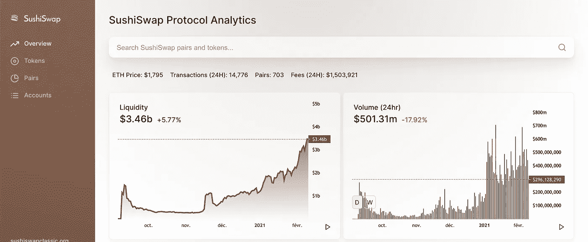

# 如何扫描最新添加到 Sushiswap 的 pairs？

> 原文：<https://medium.com/coinmonks/how-to-scan-the-latest-pairs-added-to-sushiswap-4e5fee7880e2?source=collection_archive---------0----------------------->

Source : https://sushiswap.fi/

***更新:*** *有兴趣者请点此处**[***Uniswap->***](/coinmonks/how-to-scan-the-latest-pairs-added-to-uniswap-31c4400cc2a6)*

# *Sushiswap 是什么？*

*ushiSwap 是一个运行在以太坊上的软件，它试图激励一个用户网络来操作一个用户可以买卖加密资产的平台。与 Uniswap 和 Balancer 等平台类似，SushiSwap 使用一系列流动性池来实现这一目标。用户首先将资产锁定在智能合约中，然后交易者从这些资金池中买卖加密货币，用一个代币交换另一个代币。*

*作为越来越多的分散金融( [DeFi](https://www.kraken.com/learn/what-is-decentralized-finance-defi) )平台之一，SushiSwap 允许用户在不需要中央运营商管理员的情况下交易加密货币。*

*这意味着与 SushiSwap 软件相关的决定是由其本地加密货币 SUSHI 的持有者做出的。任何持有资产余额的人都可以提议改变资产的运行方式，并可以对其他用户提交的提议进行投票。*

**

*Source : [https://sushiswap.fi/](https://sushiswap.fi/)*

*t 的核心功能是通过促进用户之间购买和出售不同的加密资产来反映传统的交易。在 SushiSwap 上交易的代币不是由一个中央实体支持，而是由智能合约维护，用户将密码锁定在软件上，然后交易者可以访问该软件。*

*在 SushiSwap 上交易的代币不是由一个中央实体支持，而是由智能合约维护，用户将密码锁定在软件上，然后交易者可以访问该软件。*

*值得注意的是，那些交易锁定资产的人支付一笔费用，然后根据他们对资金池的贡献按比例分配给所有流动性提供者。*

*这就是[**Sushiswap 的分散交换**](https://exchange.sushiswap.fi/#/swap) 的样子:*

****

*[https://exchange.sushiswap.fi/#/swap](https://exchange.sushiswap.fi/#/swap)*

*一些 [CryptoTools 数据分析](https://medium.com/the-cryptocurious)用户一直有兴趣找到一种方法，让**的最新代币在 Sushiswap 和 Uniswap 上交易，最有可能的是作为一种交易分析工具**。*

*因此，我创建了一个谷歌表单模板，帮助你在这两个分散的交易所过滤新的可交易硬币。*

> *[*此处访问现场模板表*](https://docs.google.com/spreadsheets/d/1jKEhOi9gIcM9bKdn7rgJEK0RKpzbE1k6bPy_kJW75Aw/edit?usp=sharing)*

***该表返回 Sushiswap 和 Uniswap 上所有新的可交易货币对，给出货币对活跃的天数、交易量($)、流动性($)和交易数量的限制。***

****

*[https://thegraph.com/explorer/subgraph/zippoxer/sushiswap-subgraph-fork](https://thegraph.com/explorer/subgraph/zippoxer/sushiswap-subgraph-fork)*

*为了获得 Sushiswap 的分析，我使用了图**，这是一个用于查询以太坊和 IPFS 等网络的索引协议。任何人都可以使用、构建和发布开放的 API，称为子图，使数据易于访问。***

******

***[https://sushiswap.vision/home](https://sushiswap.vision/home)***

***[**GOOGLE SHEETS 中的 Sushiswap 函数**](https://docs.google.com/spreadsheets/d/1jKEhOi9gIcM9bKdn7rgJEK0RKpzbE1k6bPy_kJW75Aw/edit?usp=sharing) **:**
返回 SUSHISWAP 上新的可交易对，对币活跃的天数、成交量($)、流动性($)和交易次数进行约束。***

******

***In Google Sheets =SUSHISWAP(4, 5'000, 10'000, 200)***

***例如，如果我想获得新的 Sushiswap 对，其中:***

*   ***该池是在过去 4 天内启动的***
*   ***每日交易量超过 5000 美元***
*   ***流动资金超过 10，000 美元***
*   ***自推出以来，已有超过 200 笔交易***

*****公式变成:
=SUSHISWAP(4，5000，10000，200)*****

***[@param](http://twitter.com/param) {days}该对处于活动状态的天数
[@param](http://twitter.com/param) {volume}最小交易量($)
[@ param](http://twitter.com/param){ Liquidity }最小交易量($)
[@ param](http://twitter.com/param){ tx _ count }自创建以来存在的交易数***

**** [@return](http://twitter.com/return) a 表 [**(见上图 GIF)**](https://docs.google.com/spreadsheets/d/1jKEhOi9gIcM9bKdn7rgJEK0RKpzbE1k6bPy_kJW75Aw/edit?usp=sharing)uni swap 上所有新的可交易对及其自活跃以来的天数、成交量($)、流动性($)、交易数。***

# ***扫描的指标更多？***

***通过 **TheGraph API 可以添加更多的功能。**不要犹豫，看看所有可用的端点，例如:***

******

***[https://thegraph.com/explorer/subgraph/zippoxer/sushiswap-subgraph-fork](https://thegraph.com/explorer/subgraph/zippoxer/sushiswap-subgraph-fork)***

*   *****总供应量*****
*   *****未跟踪卷 D*****
*   *****liquidityProviderCount*****

***如果您有兴趣在整合更多个性化指标方面获得一些帮助， [DM me](https://t.me/TheCryptoCurious) 。***

# ***结论***

***使用[**Google Sheets**](https://docs.google.com/spreadsheets/d/1jKEhOi9gIcM9bKdn7rgJEK0RKpzbE1k6bPy_kJW75Aw/edit?usp=sharing)**在 Sushiswap 上获取最新对子的简单方法，可用于数据分析，并作为筛选新市场参与者的交易工具。*****

********更新:*** *有兴趣的可以看一下**[***Uniswap->点击这里***](/coinmonks/how-to-scan-the-latest-pairs-added-to-uniswap-31c4400cc2a6)******

******这是正在进行的工作。如果你发现错误，请不要犹豫让我知道。非常欢迎反馈。一个 [*电报聊天*](https://t.me/TheCryptoCurious) *也可供支持。如果这个项目为你增加了任何价值，或者正在你的谷歌表单上寻找个性化编码，请不要犹豫，留下你的信息。*******

******非常感谢你花时间阅读这篇文章。******

******在这个充满挑战的时代，照顾好你自己和你的家人！******

> ******加入 coin monks[Telegram group](https://t.me/joinchat/EPmjKpNYwRMsBI4p)，了解加密交易和投资******

## ******另外，阅读******

*   ******什么是[闪贷](https://blog.coincodecap.com/what-are-flash-loans-on-ethereum)？******
*   ******最好的[密码交易机器人](/coinmonks/crypto-trading-bot-c2ffce8acb2a) | [网格交易](https://blog.coincodecap.com/grid-trading)******
*   ******[3 商业评论](/coinmonks/3commas-review-an-excellent-crypto-trading-bot-2020-1313a58bec92) | [Pionex 评论](/coinmonks/pionex-review-exchange-with-crypto-trading-bot-1e459d0191ea) | [Coinrule 评论](https://blog.coincodecap.com/coinrule-review-a-perfect-trading-bot)******
*   ******[AAX 交易所评论](/coinmonks/aax-exchange-review-2021-67c5ea09330c) | [德里比特评论](/coinmonks/deribit-review-options-fees-apis-and-testnet-2ca16c4bbdb2) | [FTX 交易所评论](/coinmonks/ftx-crypto-exchange-review-53664ac1198f)******
*   ******[n 平均零点评审](/coinmonks/ngrave-zero-review-c465cf8307fc) | [Phemex 评审](/coinmonks/phemex-review-4cfba0b49e28)******
*   ******[Bybit 交易所评论](/coinmonks/bybit-exchange-review-dbd570019b71) | [Bityard 评论](https://blog.coincodecap.com/bityard-reivew) | [CoinSpot 评论](https://blog.coincodecap.com/coinspot-review)******
*   ******[3Commas vs Cryptohopper](/coinmonks/3commas-vs-pionex-vs-cryptohopper-best-crypto-bot-6a98d2baa203)******
*   ******最好的比特币[硬件钱包](/coinmonks/the-best-cryptocurrency-hardware-wallets-of-2020-e28b1c124069?source=friends_link&sk=324dd9ff8556ab578d71e7ad7658ad7c) | [BitBox02 回顾](/coinmonks/bitbox02-review-your-swiss-bitcoin-hardware-wallet-c36c88fff29)******
*   ******[莱杰 vs n rave](https://blog.coincodecap.com/ngrave-vs-ledger)|[莱杰 nano s vs x](https://blog.coincodecap.com/ledger-nano-s-vs-x)******
*   ******[密码拷贝交易平台](/coinmonks/top-10-crypto-copy-trading-platforms-for-beginners-d0c37c7d698c) | [比特码拷贝交易](https://blog.coincodecap.com/bityard-copy-trading)******
*   ******[Vauld Review](https://blog.coincodecap.com/vauld-review)|[you hodler Review](/coinmonks/youhodler-4-easy-ways-to-make-money-98969b9689f2)|[BlockFi Review](/coinmonks/blockfi-review-53096053c097)******
*   ******最好的[加密税务软件](/coinmonks/best-crypto-tax-tool-for-my-money-72d4b430816b) | [硬币追踪评论](/coinmonks/cointracking-review-a-reliable-cryptocurrency-tax-software-5114e3eb5737)******
*   ******最佳[密码借贷平台](/coinmonks/top-5-crypto-lending-platforms-in-2020-that-you-need-to-know-a1b675cec3fa) | [杠杆令牌](/coinmonks/leveraged-token-3f5257808b22)******
*   ******[莱杰 Nano S vs 特雷佐 one vs 特雷佐 T vs 莱杰 Nano X](https://blog.coincodecap.com/ledger-nano-s-vs-trezor-one-ledger-nano-x-trezor-t)******
*   ******[block fi vs Celsius](/coinmonks/blockfi-vs-celsius-vs-hodlnaut-8a1cc8c26630)|[Hodlnaut 审查](https://blog.coincodecap.com/hodlnaut-review)******
*   ******[Bitsgap 审查](/coinmonks/bitsgap-review-a-crypto-trading-bot-that-makes-easy-money-a5d88a336df2) | [Quadency 审查](/coinmonks/quadency-review-a-crypto-trading-automation-platform-3068eaa374e1)******
*   ******[埃利帕尔泰坦评论](/coinmonks/ellipal-titan-review-85e9071dd029) | [赛克斯斯通评论](https://blog.coincodecap.com/secux-stone-hardware-wallet-review)******
*   ******[DEX Explorer](https://explorer.bitquery.io/ethereum/dex) | [区块链 API](https://explorer.bitquery.io/graphql)|[local bitcoins 评论](https://blog.coincodecap.com/localbitcoins-review)******
*   ******最佳[区块链分析](https://bitquery.io/blog/best-blockchain-analysis-tools-and-software)工具| [赚比特币](https://blog.coincodecap.com/earn-bitcoin)******
*   ******[加密套利](/coinmonks/crypto-arbitrage-guide-how-to-make-money-as-a-beginner-62bfe5c868f6)指南:新手如何赚钱******
*   ******最佳[加密制图工具](/coinmonks/what-are-the-best-charting-platforms-for-cryptocurrency-trading-85aade584d80) | [最佳加密交易所](/coinmonks/crypto-exchange-dd2f9d6f3769)******
*   ******了解比特币最好的[书籍有哪些？](/coinmonks/what-are-the-best-books-to-learn-bitcoin-409aeb9aff4b)******

> ******[直接在您的收件箱中获得最佳软件交易](/coinmonks/newsletters/coinmonks)******

************